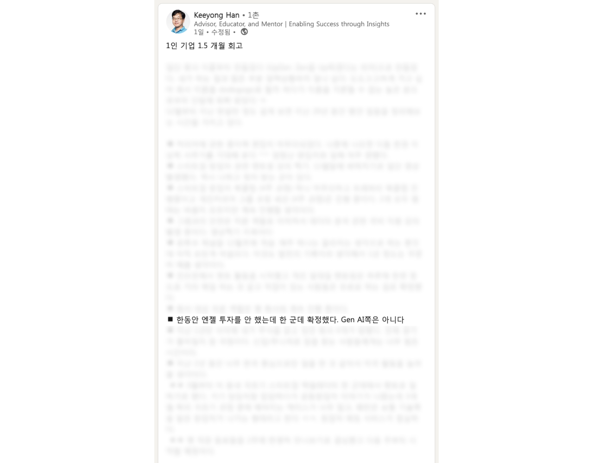

2023년은 여러 중요한 사건들이 있었던 한 해였습니다. 그 중 `창업`은 가장 기억에 남는 사건이었습니다. 이번 글에서는 2023년부터 게시글 발행 시점까지를 타임라인 순서대로 적어보고자 합니다.

## 카카오페이: 신규 프로젝트

2023년 초 당시 소속되어 있던 팀은 `카카오페이 머니`를 비롯한 현금 흐름을 지원하기 위한 플랫폼을 개발하는 팀이었고, 주로 실제 입금/출금 거래를 체결하기 위한 `카카오페이<->은행 통신 Gateway`, `머니 정산`, `전사 자금 업무 지원 플랫폼` 등의 프로젝트를 진행했습니다.

그러다보니 전사의 각 조직에서 필요로 하는 공통된 부분을 도출하고 이를 플랫폼으로 `잘 만들어` 제공하는 것에 항상 관심 있었는데요. 평소와 같이 타 조직의 Pain Point를 살펴보던 중 이건 꼭 필요하겠다는 판단하에 `<은행정보 플랫폼>`이라 불리는 신규 프로젝트를 추진하게 되었습니다. 좋은 경험을 하게 해주신 PM 말론에게 이 자리를 빌어 감사의 말씀을 드립니다. 🙇‍♂️

기존에는 수십 개의 개발 조직에서 은행에 대한 정보가 필요하다면 각자 관리하는 구조였습니다.

1. 카카오페이 머니 개발 조직: 머니 충전/송금을 위한 은행 정보 조회
2. 고객 문의 플랫폼 개발 조직: 착오송금 반환 중개 시 은행 정보 입력
3. 환불 시스템 개발 조직: 환불 계좌 유효성 검사
4. 등등..

은행 이름, 로고, 약관, 송금/계좌연결 가능 여부, 점검 유무 등 다양한 정보를 파편적으로 관리하고 있다보니 각 화면마다 보이는 로고가 다르거나 해당 은행이 점검 중인지 확인하기 위해선 실제로 송금과 같은 `액션`을 수행해봐야만 하는 문제가 있었습니다.

이에 가장 빠르게 협업 해볼만한 조직을 리서치하였고, 가장 밀접하게 협업 중이던 머니 서비스 개발 조직에서 `송금 단계에서 계좌번호 입력 시 은행 추론` 기능을 개발하고자 하는 니즈를 확인 할 수 있었습니다. 또한 각 계좌번호 패턴별로 어떤 은행에 해당하는지 추론하기 위한 정보는 해당 조직에서만 필요로하는 것이 아니었기 때문에 공통화하여 플랫폼으로 제공하기 충분하다고 판단하였습니다.

송금 단계에서 계좌번호 입력 시 은행 추론 기능(카카오페이 송금 화면 캡처)

그 후, 해당 조직을 1차 타겟으로 하여 MVP -> 1차 확장(M-1) -> 2차 확장(M-2)까지의 로드맵과 전략을 수립하였고 기술 아키텍처를 Design 하였습니다.

기술적으로도 많은 고민이 있었는데요. 첫 번째는 `Server to Server` 통신 시 발생하는 네트워크 병목과 오류에 대한 부분이었습니다. 네트워크 통신시에는 고려해야할 부분이 참 많습니다.

1. 과도한 GET(Read) 부하
2. 각종 Network I/O Exception(Timeout 등)
3. Known Error 처리
4. 같은 요청이 짧은 시간에 두 번 이상 발생한 경우
5. 네트워크 요청 순서가 뒤집힌 경우
6. 등등..

이 중에서 MVP 개발 시에는 1번, 2번, 3번 부분만 고민하기로 했습니다. 4번과 5번은 데이터에 대한 Write 요청 시 발생할 수 있는 문제인데, MVP Spec에서는 Read에 대한 Spec밖에 없었기 때문입니다.

> `MVP Spec`: 은행 목록 조회, 계좌번호로 은행 추론

### Tech Challenge #1. 과도한 GET(Read) 부하

API 사용자가 늘어날수록 플랫폼 서버의 부하가 심해질 것 이기에 이 부분을 고려하지 않을 수 없었습니다. 세 가지 해결책을 후보로 두었습니다.

1. 사용하는 쪽에서 Caching 하도록 가이드 전달
2. 플랫폼 서버 차원에서 Caching 적용
3. 두 가지 방법 모두 적용

### Tech Challenge #2. 각종 Network I/O Exception(Timeout 등)

마땅히 플랫폼 서버 측에서 대신 해줄 수 있는 부분이 많이 없었습니다.

1. 사용하는 쪽에서 적절히 처리할 수 있도록 가이드 전달

### Tech Challenge #3. Known Error 처리

여기도 마찬가지로, 플랫폼 서버 입장에서는 해줄 수 있는 부분이 많이 없었습니다.

1. 사용하는 쪽에서 적절히 처리 할 수 있도록 가이드 전달

음.. 정리하고보니 사용하는 쪽에서 '잘', '알아서' 해주길 `기대해야 하는` 부분이 너무 많았습니다. 그리고 잘 만들어서 편하게 쓸 수 있게하여 널리 보급해야하는 플랫폼 팀의 입장에서 이런 방식은 `한계가 명확`했습니다.

이 시점에 아래와 같은 `Ground Rule`을 정하게 됩니다.

1. 연동은 최소한의 공수만으로 할 수 있게 한다.
2. 모든 조직이 매 연동마다 반복해서 해야하는 고민은 모두 없애준다.
3. 특정 기능을 사용하기 위해 `'어떻게'` 해야 하는지 고민하지 않게 한다.

이를 위해 SDK를 개발하기로 결정했고, SDK 아키텍처에 대한 고민을 시작합니다. 경험상 아키텍처는 여러명이 처음부터 다 같이 고민하면 좋은 결과가 나오기 힘들었기에, 한 명이 총대 메고 초안을 잡고 Review & Feedback 받는 구조가 가장 좋겠다는 판단을 내렸습니다. 그리고 그걸 `제가 하게 됩니다.`

조금 오래되어 정확하지는 않지만, 수요일 즈음 이 논의를 마치고 집에 돌아가 곧장 리서치를 통해 대략의 아키텍처를 잡고 그 주 주말까지 시연 가능한 프로토타입을 만들었던걸로 기억합니다. [프로토타입 GitHub Repository](https://github.com/heli-os/data-provider-client) 상 커밋 기록을 보면 아마 맞는 듯 합니다.

그리고 그 다음 주 평일에 곧장 Review를 진행하고, 수정할 부분을 수정한 뒤 Sdk 개발을 본격적으로 진행했습니다. (실제 개발된 모습은 GitHub Repository와 다릅니다. 😅) 해당 프로토타입에 대해서도 이야기할게 많은데, 너무 길어질 듯 하여 추후에 기회가 되면 별도 게시글로 다루어보도록 하겠습니다.

Sdk 개발과 플랫폼 서버 개발까지 모두 끝마치고선 본격적으로 MVP 타겟 조직과 밀접하게 협업하며 Feature를 만들어 나갔고, 처음 보여드린 `계좌번호 입력 시 은행 추론 기능`이 개발되었습니다.

그 후에는 전사 확장을 위해 프로젝트의 이름이 로고로 프린팅된 반팔 티셔츠를 만들어 입고 다니며 홍보하기도 하고, 여러 프로젝트의 담당자들이 이 티셔츠에 대하여 물어볼 때 마다 `'우리가 개발한 신규 플랫폼을 연동하면 드린다.'`라고 답하기도 했던 기억이 나네요. 최근에는 반팔 티셔츠에서 맨투맨으로 확장되고, 초기 잡아둔 마일스톤에서 조금 더 확장하여 잘 Develop 되고 있다고 전해 듣고 있습니다. 😁

## 카카오페이: 퇴사

앞선 프로젝트를 마치고 신규 프로젝트를 준비하고 있던 시점에 퇴사를 결정하게 됩니다. 예정되어 있는 프로젝트 모두 기대 되는 프로젝트라 이 경험을 저 대신 하셨을 다른 팀원 분들에게 질투가 나기도 하는데요. 이 결정에 대해선 후회하지 않습니다.

왜 퇴사 했는지는 앞서 이야기 드렸지만, `저는 창업을 했습니다.`

## 볼타: 창업

공동창업자인 문혁님이 처음 [디스콰이엇](https://disquiet.io)을 통해 공동창업에 대한 이야기를 주셨는데요. 그때 당시엔 1주일에 몇개씩 비슷한 종류의 콜드메일이 왔기에 당연히 대수롭지 않게 무시하고 넘어갔습니다. 그랬더니 링크드인까지 찾아오셔서 자료를 전달주시며 이야기를 이어 나가려고 하셨고, 그제서야 메시지를 읽어보기 시작했습니다.

공감가는 내용이 꽤 많았으며, 자료를 읽고 든 궁금증을 링크드인 메시지로 질문드렸습니다. 그리고 마침 근처에 계시길레 오프라인에서 만나뵈었는데, 만난지 1시간 만에 `같이 하시죠.`라고 말씀 드리고 곧장 팀장님에게 퇴사 의사를 밝혔습니다. 조금 더 자세한 이야기는 [코파운더를 찾은 Bolta 메이커 문혁님의 스토리](https://dis.qa/mrfii) 게시글을 참고해주세요.

초반에는 법인 설립과 사무실 없이 주말에 서로의 집 근처에서 만나서 이야기를 나눴습니다. 알고보니 서로의 집이 10분 거리였습니다. 처음엔 코딩, 개발 전혀 없이 노코드로 랜딩 페이지를 만들고 반응을 보는게 중요하다고 생각했습니다.(참고: [노코드 랜딩 페이지 만들기](https://blog.bolta.io/landingpage))

노코드 랜딩 페이지를 `'이러한 기능이 제공될 예정인데 지금 신청하면 무료, 4주 뒤에는 유료!'`라는 뉘앙스로 꾸미기 시작했고, 200곳 가량이 사용 신청을 해주셨습니다. 그 중 일부를 필터링한 뒤 한달 동안 모두 인터뷰하며 그들이 겪고있는 `진짜 문제`에 대하여 파고들기 시작했습니다. 그 과정에서 MVP Spec과 향후 방향성을 대략 잡을 수 있었고, 본격 개발을 통하여 MVP를 출시하게 됩니다.

## 볼타: MVP 출시

볼타 MVP 스크린샷

특별한 Section 구분 없이 Input과 Label, Button의 나열로 구성된 UI였습니다. 지금 보면 정말 기능에만 충실했던 것 같네요.😅 이때 당시 FrontEnd는 React 18(CRA)과 TypeScript 로 개발되어 정적 빌드 후 AWS S3에 배포되는 구조를 가지고 있었습니다.

MVP를 출시한 뒤 많은 고객분들이 Feedback 주셨고, 하나하나 개선해나가는 과정에서 누적되는 문제가 있었습니다. MVP를 만들 때 당시 `속도`만 고민하다 확장성을 사실상 모두 포기했던 부분이었는데요. 시간이 지남에 따라 더 큰 문제로 다가오게 되었습니다.

신규 기능을 하나 추가하려고 해도 `Break-Change`가 상당 부분 발생했고, 동일한 UI를 가진 컴포넌트를 다시 사용하는데에도 생산성이 더 높아지는게 아니라 기존 기능과의 호환성을 위한 고민과 컴포넌트 내 분기 처리가 너무 많이 필요했습니다.

그럼에도 많은 분들이 잘 사용해주고 있으셨지만 추가적인 기능 개발 외에도 UX Flow 개선, 테스트 용이성 향상, 개발 경험(DX) 향상, 장기적으로 Mobile 지원 등에 대한 고민이 있었기에 `전면 리뉴얼`이라는 결단을 내릴 수 밖에 없었습니다.

## 볼타: 전면 리뉴얼 & FrontEnd Engineering

볼타 전면 리뉴얼 스크린샷

리뉴얼에서는 사용자가 제품을 더 빠르고 효과적으로 사용할 수 있게 하는 동시에, 사용자 경험을 크게 향상시키기 위한 `세 가지 원칙`이 있었습니다.

### 원칙 1. 별도 학습 없이도 사용자 스스로 제품을 이해할 수 있게 한다.

이 원칙의 핵심은 `직관적인 사용자 경험(UX)`입니다. 사용자 인터페이스(UI)는 직관적으로 설계되어야 하며, 사용자가 추가적인 설명이나 교육 없이도 기능을 쉽게 이해하고 사용할 수 있어야 한다고 생각했습니다.

최대한 사용자 흐름을 간단하고 자연스럽게 만들며, 사용자가 원하는 정보나 기능에 빠르게 접근할 수 있도록 설계하였습니다.

### 원칙 2. 같은 목적을 가진 요소는 가까이 둔다.

이 원칙은 `정보와 기능의 응집성`의 중요성에서 시작되었습니다. 간단하게 설명하면, 같은 목적이나 기능을 가진 것들은 `'가까이에 모아두는 것이 좋다'`는 원칙입니다. 이렇게 하면 사용자가 필요한 정보를 빠르게 찾고 작업을 효율적으로 할 수 있게 됩니다.

### 원칙 3. 반응형과 접근성을 가능한 고려한다.

모든 사용자가 다양한 디바이스와 환경에서 원활하게 제품을 이용할 수 있도록 `반응형 디자인과 접근성`을 고려하였습니다. 이 원칙을 적용함으로써, 제품의 사용성과 접근성이 향상되어 더 많은 사용자분들이 편하게 사용하시기를 기대합니다.

### 그 외 원칙: 기술

그 외에도 다양한 기술적인 고민이 존재했습니다. 우선 각 컴포넌트의 코드 중복을 줄이고, 협업을 용이하게 하면서도 미래의 확장성 및 변경 사항에 대한 대응력을 향상시키기 위해 최대한 재사용 가능한 컴포넌트를 설계해야겠다는 판단을 내렸습니다.(100% 모듈 형태의 구조는 아닙니다)

최대한 UI 요소들을 범용적으로 사용할 수 있는 형태로 구성하였고, 비즈니스 로직과 UI 레이어를 분리하여서 각각의 부분이 독립적으로 발전할 수 있도록 했습니다. 이 덕분에 제품의 기능 확장이나 디자인 변경이 필요할 때, 전체 구조를 뜯어고치지 않고도 필요한 부분만을 쉽게 업데이트하거나 교체할 수 있게 되었습니다.

그리고 기술 스택도 일부 변경되었는데요. 가장 큰 변화로는 기존에 CRA 베이스로 구성되어 있던 프로젝트가 Next.js 베이스로 변경되게 됩니다.

- 기존
  - React 18(CRA)
  - AWS S3 + CloudFront 배포 환경
- 변경
  - React 18
  - Next.js 14
  - AWS Amplify + CloudFront 배포 환경

프로젝트를 진행하다보면 성능을 최적화하거나 사용성을 개선하기 위하여 대규모의 보일러플레이트 코드를 작성해야하는 경우가 종종 있습니다. 하지만 매번 이러한 것을 직접 구현하는 것은 비효율이라고 판단하였고, 이를 선제적-적극적으로 지원해줄 수 있는 Framework를 사용하는 것이 효율적일 것이라는 이유였습니다.

여러 Framework 후보가 존재했지만, 그중에서 Next.js가 현재도 그렇고 앞으로도 Vercel에 의하여 여러 후보에 비해 가장 적극적으로 Maintaining 될 것이라 기대하며 도입하게 되었습니다.

## 볼타: 전면 리뉴얼 & BackEnd/Server Engineering

볼타 빌링 스크린샷

앞서 FrontEnd Engineering 영역에 대한 기술적 챌린지를 간략하게 이야기 드렸습니다. FrontEnd 리뉴얼에 맞추어 서버에서도 신규 API를 개발하거나 기존 API를 변경해야 하는 상황도 있었는데요. Down-Time을 발생시키며 리뉴얼을 진행할 것이 아니었기에 기존 API와의 하위호환성을 유지하면서도 대규모의 신규 API를 개발해야만 했습니다.

리뉴얼을 위한 BackEnd Engineering 영역에서는 크게 `세 가지 기술 과제`가 있었습니다.

### 과제 1. Leagcy, Shared, New 코드 베이스 영역 분리

리뉴얼 이전에만 사용되는 Legacy 코드 베이스, 리뉴얼 이후에만 사용되는 New 코드 베이스 그리고 양쪽 모두에서 사용되는 Shared 코드 베이스까지 방대한 코드를 효율적으로 관리하기 위한 고민이 필요했습니다.

수백, 수천 라인에서 그치는 게 아닌 수만 라인에 달하는 규모이다 보니 더욱 고민이 컸습니다.

볼타의 주요 API 서버는 가까운 시일 내에 예정되어 있는 API 서버 분리와 추가적인 외부 인프라 연동을 고려하여 아래와 같은 구조로 구성되어 있었습니다.

- presentation layer: RestController 위치
- core(domain) layer: POJO DomainModel, usecase interface 위치
- application(implementation) layer: usecase의 구현체, external(infrastructure) 연동을 위한 interface 위치
- external(infrastructure) layer: mysql, redis, AWS Managed Service 등 외부 인프라 연동을 위한 구현체 위치

이 중 presentation layer는 Shared 코드 베이스를 허용하지 않기로 결정하였고, 기존과 동작의 변경이 없더라도 리뉴얼용 API EndPoint를 별도로 작성하고 기존 API에는 모두 `@Deprecated` 어노테이션을 명시적으로 추가해 주었습니다. 신규로 필요한 EndPoint는 core layer에 신규 usecase interface를 함께 작성하며 추가하였습니다.

그 후 각 usecase에서 필요한 구현체와 infrastructure 연동을 위한 코드 작업을 하는 방식으로 코드 베이스를 구분하였습니다.

### 과제 2. 인프라 관리 효율화

볼타 팀의 모든 서비스는 AWS 인프라 위에서 운영되고 있습니다. EC2, RDS, Aurora, ParamterStroe, ALB, VPC, IAM 등 다양한 매니지드 서비스를 여러 목적으로 사용하다 보니 비슷한 부분이 반복되기도 하고 생성해 놓고 잊기도 하는 등 여러 가지 이슈가 식별되었습니다.

이에 IaC(Infrastructure as Code)의 필요성을 느끼게 되었고, 여러 후보를 두고 고민해 본 끝에 Terraform을 도입하게 되었습니다.

asbubam(이승우)님의 약 7년 전 [AWS VPC with Terraform Modules](https://blog.2dal.com/2017/10/28/aws-vpc-with-terraform-modules/) 게시글과 [KC(Chang Kyungcheol)](https://blog.cloudacode.com/)님의 조언으로 1주일도 안되어서 모든 인프라를 테라폼으로 성공적으로 옮길 수 있었습니다.

이 작업을 통해 크게 세 가지 효과를 얻을 수 있었습니다.

1. 하나의 인프라 요소를 추가/변경하더라도 추적하기 쉬워졌으며 전체적인 형상 가시성이 더 명확해졌습니다.
2. 동일 애플리케이션의 phase마다 이름이나 컴포넌트 구성이 일부 다르던 부분까지 식별하고 통일할 수 있게 되었습니다.
3. aws infrastructure 다이어그램을 테라폼 state 기반으로 자동으로 그릴 수 있게 되어 AWS 인프라 변화가 문서에 반영되지 않는 문제를 해결할 수 있게 되었습니다. 이를 통해 팀에 새로운 분이 합류하시더라도 전체적인 구조를 조금 더 쉽게 이해하실 수 있지 않을까 기대합니다.

### 과제 3. 서비스 배포 효율화

기존에 모든 서버 애플리케이션은 EC2에 Docker Image를 기반으로 `수동 배포`하는 구조였습니다. 처음에는 혼자서 배포하고, 관리해 왔기 때문에 큰 불편함이 없었습니다. 다만, 새로운 팀원이 합류하는 걸 고려하였을 때 이 방식은 지속하기 어렵겠다는 판단하에 배포 프로세스를 개선하게 됩니다.

우선 서비스 실행 방식을 EC2에서 `ECS(Elastic Container Service)`로 이관하는 결정을 내렸습니다. 기존에도 모든 서버 애플리케이션은 도커 이미지로서 컨테이너화되어 관리되고 있었기에 큰 공수가 필요하지 않았습니다. 그럼에도 애플리케이션을 조금 더 효율적으로 배포, 관리하고 Scale을 조정하는데 큰 도움을 주기에 도입하지 않을 이유가 없었습니다.

그 후 배포 파이프라인도 손보게 됩니다. AWS CodeBuild/Pipeline, Jekins, CircleCI, Drone CI 등 전통적이거나 널리 사용되는 SaaS와 매니지드 서비스를 다양하게 고려해보았습니다. 비용과 효율성 등을 종합적으로 고려하였는데, 평균적인 Build Time이나 횟수를 명확히 판단할 수 없는 시점이었기에 이를 추론하는게 쉽지는 않았습니다.

또한 단순히 빌드와 배포 트리거만 필요한 것이 아니라 배치 애플리케이션 실행을 정기적으로 트리거해주는 기능도 필요했습니다. 이 시점에서 Jekins가 가장 가능성 높은 후보로 거론되었으나 젠킨스 파이프라인을 작성하거나 AWS, Slack, GitHub, Email 등을 연동하는데 필요한 공수까지 고려하였을 때 너무 비효율적이라 판단하였습니다.

추가 리서치를 통해 [JetBrains TeamCity](https://www.jetbrains.com/teamcity/)를 알게 되었고, 필요한 모든 외부 연동이 별도 플러그인 설치 없이 자체적으로 지원하고 있음을 알게 되었습니다. 결국 TeamCity를 이용하여 빌드/배포/배치 실행 프로세스를 셋업하게 되었고, 현재까지도 별도 LICENSE 비용 없이 무료 범위 내에서 잘 사용하고 있습니다.

먼 미래엔 AWS 매니지드 서비스로 넘어가지 않을까 싶기는 합니다.

## 볼타: 채용

두 명 뿐이었던 팀원은 약 8개월에 걸쳐 5명이 되었습니다.

- 기존 팀원: 글렌(CEO), 테오(CTO)
- 신규 팀원: 메이(Product Designer), 셰인(BE), 제이(FE)

길게 보고 채용을 진행하였고, 약 3000개의 이력서를 받아볼 수 있었습니다. 정말 좋은 분들이 지원해 주셨지만 모두 모실 수 없어 아쉬움이 컸습니다. 그런 마음에 불합격을 안내드린 분들에게는 500자~1000자 가량의 피드백을 전달해 드리기도 했습니다.

신규 팀원분들은 위에 적힌 순서대로 모시게 되었는데요. 리뉴얼을 결정한 직후 제품에 대한 고민을 함께 해주실 수 있는 프로덕트 디자이너분을 모셔야겠다는 생각이 들어 가장 먼저 채용을 진행하였고, 기존에 경험했던 환경과 업무에서의 `강점이 명확`하시면서도 새로운 환경에서 `도전하는 것에 대한 확신`이 뛰어나셨던 `메이`를 모시게 되었습니다.

그 후 백엔드 개발쪽에 굵직한 기술 과제들이 많아 새로운 백엔드 개발자 한 분을 모셔야겠다는 생각이 들었고, 결과적으로 `셰인`을 모시게 되었습니다. 셰인은 아직 대학에 재학중이신, 졸업예정 상태이셨는데요. 그럼에도 수많은 후보자들이 어려워했던 인터뷰를 정말 잘 답변해주셨고, 무엇보다 `Fresh-Eyes`와 `열정`으로 제품에 대한 새로운 의견을 적극적으로 제시해주실 수 있는 분이라는 생각이 들어 모시게 되었습니다.

마지막으로 `제이`를 모시게 되었습니다. 리뉴얼에서 필요한 프론트 엔지니어링 작업량이 상당하였고, 이를 제가 백엔드 엔지니어링과 함께 하는 것 보다는 프론트엔드 엔지니어를 한 분 새롭게 모시는게 더 효율적일 것이라는 판단이 있었습니다. 제이는 인터뷰 과정에서부터 `한정된 시간 속에서 일을 효율적으로 하는 방법을 통달하신 분`이라는 생각이 들게 하는 분이었습니다. 이 부분이 모든 팀원에게 귀감되며, 배울 수 있는 점이라고 생각되어 모시게 되었습니다.

## 볼타: 투자

[간편 전자세금계산서 발행, 관리 - 볼타](https://bolta.io)를 서비스하는 (주)볼타코퍼레이션은 2023년 4월 17일 법인을 설립하였습니다. 2호선 서울대입구역 도보 2분 거리에 위치한 BS타워(관악구 관악로 158)를 첫 사무실로 이용하였는데요.

이 사무실은 저희 Seed 투자사인 [스프링 캠프](https://springcamp.co)의 사무실이며, 배치 프로그램 이전에 잠시 비어있는 공간을 대여해주셔서 이용했습니다. 덕분에 너무 넓은 공간을 편하게 이용할 수 있었습니다.

2023년 5월 10일에는 스프링 캠프로부터 Seed 투자를 유치하게 됩니다. [전자세금계산서 SaaS ‘볼타코퍼레이션’, 스프링캠프로부터 시드 투자 유치](https://platum.kr/archives/206678)

그 후 시간이 지나 8월 1일, 강남역에 위치한 위워크 강남역2호점으로 이사하게 되었고, 추가 채용에 따라 조금 더 넓은 호실로 옮겨오면서 8개월만에 이사를 두 번하기도 했습니다. (참고: [공유오피스를 고를 때 고려했던 점들
](https://blog.bolta.io/office/))

2023년 8월 25일에는 중소벤처기업부 기술창업지원 프로그램 '팁스(TIPS)'에 선정됩니다. [세금계산서 발행&관리 서비스 '볼타' 운영사 볼타코퍼레이션, '팁스' 선정](https://www.venturesquare.net/893436)

2024년 1월 23일, Pre-A 투자를 유치하였습니다. 해당 투자는 미국계 밴처캐피탈 [스트롱벤처스(Strong Ventures)](https://www.strongvc.com/)가 리드했으며, [컴패노이드 랩스](https://www.companoid.io/)와 [한기용](https://www.linkedin.com/in/keeyonghan/)님이 함께 해주셨습니다. [‘볼타’ 운영사 볼타코퍼레이션, 스트롱벤처스로부터 프리 A 투자 유치](https://platum.kr/archives/221703)

투자 소식 공개 이전 한기용님의 개인 SNS 🙂

기용과의 인연은 정말 우연히 이어졌는데요. 처음에는 EO에 소개된 인터뷰 영상으로 접하게 되었었습니다.

- [27년차 실리콘밸리 개발자의 인생 이야기 [한기용] 1부](https://youtu.be/nLL409se8sM)
- [40대 중반이 돼서야 깨닫고 실천할 수 있게 된 것 [한기용] 2부](https://youtu.be/XKqLz6WJSRA)
- [이런 얘기를 하면 화내는 사람도 있죠 [한기용] 3부 최종화](https://youtu.be/3U0cbzmwSYc)

그 후 여러 회사에서 오프라인 세션을 진행하시는 것을 지인과 SNS를 통해 전해 들었는데요. 그러다 2023년 8월, 기용님이 한국에 들어오신다는 소식을 듣고선 한번 뵙고 싶다는 생각에 `'기회가 된다면 뵙고 싶다'`라고 드렸는데, 실제로 저와 같이 따로 연락드린 분들을 모아 세션을 진행해주셨습니다.

자리를 준비하시어 DM으로 연락주신 모습

세션은 개발자, 디자이너, PO, 사업개발, 데이터 분석가, 데이터 엔지니어 등 다양한 직군의 사람이 참가해주셨고 `1) 해외취업`, `2) 건강한 피드백`, `3) 리더십` 같은 주제로 구성되었습니다. 건강한 피드백과 리더십에 대한 내용은 [한기용님과 함께하는 단체챗 회고](/한기용님과-함께하는-단체챗-회고)에 간략하게 정리되어 있습니다.

그 후 시간이 지나 링크드인을 통해 엔젤투자 의사를 먼저 밝혀 주셨고, 기술 조직 운영에 대한 노하우 부분에서 많은 도움을 받을 수 있을 것 같다는 판단하에 엔젤투자자로 모시게 되었습니다.

컴패노이드 랩스는 HCI, UX 전문가 [장진규 의장님](https://www.linkedin.com/in/alanjkjang)과의 인연으로 함께 해주시게 되었습니다. 

## 개인적인 이야기

창업하며 일하는 방식과 협업 방식이 크게 바뀌게 되었습니다. 과거에는 플랫폼 엔지니어링 위주로 경험했다 보니 서버 개발자와 PM을 제외한 프론트엔드 개발자, 프로덕트 디자이너와 밀접하게 협업할 기회가 많지 않았습니다. 협업 기회가 생기더라도 대부분 PM을 통해서 협업하거나 일시적으로 협업하고 끝났던 것 같습니다.

그래서 이 부분을 약 100개의 사이드 프로젝트를 경험하며 채워나갔지만, 그럼에도 마음속에는 약간의 `결핍`으로 남아있었다고 생각합니다. 어떻게 하면 더 효율적으로 `가치를 만들 수 있을까`, 어떻게 하면 `한정된 시간 동안 최대의 효율을 낼 수 있을까`, 어떻게 하면 `다른 사람보다 100배 빠르게, 잘할 수 있을까`라는 생각이 계속 들었습니다.

그러던 중 새롭게 모시게 된 `제이` 덕분에 대략의 방향성을 잡을 수 있게 되었습니다. 바로 `나의 탁월한 역량으로 상대방이 일하기 편하게 해주자`였습니다.

> 예를 들어 엑셀 파일을 업로드해서 파싱하고 양식에 맞게끔 작성하였는지 검증하는 로직이 필요하다고 할 때, 프론트엔드와 백엔드 중 어디서 하는 게 좋을까요?

각자 장단점이 있지만 백엔드에서 처리하는 방향으로 구조를 잡는다면 업로드된 파일의 State를 관리해야 한다거나 하는 등 여러 부분에서 복잡한 처리가 필요해집니다. 그런데 이때 `'이건 프론트엔드 측에서 하는게 나을 것 같다.'`라며 프론트엔드 개발자가 먼저 제안 해준다면 어떨까요? 구조는 훨씬 간단해집니다.

저는 저 상황에서 `당연히 백엔드에서 해야지`라고 생각했습니다. 제가 여태 해온 것이 백엔드 개발이니까요. 하지만 저 말을 듣는 순간 `적절한 위임`과 `탁월한 역량으로 팀에 기여한다는 것`의 중요성을 다시 한번 깨닫게 되었습니다.

그 이후 `빌링(결제 및 구독) 프로젝트`를 진행했는데요. 제가 백엔드 개발을 담당하였습니다.

결제와 구독 비즈니스는 정기 결제 실패, 유료 구독 연장, 무료 체험, 구독 플랜 변경 등 다양한 부분에서 복잡한 조건과 상태를 확인하고, API를 어떤 방법과 순서로 호출 하여야 하는지에 대한 이해가 필요합니다. 이러한 정보는 서버 개발을 담당한 백엔드 개발자가 가잘 잘 알고 있을텐데요.

백엔드 개발자가 이해하고 있는 조건과 정책을 프론트엔드 개발자에게 전파시키는게 쉬운 일은 아닙니다. 아무리 다이어그램을 잘 그리고 구구절절 설명 하더라도 그걸 보는 사람마다 다 다르게 이해할 가능성도 있습니다. 그래서 저는 관련 로직을 `프론트엔드 코드로 직접 작성`해서 전달했습니다.

그 결과 이해관계자들끼리의 커뮤니케이션 비용이 확연히 줄어들게 되었고, 실제로 커뮤니케이션을 위한 시간이 많이 줄어듦을 체감할 수 있었습니다. (서버 개발부터 프론트엔드 개발까지 working-time 3일이 안걸렸습니다.)

항상 내가 고민하는 시간보다 내 이야기를 듣기 위한 `상대방의 시간이 더 소중하다`는걸 명심하고, `탁월한 역량으로 팀에 기여`하기 위한 방법을 고민하고, 어떻게 `남들보다 100배 더 잘할 수 있을지` 고민하는 것에 대한 중요성을 다시 한번 깨닫는 계기였습니다.

## 2024년 계획

2024년에는 크게 네 가지 목표를 가지고 나아가려고 합니다. 넘버링이 우선순위를 의미하는건 아닙니다.

### 목표 1. 고객

2024년의 주요 목표 중 하나는 제품을 이용해주고 있으신 고객분들에게 더 나은 가치를 전달하고, 더 나은 서비스와 경험을 제공하는 것입니다. 이를 위해 고객의 피드백을 청취하고 그에 따른 개선사항을 빠르게 반영할 수 있는 프로세스를 준비하고 있습니다.

### 목표 2. 제품

제품을 더 사용자 친화적이고 효율적으로 만들기 위한 연구와 개발을 지속적으로 진행하려고 합니다. 예정되어 있는 기능과 서비스 뿐 아니라, 앞으로 새롭게 챌린지하게 될 것들까지 상상 할 수 없는 속도로 준비하고 있습니다. 또한, 제품의 안정성과 보안성을 더욱 강화하기 위한 작업도 함께 진행할 예정입니다.

이 글에서 모두 밝히긴 어렵지만 `2024년`은 2023년보다 `20배`, `30배` 빠르게 나아갈 수 있을 것으로 기대합니다.

### 목표 3. 채용

팀을 더 강화하고 더 많은 역량 있는 인재를 채용하는 것도 중요한 목표 중 하나입니다. 제품과 팀의 성장과 발전을 위해 필요한 역량과 경험을 가지신 분들을 영입하고자 합니다. 현재 B2B 마케터, 백엔드 개발자, 프론트엔드 개발자 포지션을 열어두었으며, 관심 있으신분을 위해 채용 공고를 함께 첨부합니다. [볼타(Bolta) 채용 : 볼타는 고속성장중!](https://careers.bolta.io/)

### 목표 4. 건강

마지막으로, 2024년에는 개인의 건강에 대한 부분을 더 큰 중요성으로 다루고 관리하려 합니다. 다양한 스트레스를 관리하기 위해 지금보다 건강한 식사와 규칙적인 운동을 병행하고자 합니다. 최대한 컨디션의 Low-High 격차를 줄여 항상 뛰어난 판단을 내릴 수 있기를 기대합니다. 이를 통해 팀과 제품의 목표를 달성하는 데 큰 기여를 할 수 있다고 믿습니다.

## 마무리

그럼, 2024년에도 모두 잘 부탁드립니다. 🙂