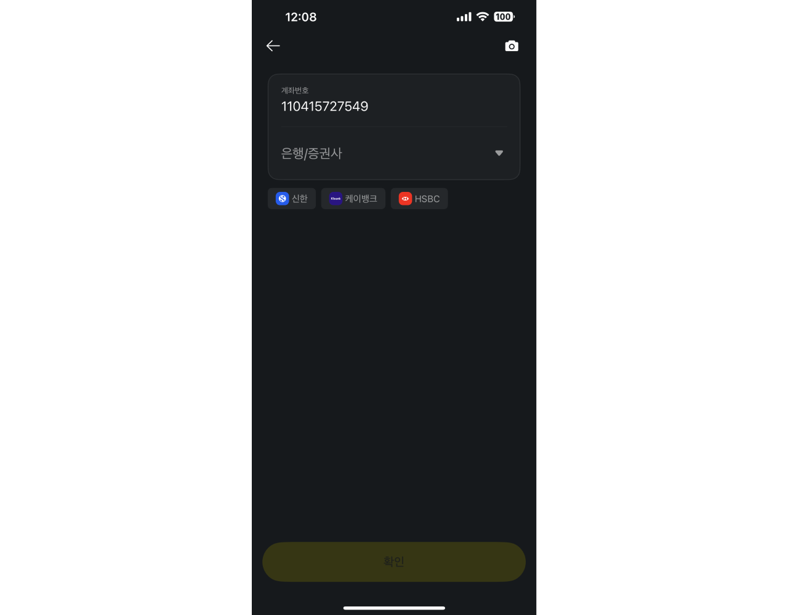

2023년은 정말 많은 일이 있었던 한 해였습니다. 그 중에서 `창업`이 가장 큰 사건(?)이 아니었을까 싶은데요. 이번 글에서는 2023년을 타임라인 순서대로 적어보고자 합니다.

## 카카오페이: 신규 프로젝트

2023년 초 당시 소속되어 있던 팀은 `카카오페이 머니`를 비롯한 현금 흐름을 지원하기 위한 플랫폼을 개발하는 팀이었고, 주로 실제 입금/출금 거래를 체결하기 위한 `카카오페이<->은행 통신 Gateway`, `머니 정산`, `전사 자금 업무 지원 플랫폼` 등의 프로젝트를 진행했습니다.

그러다보니 전사의 서비스 개발 조직에서 필요로 하는 공통된 부분을 도출하고 이를 플랫폼으로 `잘 만들어` 제공하는 것에 항상 관심이 있었는데요. 평소와 같이 타 조직의 Pain Point를 살펴보던 중 내부적으로 `<은행정보 플랫폼>`이라 불리는 신규 프로젝트를 추진하게 되었습니다.

기존에는 수십 개의 개발 조직에서 은행에 대한 정보가 필요하다면 각자 관리하는 구조였습니다.

1. 카카오페이 머니 개발 조직: 송금 가능한 은행 목록 노출, 계좌 연결 가능한 은행 목록 노출, ...
2. 고객 문의 플랫폼 개발 조직: 착오송금 반환 중개 시 은행 정보 입력
3. 등등..

은행 이름, 로고, 약관, 송금/계좌연결 가능 여부, 점검 유무 등 다양한 정보를 파편적으로 관리하고 있다보니 각 화면마다 보이는 로고가 다르거나 해당 은행이 점검 중인지 확인하기 위해선 실제로 송금과 같은 `액션`을 수행해봐야만 하는 문제가 있었습니다.

이에 가장 빠르게 협업 해볼만한 조직을 리서치해보기 시작했고, 가장 밀접하게 협업 중이던 머니 서비스 개발 조직에서 `송금 단계에서 계좌번호 입력 시 은행 추론` 기능을 개발하고자 하는 니즈가 있음을 확인 했습니다.

송금 단계에서 계좌번호 입력 시 은행 추론 기능(카카오페이 송금 화면 캡처)

- 카카오페이: 프로젝트, 퇴사
- 창업: 서울대 입구 -> 투자 -> 팁스 -> 채용 -> ...
- 제품/기술: -> ...
- 2024 예정

카카오페이 이야기 -> 창업 -> 투자 -> 채용 -> 기술 -> 2024 예정