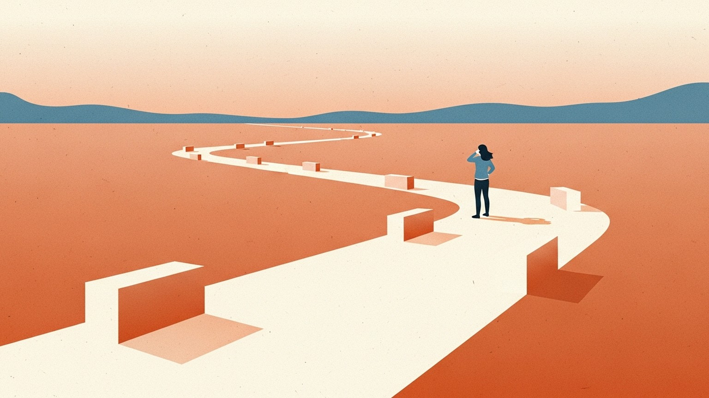

1960년 2월, 『사이언티픽 아메리칸』의 「Mathematical Games」 칼럼에 짧은 문제 하나가 실렸다. 마틴 가드너가 쓴 그 호의 부제는 어쩐지 불길했다. "결혼하기 전에 고려해야 할 것들에 관한 수학적 퍼즐."

문제 자체는 단순했다. 비서 한 명을 뽑는다고 치자. 후보는 100명. 한 명씩 차례로 면접을 보고, 면접이 끝나는 순간에 뽑을지 말지를 결정해야 한다. 한번 거절한 사람은 다시 부를 수 없다. 게다가 지원자의 절대적인 점수는 보이지 않는다. 지금까지 본 사람들 사이의 상대적 순위만 보인다. 이 조건에서 어떻게 해야 진짜 최고의 후보를 뽑을 수 있을까?

수학자들은 이 문제를 아주 좋아했다. 하도 좋아해서 이름이 여러 개 생겼다. 비서 문제(secretary problem), 결혼 문제(marriage problem), 술탄의 지참금 문제(sultan's dowry problem), 구골 게임(googol game). 같은 문제인데 상황만 바꿔놓은 것이다. 술탄은 왕비 후보를, 비서실장은 비서를, 그리고 아마 당신은… 오늘의 주제다.

놀랍게도 이 문제에는 정답이 있다. 그것도 매우 깔끔한, 외우기 쉬운 정답이. 그리고 이 정답은 꽤 오래전부터 은근히 유명해서, 데이팅 앱이 생기기 한참 전부터 수학자들이 결혼 상대를 고를 때 몰래 참고했다는 소문도 있다.

어디 한번 들여다보자.

### 37%에서 멈추라

최적 전략은 이렇다.

- 전체 후보의 **처음 37%는 무조건 거절한다.** 이 구간은 "탐색"이다. 이 사람이 아무리 좋아 보여도 넘긴다.
- 37%가 지나면, 지금까지 본 최고보다 나은 사람이 나타나는 순간 그와 결정한다.

왜 하필 37%일까. 수학적 유도는 복잡하지만 결과는 단순하다. 전체의 1/e 지점에서 멈추는 게 최적이고, 1/e ≈ 0.368, 반올림하면 37%다. e는 자연로그의 밑, 값은 2.71828…. 파이만큼 유명하진 않지만 파이만큼 이상한 상수다. 그래서 이 전략은 "37% 규칙"이라는 별명을 얻었다.

그리고 이 전략이 1등을 뽑을 확률은 1/e ≈ 36.8%다. 달리 말하면, 이 수학이 추천하는 최적의 전략을 완벽히 따라도 **열 번 중 여섯 번은 1등을 놓친다.** 이게 "공식이 있다"는 말의 함정 중 하나다. 있긴 있는데, 60%는 실패한다.

숫자를 조금 만져보자. 브라이언 크리스천과 톰 그리피스는 『알고리즘, 인생을 계산하다』에서 이 공식을 데이팅 기간에 대입한다. 18살부터 40살까지 22년 동안 누군가를 만나보기로 정했다고 하자. 22년의 37%는 약 8년. 즉, **26살이 되기 전까지는 누구를 만나든 "이 사람이다" 싶어도 일단 거절하라.** 그리고 26살이 넘어가면, 지금까지 만난 역대 최고를 기억해두고, 그보다 나은 사람이 나타나는 즉시 결혼하라.

만약 기간이 아니라 "만날 사람 수"로 계산하면 어떨까. 평생 열 명쯤 진지하게 만난다고 치면, 앞의 서너 명은 연습용이고, 네 번째부터는 누구라도 이전보다 나으면 결혼하라는 얘기가 된다.

써놓고 보니 굉장히 낭만적이지 않은 문장이다. 하지만 수학은 원래 낭만에 관심이 없다. 37% 규칙은 사랑을 이야기하지 않는다. 이 공식이 말하는 건 "어떻게 하면 최고를 놓칠 확률을 줄일 수 있는가"에 가깝다. 그리고 방금 봤듯이, 줄여도 60%는 놓친다. 이 사실은 계속 기억해둘 가치가 있다.

### 그런데 그 사람이 이미 고점이었다면

이 공식의 가장 잔인한 부분은 여기다.

37% 규칙이 실패하는 시나리오는 크게 두 가지다.

첫 번째. **탐색 구간(처음 37%) 안에 이미 인생 최고가 있었다.** 그 사람은 "기준"을 세우는 데만 쓰이고 지나간다. 이후에 등장하는 사람들은 전부 그보다 못한 사람들이니, 규칙을 지키면 아무도 고를 수 없다. 마지막까지 버티다가 전략이 무너져버린다.

두 번째. **관찰 구간의 최고가 너무 훌륭해서 이후 아무도 못 이긴다.** 결과적으로 마지막 사람까지 끌려가고, 별 감흥 없는 그 사람과 결정하게 된다.

첫 번째 시나리오가 발생할 확률은 정확히 37%다. 1등이 전체 후보 중 어느 위치에 있을지는 대체로 균일분포로 본다. 그러니 앞쪽 37% 안에 있을 확률이 37%. 바꿔 말하면, 이 공식을 완벽히 따르는 사람의 **세 명 중 한 명은 "이 사람이다" 싶었던 사람을 거절해놓고 평생 그보다 나은 사람을 만나지 못한다.**

이상한 일이다. 수학자들이 "최적"이라고 부르는 전략인데, 실행한 사람의 3분의 1은 자기 인생 최고의 사람을 직접 흘려보냈다는 사실조차 모르고 살아간다. 그게 수학적으로 "정답"이다.

이 부분이 사랑에 대한 수학을 진지하게 받아들일 수 없게 만드는 진짜 이유 같다. 수학은 "가장 높은 확률로 1등을 뽑는 전략"을 알려주지, "이 사람이 지금 내가 만날 수 있는 가장 좋은 사람인가"에는 답하지 않는다. 37%가 지난 뒤 "어, 이 정도면 전보다 낫네" 싶어서 멈춘 바로 그 지점이 사실은 당신 인생의 고점일 수도 있고, 동시에 당신이 놓친 첫 37% 어딘가에 그보다 훨씬 높은 봉우리가 있었을 수도 있다.

그리고 결정적으로, **당신은 그걸 영영 모른다.** 탐색이 끝나면 그 사람들은 대부분 당신 삶에서 사라지니까.

재미있는 역설이 하나 있다. 탐색 구간에서 최고를 세워두고 활용 구간에 진입한 뒤, 그 기준을 뛰어넘는 사람이 "드디어" 나타났다고 하자. 수학의 관점에서 이 사람은 특별하다. 왜냐하면 관찰된 전체 후보의 1등이 (지금까지는) 이 사람이기 때문이다. 그런데 이때 "그래도 더 나은 사람이 있을 수 있지 않나?"라는 생각이 든다면, 사실 그 생각은 이미 37% 규칙이 거부하라고 경고한 바로 그 유혹이다.

규칙은 이렇게 말한다. "탐색은 끝났다. 당신이 지금 보고 있는 사람은 지금까지의 전부를 이긴 사람이다. 더 기다리는 건 원리적으로 이득일 수도 있지만, 통계적으로 당신은 지금보다 더 나은 사람을 만나기보다 아무도 만나지 못하고 시간을 태울 가능성이 더 크다."

그래서 "이 사람보다 더 나은 사람이 있을 수도 있다"는 생각이 들기 시작하면, 수학적으로는 오히려 신호를 거꾸로 읽고 있을 가능성이 크다. 37%가 지난 시점에 과거 최고를 이긴 사람이 나왔다는 건, 확률적으로 이 사람이 앞으로 만날 사람들 중에서도 상위에 있을 공산이 크다는 뜻이다. "더 나은 사람"을 기다리는 시간이 길어질수록 당신은 63%의 중간 어딘가를 낭비하고 있을지 모른다.

물론, 그래도 남은 63%에서 더 나은 사람이 나타날 확률은 여전히 있다. 얼마나? 직관과 달리 그리 높지 않다. 그리고 이 확률이 얼마든, 여기엔 한 가지 슬픈 조항이 덧붙는다. 기다리는 동안 그 사람은 기다려주지 않는다는 것.

### 수학자들도 이 문제로 장난쳤다

공식은 공식이고, 현실은 현실이다. 수학자들도 이 사실을 모르지 않았다. 그래서 그들은 결혼 문제에 대해 꽤 오랫동안 농담 같은 장난을 쳐왔다.

1611년, 독일의 천문학자 요하네스 케플러는 첫 아내를 잃고 두 번째 아내를 구하고 있었다. 케플러는 꼼꼼한 사람이었다. 어찌나 꼼꼼했는지, 2년에 걸쳐 11명의 후보 여성을 만났고, 각각의 장단점을 세밀하게 정리한 편지와 일지를 남겼다. 행성의 궤도를 타원으로 정리한 그 남자답게, 결혼 후보들도 정량화하려 했던 셈이다.

수학사학자 알렉스 벨로스가 정리한 바에 따르면, 케플러는 4번째 후보에게 강하게 끌렸지만 친구들의 만류로 넘어갔고, 이후 5번부터 11번까지 계속 비교를 이어갔다. 결국 그가 선택한 사람은 5번째 후보, 수잔나 로이팅거였다. 결혼 생활은 꽤 행복했다고 기록돼 있다. 케플러는 최적 멈춤 이론을 알지 못했다. 그의 시대에 그런 건 없었다. 그런데 그가 한 일을 37% 규칙에 대입해보면 기묘하게 맞아떨어진다. 11명 중 37%는 약 4명. 탐색 구간의 최고(4번째)를 기준점으로 두고, 5번째에서 그보다 나은 사람이 나왔을 때 멈춘 셈이다.

이 패턴은 순전한 우연일 수도, 케플러가 직관적으로 도달한 일종의 자가 발견일 수도 있다. 어느 쪽이든, 400년 뒤의 수학자들은 이 일지를 보고 기립박수를 쳤다.

훨씬 최근에는 더 뻔뻔한 장난도 있었다. 2010년, 영국 워릭대학의 경제학자 피터 백커스는 "나는 왜 여자친구가 없는가(Why I Don't Have a Girlfriend)"라는 장난 논문을 썼다. 백커스가 사용한 도구는 드레이크 방정식이었다. 드레이크 방정식은 원래 우리 은하에 존재할 외계 문명의 수를 추정하기 위해 천문학자 프랭크 드레이크가 만든 수식이다. 별의 탄생 속도, 행성을 가진 별의 비율, 생명이 발생할 비율, 지적 생명으로 진화할 비율, 교신 가능한 문명이 될 비율, 문명 존속 시간. 여섯 개의 수를 곱해 외계 문명의 수를 얻어내는 간결한 방정식이다.

백커스는 이 수식의 변수를 하나씩 바꿨다. 별의 탄생 속도 대신 영국의 인구 증가율, 행성을 가진 별의 비율 대신 여성의 비율, 생명이 발생할 비율 대신 런던에 거주할 비율… 전부 넣고 계산해보니, 영국에서 그의 이상형일 가능성이 있는 여성은 **약 26명**이었다. 그 시점에 감지 가능한 외계 문명이 약 10개 정도로 추정되고 있었으니, 결론은 이랬다: 외계인을 만날 확률보다 이상형을 만날 확률이 2.6배 높다. 위로인지 비관인지 헷갈리는 결론이다.

드레이크 방정식도 37% 규칙도, 어떤 의미에서는 같은 일을 하고 있다. 통제할 수 없을 만큼 복잡한 현실을 몇 개의 숫자로 축약해놓고, "이 숫자만 맞추면 답이 나온다"고 주장한다. 그게 사실일 리 없다는 걸 모두가 안다. 그런데도 계산하고, 발표하고, 읽는다. 이 안에 뭔가가 있다. 불완전한 수식이라도, 무작위한 삶에 격자 하나를 올려놓으면 최소한 어디가 어디인지 가리킬 수는 있다. 정답이 아니라 좌표계로서의 수학이다.

수학자들은 이 문제를 가지고 수십 년간 변형을 만들어왔다. 몇 가지만 추려보자.

- **완전 정보 변형(full-information problem)**: 후보의 절대 점수를 볼 수 있다면? 이 경우 성공 확률은 37%에서 **58% 이상**으로 뛴다. 상대 순위만 보던 원래 문제가 얼마나 정보 빈곤한 설정이었는지 드러나는 대목이다.
- **되돌아가기 허용(recall allowed)**: 이미 거절한 사람을 다시 부를 수 있으면, 당연히 더 나은 전략이 존재한다. 확률은 올라가고 공식은 덜 엄격해진다. 현실의 재회나 뒤늦은 고백이 여기 해당된다고 볼 수 있다.
- **2등 뽑기(postdoc problem)**: 놀랍게도 2등을 뽑는 전략은 1등을 뽑는 전략과 다르다. 탐색 구간이 37%가 아니라 더 짧다. "최고는 부담스러우니 2등이면 된다"는 사람에게 수학은 다른 답을 준다.
- **매칭 시장(Gale-Shapley)**: 선택하는 쪽이 한쪽이 아니라 양쪽이라면? 수학자 로이드 섀플리와 데이비드 게일은 1962년 "안정 매칭 알고리즘"을 발표했다. 모든 사람이 서로에게 순위를 매기고, 제안하고, 거절하고, 받아들이는 이 메커니즘은 2012년 노벨 경제학상을 받았다. 결혼 문제에 "상대방도 나를 고른다"는 조항을 추가한 순간, 수학은 훨씬 재밌어졌고 동시에 훨씬 현실에 가까워졌다.

이 모든 변형이 말해주는 것은 하나다. **원래의 37% 규칙은 아주 특수한 설정에서만 성립한다.** 그리고 그 설정이 현실과 얼마나 닮았는지는… 음, 그건 각자의 삶에 달렸다. 대체로 덜 닮았고, 가끔 예상보다 닮았다.

### 멈추는 일에 대하여

수학을 한쪽으로 치워놓고 보면, 37% 규칙이 하는 이야기는 사실 아주 오래된 질문이다. **언제 충분히 알았다고 말할 수 있는가.**

1978년, 경제학자 허버트 사이먼은 두 종류의 사람을 구분했다. 극대화자(maximizer)와 만족자(satisficer). 극대화자는 모든 선택지를 다 검토하고 그중 최고를 고르려고 한다. 만족자는 일정 기준을 세운 뒤, 그 기준을 넘는 첫 선택지에서 멈춘다. 사이먼은 극대화자 전략이 수학적으로는 가장 좋은 결과를 낼 것 같지만, 현실에선 거의 불가능하다고 지적했다. 후보가 유한하고 비교 비용이 0일 때에만 성립하는 전략이기 때문이다. 현실의 후보는 시간이 지나면 사라지고, 비교하는 데는 시간과 감정이 든다.

2002년, 심리학자 배리 슈워츠는 이 아이디어를 "선택의 역설(paradox of choice)"로 확장했다. 그의 연구에 따르면, 극대화자 성향이 강한 사람일수록 결정을 내린 뒤에도 더 후회하고 더 불행해진다. 선택지를 오래 비교할수록 "더 나은 게 있었을지도 모른다"는 그림자가 길게 따라붙는다. 반대로 만족자는 기준을 넘는 첫 순간에 멈추고, 그 뒤의 삶에 에너지를 쓴다.

37% 규칙의 진짜 미덕은 이 지점에서 드러난다. 이 규칙은 겉으로는 극대화자의 문법으로 쓰여 있다. "1등을 뽑을 확률을 최대화하라." 그런데 막상 따르면 60%는 실패하고, 그 실패의 상당 부분은 "이미 최고를 놓쳤다"는 방식이다. 수학적 극대화조차 만족자의 결론으로 귀결된다. **"더 나은 게 있었을지도 모른다"는 건, 모든 선택이 항상 짊어지는 조건이지, 어떤 특정 선택의 결함이 아니다.**

이 관점은 사랑뿐 아니라 많은 일에 적용된다. 어느 회사에서 멈출지, 어느 직업에서 멈출지, 어느 도시에서 멈출지, 어느 책상에서 멈출지. 계속 비교하고 싶은 유혹은 강하지만, 수학이 보여주는 건 비교의 수익률이 생각보다 빨리 떨어진다는 사실이다. 그리고 멈춘 자리가 최고가 아닐 확률은 어느 전략을 써도 대개 50%를 넘는다. "최적"을 포기해도 잃을 것은 대부분 착시다.

그러니 "이 사람보다 더 나은 사람이 있지 않을까"라는 질문이 찾아오면, 그 질문 자체가 답이 아닐 수도 있다. 37% 규칙이 옳다면, 그 질문에 매달리는 시간의 대부분은 이미 지나간 탐색 구간을 뒤돌아보거나, 63%의 남은 시간을 통계적으로 유의미하지 않은 비교에 쓰는 일에 가깝다. 어쩌면 질문을 이렇게 바꾸는 편이 더 정확할지도 모른다. **이 사람이 내 기준을 넘는가.**

수학은 여기까지다. 그 다음은 사람의 몫이다. 케플러는 11명의 후보를 세심하게 비교한 뒤 다섯 번째에서 멈추었고, 그게 행복한 결혼으로 이어졌다고 전한다. 피터 백커스는 자기 이상형이 26명이라는 계산을 공개한 뒤 몇 년 뒤 실제로 결혼했다. 그들의 결정이 수학이 말한 "최적"이었는지, 아니었는지는 아무도 모른다. 아마 본인들도.

36.8%는 사랑에 빠질 확률이라기보다, 멈춰도 괜찮다고 수학이 슬쩍 건네주는 승인에 가깝다. 그 숫자가 완벽하지 않다는 걸 알면서도, 그리고 바로 그 불완전함 때문에, 수학이 끝난 자리에서부터 사람이 시작될 여지가 남는다.
