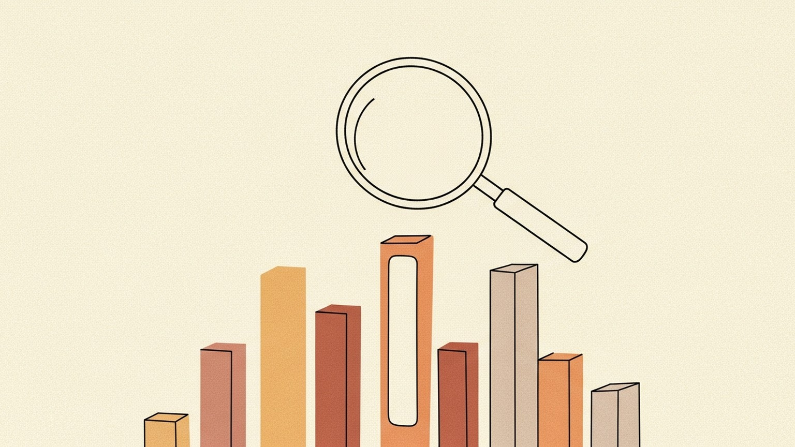

> **논문 정보**
>
> - **제목**: AI Agents That Matter
> - **저자**: Sayash Kapoor, Benedikt Stroebl, Zachary S. Siegel, Nitya Nadgir, Arvind Narayanan (Princeton University)
> - **출판**: arXiv 2407.01502 (2024.07)

시리즈의 지난 세 글에서 에이전트 학습의 세 가지 축을 읽었다. Reflexion은 자연어 반성으로, LATS는 트리 탐색으로, ETO는 대조 학습으로 성능을 끌어올렸다. HumanEval에서 91%, 92.7%라는 수치가 등장했고, 각각이 이전 SOTA를 넘어섰다. 숫자는 인상적이었다.

하지만 여기서 멈추고 물어야 할 질문이 있다. 그 숫자가 진짜 의미하는 것은 무엇인가? LATS가 92.7%를 달성할 때, 얼마를 썼는가? 단순히 같은 문제를 다시 풀어보는 것과 비교하면 어떤가?

2024년 7월, Princeton University의 연구팀이 정확히 이 질문을 던졌다. 논문 제목부터 도발적이다 — "AI Agents That Matter". 중요한 AI 에이전트. 현재의 에이전트 벤치마킹이 "중요하지 않은" 에이전트를 만들고 있다는 암묵적 비판이다.

## 134달러짜리 88% — 숫자 뒤의 숫자

논문이 제시하는 첫 번째 실험이 가장 충격적이다. HumanEval 벤치마크에서 여러 에이전트의 정확도와 비용을 함께 측정한 것이다.

| 에이전트 | 정확도 (%) | 총 비용 ($) |
|--------|-----------|------------|
| GPT-4 (zero-shot) | 89.6 | 1.93 |
| Warming (GPT-4) | 93.2 | 2.45 |
| Retry (GPT-4) | 92.0 | 2.51 |
| LDB (GPT-4) | 93.3 | 6.36 |
| Reflexion (GPT-4) | 87.8 | 3.90 |
| LATS (GPT-4) | 88.0 | 134.50 |

Warming은 단순한 전략이다. 실패하면 온도를 조금 올려서 다시 시도한다. 그게 전부다. 자기 반성도 없고, 트리 탐색도 없고, 외부 메모리도 없다. 이 전략이 93.2%를 달성한다. LDB(93.3%)와 거의 같은 정확도를, 비용은 2.45달러 대 6.36달러로 절반 이하에 달성한다.

LATS는 88%에 134.50달러다. 앞선 글에서 읽었던 정교한 트리 탐색, 가치 함수, 반성 메커니즘 — 이 모든 것이 단순 재시도보다 정확도는 낮으면서 비용은 50배 이상이다. 물론 이것은 HumanEval이라는 특정 벤치마크에서의 결과이고, 더 어려운 과제에서는 이야기가 달라질 수 있다. 하지만 이 숫자가 던지는 질문은 불편하다.

## 네 가지 근본 문제

논문은 현재 에이전트 벤치마킹의 네 가지 구조적 문제를 식별한다.

**첫째, 정확도만 추구하면 비용이 무한히 증가한다.** 리더보드는 정확도만 보여준다. 연구자들은 비용에 관계없이 정확도를 1%라도 올리려 한다. 결과적으로 복잡하고 비싼 에이전트가 리더보드 상위를 차지하지만, 실세계에서 배포하기에는 비실용적이다. SWE-Agent 1회 실행에 4달러라면, 하루에 수천 건의 요청을 처리하는 서비스에서는 감당할 수 없다.

논문이 제안하는 대안은 파레토 프론티어다. 정확도와 비용을 2차원 평면에 놓고, 어떤 에이전트가 "더 적은 비용으로 같은 정확도" 또는 "같은 비용으로 더 높은 정확도"를 달성하는지 보는 것이다. 파레토 프론티어 위의 에이전트만이 "중요한" 에이전트다. 프론티어 아래에 있다면, 더 싸면서 더 정확한 대안이 존재한다는 뜻이다.

**둘째, 모델 평가와 다운스트림 평가가 혼동된다.** 모델 개발자가 아키텍처의 효과를 측정하려는 것과, 서비스 개발자가 어떤 모델을 채택할지 결정하려는 것은 다른 목적이다. 전자는 계산량(compute)으로 비용을 측정하고, 후자는 달러로 측정해야 한다. 이 구분이 무시되면, 벤치마크 결과가 실세계 의사결정을 잘못 안내한다.

NovelQA 사례가 이를 보여준다. 긴 컨텍스트 모델과 RAG를 비교할 때, NovelQA 벤치마크는 RAG에 불리하게 설계되어 있다. 하지만 실세계에서 RAG는 20배 이상 저렴하면서 유사한 정확도를 낸다.

**셋째, 적절한 hold-out 세트가 부족하다.** 에이전트 연구에서 과적합은 모델 과적합과 다른 형태로 나타난다. 특정 벤치마크의 구조를 알고 있는 연구자가, 그 구조에 맞춘 하드코딩된 전략을 에이전트에 심는다. WebArena에서 1위를 차지한 STeP 에이전트가 대표적이다. URL 구조에 의존하는 하드코딩된 정책을 사용했고, URL이 바뀌면 작동하지 않았다.

논문이 제시하는 4단계 일반성 프레임워크가 이 문제를 체계화한다. 분포 특화, 과제 특화, 도메인 일반, 완전 일반 — 각 수준에서 적절한 hold-out 세트가 달라진다. 17개 벤치마크를 분석한 결과, 대다수가 적절한 hold-out을 포함하지 않았다.

**넷째, 표준화와 재현성이 부족하다.** 같은 벤치마크에서 같은 에이전트를 실행해도, 평가 스크립트의 차이, 외부 환경과의 상호작용, 미묘한 버그로 인해 결과가 달라진다. HumanEval과 WebArena 모두에서 만연한 재현성 문제가 발견되었다.

## 단순한 기준선의 위력

논문이 테스트한 세 가지 단순 기준선이 인상적이다.

Retry: 실패하면 최대 5회까지 같은 프롬프트로 재시도한다. 온도는 0.

Warming: Retry와 같지만, 재시도할 때마다 온도를 0에서 0.5까지 점진적으로 올린다. 다양한 출력을 유도하기 위해서다.

Escalation: 가장 저렴한 모델(Llama-3 8B)부터 시작하고, 실패하면 더 비싼 모델로 올라간다.

이 중 Escalation이 특히 주목할 만하다. 85%의 정확도를 0.27달러에 달성한다. 대부분의 문제는 저렴한 모델로 풀 수 있고, 어려운 문제만 비싼 모델이 처리한다. 비용 효율성 관점에서 가장 뛰어나다.

이 결과가 시사하는 것은 "복잡한 에이전트 구조가 성능 향상에 기여한다"는 일반적 가정에 대한 의문이다. 논문의 표현을 빌리면, "System 2 접근법 — 디버깅, 반성, 계획 — 이 성능 향상에 책임이 있다는 증거가 부족하다." 적어도 HumanEval 수준의 벤치마크에서는 그렇다.

## 비용을 함께 최적화하면 — DSPy 실험

논문은 비판에 그치지 않고 대안을 제시한다. DSPy 프레임워크와 Optuna를 사용하여, 정확도와 비용을 동시에 최적화하는 실험을 수행했다.

HotPotQA에서 GPT-3.5를 사용할 때, 공동 최적화가 기본 DSPy 대비 비용을 53% 절감하면서 동일한 정확도를 유지했다. Llama-3-70B에서는 41% 절감. 최적화 대상은 온도, 퓨샷 예시의 수와 선택, 포맷팅 지시의 포함 여부 같은 단순한 하이퍼파라미터들이다. 복잡한 에이전트 구조가 아니라, 기본적인 설정 조정만으로도 큰 효율 개선이 가능하다는 뜻이다.

## 2026년의 시선 — 비판의 유효성

논문이 발표된 2024년 7월로부터 약 2년이 지났다.

**실현된 것**: 비용 인식 평가가 에이전트 연구의 표준으로 자리잡기 시작했다. SWE-bench Verified 같은 최신 벤치마크는 비용을 함께 보고하는 추세다. Escalation 패턴은 "라우터(router)" 방식으로 산업에서 광범위하게 채택되었다 — 간단한 쿼리는 작은 모델이, 어려운 쿼리는 큰 모델이 처리하는 구조다.

**여전히 유효한 것**: 리더보드 중심의 연구 문화는 여전하다. 새로운 에이전트 논문이 나올 때마다 "SWE-bench에서 X%"라는 숫자가 헤드라인을 장식하고, 비용은 작은 글씨로 묻힌다. 논문이 제기한 재현성 문제도 근본적으로 해결되지 않았다.

**수정이 필요한 것**: "복잡한 에이전트가 불필요하다"는 주장은 HumanEval 같은 단순 벤치마크에서는 맞지만, SWE-bench나 실세계 소프트웨어 엔지니어링 과제에서는 다르다. 복잡한 추론, 계획, 도구 사용이 실질적 차이를 만드는 영역이 존재한다. 논문도 이 점을 인정하며 "더 어려운 과제에서는 System 2 접근이 유용할 가능성"을 언급한다.

## CoALA 좌표계 위의 이 논문

이 논문은 에이전트를 만드는 논문이 아니라, 에이전트를 평가하는 논문이다. CoALA 좌표계 위에 놓기보다는, 좌표계 자체를 점검하는 메타 연구에 해당한다.

시리즈에서 읽어온 모든 논문 — CoT, ReAct, Reflexion, LATS, ETO — 의 성과가 실제로 무엇을 의미하는지 재검토하게 만든다. 벤치마크 숫자 뒤에 비용이 있고, 비용 뒤에 실용성이 있고, 실용성 뒤에 "이 에이전트가 실세계에서 정말 유용한가"라는 궁극적 질문이 있다.

## 마무리 — 숫자를 읽는 법

이 논문이 바꾸는 것은 에이전트 연구를 읽는 방식이다. 정확도가 몇 퍼센트인지 묻기 전에, 비용이 얼마인지 묻는다. SOTA라는 라벨을 보기 전에, 단순 기준선과 비교했는지 확인한다. 복잡한 구조가 진짜로 기여하는 부분인지, 아니면 같은 효과를 더 싸게 얻을 수 있는지 따진다.

다음 글에서는 다시 에이전트 아키텍처로 돌아온다. Paradigms — 도구 사용, 계획, 피드백 학습이라는 세 가지 패러다임으로 에이전트 전체를 정리하는 리뷰 논문을 읽는다.

---

*이 글은 "Agentic AI 논문 읽기" 시리즈의 열한 번째 글입니다. 시리즈 전체 목록은 시리즈 페이지에서 확인할 수 있습니다.*
