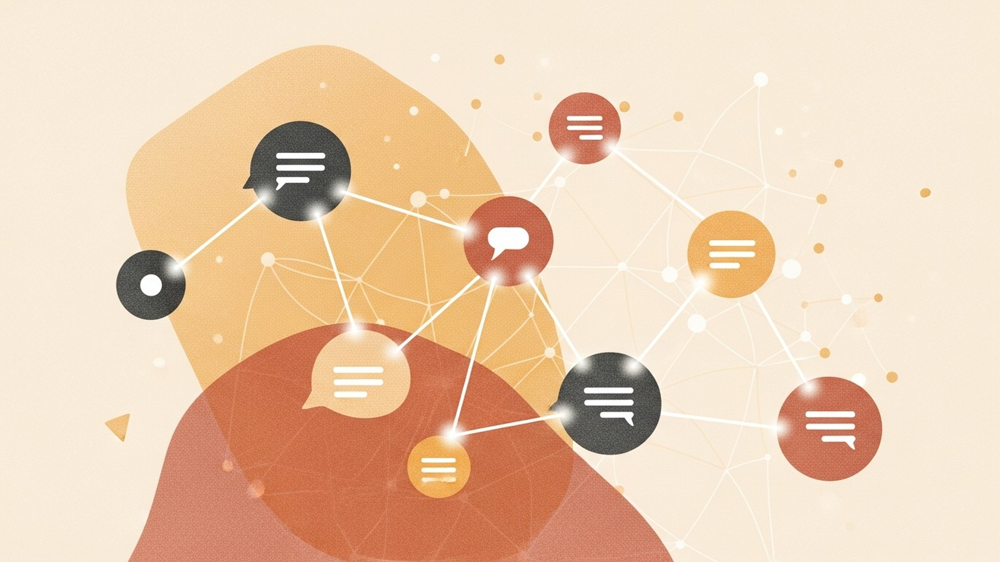

> **논문 정보**
>
> - **제목**: AutoGen: Enabling Next-Gen LLM Applications via Multi-Agent Conversation
> - **저자**: Qingyun Wu, Gagan Bansal, Jieyu Zhang, Yiran Wu, Beibin Li 외 다수 (Microsoft Research, Penn State University, University of Washington, Xidian University)
> - **출판**: arXiv 2308.08155 (2023.10)

이 시리즈의 첫 번째 글에서 CoALA는 좌표계를 펼쳤다. 기억, 행동, 판단이라는 세 축 위에 에이전트를 올려놓는 지도다. 두 번째 글에서 ReAct는 그 지도 위에 처음으로 에이전트를 세웠다. 생각하고, 행동하고, 관찰하는 사이클이다. 세 번째 글에서 CoT는 시간을 거슬러 올라가 원점을 찾았다 — LLM이 추론할 수 있다는 가장 근본적인 전제를 증명한 논문이다. 네 번째 글에서 Toolformer는 도구 사용법을 인간의 가르침 없이 스스로 학습할 수 있음을 보였다.

네 편의 논문이 그린 궤적은 이렇다. 생각할 수 있다(CoT), 생각하면서 행동할 수 있다(ReAct), 행동을 스스로 배울 수 있다(Toolformer). 하지만 이 모든 것은 한 명의 에이전트가 홀로 수행한 것이다. 지난 글의 마지막 문장이 던진 질문 — "이 모든 것을 하나의 시스템 안에서 어떻게 조율하는가?" — 에 이번 논문이 답한다.

2023년 10월이다. GPT-4가 공개된 지 7개월, ChatGPT 플러그인이 도입된 지 6개월이 지났다. Microsoft Research에서 하나의 전환을 제안하는 논문이 나온다. 혼자 일하는 에이전트의 시대를 넘어, 여러 에이전트가 대화를 통해 협력하는 시스템을 구축할 수 있는가? AutoGen은 이 질문에 프레임워크로 답한 논문이다.

### 혼자서는 부족하다 — 다중 에이전트의 직관

하나의 LLM 에이전트가 해결할 수 있는 문제의 범위는 넓다. CoT로 추론하고, ReAct로 도구를 사용하고, Toolformer의 방식으로 도구 사용법을 학습할 수 있다. 하지만 과제의 복잡성이 증가하면, 단일 에이전트는 한계에 부딪힌다.

비유하자면, 아무리 뛰어난 요리사도 혼자서 50인분의 코스 요리를 동시에 준비할 수 없다. 전채를 담당하는 사람, 메인 디시를 굽는 사람, 디저트를 만드는 사람, 전체 흐름을 조율하는 수석 셰프가 필요하다. 각자 전문 영역에서 일하되, 서로 소통하며 전체 코스를 완성한다. 이 직관을 LLM 에이전트에 적용한 것이 다중 에이전트 대화(multi-agent conversation)다.

논문은 다중 에이전트가 주는 이점을 세 가지로 정리했다. 첫째, 발산적 사고를 촉진한다. 다른 역할의 에이전트들이 같은 문제를 다른 관점에서 바라보면, 단일 에이전트가 놓치는 해법을 찾을 수 있다. 둘째, 사실성과 추론의 질을 높인다. 한 에이전트의 출력을 다른 에이전트가 검증하면, 환각이나 논리적 오류를 잡아낼 수 있다. 셋째, 역할 분담을 통해 복잡한 과제를 모듈적으로 분해할 수 있다.

그러나 다중 에이전트를 구현하려면 두 가지 근본적 질문에 답해야 한다. 개별 에이전트를 어떻게 설계해야 재사용 가능하고 커스터마이즈 가능한가? 그리고 다양한 대화 패턴 — 1:1 대화, 그룹 토론, 인간이 개입하는 대화 — 을 수용하는 통합 인터페이스를 어떻게 만들 것인가?

### 대화할 수 있는 에이전트 — ConversableAgent의 설계

AutoGen의 첫 번째 기여는 대화 가능한 에이전트(Conversable Agent)라는 추상화다. 에이전트는 메시지를 보내고 받을 수 있는 엔티티로, 세 가지 능력원으로 구동된다.

첫째, LLM이다. 역할 수행, 추론, 코드 생성 등 고급 언어 능력을 제공한다. 둘째, 인간(Human)이다. 에이전트 대화에 인간이 직접 참여하여 피드백을 제공하거나 판단을 내린다. 셋째, 도구(Tool)다. 코드 실행이나 함수 호출을 통해 외부 시스템과 상호작용한다.

핵심은 이 세 가지가 조합 가능하다는 점이다. 하나의 에이전트가 LLM만 사용할 수도 있고, LLM과 도구를 함께 사용할 수도 있고, 인간의 입력을 받으면서 도구를 실행할 수도 있다. 이 조합의 유연성이 ConversableAgent를 범용 빌딩 블록으로 만든다.

내장 에이전트 네 종류가 이 추상화 위에 구축된다:

| 에이전트 | 역할 | 능력원 |
|---------|------|--------|
| ConversableAgent | 최상위 추상화 | LLM + 인간 + 도구 (모두 가능) |
| AssistantAgent | AI 어시스턴트 | LLM 중심 (코드 생성, 문제 해결) |
| UserProxyAgent | 인간 프록시 | 인간 입력 수집 + 코드 실행 |
| GroupChatManager | 그룹 대화 관리자 | 동적 화자 선택 + 응답 브로드캐스트 |

비유를 이어가면, ConversableAgent는 주방에서 누구든 될 수 있는 범용 요리사다. "너는 오늘 수 셰프야"라고 역할을 부여하면 AssistantAgent가 되고, "너는 손님의 피드백을 전달하는 홀 매니저야"라고 하면 UserProxyAgent가 되고, "너는 주방 전체를 조율하는 헤드 셰프야"라고 하면 GroupChatManager가 된다. 같은 기본 추상화 위에서, 구성만 바꾸면 역할이 달라진다.

이전 논문들과 비교하면 이 설계의 차별점이 선명해진다. ReAct의 에이전트는 LLM + 도구의 고정된 조합이었다. 인간 개입을 추가하려면 별도의 메커니즘이 필요했다. Toolformer의 에이전트는 LLM + 도구이되, 추론 트레이스조차 없었다. AutoGen의 ConversableAgent는 이 모든 조합을 하나의 인터페이스 안에서 구성 가능하게 만든 것이다.

특히 인간 개입의 유연성이 주목할 만하다. UserProxyAgent의 `human_input_mode`는 세 가지 설정을 제공한다. `ALWAYS`는 매 턴마다 인간에게 입력을 요청한다. `TERMINATE`는 종료 조건이 충족될 때만 인간에게 확인을 요청한다. `NEVER`는 완전 자동 모드다. Toolformer의 "학습 후 자율 실행"과 ReAct의 "인간이 프롬프트를 작성" 사이의 스펙트럼을 연속적으로 조절 가능하게 만든 것이다.

### 대화로 프로그래밍하다 — 계산과 제어의 융합

AutoGen의 두 번째 기여는 대화 프로그래밍(Conversation Programming)이라는 패러다임이다. 복잡한 LLM 애플리케이션 워크플로우를 다중 에이전트 대화로 단순화한다는 통찰이다.

전통적인 프로그래밍에서 계산(computation)과 제어 흐름(control flow)은 분리되어 있다. 함수가 계산을 수행하고, if/else나 for 루프가 흐름을 제어한다. AutoGen은 이 두 가지를 모두 대화로 통합한다.

계산은 대화 중심적(conversation-centric)이다. 에이전트가 대화에서 행동을 수행하고, 그 결과가 후속 대화로 이어진다. 제어 흐름은 대화 주도적(conversation-driven)이다. 어떤 에이전트에게 메시지를 보낼지, 어떤 순서로 작업할지가 대화 자체에 의해 결정된다.

이를 가능하게 하는 두 가지 설계 패턴이 있다.

첫째, 통합 인터페이스와 자동 응답이다. 모든 에이전트는 `send`, `receive`, `generate_reply`라는 세 가지 함수를 공유한다. 메시지를 받으면 자동으로 응답을 생성하고, 그 응답을 다시 상대에게 보내는 사이클이 반복된다. 종료 조건이 충족될 때까지 이 사이클이 이어지면서, 별도의 오케스트레이션 코드 없이도 대화가 자동으로 진행된다.

둘째, 자연어와 프로그래밍 언어의 융합이다. 에이전트의 행동은 시스템 메시지(자연어)로 프로그래밍하고, 종료 조건이나 도구 실행 같은 정밀한 제어는 Python 코드로 정의한다. 자연어와 코드 사이의 전환이 양방향으로 일어난다 — LLM이 코드를 생성하면 그것이 실행되고, 실행 결과가 다시 대화로 돌아온다.

동적 대화 패턴도 지원한다. 대화 도중 다른 에이전트를 동적으로 호출할 수 있고, GroupChatManager가 상황에 따라 다음 화자를 선택할 수 있다. 정적으로 고정된 순서가 아니라, 대화의 맥락에 따라 흐름이 결정된다.

이것을 당시 기준으로 기존 시스템과 비교하면 AutoGen의 위치가 명확해진다.

| 측면 | AutoGen | CAMEL | BabyAGI | MetaGPT |
|------|:---:|:---:|:---:|:---:|
| 대화 패턴 | 유연(동적) | 정적 | 정적 | 정적 |
| 코드 실행 | O | X | X | O |
| 인간 개입 | 설정 가능 | X | X | X |

유연한 대화 패턴, 코드 실행, 설정 가능한 인간 개입을 모두 지원하는 프레임워크는 논문이 쓰인 시점에 AutoGen이 유일했다.

### 여섯 개의 무대 — 벤치마크와 사례

논문은 여섯 가지 애플리케이션에서 프레임워크의 효과를 입증했다. 각각이 다른 대화 패턴과 에이전트 조합을 보여주며, AutoGen의 유연성을 다각도로 검증한다.

**수학 문제 해결 — 내장 에이전트 2개의 위력**

가장 인상적인 결과다. AssistantAgent(문제 풀이)와 UserProxyAgent(코드 실행)라는 기본 에이전트 두 개만으로 MATH 벤치마크에서 69.48%를 달성했다. 당시 GPT-4 단독의 55.18%를 14%p 능가한 수치다.

| 시스템 | MATH 정확도 |
|--------|:---:|
| AutoGen (2-에이전트) | 69.48% |
| GPT-4 (단독) | 55.18% |
| ChatGPT + Code Interpreter | 45.0% |

비결은 단순하다. AssistantAgent가 문제를 풀어서 Python 코드를 생성하고, UserProxyAgent가 그 코드를 실행한다. 실행 결과가 틀리면 대화가 이어지고, AssistantAgent가 코드를 수정한다. 이 사이클이 반복되면서 답에 수렴한다. 인간이 대화에 참여하는 human-in-the-loop 모드에서는 자율적으로 풀 수 없는 도전적 문제도 해결했다.

**ALFWorld 텍스트 게임 — 그라운딩 에이전트의 가치**

2-에이전트(어시스턴트 + 실행기)로 ReAct에 필적하는 성능을 보였지만, 반복 오류 루프에 빠지는 문제가 있었다. 에이전트가 같은 실수를 되풀이하는 것이다. AutoGen의 모듈적 설계 덕분에 그라운딩 에이전트를 추가하여 3-에이전트 시스템을 구성했다. 이 에이전트는 반복 오류 징후가 보일 때 상식 지식을 적시에 제공한다. "대상 물건을 찾아서 집어야 사용할 수 있다"는 배경 지식을 주입하여 오류 루프를 끊는 것이다. 결과는 2-에이전트 대비 15% 성능 향상이었다.

이 사례가 보여주는 교훈은 명확하다. 문제를 풀 에이전트뿐 아니라, 문제를 풀다 막혔을 때 도와줄 에이전트가 별도로 필요하다는 것이다. 인간 팀에서 멘토의 역할과 같다.

**멀티에이전트 코딩 (OptiGuide) — 코드 축소와 안전성**

공급망 최적화 코드 작성을 위해 Commander(지시), Writer(코드 작성), Safeguard(안전 검증)의 3-에이전트 구조를 설계했다. 핵심 워크플로우 코드가 430줄에서 100줄로 축소됐다 — 4배 이상의 절감이다. 더 중요한 것은 Safeguard 에이전트가 안전하지 않은 코드를 식별하는 F-1 점수를 GPT-4에서 8%, GPT-3.5에서 35% 향상시켰다는 것이다. 코드를 쓰는 에이전트와 코드를 검증하는 에이전트를 분리한 것만으로 안전성이 올라간 결과다.

**검색 증강 QA — 대화형 검색**

검색 증강 에이전트 2개로 Natural Questions에서 F1 66.65%를 달성했다. 핵심 혁신은 대화형 검색(interactive retrieval)이다. 관련 정보를 찾지 못하면 "UPDATE CONTEXT"라는 메시지로 자동 재검색을 수행한다. 한 번의 검색으로 끝나는 것이 아니라, 대화를 통해 검색을 반복하는 것이다. Toolformer가 도구를 한 번만 호출할 수 있었던 한계와 대비된다.

**동적 그룹 채팅과 대화형 체스**

GroupChatManager가 역할 기반으로 화자를 동적 선택하여 정적 순서 대비 높은 성공률을 보였다. 대화형 체스에서는 플레이어 에이전트와 보드 에이전트의 분리가 불법 수를 방지하여 게임 완결성을 보장했다. 보드 에이전트 없이는 불법 수가 발생하여 게임이 중단되는 것과 대조적이다.

### 아직 답하지 못한 질문들 — AutoGen의 한계

논문은 네 가지 열린 문제를 솔직하게 밝혔다.

첫째, 최적 워크플로우 설계의 부재다. 에이전트를 몇 개 써야 하는지, 각 에이전트에 어떤 역할을 부여해야 하는지, 어떤 대화 패턴이 최적인지에 대한 가이드라인이 없다. MATH 벤치마크에서 2개의 에이전트가 최적이었지만, ALFWorld에서는 3개가 더 좋았다. 과제마다 다르다면, 이 선택을 어떻게 체계화할 것인가?

둘째, 스케일링과 안전성이다. 에이전트 수가 늘어나면 대화의 복잡도가 기하급수적으로 증가한다. 어떤 에이전트가 어떤 판단을 내렸는지 추적하기 어려워지고, 연쇄 실패의 위험이 커진다.

셋째, 자율성의 위험이다. 완전 자율 모드(`human_input_mode='NEVER'`)에서 에이전트들이 서로 대화하며 행동하면, 의도치 않은 방향으로 전개될 수 있다. 보상 해킹이나 통제 이탈의 가능성이 열려 있다. 논문 자체가 `ALWAYS` 모드로 시작하여 점진적으로 자동화하라고 권고한 이유다.

넷째, LLM 추론 최적화다. 프롬프트 설계, 온도 설정, 응답 캐싱 등 튜닝해야 할 매개변수가 많고, 에이전트 수만큼 이 복잡성이 곱해진다.

3년이 지난 지금 시점에서 되짚어보면, 이 한계들 중 일부는 해소되었고 일부는 더 첨예해졌다. 최적 워크플로우 설계는 여전히 열린 문제다. 에이전트 수와 역할의 최적 조합을 자동으로 찾는 메타 학습은 아직 실용 수준에 이르지 못했다. 반면 안전성과 자율성 문제는 에이전트 시스템이 프로덕션에 배포되면서 현실적 긴급성을 얻었다. AutoGen이 이론적으로 제기한 "연쇄 실패"와 "통제 이탈"은 이제 엔지니어링 문제가 되었다.

### CoALA의 좌표계 위에 놓은 AutoGen

시리즈의 매 글에서 해온 것처럼, CoALA의 좌표계 위에 AutoGen을 올려놓는다.

| 축 | AutoGen의 상태 |
|---|---|
| 기억 | 대화 이력이 작업 기억 역할. 장기 기억 없음. 에이전트 간 대화 자체가 공유 기억 |
| 바깥 행동 | 코드 실행 + 함수 호출을 통한 도구 사용. UserProxyAgent가 디지털 환경과 상호작용 |
| 안 행동 | LLM 기반 추론 + 자연어/코드 생성. 명시적 추론 트레이스는 에이전트 설계에 따라 선택적 |
| 의사결정 | 자동 응답 메커니즘 + 동적 화자 선택. GroupChatManager가 다자간 의사결정 조율 |

이전 논문들과 비교하면 AutoGen이 새롭게 채운 영역이 드러난다.

CoT는 안 행동(내부 추론)만 있었다. ReAct는 안 행동과 바깥 행동을 엮었다. Toolformer는 바깥 행동을 자율적으로 학습했다. 세 편 모두 단일 에이전트의 능력을 확장한 논문이다. AutoGen이 추가한 것은 에이전트 간 관계(inter-agent relationship)라는 새로운 차원이다.

CoALA의 좌표계가 개별 에이전트의 인지 구조를 기술한다면, AutoGen은 그 에이전트들이 어떻게 조직되는가를 기술한다. 기억, 행동, 판단의 각 축이 에이전트 내부에서 작동하는 것에 더해, 에이전트 사이의 대화를 통해서도 작동한다. 한 에이전트의 출력이 다른 에이전트의 작업 기억이 되고, 한 에이전트의 행동 결과가 다른 에이전트의 판단 입력이 된다.

하지만 한계도 있다. AutoGen은 에이전트 간 대화가 주는 구조적 이점을 입증했지만, 각 에이전트의 인지 구조 자체는 단순하다. 장기 기억이 없고, 자기 성찰(self-reflection)이 없고, 경험에서 학습하는 메커니즘이 없다. 대화를 통해 에이전트 수준에서의 한계를 보완하지만, 개별 에이전트의 지능은 CoT나 ReAct 수준에 머문다.

### 마무리 — 대화라는 프로토콜

AutoGen의 전부를 한 문장으로 줄이면 이렇다: "에이전트 사이의 대화가 곧 프로그래밍이다."

이것은 기술적 제안이면서 동시에 철학적 전환이다. 전통적 소프트웨어에서 모듈 간 소통은 함수 호출, API, 메시지 큐 등 엄격하게 정의된 인터페이스를 통해 이루어졌다. AutoGen은 자연어 대화를 모듈 간 인터페이스로 승격시켰다. 에이전트가 서로에게 "이 코드를 실행해봐"라고 말하고, "결과가 틀렸으니 다시 해봐"라고 피드백하고, "이번에는 맞았어, 다음 단계로 가자"라고 진행하는 것 — 이것이 프로그래밍이라는 주장이다.

3년이 지난 지금, AutoGen의 영향은 프레임워크 자체보다 더 넓은 범위에서 확인된다. CrewAI, LangGraph, Microsoft의 AutoGen 후속 버전 등 다중 에이전트 프레임워크가 봇물처럼 쏟아졌고, 대부분이 AutoGen이 제시한 두 가지 핵심 — 대화 가능한 에이전트 추상화와 대화 기반 워크플로우 — 을 변주한 것이다. "에이전트들이 대화한다"는 직관은 이제 업계의 기본 가정이 되었다.

시리즈의 흐름을 되짚어보자. CoT가 추론을 증명했고, ReAct가 추론에 행동을 엮었고, Toolformer는 행동을 스스로 배울 수 있음을 보였다. AutoGen은 이 능력들을 가진 에이전트들이 대화를 통해 협력할 수 있음을 보였다. 개체의 지능에서 집단의 지능으로 — 규모의 전환이다.

하지만 AutoGen이 보여준 다중 에이전트 시스템에는 아직 빠진 조각이 있다. 에이전트들이 대화하지만, 대화에서 배우지는 않는다. 같은 실수를 반복하고, 경험을 축적하지 않고, 자신의 한계를 인식하지 못한다. 다음 질문은 자연스럽게 이어진다. 에이전트가 자신의 실패를 되돌아보고, 그로부터 학습할 수 있는가?

---

*이 글은 "Agentic AI 논문 읽기" 시리즈의 다섯 번째 글입니다.*
