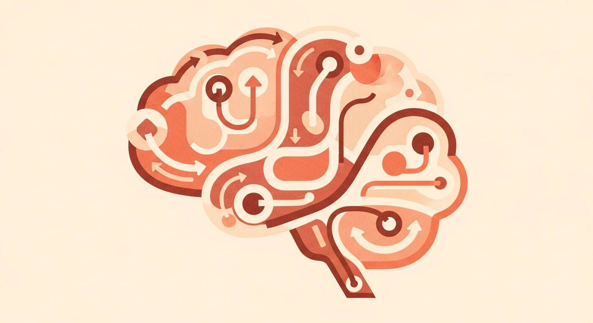

> **논문 정보**
>
> - **제목**: Cognitive Architectures for Language Agents
> - **저자**: Theodore R. Sumers, Shunyu Yao, Karthik Narasimhan, Thomas L. Griffiths (Princeton University)
> - **출판**: Transactions on Machine Learning Research (2024.02)
> - **arXiv**: 2309.02427

이 논문이 쓰인 2023년은, GPT-4가 변호사 시험을 통과하고 LLM 기반 에이전트라는 개념이 막 폭발적으로 퍼지기 시작한 시기였다. 당시의 LLM은 탁월한 언어 능력을 갖췄지만, 혼자서는 기억하지 못하고, 계획하지 못하고, 행동하지 못했다. 뛰어난 두뇌를 가졌지만 몸도 기억도 습관도 없는 존재와 같았다. 이 간극을 메우려는 시도가 바로 언어 에이전트(Language Agent)였다.

그런데 문제가 있었다. 각 연구가 "도구 사용", "그라운딩", "행동" 같은 용어를 제각각 다른 의미로 쓰고 있었고, 비슷한 에이전트를 비교하거나 발전 방향을 잡기가 어려웠다.

CoALA는 이 혼란을 정리하기 위해 등장한 개념적 프레임워크다. 인지과학과 전통 AI 연구의 수십 년 역사를 빌려와, 흩어진 에이전트 연구들을 기억, 행동, 판단이라는 세 개의 축 위에 올려놓았다.

2년이 넘게 지난 지금, 에이전트 기술은 논문이 쓰인 시점과는 비교할 수 없을 만큼 발전했다. 그럼에도 이 논문을 첫 번째로 다루는 이유는, CoALA가 제시한 분류 체계가 오늘날의 에이전트를 이해하는 데도 여전히 유용한 골격을 제공하기 때문이다. 이 글에서는 CoALA의 핵심 구조를 따라가되, 2023년의 시선이라는 점을 염두에 두고 읽어보자.

### LLM에서 에이전트로 — 생성 시스템이라는 오래된 연결고리

CoALA를 이해하려면 생성 시스템(Production System)이라는 개념까지 거슬러 올라가야 한다.

20세기 전반, 수학과 계산을 기호 조작으로 환원하려는 시도가 있었다. 생성 시스템은 그 과정에서 탄생한 형식주의 중 하나다. 구조는 놀랍도록 단순하다. "조건이 맞으면 이 규칙을 적용한다."

```
XYZ → XWZ
```

문자열 `XYZ`를 만나면 `Y`를 `W`로 바꾸라는 뜻이다. 이런 규칙을 여럿 모아두면 문자열을 점진적으로 변환할 수 있다. 하지만 규칙만으로는 "어떤 규칙을 먼저 적용할지"를 알 수 없다. 여기서 제어 흐름(Control Flow)이 등장한다 — 규칙 사이의 우선순위와 실행 순서를 결정하는 장치다.

Allen Newell을 비롯한 AI 연구자들은 이 생성 시스템을 인간의 문제 해결 과정을 모사하는 데 끌어왔다. 단순한 문자열 변환 규칙에 기억, 지각, 계획 같은 인지 프로세스를 결합하니 인지 아키텍처(Cognitive Architecture)가 태어났다. 대표적인 예가 Soar다. Soar는 장기 기억에 규칙을 보관하고, 현재 상황에 가장 적합한 규칙을 골라 실행하는 판단 루프를 반복한다. 기억도, 학습도, 의사결정도 있는 완전한 인지 시스템이었다.

여기서 CoALA의 핵심 통찰이 나온다:

> **LLM은 확률적 생성 시스템이다.**

전통적 생성 시스템이 "이 조건이면 이 규칙을 적용한다"고 결정론적으로 동작했다면, LLM은 입력 텍스트가 주어졌을 때 가능한 출력들에 대한 확률 분포를 만든다. 고정된 규칙을 따르는 것이 아니라, 매번 확률적으로 하나를 골라 적용하는 셈이다.

이 관점을 받아들이면, 프롬프트 엔지니어링의 본질도 달리 보인다. Few-shot 예시를 넣거나, RAG로 검색 결과를 컨텍스트에 추가하거나, Self-Critique를 시키는 것 — 이 기법들은 결국 LLM이라는 확률적 생성 시스템에 **제어 흐름을 부여하는 행위**다. 그리고 이 제어 흐름을 체계적으로 설계하면, LLM은 단순한 텍스트 생성기를 넘어 에이전트가 된다.

### 네 개의 서랍장 — CoALA의 기억 구조

인간은 다양한 종류의 기억을 쓴다. 지금 읽고 있는 문장의 내용(작업 기억), 어제 저녁에 먹은 것(일화 기억), "서울은 한국의 수도"라는 사실(의미 기억), 자전거 타는 법(절차 기억). CoALA는 이 인지심리학의 분류를 에이전트 설계에 그대로 가져온다.

| 기억 유형 | 역할 | 에이전트에서의 모습 |
|-----------|------|-------------------|
| **작업 기억(Working Memory)** | 지금 이 순간 쓰이는 정보 | 프롬프트 컨텍스트, 현재 목표, 직전 관찰 |
| **일화 기억(Episodic Memory)** | 과거 경험을 시간순으로 보관 | 대화 이력, 작업 궤적, 성공·실패 기록 |
| **의미 기억(Semantic Memory)** | 세계에 대한 사실적 지식 | 위키피디아, 지식 베이스, 도메인 규칙 |
| **절차 기억(Procedural Memory)** | "어떻게 하는지"에 대한 지식 | LLM 가중치(암묵적) + 에이전트 코드(명시적) |

**절차 기억**이 두 층으로 나뉘는 점이 흥미롭다.

첫째는 **암묵적 절차 기억** — LLM 가중치 그 자체다. 수십억 파라미터에 압축된 "언어를 다루는 법"이다. 자전거 타는 법을 말로 설명하기 어렵듯, LLM의 가중치도 명시적으로 꺼내볼 수 없다.

둘째는 **명시적 절차 기억** — 에이전트의 소스 코드다. "사용자 입력을 받으면 → 검색을 먼저 하고 → 결과를 프롬프트에 넣어서 → LLM에게 보내라" 같은 흐름이 여기 해당한다. 프롬프트 템플릿, 도구 호출 로직, 워크플로우 코드가 모두 명시적 절차 기억이다.

LLM은 본질적으로 무상태(Stateless) 시스템이다. 한 번의 호출이 끝나면 아무것도 남지 않는다. 에이전트가 "기억하는 존재"가 되려면, 이 네 가지 기억을 LLM 바깥에 명시적으로 구축해야 한다.

일화 기억이나 의미 기억은 처음에 비어 있어도 된다. 경험이 쌓이면서 채워지니까. 하지만 절차 기억은 다르다 — 에이전트가 돌아가려면, 설계자가 코드를 작성해서 초기화해야 한다. 에이전트는 백지 상태에서 태어나지만, "무엇을 어떻게 할지"는 알고 시작해야 한다.

### 에이전트가 할 수 있는 것들 — 행동 공간

기억이 에이전트의 "아는 것"이라면, 행동 공간(Action Space)은 "할 수 있는 것"이다. CoALA는 행동을 **바깥을 향한 것**과 **안을 향한 것**으로 나눈다.

**바깥을 향한 행동 — 그라운딩(Grounding)**

에이전트가 외부 세계와 실제로 상호작용하는 행위다. 세 갈래로 나뉜다:

- 물리 환경: 로봇이 물건을 집거나, 센서로 주변을 읽는 것
- 대화 환경: 사람이나 다른 에이전트와 언어로 소통하는 것
- 디지털 환경: API 호출, 웹 탐색, 코드 실행

흔히 말하는 "도구 사용(Tool Use)"은 디지털 환경에서의 그라운딩이다.

**안을 향한 행동 — 추론, 검색, 학습**

외부에 아무런 영향을 주지 않고, 에이전트의 내부 상태만 바꾸는 행위다. CoALA는 이를 기억과의 관계로 깔끔하게 분류한다:

- 추론(Reasoning): 작업 기억 안에서 정보를 가공해 새로운 결론을 낸다. 관찰을 요약하거나, 다음 행동을 계획하거나, 상황을 판단하는 것이 여기 속한다.
- 검색(Retrieval): 장기 기억에서 필요한 정보를 찾아 작업 기억으로 가져온다. 과거 경험을 떠올리거나, 지식 베이스에서 사실을 찾는 것이다.
- 학습(Learning): 새로운 정보를 장기 기억에 쓴다. 경험을 일화 기억에 기록하거나, 추론 결과를 의미 기억에 남기거나, 에이전트 코드 자체를 수정하는 것까지 포함한다.

정리하면, **추론 = 작업 기억 내 읽기/쓰기, 검색 = 장기 기억에서 읽기, 학습 = 장기 기억으로 쓰기**다. 이 분류가 깔끔한 이유는 행동의 종류를 기억과의 상호작용으로 정의하기 때문이다.

### 생각하고, 고르고, 실행하다 — 의사결정 사이클

기억도 있고 행동도 할 수 있다면, 남은 질문은 하나다. **"지금 무엇을 할 것인가?"**

CoALA는 이 결정을 반복적인 사이클로 구조화한다.

```
관찰 → [계획: 제안 → 평가 → 선택] → 실행 → 관찰 → ...
```

**계획 단계**에서 에이전트는 세 과정을 거친다:

1. 제안(Proposal): 추론과 검색을 동원해 후보 행동을 만든다. "지금 뭘 할 수 있지?"
2. 평가(Evaluation): 후보가 여럿이면 각각에 점수를 매긴다. LLM의 자체 판단, 학습된 가치 함수, 시뮬레이션 결과 등 다양한 방법이 가능하다.
3. 선택(Selection): 가장 유망한 행동을 고른다. 만족스러운 후보가 없으면 제안 단계로 돌아간다.

**실행 단계**에서는 선택된 행동을 수행한다. 외부 행동이면 환경에 영향을 주고, 내부 행동이면 기억 상태가 바뀐다. 그 결과로 새로운 관찰이 들어오고, 다시 사이클이 시작된다.

중요한 점은, 오늘날 대부분의 에이전트가 이 사이클의 일부만 구현하고 있다는 것이다. 제안만 하고 평가를 생략하기도, 평가에만 특화되기도 한다. CoALA는 이 차이를 체계적으로 포착하는 도구다.

### 다섯 에이전트로 읽는 CoALA

추상적인 프레임워크가 실제로 쓸모 있는지, 논문이 분석한 다섯 가지 에이전트를 살펴보자. 이들은 모두 2022~2023년에 발표된 연구로, 당시 에이전트 설계의 최전선이었다.

**SayCan — 몸은 있지만 머리가 단순한 에이전트**

Google이 만든 주방 로봇 에이전트다. 551개의 사전 정의된 동작("컵을 집어", "서랍을 열어")을 가지고 있고, LLM은 상황에 맞는 동작의 확률을 매기기만 한다. 장기 기억도, 추론이나 검색도 없이, 오직 평가만으로 의사결정을 한다. CoALA 기준으로 보면 가장 단순한 구조다 — 바깥 행동만 있고, 안을 향한 행동이 전혀 없다.

**ReAct — 생각과 행동을 엮은 에이전트**

"생각한 다음 행동하고, 행동한 다음 다시 생각한다." 이 패턴을 처음 제안한 연구다. 장기 기억 없이, 추론(안)과 그라운딩(바깥)을 번갈아 수행한다. 의사결정은 단순하다 — 한 번 추론으로 상황을 파악하고, 바로 다음 행동을 제안한다. 평가나 선택 과정이 없다. 하지만 이 단순한 구조만으로 추론과 행동의 시너지를 처음 입증했다.

**Voyager — 네 가지 행동을 모두 갖춘 에이전트**

Minecraft에서 자율 탐험하는 에이전트다. CoALA가 정의한 네 가지 행동(추론, 검색, 학습, 그라운딩)을 전부 갖춘, 가장 "완전한" 에이전트에 가깝다. 코드로 된 스킬을 절차 기억에 쌓고, 새 상황에서 기존 스킬을 검색해 활용하고, 성공한 스킬은 기억에 추가한다. 실패하면 추론으로 코드를 고쳐서 재시도한다. 에이전트가 경험을 통해 점점 유능해지는 구조다.

**Generative Agents — 기억하고 성찰하는 에이전트**

Stanford의 "AI 마을" 실험에서 등장한 에이전트다. 일화 기억과 의미 기억을 동시에 활용한다. 매일의 경험을 일화 기억에 쌓고, 주기적으로 이를 되돌아보며 고차원적 성찰("나는 환경에 관심이 많은 사람이다")을 만들어 의미 기억에 저장한다. 다음 날 계획을 세울 때 이 성찰을 검색해 참고한다. 단순히 반응하는 것이 아니라, **경험으로부터 자아를 빚어가는** 에이전트다.

**Tree of Thoughts — 내부 세계에서 깊이 파고드는 에이전트**

바깥 행동은 "최종 답 제출" 하나뿐이다. 장기 기억도 없다. 하지만 의사결정에서 독보적이다. 추론 결과를 여러 개 제안하고, 각각을 LLM으로 평가하고, 트리 탐색 알고리즘으로 유망한 방향을 고른다. 막다른 길에 다다르면 이전 분기점으로 되돌아간다. 외부 세계 없이, 순수하게 **내부 추론의 깊이를 극대화**한 사례다.

**비교 정리**

| 에이전트 | 장기 기억 | 바깥 행동 | 안 행동 | 의사결정 특징 |
|---------|----------|----------|--------|-------------|
| **SayCan** | 없음 | 물리적 (로봇) | 없음 | 평가만 |
| **ReAct** | 없음 | 디지털 (API) | 추론 | 제안만 |
| **Voyager** | 절차 기억 | 디지털 (게임) | 추론+검색+학습 | 제안+피드백 루프 |
| **Generative Agents** | 일화+의미 기억 | 디지털+대화 | 추론+검색+학습 | 제안+성찰 |
| **Tree of Thoughts** | 없음 | 디지털 (답 제출) | 추론 | 제안+평가+선택 |

이 표에서 드러나는 패턴이 있다. 2023년 당시, 어떤 에이전트도 CoALA가 정의한 모든 요소를 다 갖추지는 못했다. 각각이 프레임워크의 서로 다른 부분을 탐색하고 있었을 뿐이다. 오늘날에는 이 빈칸의 상당수가 채워졌지만, CoALA가 제시한 좌표계 자체는 여전히 에이전트의 구조를 파악하는 데 유효하다.

### 에이전트 설계를 위한 세 단계 청사진

CoALA가 남긴 가장 실용적인 유산은 에이전트를 설계할 때 물어야 할 세 가지 질문이다.

**첫째, 어떤 기억이 필요한가?**

과거 상호작용을 기억해야 하면 일화 기억이, 도메인 지식을 참조해야 하면 의미 기억이, 코드 기반 스킬을 축적해야 하면 명시적 절차 기억이 필요하다. 모든 기억이 항상 필요한 것은 아니다 — ReAct는 장기 기억 없이도 강력했다.

**둘째, 어떤 행동이 가능한가?**

각 기억에 대한 읽기/쓰기 권한을 설계한다. 어떤 내부 행동(추론, 검색, 학습)이 필요한가? 어떤 외부 환경과 어떻게 연결되는가?

**셋째, 어떻게 판단하는가?**

제안만 할 것인가, 평가까지 할 것인가, 복수의 후보를 비교 선택할 것인가? 정교한 판단 절차는 더 나은 결과를 내지만, 비용과 지연도 커진다. 과제의 성격에 맞는 균형점을 찾아야 한다.

이 청사진 위에서 CoALA가 거듭 강조하는 원칙이 있다 — **에이전트는 모놀리식이 아닌 모듈형으로 구성되어야 한다.** 기억, 행동, 판단을 독립적 모듈로 분리하면, 각 부분을 따로 개선하고 교체할 수 있다.

그리고 에이전트 안에는 두 종류의 "프로그램"이 공존한다. LLM 가중치(확률적, 유연함)와 에이전트 코드(결정론적, 정확함). CoALA의 제안은, 코드를 아껴 쓰되 LLM이 잘 못하는 영역 — 트리 탐색, 수치 계산, 외부 API 호출 — 을 보완하는 데 집중하라는 것이다.

### CoALA가 남긴 질문들 — 2년 뒤의 시선으로

논문이 제시한 미래 과제들을, 2026년의 시점에서 되짚어보자:

- 자기 수정: 에이전트가 자기 코드를 고치며 발전할 수 있을까? → Claude Code나 Cursor 같은 코딩 에이전트가 이미 자신의 도구와 워크플로우를 수정하며 동작한다. 완전한 자기 수정까지는 아니지만, 논문이 상상한 방향으로 상당히 진전됐다.
- 적응적 검색: 상황에 따라 검색 전략을 바꿀 수 있을까? → RAG를 넘어 에이전트가 검색 쿼리를 스스로 구성하고, 결과를 평가해 재검색하는 패턴이 보편화됐다.
- 추론 효율: 추론의 비용과 품질 사이 균형을 조절할 수 있을까? → 이 문제는 여전히 열려 있다. 토큰 비용이 낮아졌지만, 언제 깊이 생각하고 언제 빠르게 답할지의 판단은 아직 발전 중이다.
- 신뢰와 정렬: 에이전트의 과신과 환각을 어떻게 제어할 것인가? → Constitutional AI나 RLHF 같은 접근이 발전했지만, 자율적으로 행동하는 에이전트의 정렬 문제는 여전히 가장 어려운 과제다.

논문은 "더 강력한 LLM이 등장하면 외부 기억이나 도구가 불필요해질까?"라고도 물었다. 실제로 컨텍스트 창은 백만 토큰을 넘겼고, LLM의 추론 능력도 비약적으로 발전했다. 하지만 CoALA의 예측대로, 체계적인 기억과 행동의 구조는 사라지지 않았다. 오히려 에이전트가 더 복잡한 과제를 다루게 되면서 그 필요성이 더 뚜렷해졌다. 달라진 것은 각 모듈의 구현 방식과 비중이다.

### 마무리 — 렌즈로서의 CoALA

CoALA는 특정 에이전트를 만드는 레시피가 아니다. 2023년 시점에서 에이전트를 이해하고 비교하기 위한 렌즈를 제공한 논문이다. 개별 기술은 빠르게 구식이 되지만, "기억은 어떻게 구성되어 있는가, 행동은 무엇이 가능한가, 판단은 어떻게 내리는가"라는 질문의 구조는 쉽게 낡지 않는다.

"이 에이전트에는 어떤 기억이 있는가? 어떤 행동이 가능한가? 판단은 어떻게 내리는가?" — 이 세 질문만으로도, 어떤 에이전트든 구조와 한계를 파악할 수 있다. 빈칸이 보이면, 그것이 곧 개선의 방향이 된다.

다음 글에서는 CoALA가 사례로 다룬 에이전트 중 하나인 **ReAct**를 깊이 들여다본다. 추론과 행동을 엮는 단순한 아이디어가 어떻게 에이전트 설계의 출발점이 되었는지 살펴보자.

---

*이 글은 "Agentic AI 논문 읽기" 시리즈의 첫 번째 글입니다.*
