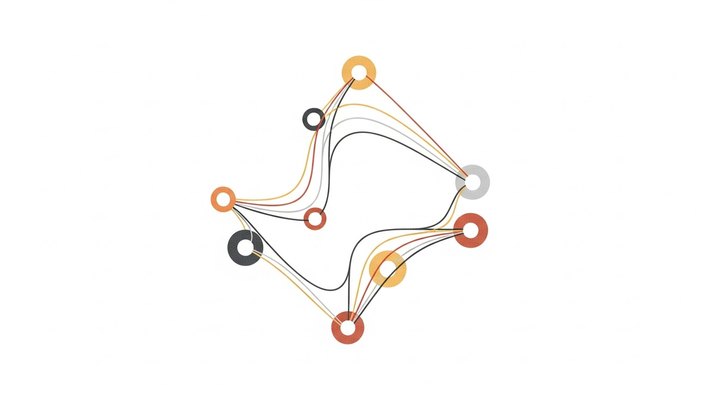

> **논문 정보**
>
> - **제목**: Batch Query Processing and Optimization for Agentic Workflows
> - **저자**: Junyi Shen, Noppanat Wadlom, Yao Lu (National University of Singapore)
> - **출판**: arXiv 2509.02121 (2025.09)

시리즈의 지금까지 논문들은 에이전트가 무엇을 하는가를 다뤘다. 추론하고(CoT), 행동하고(ReAct), 도구를 쓰고(Toolformer), 반성하고(Reflexion), 탐색한다(LATS). 하지만 에이전트가 무엇을 하든, 결국 물리적 하드웨어에서 실행되어야 한다. GPU에서 LLM 추론이 돌아가고, CPU에서 SQL 쿼리와 API 호출이 처리된다. 이 실행의 효율성을 누가 책임지는가?

2025년 9월, National University of Singapore의 연구팀이 이 질문에 답하는 시스템 논문을 발표했다. Halo는 에이전트 워크플로우를 데이터베이스 시스템의 관점에서 바라본다. 워크플로우를 DAG(Directed Acyclic Graph)로 표현하고, 여러 워크플로우 사이에서 공유할 수 있는 계산을 발견하고, GPU와 CPU 사이의 작업 스케줄링을 최적화한다. 에이전트의 지능이 아니라, 에이전트의 인프라를 다루는 논문이다.

### 세 겹의 비효율 — 왜 에이전트가 느린가

Halo가 해결하려는 문제는 세 가지 비효율이다.

첫째, 구조적 중복이다. 여러 에이전트가 같은 하위 과제를 수행할 때, 같은 SQL 쿼리를 각자 실행하고, 같은 API를 각자 호출한다. 10개의 에이전트가 같은 고객 데이터를 조회하면 10번의 동일한 데이터베이스 쿼리가 실행된다. 기존 에이전트 프레임워크(LangGraph, AgentScope)는 각 세션을 독립적으로 처리하므로 이 중복을 감지하지 못한다.

둘째, 이종 파이프라인 버블이다. 에이전트 워크플로우는 GPU에서 실행되는 LLM 추론과 CPU에서 실행되는 도구 호출이 교차한다. LLM이 "이 SQL을 실행해라"고 출력하면, GPU가 멈추고 CPU가 SQL을 실행하고, 결과가 돌아오면 GPU가 다시 LLM을 돌린다. 이 왕복 과정에서 GPU와 CPU가 번갈아 유휴 상태에 빠진다.

셋째, LLM 연산자의 상태 관리 문제다. 서로 다른 워크플로우가 서로 다른 모델을 요구하면 모델 전환 비용이 발생한다. 같은 프롬프트 접두사를 공유하는 요청들이 있어도, 기존 시스템은 이를 인식하지 못해 KV 캐시를 재활용하지 못한다.

### Halo의 아키텍처 — Parser, Optimizer, Processor

Halo의 구조는 세 단계 파이프라인이다. 데이터베이스 시스템의 쿼리 처리 파이프라인 — 파싱, 최적화, 실행 — 을 에이전트 워크플로우에 적용한 것이다.

Parser는 YAML로 선언된 워크플로우를 DAG 형태의 중간 표현으로 변환한다. 핵심 변환은 의존성 분리(dependency decoupling)다. LLM 프롬프트 안에 묻혀 있는 SQL 쿼리나 API 호출을 별도의 노드로 추출한다. 프롬프트 내부의 불투명한 부작용이 아니라, 스케줄링 가능한 독립 단위로 만드는 것이다.

Optimizer는 DAG를 실행 계획으로 변환한다. 에포크 기반 동적 프로그래밍으로 전역 최적을 찾는다. LLM 노드를 어느 GPU에 배치할지, 비LLM 연산을 언제 실행할지, CPU와 GPU의 부하를 어떻게 균형잡을지를 결정한다. 비용 모델은 병목 워커의 지연 시간(makespan)과 총 시스템 부하를 동시에 고려한다.

Processor는 계획을 실행한다. Coordinator가 DAG 상태를 비차단 이벤트 기반으로 관리하고, GPU 실행자가 LLM 추론을, CPU 실행자가 도구 호출을 처리한다.

### 핵심 최적화 기법

Halo의 구체적 최적화 기법 세 가지가 성능 향상의 원천이다.

요청 합체(Request Coalescing): 동일한 도구 호출을 자동으로 감지하여 한 번만 실행한다. 10개의 에이전트가 같은 SQL 쿼리를 요청하면, 물리적으로 한 번 실행하고 결과를 10개 노드에 팬아웃한다. 데이터베이스의 공유 스캔(shared scan)과 같은 발상이다.

기회적 실행(Opportunistic Execution): 계획된 작업이 외부 요인(느린 API 응답 등)으로 지연될 때, 데이터 의존성이 이미 충족된 다른 노드를 빈 슬롯에서 실행한다. 유휴 시간을 생산적 시간으로 바꾸는 것이다.

KV 캐시 공유 및 프리페칭: 같은 시스템 프롬프트나 같은 컨텍스트 접두사를 공유하는 LLM 요청들의 KV 캐시를 재사용한다. 프리필 단계에서 이미 계산된 토큰을 다시 계산하지 않으므로, 추론 비용이 절감된다.

### 실험 결과

6개 벤치마크에서의 결과다. 논문이 발표된 2025년 기준이다.

배치 추론에서 3.6배 속도 향상, 온라인 서빙에서 2.6배 처리량 향상을 달성했다. 핵심은 출력 품질 저하 없이 이 성능을 얻었다는 점이다. Halo는 에이전트의 행동 자체를 바꾸지 않는다. 같은 입력에 같은 출력을 내되, 그 과정의 물리적 실행만 최적화한다.

### 2026년의 시선 — 시스템 레벨의 중요성

이 논문이 중요한 이유는 에이전트 연구에서 간과되기 쉬운 층위를 다루기 때문이다. 대부분의 에이전트 논문은 알고리즘 — 어떻게 추론하고, 어떻게 계획하고, 어떻게 학습하는가 — 에 집중한다. 하지만 에이전트가 프로덕션에 배포되면, 지연 시간, 처리량, 비용이 알고리즘 성능만큼이나 중요해진다.

AI Agents That Matter가 에이전트의 비용 문제를 비판적으로 분석했다면, Halo는 그 비용을 시스템 수준에서 줄이는 해법을 제시한다.

### CoALA 좌표계 위의 Halo

Halo는 CoALA 좌표계의 바깥에 있다. 기억, 행동, 판단이라는 인지적 축이 아니라, 에이전트를 실행하는 하부 구조의 최적화다. CoALA가 에이전트의 마음을 설계한다면, Halo는 에이전트의 신체 — 물리적 실행 환경 — 를 최적화한다.

### 마무리

다음 글에서는 도구 사용의 진화를 통사적으로 조망하는 서베이를 읽는다. Tool Use Evolution — 단일 도구 호출에서 다중 도구 오케스트레이션까지, 에이전트가 도구를 다루는 방식이 어떻게 발전해왔는지 여섯 가지 차원으로 분석한다.

---

*이 글은 "Agentic AI 논문 읽기" 시리즈의 열세 번째 글입니다. 시리즈 전체 목록은 시리즈 페이지에서 확인할 수 있습니다.*
