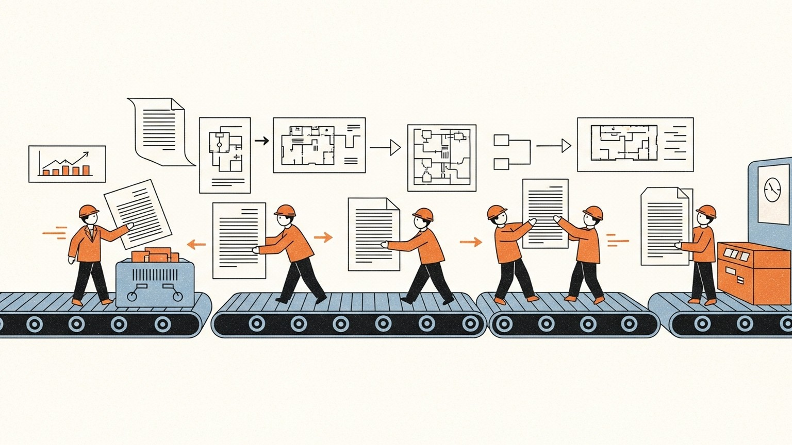

> **논문 정보**
>
> - **제목**: MetaGPT: Meta Programming for a Multi-Agent Collaborative Framework
> - **저자**: Sirui Hong, Mingchen Zhuge, Jiaqi Chen, Xiawu Zheng, Yuheng Cheng 외 다수 (DeepWisdom, KAUST, UC Berkeley, Swiss AI Lab IDSIA)
> - **출판**: ICLR 2024 (Conference Paper)
> - **arXiv**: 2308.00352

시리즈의 궤적을 되짚는다. CoALA가 좌표계를 펼쳤고, CoT가 추론을 증명했고, ReAct가 추론에 행동을 엮었고, Toolformer가 행동을 스스로 배울 수 있음을 보였다. AutoGen은 이 능력들을 가진 에이전트들이 대화를 통해 협력할 수 있음을 보여주며, 개체의 지능에서 집단의 지능으로 전환했다.

지난 글의 마지막 질문은 이것이었다. 에이전트가 자신의 실패를 되돌아보고, 그로부터 학습할 수 있는가? 중요한 질문이다. 하지만 이번 글은 그보다 한 발 앞선 질문을 던진다. 실패로부터 학습하기 전에, 애초에 실패를 구조적으로 예방할 수 있는가?

AutoGen의 비교표를 기억한다면, MetaGPT가 "정적"이라는 딱지가 붙어 있었다. 대화 패턴이 유연하지 않다는 의미였다. AutoGen이 그것을 한계로 분류한 자리에, MetaGPT는 핵심 설계 원칙을 세운다. 유연성이 아니라 절차가, 대화가 아니라 문서가, 이 시스템의 근간이라는 선언이다.

2023년 8월이다. AutoGen이 나온 시기와 거의 같다. 두 논문은 같은 문제를 바라보되, 정반대의 철학으로 답한다. AutoGen은 유연한 대화를 통해 에이전트를 풀어놓았고, MetaGPT는 엄격한 절차 안에 에이전트를 배치했다. 이 논문이 제출된 DeepWisdom 팀은 실제 소프트웨어 회사의 운영 방식을 에이전트 시스템에 이식하겠다는 야심찬 실험을 수행했다.

### 대화의 함정 — 다중 에이전트가 실패하는 이유

AutoGen이 보여준 다중 에이전트 대화에는 구조적 취약점이 있었다. 에이전트들이 자연어로 자유롭게 소통하면, 전화 게임(Chinese Whispers)과 같은 현상이 발생한다. 첫 번째 에이전트가 전달한 정보가 두 번째 에이전트를 거치면서 미묘하게 왜곡되고, 세 번째 에이전트에 이르면 원래 의도와 상당히 다른 해석이 만들어진다. LLM의 환각이 한 에이전트에서 다음 에이전트로 전파되며 증폭되는 것이다. 논문은 이것을 연쇄 환각(cascading hallucinations)이라 불렀다.

문제는 더 있었다. 기존 다중 에이전트 시스템에서 에이전트들은 종종 업무와 무관한 대화를 나눴다. 논문이 든 예시가 인상적이다 — Product Manager가 "안녕하세요, 잘 지내세요?"라고 인사하고, Architect가 "좋아요! 점심 드셨나요?"라고 답하는 상황. 인간 사이에서는 자연스러운 이 잡담이, LLM 에이전트 사이에서는 토큰을 낭비하고 환각의 씨앗이 된다.

비유를 바꿔보자. 다섯 명의 개발자가 슬랙 채널 하나에 모여 앉아, 별도의 문서화 없이 대화로만 소프트웨어를 만든다고 상상해보라. 초기에는 빠르게 진행될 수 있다. 하지만 프로젝트가 커지면, "그때 누가 뭐라고 했더라?"를 찾기 위해 채팅 로그를 뒤지고, 같은 결정을 두 번 내리고, 서로 다른 이해를 가진 채 코드를 작성하게 된다. 결국 시스템이 무너진다.

실제 소프트웨어 회사는 이 문제를 어떻게 해결했는가? 표준 운영 절차(SOP, Standard Operating Procedures)다. 역할을 명확히 나누고, 각 역할이 생산하는 산출물의 형식을 정의하고, 인수인계 기준을 문서화한다. MetaGPT의 핵심 통찰은 단순하다 — 인간 조직이 수십 년에 걸쳐 정제한 이 절차적 지혜를, LLM 에이전트 시스템에 그대로 이식하자.

### 다섯 개의 직함 — SOP로 짜인 조직

MetaGPT가 시뮬레이션하는 것은 소프트웨어 회사다. 다섯 명의 직원이 있고, 각자 명확한 직함과 책임과 산출물을 가진다.

| 역할 | 입력 | 산출물 |
|------|------|--------|
| Product Manager | 사용자 요구사항 | PRD (제품 요구사항 문서): 목표, 사용자 스토리, 경쟁 분석 |
| Architect | PRD | 시스템 설계: 파일 목록, 클래스 다이어그램, 인터페이스 정의 |
| Project Manager | 시스템 설계 | 과제 목록: 파일별 기능 분해, 의존관계 분석 |
| Engineer | 과제 목록 + 설계 문서 | 코드: 지정된 클래스와 함수 구현 |
| QA Engineer | 코드 | 테스트 케이스: 품질 검증, 단위 테스트 |

워크플로우는 순차적이다. 조립 라인(assembly line)이라는 비유가 논문 자체에 등장한다. 사용자가 요구사항을 던지면, Product Manager가 PRD를 작성하고, Architect가 그 PRD를 시스템 설계로 변환하고, Project Manager가 설계를 과제로 분해하고, Engineer가 코드를 작성하고, QA Engineer가 테스트를 수행한다. 각 단계의 출력이 다음 단계의 입력이 된다.

이전 글에서 다뤘던 AutoGen과 비교하면 차이가 선명해진다. AutoGen의 에이전트들은 대화 중에 동적으로 역할을 전환하고, GroupChatManager가 상황에 따라 다음 화자를 선택했다. 축구팀처럼 유동적이었다. MetaGPT의 에이전트들은 공장의 조립 라인처럼 자기 위치에서 자기 일만 한다. Product Manager는 절대 코드를 쓰지 않고, Engineer는 절대 PRD를 작성하지 않는다.

이것이 제약인가, 장점인가? MetaGPT의 답은 명확하다 — 장점이다. 각 에이전트가 프로필(이름, 역할, 목표, 제약)로 초기화되고, 전문 스킬만 가지고 있기 때문에, 역할 외의 일을 시도하다가 환각을 일으킬 여지가 줄어든다. 5인 스타트업에서 모두가 모든 일을 하는 것과, 50인 회사에서 각자 전문 분야에 집중하는 것의 차이다. 규모가 커질수록 후자가 이긴다.

### 문서가 말을 대신한다 — 구조화된 소통

MetaGPT의 가장 뚜렷한 설계 결정은 에이전트 간 소통 방식에 있다. 대화가 아니라 문서다.

기존 다중 에이전트 시스템은 자연어 메시지를 주고받는다. "요구사항이 이렇고, 이런 구조로 만들면 좋겠어"라고 Architect가 말하면, Engineer가 그 메시지를 읽고 해석한다. 해석의 여지가 있다는 것은 오류의 여지가 있다는 뜻이다.

MetaGPT에서 Architect는 말하지 않는다. 대신 시스템 설계 문서를 작성한다. 파일 목록, 클래스 다이어그램, 시퀀스 플로우, API 인터페이스 정의가 명시된 구조화된 문서다. Engineer는 이 문서를 "해석"할 필요가 없다. 정의된 인터페이스대로 구현하면 된다. 인간 소프트웨어 회사에서 구두 지시 대신 설계 문서를 쓰는 것과 같은 이유다 — 문서는 모호성을 줄인다.

정보 공유 방식도 다르다. 모든 에이전트가 모든 메시지를 받는 브로드캐스트 방식 대신, MetaGPT는 발행-구독(Publish-Subscribe) 메커니즘을 사용한다. 글로벌 메시지 풀(message pool)에 구조화된 메시지가 발행되고, 각 에이전트는 자신의 역할에 관련된 메시지만 구독한다.

Architect는 Product Manager의 PRD를 구독하지만, QA Engineer의 테스트 결과는 구독하지 않는다. Engineer는 Architect의 설계 문서와 Project Manager의 과제 목록을 구독하지만, Product Manager의 경쟁 분석은 구독하지 않는다. 필요한 정보만 받아서, 필요한 산출물만 만든다. 정보 과부하를 구조적으로 차단하는 것이다.

이 설계를 AutoGen과 대비하면 철학의 차이가 극명해진다. AutoGen의 GroupChatManager는 대화를 모든 에이전트에게 브로드캐스트했다. 유연하지만, 에이전트 수가 늘어나면 각 에이전트가 처리해야 할 정보량이 기하급수적으로 증가한다. MetaGPT의 발행-구독은 이 문제를 설계 수준에서 해결했다. 회사에서 전체 슬랙 채널 대신 팀별 채널을 쓰는 것, 모든 회의에 전 직원이 참석하는 대신 관련자만 참석하는 것과 같다.

### 코드가 스스로를 검증한다 — 실행 피드백 루프

SOP와 구조화된 소통이 환각을 예방하는 설계라면, 실행 가능 피드백(executable feedback)은 환각이 발생했을 때 잡아내는 안전망이다.

기존 접근법에서 코드 품질을 보장하는 방식은 두 가지였다. 코드 리뷰 — 다른 에이전트가 코드를 읽고 피드백을 준다. 자기 반성(self-reflection) — 에이전트 자신이 코드를 다시 살펴본다. 두 방법 모두 코드를 실행하지 않는다. 논리적으로 맞아 보이지만 실제로 돌아가지 않는 코드를 걸러내지 못하는 것이다.

MetaGPT의 Engineer는 코드를 작성한 후, 직접 실행한다. 실행 오류가 발생하면, 과거 실행 이력과 디버깅 메모리를 참조하여 코드를 수정한다. 필요하면 단위 테스트를 작성하고 실행하여, 테스트가 통과할 때까지 반복한다. 최대 3회의 재시도가 허용된다.

이것은 인간 개발자의 워크플로우를 충실하게 재현한 것이다. 코드를 쓰고, 빌드하고, 테스트를 돌리고, 실패하면 에러 로그를 보고 수정한다. 코드 리뷰가 "이 코드가 맞는 것 같다"는 판단이라면, 실행 피드백은 "이 코드가 실제로 동작한다"는 증명이다. CI/CD 파이프라인이 구두 코드 리뷰를 대체할 수 없듯이, 실행 피드백도 코드 리뷰를 대체하지 않는다. 둘 다 필요하다. MetaGPT는 실행 피드백을 추가함으로써, 기존 시스템이 갖지 못한 검증 계층을 하나 더 쌓은 것이다.

### 숫자가 말하는 것들 — 벤치마크 결과

논문이 쓰인 2023년 8월 기준으로, MetaGPT는 세 가지 벤치마크에서 평가되었다.

코드 생성 벤치마크(HumanEval, MBPP)에서 MetaGPT는 당시 모든 선행 접근법을 능가했다.

| 모델 | HumanEval (Pass@1) | MBPP (Pass@1) |
|------|:---:|:---:|
| GPT-4 단독 | 67.0% | — |
| CodeX (175B) | 47.0% | 47.0% |
| MetaGPT (실행 피드백 없음) | 81.7% | 82.3% |
| MetaGPT (실행 피드백 포함) | 85.9% | 87.7% |

실행 피드백의 효과가 수치로 드러난다. HumanEval에서 +4.2%, MBPP에서 +5.4%의 추가 개선이다. 코드를 실행해보는 것만으로 이 정도의 차이가 난다.

더 흥미로운 것은 SoftwareDev 벤치마크다. 70개의 실제 소프트웨어 개발 과제(미니 게임, 이미지 처리, 데이터 시각화)를 대상으로 한 평가에서, MetaGPT는 당시 대표적 다중 에이전트 프레임워크인 ChatDev를 거의 모든 지표에서 앞섰다.

| 지표 | ChatDev | MetaGPT |
|------|:---:|:---:|
| 실행 가능성 (1–4) | 2.25 | 3.75 |
| 코드 라인 수 | 77.5 | 251.4 |
| 생산성 (토큰/코드라인, 낮을수록 효율적) | 248.9 | 124.3 |
| 인간 수정 비용 | 2.5 | 0.83 |

인간 수정 비용이 2.5에서 0.83으로 떨어진 것에 주목해야 한다. MetaGPT가 생성한 코드는 인간이 고쳐야 할 부분이 ChatDev의 3분의 1 수준이라는 뜻이다. 더 많은 코드를 더 적은 토큰으로 생성하면서, 품질도 높다.

역할별 제거 실험(ablation study)은 SOP의 가치를 직접적으로 보여준다.

| 역할 구성 | 실행 가능성 (1–4) | 인간 수정 비용 | 비용 |
|:---:|:---:|:---:|:---:|
| Engineer만 (1명) | 1.0 | 10.0 | $0.915 |
| +PM, Architect (3명) | 2.5 | 4.0 | $1.204 |
| +Project Manager (4명) | 2.0 | 3.5 | $1.251 |
| 전체 (5명) | 4.0 | 2.5 | $1.385 |

Engineer 혼자일 때 실행 가능성은 1.0이고 인간 수정 비용은 10.0이다. 역할을 하나씩 추가할 때마다 비용은 소폭 증가하지만($0.915 → $1.385, 약 51% 증가), 실행 가능성은 1.0에서 4.0으로, 인간 수정 비용은 10.0에서 2.5로 극적으로 개선된다. 에이전트를 더 쓰는 비용보다, 사람이 코드를 덜 고치는 이득이 압도적으로 크다.

이 벤치마크 결과들은 당시 기준의 것이며, 이후 더 발전된 LLM과 프레임워크가 등장했다는 점을 염두에 두어야 한다. 하지만 결과가 보여주는 패턴 — 역할 분리가 품질을 높이고, 구조화된 소통이 환각을 줄이고, 실행 피드백이 정확성을 보완한다 — 은 특정 벤치마크 수치를 넘어서는 일반적 교훈이다.

### 아직 열리지 않은 문 — MetaGPT의 한계

MetaGPT의 설계는 인상적이지만, 논문 자체가 인정하는 한계가 있다.

첫째, 프로젝트 간 학습이 없다. 각 프로젝트가 독립적으로 실행되며, 이전 프로젝트에서 얻은 경험을 다음 프로젝트에 활용하지 않는다. 같은 유형의 과제를 반복해도 매번 처음부터 시작한다. 논문의 부록에서 이 문제를 인식하고, 에이전트가 과거 프로젝트 경험을 장기 메모리에 저장하여 제약 프롬프트를 재귀적으로 수정하는 자기 개선 메커니즘을 향후 과제로 제안했다.

둘째, SOP가 정적이다. 실제 소프트웨어 회사에서 운영 절차는 프로젝트 규모, 팀 구성, 긴급도에 따라 유동적으로 조정된다. 소규모 프로젝트에서는 Architect와 Project Manager의 역할이 합쳐지기도 하고, 긴급 버그 수정에서는 QA를 건너뛰기도 한다. MetaGPT의 SOP는 하드코딩되어 있다. 모든 과제에 동일한 5단계 파이프라인이 적용된다.

셋째, 도메인 특화다. 논문의 실험은 소프트웨어 개발에 한정되어 있다. Product Manager → Architect → Engineer라는 역할 구조가 다른 도메인 — 예를 들어 법률 문서 검토나 금융 분석 — 에도 적용 가능한지는 검증되지 않았다.

이 한계들은 AutoGen과의 대비에서 더 선명해진다. AutoGen의 유연한 대화 패턴은 다양한 도메인에 적용 가능했다 — 수학 문제, 텍스트 게임, 체스, QA까지. MetaGPT는 소프트웨어 개발이라는 특정 도메인에서 더 높은 성능을 보였지만, 그 대가로 범용성을 희생했다. 유연성과 구조 사이의 트레이드오프가 여기에 있다.

### CoALA의 좌표계 위에 놓은 MetaGPT

시리즈의 매 글에서 해온 것처럼, CoALA의 좌표계 위에 MetaGPT를 올려놓는다.

| 축 | MetaGPT의 상태 |
|---|---|
| 기억 | SOP와 역할 정의가 절차 기억(procedural memory) 역할. 구조화된 산출물(PRD, 설계 문서, 과제 목록)이 작업 기억(working memory). 장기 기억 없음 — 프로젝트 간 경험이 축적되지 않음 |
| 바깥 행동 | 코드 실행 + 단위 테스트 실행을 통한 디지털 환경 상호작용. 실행 피드백 루프로 행동 결과를 검증 |
| 안 행동 | 역할별로 특화된 LLM 추론 + 구조화된 문서·코드 생성. 추론 트레이스가 산출물(PRD, 설계 문서)에 자연스럽게 내재 |
| 의사결정 | SOP에 의해 사전 정의된 순차적 파이프라인. 동적 판단 없이 정해진 절차를 따름 |

AutoGen과 나란히 놓으면 두 시스템이 채운 영역의 차이가 드러난다.

| 축 | AutoGen | MetaGPT |
|---|---|---|
| 기억 | 대화 이력이 작업 기억 | SOP가 절차 기억, 구조화된 문서가 작업 기억 |
| 바깥 행동 | 코드 실행 + 함수 호출 | 코드 실행 + 테스트 실행 + 실행 피드백 루프 |
| 안 행동 | LLM 추론 + 자연어/코드 생성 | 역할 특화된 LLM 추론 + 구조화된 문서 생성 |
| 의사결정 | 동적 화자 선택 (GroupChatManager) | 정적 순차 파이프라인 (SOP) |

MetaGPT가 새롭게 채운 영역은 절차 기억이다. AutoGen에는 절차 기억에 해당하는 것이 없었다. 에이전트가 "어떤 순서로 무엇을 해야 하는지"를 대화 도중에 즉흥적으로 결정했다. MetaGPT는 이것을 SOP로 사전에 인코딩함으로써, 의사결정의 부담을 설계 시점으로 앞당겼다.

또 하나의 차이는 작업 기억의 질이다. AutoGen의 작업 기억은 자연어 대화 이력이었다. MetaGPT의 작업 기억은 PRD, 시스템 설계 문서, 인터페이스 정의 같은 구조화된 산출물이다. 같은 정보라도 구조화된 형태로 저장되면 후속 에이전트가 더 정확하게 활용할 수 있다. 슬랙 대화를 뒤지는 것과 컨플루언스 문서를 참조하는 것의 차이다.

하지만 두 시스템이 공유하는 빈칸도 있다. 장기 기억이 없고, 자기 성찰(self-reflection)이 없고, 경험에서 학습하는 메커니즘이 없다. AutoGen의 에이전트들은 대화에서 배우지 않았고, MetaGPT의 에이전트들은 프로젝트에서 배우지 않는다. 다중 에이전트 시스템의 두 가지 극단 — 유연한 대화와 엄격한 절차 — 모두 같은 빈칸 앞에 서 있다.

### 마무리 — 절차라는 지혜

MetaGPT의 전부를 한 문장으로 줄이면 이렇다: "인간 조직의 표준 운영 절차가, 에이전트 조직에서도 작동한다."

이것은 기술적 기여이면서 동시에 조직론적 통찰이다. 소프트웨어 공학이 수십 년에 걸쳐 발견한 것 — 역할을 나누고, 산출물을 정의하고, 인수인계 기준을 문서화하면 품질이 올라간다는 것 — 이 LLM 에이전트에게도 똑같이 적용된다. 에이전트가 인간을 모방하는 것이 아니라, 인간이 발견한 조직 원리가 에이전트에게도 유효한 것이다.

3년이 지난 지금, MetaGPT의 영향은 두 갈래로 갈라졌다. 구조화된 산출물과 역할 분리라는 설계 원칙은 후속 다중 에이전트 시스템에 널리 채택되었다. 반면 정적 SOP라는 구현 방식은 대부분 더 유연한 형태로 진화했다. 원칙은 살아남았고, 구현은 바뀌었다. 좋은 절차의 운명이 그렇다 — 절차 자체는 대체되지만, 절차가 체화한 지혜는 문화가 된다.

시리즈의 흐름을 돌아보자. CoT가 추론을 증명했고, ReAct가 행동을 엮었고, Toolformer가 행동의 자율성을 보였다. AutoGen은 유연한 대화로 다중 에이전트의 문을 열었고, MetaGPT는 엄격한 절차로 그 문 안에 질서를 세웠다. 개체의 지능에서 집단의 지능으로, 다시 집단의 조직으로 — 한 단계씩 올라가고 있다.

하지만 유연성과 구조, 두 가지 접근 모두 같은 빈칸을 남겨두었다. 에이전트가 실패했을 때, 그 실패를 되돌아보고 스스로 전략을 수정할 수 있는가? 구조가 아무리 정교해도, 대화가 아무리 유연해도, 실행 과정에서 발생하는 실패를 반성하고 학습하는 능력이 없다면 같은 유형의 실수는 반복된다. 다음 질문은 자연스럽게 이어진다 — 에이전트에게 자기 성찰의 능력을 부여할 수 있는가?

---

*이 글은 "Agentic AI 논문 읽기" 시리즈의 여섯 번째 글입니다.*
