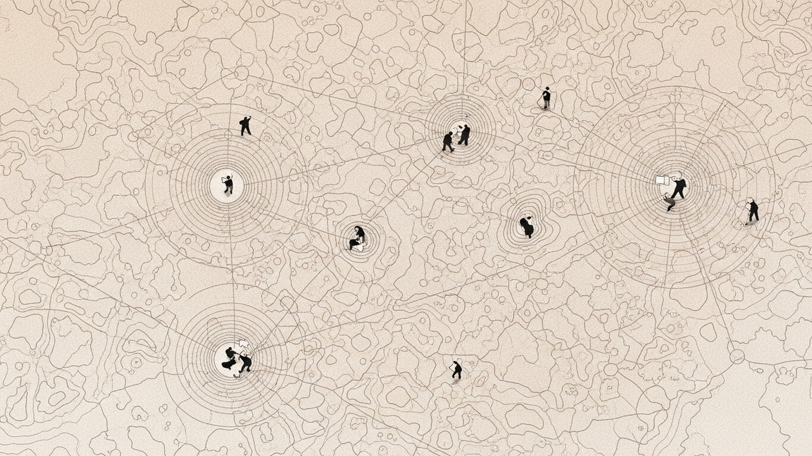

> **논문 정보**
>
> - **제목**: Large Language Model based Multi-Agents: A Survey of Progress and Challenges
> - **저자**: Taicheng Guo, Xiuying Chen, Yaqi Wang, Ruidi Chang, Shichao Pei, Nitesh V. Chawla, Olaf Wiest, Xiangliang Zhang (University of Notre Dame, KAUST, SUSTech, UMass Boston)
> - **출판**: arXiv 2402.01680 (2024.01, revised 2024.04)

지난 글의 마지막 질문을 기억한다. "에이전트에게 자기 성찰의 능력을 부여할 수 있는가?" AutoGen의 유연한 대화와 MetaGPT의 엄격한 절차, 정반대의 철학이 같은 빈칸 앞에 서 있었다. 장기 기억이 없고, 실패에서 학습하지 못하고, 같은 실수를 반복한다는 것.

그 질문에 답하기 전에, 한 발 물러서야 할 순간이 왔다.

시리즈는 여기까지 개별 논문을 하나씩 등반하듯 읽어왔다. CoALA가 좌표계를 펼쳤고, CoT가 추론을 증명했고, ReAct가 추론에 행동을 엮었고, Toolformer가 행동의 자율성을 보였다. AutoGen은 유연한 대화로 다중 에이전트의 문을 열었고, MetaGPT는 엄격한 절차로 그 문 안에 질서를 세웠다. 개체의 지능에서 집단의 지능으로, 다시 집단의 조직으로 — 한 단계씩 봉우리를 넘어왔다.

이제 봉우리 위에서 전체 산맥을 내려다볼 차례다.

2024년 1월, University of Notre Dame과 KAUST의 연구팀이 LLM 기반 다중 에이전트 시스템 전체를 조망하는 서베이를 발표했다. CAMEL이 다중 에이전트의 문을 연 2023년 3월 이후, 불과 10개월 만에 수십 편의 논문이 쏟아졌다. 소프트웨어 개발, 로봇 협업, 사회 시뮬레이션, 게임, 과학 토론 — 분야도, 접근법도, 용어도 제각각이었다. 이 논문은 그 혼돈에 하나의 정리 축을 세운다. 네 개의 축으로 모든 다중 에이전트 시스템을 분류하고, 응용을 두 갈래로 나누고, 여섯 가지 열린 도전을 식별한다.

CoALA가 단일 에이전트의 내부를 해부하는 지도였다면, 이 서베이는 에이전트들이 모여 만드는 집단의 지형을 그리는 지도다.

### 왜 서베이가 필요한가 — 개별 연구의 숲과 나무

나무 한 그루를 자세히 관찰하면 껍질의 무늬, 가지의 방향, 잎의 형태를 알 수 있다. 하지만 숲의 구조 — 어떤 나무들이 함께 자라는지, 수원지가 어디인지, 길이 어디로 통하는지 — 는 높은 곳에 올라서야 보인다.

시리즈에서 우리는 나무를 봐왔다. AutoGen이라는 나무를 보면서 "대화로 엮는 유연한 협업"을 이해했고, MetaGPT라는 나무를 보면서 "절차로 짜인 구조적 협업"을 이해했다. 하지만 이 두 시스템이 다중 에이전트라는 숲에서 어디쯤에 서 있는지, 어떤 나무들이 아직 탐색되지 않았는지는 개별 논문만 읽어서는 파악하기 어렵다.

서베이가 쓰인 2024년 초 시점에서, 다중 에이전트 연구는 이미 체계적 정리가 절실했다. 2023년 3월 CAMEL 이후 10개월 동안 독립적으로 쏟아진 논문들은 저마다 다른 용어, 다른 프레임워크, 다른 평가 기준을 사용했다. 같은 개념을 다른 이름으로 부르거나, 다른 개념을 같은 이름으로 혼용하는 경우도 빈번했다. 단일 에이전트 연구에서 CoALA가 "기억-행동-판단"이라는 공통 좌표계를 제시하여 혼란을 정리한 것처럼, 다중 에이전트 연구에도 공통 분류 체계가 필요했다.

이 서베이가 제시하는 것은 네 개의 축으로 이루어진 분류 프레임워크다. 어떤 다중 에이전트 시스템이든, 이 네 개의 질문으로 해부할 수 있다. 에이전트가 어디에서 활동하는가? 에이전트가 어떻게 정의되는가? 에이전트가 어떻게 소통하는가? 에이전트가 어떻게 성장하는가?

### 네 개의 축 — 다중 에이전트를 해부하는 프레임워크

서베이의 핵심 기여는 이 4축 분석 프레임워크다. 하나씩 뜯어본다.

**첫 번째 축: 에이전트-환경 인터페이스**

에이전트가 활동하는 무대를 세 가지로 분류한다.

| 유형 | 설명 | 대표 사례 |
|------|------|-----------|
| 샌드박스(Sandbox) | 인간이 구축한 시뮬레이션/가상 환경 | 코드 인터프리터, 게임, Minecraft |
| 물리 환경(Physical) | 실세계 물리 법칙이 적용되는 환경 | 로봇 조작, 창고 관리 |
| 없음(None) | 환경 없이 에이전트 간 소통만 존재 | 과학 토론, 합의 도출 |

흥미로운 것은 세 번째 유형이다. 환경이 없다. 에이전트들이 물리적 행동을 취하지 않고, 오직 서로에게 말하는 것만으로 과제를 수행한다. 과학 토론에서 여러 LLM이 논쟁하며 합의에 도달하는 경우가 이에 해당한다. 행동 없이 대화만으로도 집단 지능이 발현될 수 있다는 것 — 이것은 AutoGen의 "대화가 곧 프로그래밍"이라는 철학과 공명한다.

**두 번째 축: 에이전트 프로파일링**

에이전트에게 정체성을 부여하는 방식을 세 가지로 나눈다.

| 방법 | 설명 | 사용 비율 |
|------|------|-----------|
| 사전 정의(Pre-defined) | 설계자가 역할, 능력, 제약을 명시 | 가장 일반적 |
| 모델 생성(Model-Generated) | LLM이 에이전트 프로필을 자동 생성 | 소수 |
| 데이터 기반(Data-Derived) | 기존 데이터셋에서 프로필 구성 | 사회 시뮬레이션에서 주로 사용 |

논문이 쓰인 당시 기준으로, 대다수의 시스템이 사전 정의 방식을 채택했다. MetaGPT의 다섯 가지 역할(Product Manager, Architect, Project Manager, Engineer, QA Engineer)이 전형적인 예다. 설계자가 각 에이전트의 이름, 목표, 스킬, 제약을 시스템 프롬프트로 주입한다.

모델 생성 방식은 더 야심적이다. LLM 스스로가 "이 과제에는 어떤 역할이 필요한가?"를 판단하고 에이전트를 정의한다. 하지만 이 방식은 프로파일의 품질이 LLM의 판단에 전적으로 의존하기 때문에, 예측 가능성과 재현성이 떨어진다는 한계가 있었다.

데이터 기반 방식은 사회 시뮬레이션에서 빛난다. Generative Agents가 25명의 가상 주민을 시뮬레이션할 때, 각 에이전트의 프로필은 인구 통계 데이터에서 파생되었다. 17,945명 규모의 S³ 시뮬레이션에서는 실제 사회 데이터를 기반으로 에이전트 집단을 구성했다.

**세 번째 축: 에이전트 통신**

이 축이 가장 풍부하다. 서베이는 통신을 세 겹으로 분해한다 — 패러다임, 구조, 내용.

통신 패러다임은 에이전트들이 왜 소통하는가를 분류한다.

| 패러다임 | 특성 | 대표 사례 |
|----------|------|-----------|
| 협력(Cooperative) | 공유 목표를 향해 정보 교환 | 소프트웨어 개발, 로봇 협업 |
| 토론(Debate) | 논쟁을 통해 해결책을 정제 | 과학 토론, 사실 검증 |
| 경쟁(Competitive) | 서로 상충하는 목표 추구 | 게임(Werewolf, Diplomacy) |

통신 구조는 에이전트들이 어떻게 소통하는가를 분류한다. 이 부분이 AutoGen과 MetaGPT를 새로운 렌즈로 볼 수 있게 해주는 핵심이다.

| 구조 | 특성 | 대표 사례 |
|------|------|-----------|
| 계층적(Layered) | 계층별 역할, 인접 계층끼리 소통 | DyLAN |
| 분산(Decentralized) | P2P 직접 통신, 중앙 없음 | Generative Agents, 사회 시뮬레이션 |
| 중앙집중(Centralized) | 중앙 에이전트가 모든 통신 조율 | 과학 실험 팀 |
| 공유 메시지 풀(Shared Message Pool) | 발행-구독 메커니즘 | MetaGPT |

네 번째 구조가 눈에 띈다. 공유 메시지 풀은 MetaGPT가 제안한 것이다. 에이전트가 구조화된 메시지를 풀에 발행하고, 역할에 따라 관련 메시지만 구독한다. 서베이가 이것을 계층적, 분산, 중앙집중과 동등한 수준의 독립적 통신 구조로 분류한 것은, MetaGPT의 설계가 단순한 구현 기법이 아니라 통신 아키텍처의 새로운 패러다임이었음을 의미한다.

**네 번째 축: 에이전트 능력 획득**

에이전트가 어떻게 성장하는가를 두 단계로 분석한다. 먼저 어떤 피드백을 받는가, 그리고 그 피드백으로 어떻게 적응하는가.

피드백 유형:

| 유형 | 설명 | 사례 |
|------|------|------|
| 환경 피드백 | 코드 실행 결과, 물리 환경 반응 | 소프트웨어 개발, 로봇 |
| 에이전트 상호작용 피드백 | 다른 에이전트의 판단, 비판, 동의 | 토론, 게임 |
| 인간 피드백 | 인간 가치와 선호도 정렬 | Human-in-the-loop 시스템 |
| 없음 | 피드백 없이 시뮬레이션 결과만 분석 | 전염병 전파 모델링 |

적응 전략:

| 전략 | 설명 | 사례 |
|------|------|------|
| 메모리 | 과거 경험 저장·검색으로 행동 개선 | 대부분의 시스템 |
| 자기 진화(Self-Evolution) | 피드백 기반으로 목표·전략을 동적 수정 | ProAgent, LTC |
| 동적 생성(Dynamic Generation) | 운영 중 새로운 에이전트를 즉석 생성 | 스케일링이 필요한 시스템 |

자기 진화가 특히 주목할 만하다. ProAgent는 팀원의 결정을 예측하고 통신 로그에 기반하여 전략을 동적으로 조정했다. LTC(Learning through Communication)는 다중 에이전트 통신 로그를 사용하여 데이터셋을 생성한 뒤 LLM을 파인튜닝하는 패러다임을 제안했다. 인컨텍스트 학습의 한계를 넘어, 에이전트가 자율적으로 프로필이나 목표를 조정하는 것이다.

하지만 서베이는 솔직하게 인정한다. 논문이 쓰인 시점에서 대부분의 시스템은 메모리 기반 적응에 머물러 있었고, 자기 진화는 소수의 실험적 시도에 불과했다. 이것이 바로 AutoGen과 MetaGPT가 공유하던 빈칸 — 경험에서 학습하지 못한다는 한계 — 의 서베이적 확인이다.

### AutoGen과 MetaGPT를 다시 본다 — 4축 위의 좌표

이제 이 4축 프레임워크를 렌즈로 삼아, 시리즈에서 이미 다뤘던 두 시스템을 다시 들여다본다. 익숙한 지형을 새로운 지도 위에 올려놓으면, 개별 분석에서는 보이지 않던 것들이 드러난다.

| 축 | AutoGen | MetaGPT |
|---|---|---|
| 환경 인터페이스 | 샌드박스 (코드 실행) + 없음 (순수 대화 과제) | 샌드박스 (코드 실행 + 테스트 실행) |
| 프로파일링 | 사전 정의 (시스템 메시지로 역할 부여) | 사전 정의 (이름·목표·스킬·제약 명시) |
| 통신 패러다임 | 협력 + 토론 (에이전트 간 피드백 루프) | 협력 (순차적 산출물 전달) |
| 통신 구조 | 중앙집중 (GroupChatManager) | 공유 메시지 풀 (발행-구독) |
| 피드백 유형 | 환경 (코드 실행) + 인간 (UserProxy) | 환경 (코드 실행 + 테스트) |
| 적응 전략 | 메모리 (대화 이력) | 메모리 (구조화된 산출물) |

이전 글에서 두 시스템의 차이를 "유연한 대화 vs 엄격한 절차"로 요약했다. 4축 프레임워크는 이 직관적 대비를 더 정밀한 언어로 분해해준다.

통신 구조의 차이가 가장 선명하다. AutoGen의 GroupChatManager는 중앙집중형이다. 모든 대화가 중앙을 거치고, 중앙이 다음 화자를 선택한다. MetaGPT의 공유 메시지 풀은 발행-구독형이다. 중앙 조율자가 없고, 에이전트가 필요한 메시지만 구독한다. 이전 글에서 "슬랙 전체 채널 vs 팀별 채널"이라고 비유했던 것이, 서베이의 분류 체계에서는 "중앙집중 vs 공유 메시지 풀"이라는 정확한 좌표를 얻는다.

통신 패러다임의 차이도 새로운 관점을 제공한다. AutoGen은 협력과 토론을 동시에 지원했다. 에이전트가 코드를 실행하고 결과가 틀리면, 대화를 통해 수정을 요청한다. 이것은 협력인 동시에 토론이다 — 결과를 놓고 논쟁하며 개선한다. MetaGPT는 순수한 협력이다. Product Manager의 PRD를 Architect가 받아서 설계로 변환하는 과정에서, 논쟁이나 피드백은 없다. 산출물이 다음 단계로 흐를 뿐이다. 이전 글에서 "조립 라인"이라고 비유한 것의 정체가, 서베이의 분류에서 "단방향 협력"으로 정확히 위치 지어진다.

적응 전략에서 두 시스템이 공유하는 한계도 4축 프레임워크 위에서 더 명확해진다. 둘 다 메모리 기반 적응에 머물러 있다. 자기 진화도, 동적 생성도 없다. 서베이가 적응 전략의 세 가지 옵션을 제시한 덕분에, "경험에서 학습하지 못한다"는 이전 글의 관찰이 "자기 진화(Self-Evolution) 축이 비어 있다"는 구체적 진단으로 바뀐다.

한 가지 더. 서베이의 4축 프레임워크에는 계층적(Layered) 통신 구조가 있다. DyLAN이 제안한 다계층 피드포워드 네트워크다. 이것은 AutoGen의 중앙집중도, MetaGPT의 공유 메시지 풀도 아닌 제3의 길이다. 에이전트가 계층별로 배치되어, 인접 계층과만 소통한다. 시리즈에서 아직 다루지 않은 구조이며, 이 서베이를 통해서만 그 존재를 인식할 수 있다. 나무 두 그루만 봐서는 숲의 다른 영역을 알 수 없다.

### 문제를 풀거나, 세계를 짓거나 — 응용의 두 갈래

서베이는 다중 에이전트의 응용을 두 갈래로 나눈다. 문제 해결(Problem-Solving)과 세계 시뮬레이션(World Simulation)이다.

**문제 해결** — 주어진 과제를 에이전트 협업으로 풀어내는 방향이다.

소프트웨어 개발이 가장 활발한 분야였다. MetaGPT, ChatDev, CAMEL이 각기 다른 접근으로 코드를 생성했다. 체화된 에이전트(Embodied Agents) 분야에서는 RoCo가 고수준과 저수준 경로 계획을 분리하여 여러 로봇의 협업을 조율했고, CoELA가 분산 제어 환경에서 복잡한 관찰과 비용 높은 통신 문제를 다뤘다. 과학 실험에서는 전략 계획, 문헌 검색, 코딩, 로봇 운영에 각각 전문화된 에이전트가 팀을 이뤘다. 과학 토론에서는 여러 LLM이 논쟁하여 사실성과 추론 정확도를 높였다.

시리즈에서 다룬 AutoGen과 MetaGPT는 모두 이 갈래에 속한다. 수학 문제, 코드 생성, 텍스트 게임 — 모두 "주어진 문제를 풀어라"는 과제다.

**세계 시뮬레이션** — 에이전트 집단으로 세계를 구성하고 그 역학을 관찰하는 방향이다.

이 갈래는 문제 해결과 근본적으로 다른 야심을 품고 있다. 정답을 찾는 것이 아니라, 세계가 어떻게 작동하는지를 탐구한다.

사회 시뮬레이션이 대표적이다. Generative Agents는 25명의 가상 주민이 일상을 살아가는 마을을 시뮬레이션했다. Social Simulacra는 규모를 1,000명으로 키웠고, S³는 17,945명까지 확장했다. 에이전트 수가 늘어나면서, 개별 행동이 아닌 집단 수준의 역학 — 정보 전파, 사회적 규범 형성, 여론 변화 — 이 관찰 대상이 되었다.

게임 분야에서는 Werewolf, Avalon, Diplomacy 같은 전략 게임에서 LLM 에이전트가 추론, 협력, 기만, 설득을 수행했다. 게임 이론의 가설을 LLM 에이전트로 검증하는 실험이다. 심리학에서는 Turing Experiments가 고전적 심리학·경제학·사회학 실험을 LLM 에이전트로 복제했다. 논문이 보고한 당시 기준으로, 더 큰 모델이 인간 행동을 더 충실히 복제하되, 지식 기반 과제에서는 "초정확도 왜곡(super-accuracy distortion)" — 인간보다 너무 정확해서 오히려 인간답지 않은 — 현상이 발견되었다.

경제 시뮬레이션에서는 거시경제 활동, 금융 거래, 가상 타운이 모델링되었다. 추천 시스템에서는 Agent4Rec이 1,000명의 에이전트로 MovieLens-1M 데이터셋을 재현했다. 정책 결정에서는 수질 오염 위기와 역사적 분쟁이 시뮬레이션되었다. 질병 전파에서는 LLM 에이전트가 자가 격리와 사회적 거리두기 같은 인간 대응 행동을 정확히 모방했다.

이 두 갈래 — 문제 해결과 세계 시뮬레이션 — 의 구분이 중요한 이유는, 다중 에이전트 시스템을 설계할 때 근본적으로 다른 질문을 던지게 하기 때문이다. 문제 해결에서는 "에이전트를 어떻게 조직하면 더 좋은 답을 내는가?"가 핵심이다. 세계 시뮬레이션에서는 "에이전트를 어떻게 구성하면 더 현실적인 세계가 만들어지는가?"가 핵심이다. 같은 다중 에이전트 기술이, 목적에 따라 전혀 다른 설계 결정을 요구한다.

### 여섯 가지 열린 문 — 아직 풀리지 않은 도전

서베이는 여섯 가지 도전을 식별했다. 논문이 쓰인 2024년 초 시점의 진단이다.

**1. 멀티모달 확장.** 논문이 쓰인 당시, 대부분의 다중 에이전트 시스템은 텍스트만 처리했다. 이미지, 오디오, 비디오를 통합하는 멀티모달 에이전트는 아직 실험 단계였다. 2년이 지난 지금, GPT-4o와 Claude 3.5 이후의 멀티모달 모델이 보편화되면서, 이 도전은 상당 부분 완화되었다. 하지만 다중 에이전트 간 멀티모달 통신 — 에이전트가 이미지를 생성하고 다른 에이전트가 그것을 해석하는 — 은 여전히 활발한 연구 영역이다.

**2. 환각의 연쇄 전파.** 단일 에이전트의 환각도 문제지만, 다중 에이전트에서는 한 에이전트의 잘못된 정보가 네트워크를 통해 증폭된다. 전화 게임(Chinese Whispers)의 LLM 버전이다. MetaGPT가 구조화된 산출물로 이 문제를 부분적으로 완화했지만, 근본적 해결은 아니었다. 서베이는 개별 에이전트 수정을 넘어 정보 흐름 전체의 관리가 필요하다고 지적했다. 이 진단은 지금도 유효하다.

**3. 집단 지능 획득.** 서베이가 가장 야심적으로 제기한 도전이다. 현재 시스템은 개별 에이전트의 메모리와 자기 진화에 의존하지만, 진정한 집단 지능은 네트워크 수준에서 발현되어야 한다. 개미 군집이나 새 떼의 집단 행동처럼, 개별 에이전트의 능력 합 이상의 것이 시스템에서 창발하는 것 — 이것은 2년이 지난 지금도 대부분 미해결이다.

**4. 스케일링.** 에이전트 수가 증가하면 세 가지 문제가 동시에 발생한다. 계산 비용(각 에이전트가 GPT-4급 LLM을 필요로 한다), 조정 복잡성(누가 누구에게 무엇을 말하는가), 통신 효율성(메시지가 기하급수적으로 증가한다). 서베이는 에이전트 오케스트레이션(Agent Orchestration) — 에이전트 워크플로우, 과제 할당, 통신 패턴의 최적화 — 이 점점 중요해질 것이라고 예측했다. 정확한 예측이었다.

**5. 평가와 벤치마크.** 개별 에이전트의 능력은 HumanEval이나 MBPP 같은 벤치마크로 측정할 수 있다. 하지만 다중 에이전트 시스템의 가치는 시스템 수준의 창발적 행동에 있다. 에이전트들이 함께 일할 때 나타나는 것 — 협업의 효율성, 갈등 해결, 집단 의사결정의 질 — 을 어떻게 측정하는가? 이것은 논문이 쓰인 시점에도, 지금도, 열린 문제다.

**6. 실세계 응용.** 금융, 교육, 의료, 환경 과학, 도시 계획 — 서베이가 나열한 잠재적 응용 분야의 폭이 넓다. 논문이 쓰인 당시에는 대부분 학술적 실험이었지만, 2년 사이에 금융과 소프트웨어 개발 분야에서는 프로덕션 수준의 배포가 시작되었다.

여섯 가지 중 세 가지(멀티모달, 실세계 응용, 부분적으로 스케일링)는 진전이 있었고, 세 가지(환각 전파, 집단 지능, 평가)는 여전히 깊이 열려 있다. 서베이의 진단이 쓰인 지 2년이 지났지만, 열린 문 중 절반이 여전히 닫히지 않았다는 것은, 이 도전들이 단기적 기술 한계가 아니라 다중 에이전트 시스템의 근본적 난제임을 시사한다.

### CoALA의 좌표계 위에 놓은 서베이

시리즈의 매 글에서 해온 것처럼, CoALA의 좌표계와 이 논문을 대조한다. 하지만 이번에는 양상이 다르다. 이전 글에서는 개별 시스템(ReAct, Toolformer, AutoGen, MetaGPT)을 CoALA의 축 위에 올려놓았다. 이번에 올려놓을 것은 시스템이 아니라 프레임워크다. 분류 체계 위에 분류 체계를 놓는 메타 작업이다.

결론부터 말하면, 두 프레임워크는 경쟁하지 않는다. 보완한다.

| CoALA의 축 | 서베이의 대응 | 관계 |
|---|---|---|
| 기억 | 능력 획득의 적응 전략 (메모리, 자기 진화) | CoALA의 기억을 다중 에이전트 맥락으로 확장. 개별 에이전트의 기억이 어떻게 집단 수준의 적응으로 이어지는가 |
| 바깥 행동 | 에이전트-환경 인터페이스 (Sandbox, Physical, None) | CoALA의 바깥 행동이 일어나는 무대를 분류. 행동의 내용이 아니라 행동의 맥락을 지도화 |
| 안 행동 | 에이전트 프로파일링 + LLM 추론 | CoALA의 안 행동을 결정하는 정체성(프로필)의 부여 방식을 분류 |
| 의사결정 | 에이전트 통신 (패러다임 + 구조) + 능력 획득 (피드백 유형) | CoALA의 의사결정이 개별 에이전트 내부에서 일어나는 것이라면, 서베이의 통신은 에이전트 사이에서 일어나는 집단적 의사결정 |

CoALA는 하나의 에이전트를 열어서 내부 구조를 보여주는 해부도다. 기억이 어떻게 쌓이는지, 행동이 어떻게 선택되는지, 판단이 어떻게 내려지는지. 이 서베이는 에이전트들이 모여 있는 외부 구조를 조감하는 지형도다. 누가 누구와 소통하는지, 어떤 무대에서 활동하는지, 집단이 어떻게 성장하는지.

비유하자면, CoALA가 세포의 내부 구조를 기술한다면, 이 서베이는 세포들이 모여 조직을 이루는 방식을 기술한다. 생물학에서 세포 생물학과 조직학이 서로 다른 수준의 분석이되 둘 다 필요하듯이, 에이전트 연구에서도 단일 에이전트의 인지 구조(CoALA)와 다중 에이전트의 상호작용 구조(이 서베이)가 함께 있어야 전체 그림이 완성된다.

한 가지 흥미로운 대칭이 있다. CoALA가 단일 에이전트 연구의 초기 혼란을 정리하기 위해 공통 좌표계를 제시한 것처럼, 이 서베이도 다중 에이전트 연구의 초기 혼란을 정리하기 위해 공통 분류 체계를 제시했다. 연구 분야가 충분히 성숙하면 정리가 필요해진다는 패턴 자체가 반복되는 것이다. 먼저 개별 연구가 폭발적으로 늘어나고, 그 다음에 누군가 뒤로 물러서서 지도를 그린다. CoALA가 단일 에이전트의 지도였고, 이 서베이가 다중 에이전트의 지도다.

### 마무리 — 지도의 가치

지도는 영토가 아니다. 지도를 아무리 자세히 읽어도, 산을 오른 경험을 대체하지 못한다. 하지만 지도 없이 산에 오르면, 같은 길을 두 번 걷거나 막다른 골목에서 시간을 낭비한다. 서베이의 가치는 여기에 있다.

이 논문은 LLM 기반 다중 에이전트의 첫 2년(2023~2024)을 4축 프레임워크로 정리했다. 에이전트-환경 인터페이스, 프로파일링, 통신, 능력 획득. 이 네 개의 축은 새로운 다중 에이전트 시스템을 설계할 때 체크리스트가 되고, 기존 시스템을 분석할 때 비교 기준이 된다. AutoGen과 MetaGPT를 4축 위에 올려놓았을 때 보였던 것처럼, 같은 시스템이라도 어떤 렌즈로 보느냐에 따라 다른 것이 드러난다.

2년이 지난 지금, 서베이가 그린 지도의 일부는 이미 낡았다. 멀티모달 에이전트는 당시의 예상보다 빠르게 보편화되었고, 실세계 배포도 시작되었다. 하지만 지도의 핵심 구조 — 네 개의 축, 두 갈래의 응용, 여섯 가지 도전 — 는 여전히 유효하다. 새로운 시스템이 나올 때마다 "이것은 4축에서 어디에 위치하는가?"라고 물을 수 있다.

시리즈의 흐름으로 돌아가자. CoALA가 단일 에이전트의 좌표계를 펼쳤고, CoT·ReAct·Toolformer가 그 좌표계 위에서 개별 능력을 확장했고, AutoGen과 MetaGPT가 에이전트 간 협업의 두 가지 극단을 보여주었다. 이 서베이는 그 모든 것을 한 장의 지도 위에 올려놓았다.

지도를 손에 쥐었으니, 이제 다시 구체적인 질문으로 돌아갈 준비가 되었다. MetaGPT가 남긴 질문, 서베이의 4축 프레임워크가 "자기 진화" 축에서 비어 있음을 확인해준 바로 그 질문. 에이전트가 실패했을 때, 그 실패를 되돌아보고, 스스로 전략을 수정할 수 있는가? 다음 글에서 Reflexion을 읽는다.

---

*이 글은 "Agentic AI 논문 읽기" 시리즈의 일곱 번째 글입니다.*
