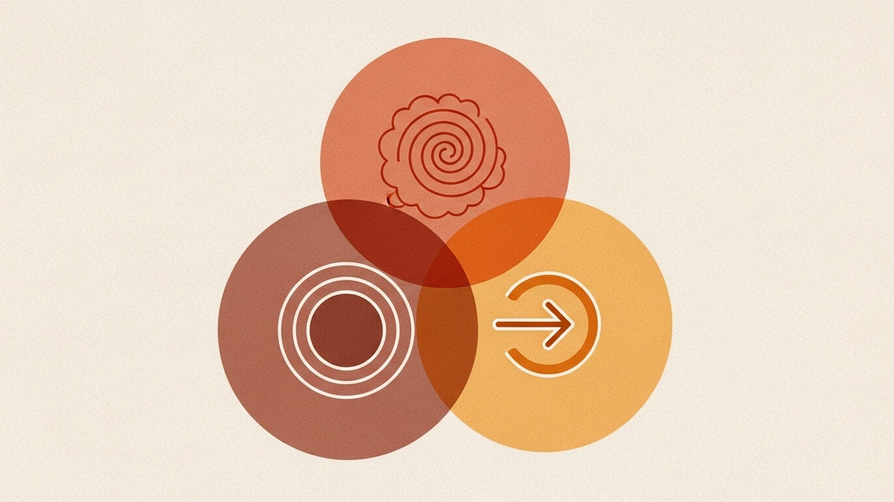

> **논문 정보**
>
> - **제목**: The Rise and Potential of Large Language Model Based Agents: A Survey
> - **저자**: Zhiheng Xi, Wenxiang Chen, Xin Guo 외 (Fudan University NLP Group)
> - **출판**: arXiv 2309.07864

앞선 글에서 Autonomous Agents Survey는 에이전트를 건물로 비유하며 시공 매뉴얼을 작성했다. 프로파일링, 메모리, 계획, 행동 -- 네 개의 기둥을 세우면 에이전트가 완성된다는 공학적 청사진이었다. 유용하지만, 그 시선은 "어떻게 만드는가"에 묶여 있었다. 만드는 법을 알면 에이전트를 이해한 것인가? 설계도를 읽을 줄 안다고 해서 그 건물에 사는 존재의 경험을 이해한 것은 아니다.

Fudan University NLP Group이 거의 같은 시기(2023년 9월)에 발표한 이 서베이는 다른 질문에서 출발한다. "에이전트를 어떻게 만드는가"가 아니라, "에이전트란 무엇인가"를 묻는다. 그 답을 찾기 위해 논문은 인지과학의 렌즈를 꺼내든다. 인간을 이해하는 틀로 인공 에이전트를 바라보겠다는 것이다. 에이전트를 뇌(Brain), 지각(Perception), 행동(Action)의 세 축으로 분해하고, 그 위에 단일 에이전트에서 다중 에이전트로, 다시 인간-에이전트 협업으로 확장되는 3단계 조직 구조를 올려놓는다.

CoALA가 인지 아키텍처의 이론적 골격을 제시했다면, Autonomous Agents Survey가 구현의 체크리스트를 정리했다면, 이 서베이는 그 둘 사이 어딘가에 자리를 잡는다. 인지과학에서 빌려온 은유를 사용하되, CoALA만큼 추상적이지 않고, Autonomous Agents Survey만큼 구현에 밀착하지도 않는다. 같은 대상을 서로 다른 축으로 절개했을 때 드러나는 단면이 다르듯, 이 논문은 에이전트의 또 다른 면을 보여준다.

### 왜 또 다른 서베이인가 -- 현미경과 망원경의 차이

같은 해에 발표된 두 서베이가 같은 대상을 다루면서도 전혀 다른 그림을 그린다. 이것은 우연이 아니라, 분류 체계의 근본적 출발점이 다르기 때문이다.

Autonomous Agents Survey는 엔지니어의 시선으로 에이전트를 본다. 프로파일링 모듈은 어떻게 설계하는가, 메모리 구조는 어떤 선택지가 있는가, 계획 전략은 피드백을 포함하는가 -- 모든 질문이 구현 결정을 향한다. 현미경으로 부품을 하나하나 확대하는 방식이다. 부품의 사양은 정확히 파악하지만, 전체 유기체가 어떻게 움직이는지는 부품 목록만으로 설명되지 않는다.

이 서베이는 망원경으로 한 발 물러서서 본다. 에이전트를 인간 인지의 모형으로 이해하려 한다. 뇌가 사고하고, 감각 기관이 세계를 인식하고, 팔다리가 세계에 개입한다 -- 이 삼분법을 에이전트에 투영한다. 시리즈 첫 글의 CoALA가 기억-행동-판단이라는 인지과학의 축을 제시한 것과 같은 계보에 속하지만, CoALA보다 더 직관적이고 덜 정형적이다. CoALA가 Soar와 ACT-R 같은 인지 아키텍처 전통을 명시적으로 계승했다면, 이 논문은 인지과학의 대중적 은유 -- 뇌, 감각, 운동 -- 를 차용하여 더 넓은 청중에게 말을 건다.

### 세 개의 축 -- Brain, Perception, Action

논문의 핵심 구조는 단순하다. 에이전트를 구성하는 세 축을 정의하고, 각 축의 내부를 세분화한다.

**Brain -- 중추 신경계로서의 LLM**

Brain은 에이전트의 인지적 핵심이다. LLM이 이 역할을 맡는다. 논문은 Brain의 기능을 여섯 가지로 세분화한다.

- 자연어 상호작용: 인간과 자연스럽게 소통하는 능력. 모든 인지 활동의 매체다.
- 지식: 사전 학습으로 내재화한 언어적 지식, 상식, 도메인 전문성. LLM의 파라미터에 응축된 세계 모델이다.
- 기억: 단기 기억(인컨텍스트 윈도우)과 장기 기억(외부 벡터 DB)의 이분법. 더 나아가 에피소드 기억(경험의 기록), 의미 기억(사실과 개념), 절차 기억(방법의 체화)으로 나뉜다. 시리즈 마지막 글에서 다룰 A-MEM이 바로 이 기억 체계를 재설계하려는 시도다.
- 추론: CoT(Chain-of-Thought)에서 출발하여 ToT(Tree of Thoughts), GoT(Graph of Thoughts)로 확장되는 추론 패러다임. 시리즈에서 CoT를 단일 경로, ToT를 다중 경로, LATS를 트리 탐색 기반으로 읽었다 -- 모두 Brain의 추론 능력을 확장하려는 시도였다.
- 계획: 복잡한 과제를 하위 과제로 분해하고 실행 순서를 정하는 능력. 계획-실행-반성의 루프가 핵심이며, Reflexion이 이 반성 루프를 언어적으로 구현한 대표적 사례다.
- 전이 가능성: 학습한 능력을 새로운 과제에 일반화하는 능력. 분포 외(out-of-distribution) 과제 처리, 지속적 학습, few-shot 적응이 여기에 포함된다.

Autonomous Agents Survey의 4모듈과 비교하면, Brain은 프로파일링을 제외한 나머지 세 모듈(메모리, 계획, 행동의 일부)을 하나로 통합한다. 이것이 두 서베이의 가장 큰 구조적 차이다. Autonomous Agents Survey는 기능별로 모듈을 나누고, 이 서베이는 생물학적 은유로 계층을 나눈다.

**Perception -- 감각 기관으로서의 입력 채널**

Perception은 에이전트가 환경에서 정보를 수집하는 모든 경로를 포괄한다.

- 텍스트 입력: 대화, 지시문, 문서, 웹 페이지. 가장 기본적인 지각 채널이다.
- 시각 입력: 이미지, 비디오, GUI 스크린샷. GPT-4V 이후 멀티모달 에이전트의 핵심 입력이 됐다.
- 청각 입력: 음성 인식, 소리 신호. Whisper 같은 모델이 LLM과 결합되면서 가능해진 채널이다.
- 기타 모달리티: 촉각, 제스처, 3D 환경 데이터. 체화된(embodied) 에이전트의 영역이다.

Perception을 독립적 축으로 분리한 것은 이 서베이의 중요한 관점이다. Autonomous Agents Survey에서 입력은 별도의 모듈로 다뤄지지 않았다 -- 행동 모듈의 일부이거나, 메모리에 저장되기 전의 전처리 단계 정도로 취급됐다. 하지만 인지과학의 관점에서, 지각은 단순한 데이터 입력이 아니라 세계를 해석하는 적극적 과정이다. 무엇을 보고 무엇을 무시하는가, 어떤 감각 채널을 신뢰하고 어떤 것을 할인하는가 -- 이 선택이 인지의 질을 결정한다.

**Action -- 운동 기관으로서의 출력 채널**

Action은 에이전트가 세계에 영향을 미치는 모든 방식이다.

- 도구 사용: API 호출, 코드 실행, 데이터베이스 검색, 웹 브라우징. Toolformer가 LLM의 도구 사용 가능성을 열었고, ReAct가 추론과 도구 사용의 교차 실행을 보여줬다.
- 텍스트 출력: 대화 응답, 보고서 생성, 요약, 코드 작성. 가장 보편적인 행동이다.
- 물리적 행동: 로봇 제어, 가상 환경에서의 조작. 체화된 에이전트가 디지털 출력을 넘어 물리적 세계에 개입하는 단계다.

Brain-Perception-Action의 세 축을 관통하는 핵심 통찰은 이것이다. 에이전트의 능력은 개별 축의 성능이 아니라, 세 축 사이의 연결 품질에 의해 결정된다. 아무리 강력한 Brain이라도 Perception이 빈약하면 맹인과 같고, Perception이 풍부해도 Action이 제한되면 감옥에 갇힌 것과 같다.

### 세 개의 층위 -- 단일에서 협업으로

논문은 에이전트 시스템을 세 단계의 조직 수준으로 분류한다. 각 단계에서 복잡성과 가능성이 함께 증가한다.

**단일 에이전트**: 하나의 LLM이 Brain-Perception-Action을 모두 담당한다. 과제 지향적 에이전트(CoT, ReAct, Toolformer)와 창발적 행동을 보이는 에이전트(Generative Agents의 개별 캐릭터)로 나뉜다. 시리즈 초반에 읽은 논문들 -- CoALA, ReAct, Reflexion, Toolformer -- 이 모두 이 단계의 설계 원리를 탐구한 것이다.

**다중 에이전트**: 여러 에이전트가 상호작용하며 과제를 수행한다. 논문은 상호작용 방식을 세 가지로 분류한다.

- 협력적 상호작용: 역할을 분담하고 순차적 파이프라인으로 작업을 처리한다. MetaGPT가 Product Manager-Architect-Engineer의 역할 분배로, ChatDev가 디자이너-프로그래머-테스터의 흐름으로 이 패턴을 구현했다.
- 토론적 상호작용: 에이전트 간 의견 교환을 통해 답을 정제한다. Multi-Agent Debate가 대표적이며, AutoGen의 유연한 대화 기반 협업도 이 범주에 속한다.
- 경쟁적 상호작용: 게임이나 시뮬레이션에서의 경쟁. 늑대인간(Werewolf), 외교(Diplomacy) 같은 전략 게임에서 에이전트 간 경쟁이 더 나은 전략을 창발시킨다.

**인간-에이전트 협업**: 에이전트가 독립적으로 행동하는 것을 넘어, 인간과 상호작용하는 패턴이다.

- 지시자-실행자: 인간이 지시하고 에이전트가 실행한다. Copilot 스타일의 보조가 대표적이다.
- 동등한 협력자: 에이전트가 인간에게 판단을 요청하거나, 인간과 공동으로 문제를 해결한다.
- 에이전트 주도: 에이전트가 자율적으로 행동하고, 인간은 감독과 승인만 담당한다.

시리즈의 여정도 이 세 단계를 따라왔다. CoALA에서 Toolformer까지가 단일 에이전트의 원리를, AutoGen에서 MetaGPT까지가 다중 에이전트의 조직을, RLHF와 Constitutional AI가 인간-에이전트 관계의 설계를 다뤘다. 이 서베이의 3단계 분류는 시리즈 전체의 지도이기도 하다.

### 세 개의 렌즈 -- 프레임워크 비교

같은 시기에 발표된 세 서베이가 LLM 에이전트를 서로 다른 축으로 절개한다. 각각의 장단점을 비교하면 에이전트를 이해하는 복합적 시야가 열린다.

| 비교 항목 | Rise and Potential (이 논문) | Autonomous Agents Survey (#23) | CoALA (#1) |
|-----------|------------------------------|-------------------------------|------------|
| 분류 축 | Brain / Perception / Action | 프로파일링 / 메모리 / 계획 / 행동 | 기억 / 행동 / 판단 |
| 출발 시선 | 인지과학적 은유 | 공학적 모듈 분해 | 인지 아키텍처 이론 |
| 강점 | 직관적 구조, 조직 수준 분류 | 구현 선택지의 상세함 | 이론적 완결성 |
| 약점 | 모듈 간 경계 모호 | 프로파일링의 정체성 논의 제한적 | 추상도가 높아 구현 지침 약함 |
| 에이전트 정체성 | Brain 내부에 암묵적 | 프로파일링 모듈로 명시 | 다루지 않음 |
| 멀티모달 입력 | Perception으로 독립 분류 | 행동 모듈에 포함 | 관찰 공간으로 추상화 |
| 다중 에이전트 | 조직 수준으로 별도 분류 | 응용 영역에서 언급 | 범위 밖 |
| 평가 프레임워크 | 벤치마크와 도전 과제 제시 | 주관/객관 평가 구분 | 형식적 정의 중심 |

세 프레임워크 중 어느 것이 "정답"인가라는 질문은 잘못된 질문이다. 엔지니어에게는 Autonomous Agents Survey의 4모듈이, 연구자에게는 CoALA의 인지 아키텍처가, 에이전트의 전체적 윤곽을 빠르게 파악하려는 사람에게는 이 논문의 Brain-Perception-Action이 더 유용하다. 중요한 것은, 세 서베이가 공통적으로 포착하는 구조가 있다는 점이다 -- 에이전트에게는 사고하는 핵심(Brain/계획/판단), 세계를 인식하는 경로(Perception/메모리/관찰), 세계에 개입하는 수단(Action/행동)이 필요하다. 이 삼분법은 용어만 다를 뿐 본질적으로 수렴한다.

### 2026년의 시선 -- 인지 은유는 얼마나 버텼는가

이 서베이가 발표된 지 2년 반이 지났다. Brain-Perception-Action 프레임워크는 여전히 유효한 렌즈인가?

맞힌 것부터 보자. 멀티모달 에이전트의 부상을 Perception이라는 독립 축으로 미리 포착한 것은 선견지명이었다. 2024년 이후 GPT-4o, Gemini, Claude의 멀티모달 능력이 급격히 발전하면서, 에이전트의 Perception 채널은 텍스트를 넘어 시각, 음성, 심지어 실시간 비디오까지 확장됐다. Autonomous Agents Survey가 입력을 독립 모듈로 다루지 않았다는 점을 감안하면, 이 논문이 Perception을 별도 축으로 분리한 판단은 옳았다.

조직 수준의 3단계 분류도 유효하다. 단일 에이전트에서 다중 에이전트로의 전환은 AutoGen과 MetaGPT를 거쳐 현실이 됐고, 인간-에이전트 협업은 Copilot에서 Cursor, Claude Code에 이르는 개발 도구들의 핵심 설계 원리가 됐다. "에이전트 주도 + 인간 감독" 패턴은 2026년 현재 가장 보편적인 인간-AI 협업 모델이다.

놓친 것도 있다. 가장 큰 빈칸은 안전과 정렬(alignment)이다. Brain-Perception-Action 어디에도 "에이전트가 하지 말아야 할 것"을 다루는 축이 없다. Constitutional AI가 제기한 원칙 기반 제약, RLHF가 시도한 인간 선호 정렬 -- 이런 안전 메커니즘이 프레임워크에 자리를 잡지 못한다. 2026년 시점에서 에이전트 안전은 선택이 아니라 필수인데, 이 서베이의 삼분법은 그것을 구조적으로 포착하지 못한다.

Brain의 범위가 너무 넓다는 점도 시간이 갈수록 선명해졌다. 자연어 이해, 지식, 기억, 추론, 계획, 전이 -- 이 모든 것을 Brain 하나에 넣으면, Brain이 사실상 "에이전트 = Brain + 입출력"이라는 자명한 명제로 환원된다. Autonomous Agents Survey가 메모리, 계획, 행동을 별도 모듈로 분리한 것이 실용적으로 더 유용했던 이유다. 특히 o1 이후의 추론 모델이 등장하면서, Brain 내부의 "추론"과 "계획"이 얼마나 다른 것인지, 분리해서 다뤄야 하는 것인지가 중요한 질문이 됐다.

에이전트-에이전트 간 통신 프로토콜의 부재도 눈에 띈다. 다중 에이전트를 조직 수준으로 분류한 것은 좋았지만, 에이전트들이 실제로 어떻게 소통하는지 -- 메시지 형식, 합의 메커니즘, 갈등 해결 -- 에 대한 분석이 얕다. 2025년에 등장한 MCP(Model Context Protocol) 같은 표준 프로토콜이나, A2A(Agent-to-Agent) 통신 규격이 이 공백의 중요성을 증명한다.

결국, Brain-Perception-Action 프레임워크는 에이전트를 처음 이해하려는 사람에게 여전히 좋은 출발점이다. 하지만 그 단순함이 곧 한계이기도 하다. 에이전트가 복잡해질수록, Brain 내부를 더 세밀하게 나누고, 안전이라는 네 번째 축을 추가하고, 조직 수준에 통신 프로토콜을 명시해야 한다. 은유는 이해의 시작이지, 설계의 완성이 아니다.

### 마무리

한 문장으로 줄이면 이렇다. 에이전트를 뇌, 지각, 행동의 세 축으로 보는 인지과학적 렌즈는 전체 윤곽을 빠르게 잡아주지만, 그 단순함 뒤에는 안전, 정체성, 통신이라는 빈칸이 있다.

Autonomous Agents Survey가 에이전트의 부품 목록을 제시했다면, 이 서베이는 에이전트를 살아 있는 유기체의 은유로 바라보게 했다. 두 시선 모두 필요하다. 부품을 모르면 만들 수 없고, 유기체를 모르면 왜 만드는지를 잊는다. 시리즈에서 읽어온 CoALA의 인지 아키텍처, ReAct의 추론-행동 루프, Reflexion의 자기 반성, MetaGPT의 역할 분배, AutoGen의 대화 기반 협업 -- 이 모든 연구가 Brain-Perception-Action이라는 세 축 위에, 혹은 프로파일링-메모리-계획-행동이라는 네 기둥 위에 자리를 잡는다. 어떤 좌표계를 쓰느냐에 따라 보이는 면이 달라질 뿐, 에이전트라는 대상 자체는 하나다.

다음 글에서는 에이전트의 가장 본질적인 능력으로 돌아간다 -- 기억. A-MEM은 니클라스 루만의 제텔카스텐에서 영감받아, 에이전트가 사전 정의된 구조 없이 스스로 기억을 조직하고 진화시키는 시스템을 제안한다. 시리즈의 마지막 글이다.

---

*이 글은 "Agentic AI 논문 읽기" 시리즈의 스물네 번째 글입니다. 시리즈 전체 목록은 시리즈 페이지에서 확인할 수 있습니다.*
