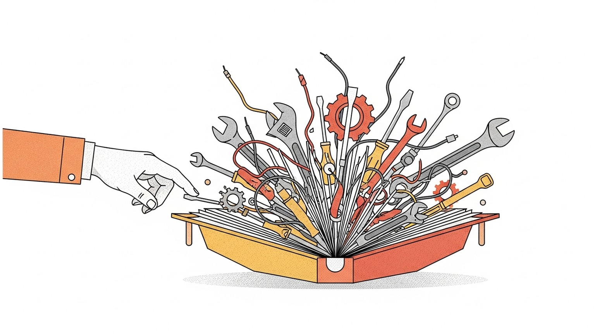

> **논문 정보**
>
> - **제목**: The Evolution of Tool Use in LLM Agents: From Single-Tool Call to Multi-Tool Orchestration
> - **저자**: Haoyuan Xu, Chang Li, Xinyan Ma, Xianhao Ou 외 (Harbin Institute of Technology, Harvard University, Huawei Technologies)
> - **출판**: arXiv 2603.22862 (2026.03)

지난 글에서 Halo는 에이전트 워크플로우를 DAG로 표현하고, GPU-CPU 이종 파이프라인을 공동 스케줄링하는 시스템 최적화를 다뤘다. 에이전트의 마음이 아니라 몸을 최적화하는 논문이었다. 그 DAG의 노드 하나하나에는 도구 호출이 들어 있었다. 검색 API를 부르고, SQL을 실행하고, 코드 인터프리터를 돌리는 것. Halo는 그 노드들의 실행 순서와 자원 배분을 최적화했지만, 노드 안에서 무슨 일이 일어나는지 -- 어떤 도구를 왜 선택하고, 어떻게 조합하고, 실패하면 어떻게 복구하는지 -- 는 다루지 않았다.

이번 서베이는 바로 그 안을 들여다본다. 시리즈의 네 번째 글에서 읽었던 Toolformer는 언어 모델이 스스로 도구를 집어드는 순간을 포착한 논문이었다. 하지만 그것은 2023년 초의 일이다. 그때는 단일 도구를 한 번 호출하는 것만으로도 혁신이었다. 3년이 지난 지금, 도구 사용은 계산기 하나를 쥐는 수준에서 오케스트라를 지휘하는 수준으로 진화했다. 이 서베이는 그 진화의 전체 지형을 6가지 차원으로 조망하는 지도다.

2026년 3월, Harbin Institute of Technology와 Harvard University, Huawei Technologies의 공동 연구팀이 이 포괄적 답변을 발표했다. 50편 이상의 벤치마크와 수백 편의 논문을 분류하면서, 도구 사용이 단일 호출의 정확성에서 다중 도구 오케스트레이션의 견고성으로 진화하는 과정을 추적한다. 이 시리즈에서 이미 읽었던 Toolformer, ReAct, Reflexion, LATS, Halo가 모두 이 서베이의 지도 위에 자리를 잡고 있다.

기존 서베이들이 놓치고 있던 두 가지 격차를 이 논문이 지적한다. 첫째, 개념적 격차다. "도구 사용", "도구 호출", "워크플로우 실행"이라는 용어가 혼용되면서, 단일 호출과 장기 오케스트레이션의 본질적 차이가 흐려졌다. 둘째, 구조적 격차다. 계획, 학습, 안전, 효율, 벤치마킹이 별개 영역으로 연구되지만, 실제 시스템에서는 이 차원들이 상호 의존한다. 이 서베이는 두 격차를 모두 메우려는 시도다.

### 6가지 차원 -- 도구 사용의 해부학

서베이는 문헌을 6가지 차원으로 조직한다. 각 차원은 독립된 연구 영역이면서, 실제 시스템에서는 상호 의존한다.

**추론 시 패러다임**: 에이전트가 도구를 선택하고 호출하는 방식이다. Toolformer의 in-generation 트리거에서, ReAct의 reasoning-acting 전략으로, 그리고 다중 도구를 병렬/순차적으로 오케스트레이션하는 방식으로 진화했다.

서베이가 특히 주목하는 것은 토폴로지 계획(topological planning)의 등장이다. 전통적 ReAct는 과제를 선형으로 분해한다. 하지만 ToolNet과 StructuredAgent 같은 최신 연구는 도구 의존성을 방향 그래프로 인코딩하여, 병렬 I/O와 중첩 호출을 자연스럽게 처리한다. Halo가 시스템 수준에서 DAG를 활용했다면, 여기서는 에이전트의 추론 수준에서 그래프 구조가 등장한 것이다. 계층적 위임도 주요 흐름이다. HIPLAN은 상위 수준 마일스톤과 하위 수준 실행기를 분리하고, ADaPT는 실패할 때만 재귀적으로 분해하는 적응적 접근을 취한다.

**튜닝/학습**: 도구 사용 능력을 모델에 내재화하는 방법이다. Toolformer가 자기지도학습으로 도구 사용 패턴을 가중치에 새겨 넣었다면, 이후에는 더 정교한 방법들이 등장했다.

Gorilla가 대규모 API 호출 데이터로 파인튜닝하여 문법 정렬을 달성하고, ToolLLM이 DFS 결정 궤적 학습을 도입하고, Hammer가 Function Masking으로 비관련 도구의 환각을 억제했다. 최근에는 ToRL이나 Agent-R1처럼 SFT 없이 강화학습만으로 도구 사용 능력을 확보하는 엔드투엔드 접근이 부상하고 있다. 궤적 데이터 합성에서 "합성-검증-확장" 프레임워크가 지배적 패러다임이 되었다는 점도 주목할 만하다. 합성 데이터의 핵심은 양이 아니라, 롱테일 도구 조합과 다단계 오류 패턴의 체계적 커버리지다.

**안전성**: 도구 호출의 부작용을 관리하는 문제다. 외부 API를 호출할 때 비가역적 행동(이메일 발송, 결제 등)의 위험을 어떻게 통제하는가.

서베이는 병렬 실행의 경쟁 조건(race conditions)과 장기 도구 체인에서의 에이전트 드리프트(agent drift)를 핵심 위협으로 식별한다. 방어의 진화는 3단계로 요약된다. 사전 실행 정적 제약(AARM, AgentSpec), 실행 중 트랜잭션 관리(SagaLLM이 분산 시스템의 Saga 패턴을 차용하여 롤백 로직을 도입), 실행 후 동적 검증(CRITIC, VerifiAgent). 장기 궤적에서는 MINJA 스타일의 메모리 중독 공격이나 계획 주입 공격 같은 새로운 공격 벡터도 등장하고 있다.

**효율성**: 도구 호출의 비용과 지연을 최소화하는 전략이다. Halo에서 읽었던 배치 최적화가 이 차원에 해당한다.

서베이는 효율성을 지연 시간 최적화와 비용 최적화로 나눈다. 지연 시간 측면에서는 병렬 실행(LLMCompiler가 도구 의존성 분석으로 독립 호출을 동시 실행), 비동기 분리(계획과 실행의 분리), 투기적 추론(ReWoo가 기대 도구 출력을 포함한 실행 그래프를 사전 생성)이 핵심이다. 비용 측면에서는 적응적 모델 라우팅(FrugalGPT -- 저비용 모델을 우선 시도하고 신뢰도가 낮을 때만 대형 모델로 에스컬레이션), 동적 도구 검색(AnyTool의 계층적 디렉토리 트리), 의미적 캐싱(GPTCache가 의미적으로 유사한 쿼리를 감지하여 캐시에서 반환)이 발전하고 있다. SwiftSage는 인간의 이중 프로세스 이론을 차용하여, 경량 모듈이 루틴 도구 호출을 처리하고 대형 모델은 복잡한 추론에만 개입하는 구조를 제안했다.

**완전성**: 오픈 환경에서 필요한 도구가 존재하지 않을 때 어떻게 하는가. 서베이는 이 문제를 세 수준으로 나눈다.

첫째, 능력 경계 인식이다. 모델이 자신의 도구킷으로 해결할 수 없는 과제를 인식하는 것. FAIL-TALMS가 이 인식 부족을 정량화했고, AskToAct는 결측 파라미터를 감지하면 사용자에게 명확화 질문을 던진다. 둘째, 자율적 도구 확장이다. LATM은 에이전트를 도구 창조자와 도구 사용자로 분리하고, CREATOR는 추상 문제를 Python 스크립트로 변환한다. 셋째, 오픈 환경 적응이다. Voyager는 성공적으로 실행된 코드를 기술 라이브러리로 축적하고, ExpeL은 성공/실패 트레이스에서 교차 과제 통찰을 추출한다.

Toolformer가 기존 도구를 "언제 쓸지" 학습했다면, 이 연구들은 "필요한 도구가 없으면 만들어라"로 나아간 것이다.

**벤치마크/평가**: 도구 사용 능력을 어떻게 측정하는가. 서베이는 50개 이상의 벤치마크를 토폴로지 복잡도, 시간 규모, 동적 환경, 상태 지속성이라는 4가지 차원으로 분류한다.

초기의 API-Bank은 단일 호출 정확성을 측정했지만, 최근의 UltraHorizon은 400회 이상의 도구 호출과 200K 토큰 이상의 궤적에서 장기 오케스트레이션 능력을 평가한다. AppWorld는 9개의 상호 연결된 앱에서 지속적 DB 상태 변경을 추적하고, OSWorld는 실세계 컴퓨터 환경에서 수백 개의 오픈 도메인 과제를 테스트한다. 이 서베이에서 가장 체계적인 부분 중 하나가 바로 이 벤치마크 분류표다.

### 진화의 세 단계 -- 계산기에서 오케스트라까지

Toolformer가 보여준 것은 첫 번째 단계였다. 이후의 진화를 세 단계로 정리할 수 있다.

| 단계 | 대표 시스템 | 도구 수 | 호출 패턴 | 핵심 도전 |
|------|-----------|--------|----------|----------|
| 단일 도구, 단일 호출 | Toolformer, Gorilla | 1개 | 생성 중 1회 삽입 | 정확한 API 선택과 파라미터 생성 |
| 다중 도구, 순차 호출 | ReAct, TaskWeaver | 여러 개 | 이전 출력이 다음 입력 | 도구 체이닝, 중간 상태 관리 |
| 다중 도구, 오케스트레이션 | HuggingGPT, Chameleon | 수십~수백 개 | 병렬+순차, DAG 구조 | 토폴로지 계획, 실패 복구, 비용 최적화 |

첫 번째 단계에서 Toolformer는 단일 도구를 한 번 호출한다. 계산기를 쓰거나, 검색을 하거나, 번역을 하는 수준이다. 시리즈의 네 번째 글에서 읽었던 것처럼, 6.7B 모델이 175B GPT-3를 넘어선 것은 이 단계의 성과였다. 하지만 한계도 명확했다 -- 도구 체이닝이 불가능하고, 결과를 보고 전략을 수정하는 루프가 없었다.

두 번째 단계에서 ReAct와 TaskWeaver는 여러 도구를 순서대로 호출한다. 검색 결과를 요약하고, 요약을 번역하는 파이프라인이다. ReAct의 사고-행동-관찰 루프가 이 패턴의 원형이다. 이전 도구의 출력이 다음 도구의 입력이 되므로, 중간 상태를 올바르게 전달하는 것이 핵심 도전이 된다.

세 번째 단계에서 HuggingGPT와 Chameleon은 과제를 분석하여 필요한 도구들의 실행 계획을 세우고, 병렬 실행이 가능한 것은 동시에, 의존성이 있는 것은 순서대로 실행한다. HuggingGPT는 중앙 계획자가 이종 전문가를 라우팅하는 구조를 취하고, Chameleon은 사용 가능한 모듈들의 조합을 프로그래밍 방식으로 합성한다. 소프트웨어 엔지니어링(SWE-Agent), GUI 자동화(AppAgent), 엔터프라이즈 워크플로우 같은 복잡한 과제에서 이 수준이 필요하다. Halo가 최적화한 것도 바로 이 세 번째 단계의 실행 효율이었다.

이 세 단계의 경계는 점점 흐려지고 있다. LATS에서 읽었던 탐색 기반 접근은 두 번째와 세 번째 단계 사이에 놓인다. 트리 탐색으로 다중 도구 경로를 평가하되, 완전한 사전 계획 없이 탐색과 실행을 병행한다. 서베이가 제시하는 비용 인식 목적 함수 -- 과제 보상에서 비용을 감산하는 형태 -- 는 이 세 단계를 관통하는 통일된 프레임워크를 제공하려는 시도다.

### 서베이가 드러내는 핵심 발견

서베이가 수백 편의 논문에서 추출한 발견들 중 주목할 만한 것들이 있다.

첫째, 도구 사용 학습의 패러다임이 SFT에서 RL로 빠르게 이동하고 있다. 초기의 Gorilla와 ToolLLM이 지도 파인튜닝으로 도구 호출 패턴을 가르쳤다면, ToRL과 Agent-R1은 기본 모델에서 SFT 단계 없이 강화학습만으로 도구 사용 능력을 직접 유도한다. 이 전환은 도구 사용이 패턴 모방을 넘어 의사결정 최적화의 문제라는 인식을 반영한다.

둘째, 벤치마크 설계가 고립된 API 호출 정확성에서 시스템 수준 평가로 결정적 전환을 겪고 있다. NESTFUL은 900개 이상의 도구와 1,800개 이상의 인스턴스로 비선형 도구 의존성을 테스트하고, UltraHorizon은 200K 토큰 이상의 장기 궤적에서 메모리 쇠퇴와 컨텍스트 포화를 측정한다. "이 도구를 올바르게 호출할 수 있는가"에서 "수십 개의 도구를 조율하면서 목표를 달성할 수 있는가"로 평가의 초점이 이동한 것이다.

셋째, 에이전트 자기 개선이 추론에서 도구 생태계 전체로 확장되고 있다. Reflexion이 언어화된 교훈을 에피소드 메모리에 저장하는 수준이었다면, MetaAgent는 경험을 재사용 가능한 도구와 내부 지식으로 증류하고, Test-Time Tool Evolution은 추론 시점에 새로운 실행 가능 도구를 합성하고 검증한다. 추론이 적응적 루프가 되어 도구 생태계를 사용할 뿐 아니라 재조직하고 개선하는 방향이다.

넷째, 응용 영역별로 도구 사용의 핵심 도전이 다르다. 서베이가 정리한 4개 응용 영역의 대비가 이를 잘 보여준다.

| 응용 영역 | 핵심 도전 | 대표 시스템 | 지배적 차원 |
|----------|----------|-----------|-----------|
| 소프트웨어 엔지니어링 | 도구 의존성 그래프의 복잡성 | SWE-Agent, OpenHands | 추론 시 패러다임 |
| 엔터프라이즈 워크플로우 | 규정 준수, 감사 가능성 | TaskWeaver | 안전성 |
| GUI 에이전트 | 동적 UI 환경 적응 | CogAgent, AppAgent | 완전성 |
| 모바일 시스템 | 자원 제약, 실시간성 | AutoDroid, DroidAgent | 효율성 |

범용적 도구 사용 프레임워크와 도메인 특화 요구 사이의 간극은 아직 좁혀지지 않았다.

### 서베이의 한계

이 서베이가 포괄적임에도 불구하고, 몇 가지 한계를 지적할 수 있다.

첫째, 6가지 차원 간의 상호작용을 깊이 다루지 못한다. 예를 들어 안전성과 효율성은 종종 상충한다 -- 트랜잭션 롤백과 검증은 안전성을 높이지만 지연 시간을 늘린다. 서베이는 각 차원을 독립적으로 정리하면서 이러한 트레이드오프를 체계적으로 분석하지 않는다.

둘째, 산업계의 실제 배포 경험이 거의 반영되지 않았다. 학술 벤치마크에서의 성능과 프로덕션 환경에서의 신뢰성 사이에는 상당한 격차가 존재한다. 에이전트가 수천 명의 사용자에게 서비스될 때 발생하는 문제 -- 도구 API의 장애, 속도 제한, 버전 불일치 -- 에 대한 논의가 부족하다.

셋째, 멀티모달 도구 사용에 대한 분석이 얇다. GUI 에이전트 섹션에서 시각적 그라운딩을 언급하지만, 이미지 생성, 비디오 분석, 음성 처리 등 비텍스트 도구와의 오케스트레이션은 충분히 다루지 않는다.

넷째, 도구 사용의 실패 모드에 대한 체계적 분류가 부족하다. 어떤 유형의 과제에서 어떤 단계의 도구 사용이 실패하는지, 실패의 근본 원인이 추론 오류인지 도구 선택 오류인지 파라미터 생성 오류인지를 구분하는 분석이 있었다면 실무적 가치가 더 컸을 것이다.

### 2026년의 시선

이 서베이는 2026년 3월에 발표되어, 가장 최신의 지형을 반영한다. 서베이가 발표된 이후에도 도구 사용의 지형은 빠르게 변하고 있다.

가장 눈에 띄는 변화는 MCP(Model Context Protocol)의 부상이다. Anthropic이 2024년 말에 공개한 이 프로토콜은 도구 연결의 표준화를 시도한다. 서베이가 정리한 "완전성" 차원의 문제 -- 도구 발견, 도구 확장, 오픈 환경 적응 -- 를 프로토콜 수준에서 해결하려는 접근이다. 도구마다 고유한 API 스키마를 학습해야 했던 시대에서, 표준화된 인터페이스로 도구를 플러그앤플레이하는 시대로의 전환이 진행 중이다.

네이티브 함수 호출(native function calling)도 도구 사용의 지형을 바꾸고 있다. Toolformer가 파인튜닝으로 도구 사용 패턴을 학습해야 했다면, 오늘날의 Claude, GPT-4, Gemini는 훈련 과정 자체에 도구 사용이 내장되어 있다. 서베이의 "튜닝" 차원에서 다룬 SFT와 RL 기법들이 이미 상용 모델의 기본 기능으로 흡수된 것이다. 서베이가 정리한 진화의 세 번째 단계 -- 다중 도구 오케스트레이션 -- 가 연구 주제에서 산업 표준으로 이동하는 속도가 예상보다 빠르다.

도구 사용에서 가장 활발한 연구 방향은 안전성과 완전성이다. 에이전트가 실세계에서 도구를 사용할 때, 잘못된 호출의 결과가 되돌릴 수 없을 수 있다는 점이 점점 더 중요해지고 있다. 서베이가 식별한 에이전트 드리프트, 교차 도구 상태 오염, 메모리 중독 공격 같은 위협들은 에이전트가 프로덕션에 배포될수록 현실적인 문제가 된다.

도구 생태계의 규모도 서베이가 다루던 시점과는 다른 양상을 보인다. ToolkenGPT가 도구를 특수 토큰으로 표현하여 플러그앤플레이 적응을 시도했던 것이 연구의 영역이었다면, 이제 MCP 서버가 수천 개 단위로 등록되는 현실에서 동적 도구 검색과 선택의 문제는 더 이상 학술적 관심사가 아니라 엔지니어링 과제가 되었다. 서베이의 6가지 차원 중 "완전성"이 가장 빠르게 현실과 조우하고 있는 셈이다.

### 마무리

한 문장으로 줄이면 이렇다: 도구 사용의 진화는 "올바른 도구를 고르는 것"에서 "올바른 순서로 안전하게 조율하는 것"으로 질적 전환을 겪고 있으며, 그 전환의 지도를 6가지 차원으로 펼친 것이 이 서베이다.

Toolformer가 도구를 잡는 법을 가르쳤고, ReAct가 도구를 쓰면서 생각하는 법을 보여줬고, Reflexion이 도구 사용의 실패에서 배우는 법을 입증했고, LATS가 도구 경로를 탐색하는 법을 제안했고, Halo가 도구 실행을 최적화하는 법을 설계했다. 이 서베이는 그 모든 조각들이 하나의 지도 위에서 어떻게 연결되는지를 보여준다.

다음 글부터는 시리즈의 방향을 금융 AI로 전환한다. BloombergGPT -- 금융 데이터에 특화된 최초의 대규모 언어 모델이 어떻게 탄생했는지 읽는다. 범용적 도구 사용 능력이 특정 도메인의 언어를 만났을 때, 어떤 가능성과 한계가 드러나는지 살펴본다.

---

*이 글은 "Agentic AI 논문 읽기" 시리즈의 열네 번째 글입니다. 시리즈 전체 목록은 시리즈 페이지에서 확인할 수 있습니다.*
