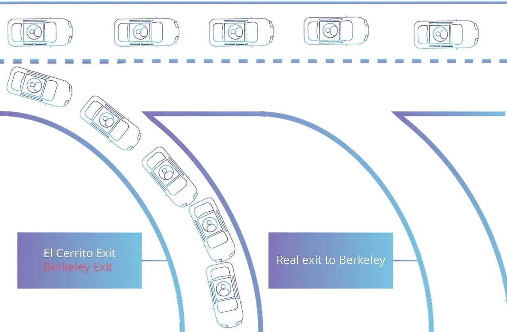
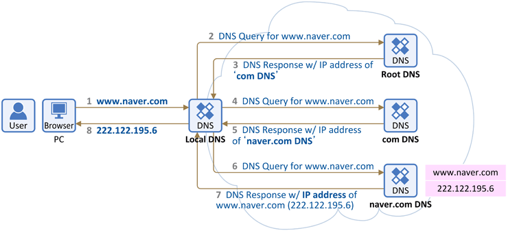
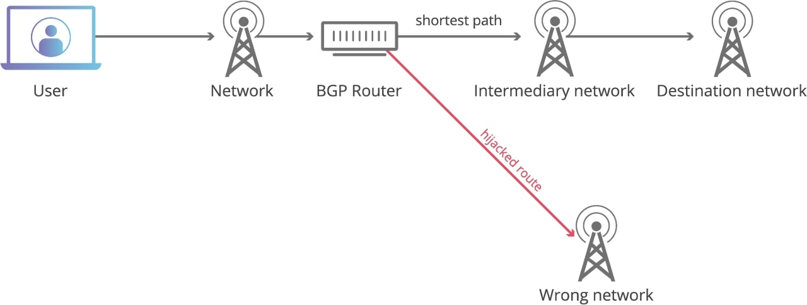

## 개요

2021년 10월, 페이스북(현 Meta)의 서비스(FaceBook, Instagram, WhatsApp, Oculus, ...) 전반을 이용할 수 없는 장애가 발생 했었습니다. 해당 장애는 긴급 복구되는데 5시간, 완벽하게 복구되는데 12시간이 걸렸을 정도로 이례적으로 오래걸렸는데요.

이런 경우 일반적으로 서버 장애, 서버 다운이라고 표현하지만 정확히 말하자면 이는 서버 다운은 아니었습니다. 네트워크의 문제였습니다.

그리고 이렇게 복구에 오래 걸리는 네트워크 관련 문제는 대부분 "DNS"에 의해 발생합니다.

실제로 페이스북, 인스타그램 접속 제한의 문제도 DNS였구요. 구체적으로 공개되기 전 까지는 BGP hijacking을 비롯한 BGP 관련 문제가 아닐까 단순히 '추정'하고 있었는데, 그 추정이 사실이었습니다. [What took Facebook down @ ZDNET](https://www.zdnet.com/article/what-took-facebook-down-major-global-outage-drags-on)

BGP(Border Gateway Protocol)는 인터넷 최상위에 존재하는 [autonomous systems (AS)](https://people.cs.rutgers.edu/~pxk/352/notes/autonomous_systems.html) (ex. KT, SKT, LGU+ 등 ISP)간에 라우팅에 사용되는 표준 프로토콜입니다. 그렇기 때문에 대부분의 사람들과 각 기업의 네트워크 관리자들은 일반적으로 BGP를 다룰 일이 없습니다.

그리고 이 문제는 단순히 서비스를 이용할 수 없는 것에서 그치는 것이 아니라 여러가지 성가신 문제를 야기하기도 했는데요.

> As annoying as this is to you, it may be even more annoying to Facebook employees. There are reports that [Facebook employees can't enter their buildings](https://twitter.com/sheeraf/status/1445099150316503057?s=21) because their "smart" badges and doors were also disabled by this network failure. If true, Facebook's people literally can't enter the building to fix things.

해당 네트워크 장애로 인해 건물 출입 인증 시스템 또한 무력화 되었다는겁니다. 즉, 복구를 위해 건물에 들어갈 수 없는 문제가 발생한건데요. 이정도로 장애의 범위가 컸기 때문에 복구까지 더욱 오래 걸린 것이 아닌가 싶습니다.

그래서 BGP와 BGP Hijacking이 뭐길레 이런 문제가 발생했을까 궁금 하실텐데요. BGP에 대해 이야기해보기 전, DNS의 전반적인 구조에 대해 먼저 이야기 해보겠습니다.

## DNS

이 그림은 인터뷰에서 자주나오는 질문 중 하나인, “브라우저에 URL을 입력했을 때 일어나는 일”을 DNS 레벨에서 표현한 다이어그램입니다.

www.naver.com → Local DNS → Root DNS → com DNS → naver.com DNS → ...

내가 접속하고자 하는 도메인을 입력하면, 해당 도메인에 대한 정보를 가진 DNS로부터 IP 정보를 받아오게 됩니다. 그 후, 해당 아이피로 HTTP 요청을 보내는 것이지요.

그렇다면 네트워크 상에는 IP를 가진 정말 많은 디바이스가 존재할텐데, 내가 찾아가야 하는 IP는 어떻게 찾는걸까요?

디테일하게 설명하면 복잡하고, 오늘의 핵심은 아니기 때문에 정말 간단하게 설명하자면, 우리가 사용하는 모든 네트워크는 어떤 통신사에 소속되어 있습니다. 그렇기 때문에 통신사에서는 IP에 대한 모든 정보를 지니고 있습니다.

네, 맞습니다. 그냥 통신사에서 알려주는겁니다. 다만 내 IP 주소와 목적지 IP 주소가 같은 통신사라면 이렇다고 이해해주시면 좋을 것 같구요. 서로 다른 통신사에 속해있다면 BGP 라는 개념이 등장하게 됩니다.

## BGP

앞서 잠깐 설명 드렸듯 BGP는 인터넷 라우팅 프로토콜이며, 사용자의 트래픽이 목적지 IP 주소에 최대한 효율적으로 도달할 수 있도록 방향을 제공합니다.

사용자가 웹 브라우저에서 도메인 주소(ex. [facebook.com](facebook.com))를 입력하면 DNS에서 IP 주소를 제공해주고, BGP는 해당 IP 주소에 도달하는 가장 효율적인 방법을 제공하는 것이죠.

각 AS들은 BGP를 이용하는 BGP 라우터들을 가지고 있습니다. 그리고, 각 BGP 라우터는 AS 간의 최적 경로가 포함된 라우팅 테이블을 저장하고 있는데요.

이 라우팅 테이블은 각 AS가 자신이 소유한 새로운 IP 접두사를 브로드 캐스트함에 따라 거의 실시간으로 업데이트 됩니다. 여기서 보안 문제가 발생합니다.

## BGP Hijacking

인터넷은 상호 연결된 여러 개의 대규모 네트워크로 구성되어 있습니다. 이들은 모두 분산되어 있기 때문에 데이터 패킷이 의도한 대상 IP 주소에 도달할 수 있도록 하는 관리 기관이나 교통 경찰 같은 역할이 특별히 존재하지 않습니다.

그래서 BGP가 이 역할을 수행합니다. BGP가 없다면 웹 트래픽은 비효율적인 라우팅으로 인해 목적지에 도달하는 데 엄청난 시간이 걸리거나 의도한 목적지에 전혀 도달하지 못할 수도 있습니다.

그리고 각 BGP 라우터들은, AS의 라우팅 테이블 업데이트 요청을 거의 무조건 신뢰합니다.

예를 들어, AS 100에 속하는 IP prefix가 192.0.2.0/24 라면, AS 100은 이웃하는 BGP peer 들에게 "192.0.2.0/24"에 속하는 주소는 자신에게 보내라고 알리는 것입니다.

그리고 이 전파는 또 다른 이웃 BGP peer에게 거의 실시간으로 전파되게 됩니다.

이를 이용한 하이재킹은 다음과 같은 방식으로 이루어집니다.

기존에 페이스북 IP에 대한 라우팅 정보를 갖고 있는 AS 1000이 있고, 페이스북의 IP Prefix는 다음과 같다고 가정해봅시다.

- 222.111.192.0/24
- 222.111.193.0/24
- 222.111.195.0/24
- 222.111.197.0/24
- 222.111.199.0/24

그런데 AS 2000이라는 곳에서 페이스북의 IP Prefix는 우리한테 연결해. 라고 브로드캐스트 해버리는 것입니다.

그렇게 된다면 다른 BGP Peer들은 이 AS의 업데이트 요청을 신뢰하게 되고, 실제로 페이스북 IP 주소로 연결되는 요청 모두를 AS 2000으로 보내버리게 됩니다. (가장 최근 발생한 브로드캐스트를 신뢰함)

다이어그램으로 표시하자면, 이런 느낌이 되겠네요.

이것이 BGP와 BGP Hijacking의 대략적인 설명이며, 이를 방지하기 위해 RPKI와 BGPsec라는 솔루션이 제시되기도 했지만, 이러한 솔루션들은 아직까지 널리 적용/구현되지 않은 상태입니다.

즉, 우리가 매일 사용하고 있는 인터넷 세상은 Routing Security 관점에선 아직 완전하지 못하다 볼 수 있습니다.