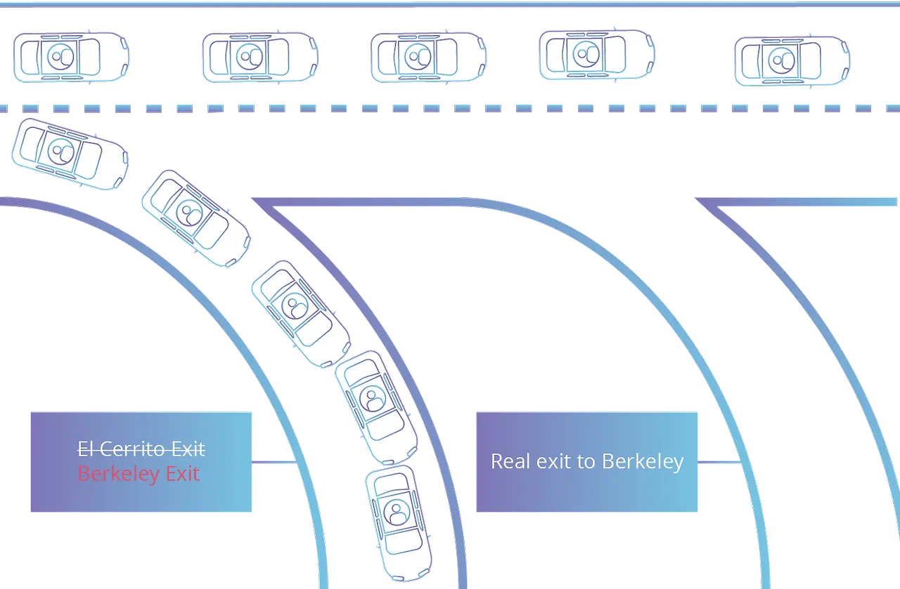

## 개요

2021년 10월, 페이스북(현 Meta)의 서비스(FaceBook, Instagram, WhatsApp, Oculus, ...) 전반을 이용할 수 없는 장애가 발생 했었습니다. 해당 장애는 긴급 복구되는데 5시간, 완벽하게 복구되는데 12시간이 걸렸을 정도로 이례적으로 오래걸렸는데요.

이런 경우 일반적으로 서버 장애, 서버 다운이라고 표현하지만 정확히 말하자면 이는 서버 다운은 아니었습니다. 네트워크의 문제였죠.

그리고 이렇게 복구에 오래 걸리는 네트워크 관련 문제는 대부분 "DNS"에 의해 발생합니다.

실제로 페이스북, 인스타그램 접속 제한의 문제도 DNS였구요. 구체적으로 공개되기 전 까지는 BGP hijacking을 비롯한 BGP 관련 문제가 아닐까 단순히 '추정'하고 있었는데, 그 추정이 사실이었습니다.

[https://www.zdnet.com/article/what-took-facebook-down-major-global-outage-drags-on](https://www.zdnet.com/article/what-took-facebook-down-major-global-outage-drags-on)

[test](http://naver.com){:target="_blank"}

<Link href="http://naver.com" />