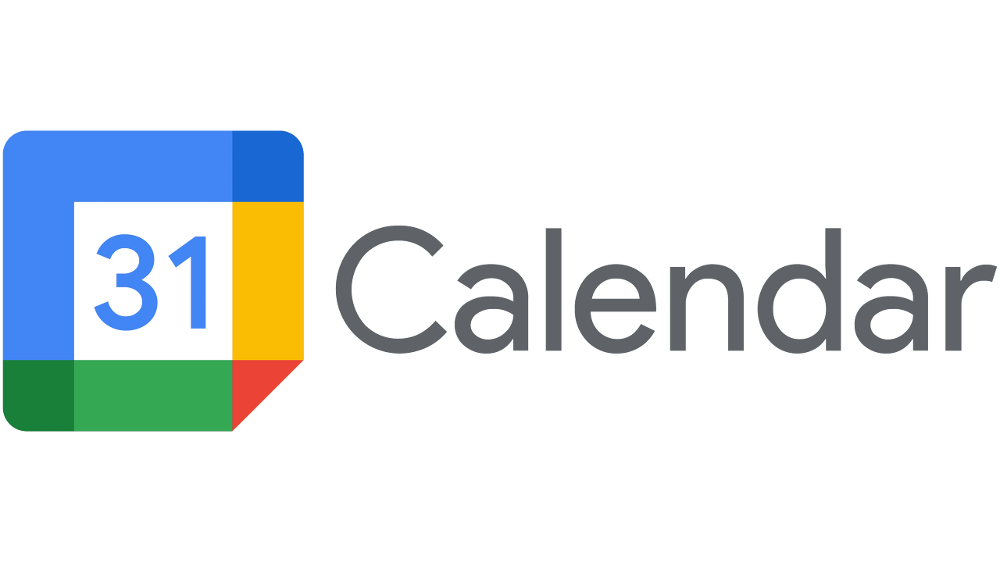
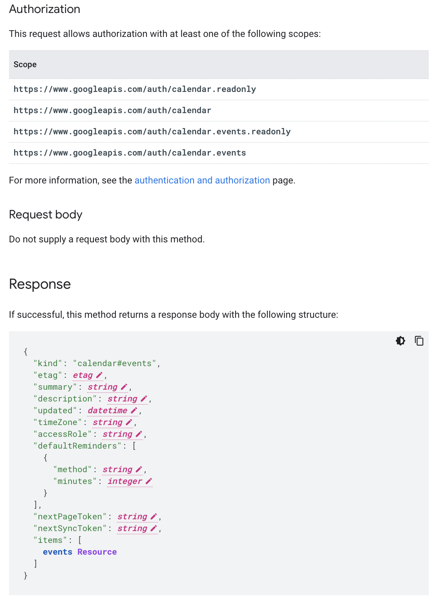
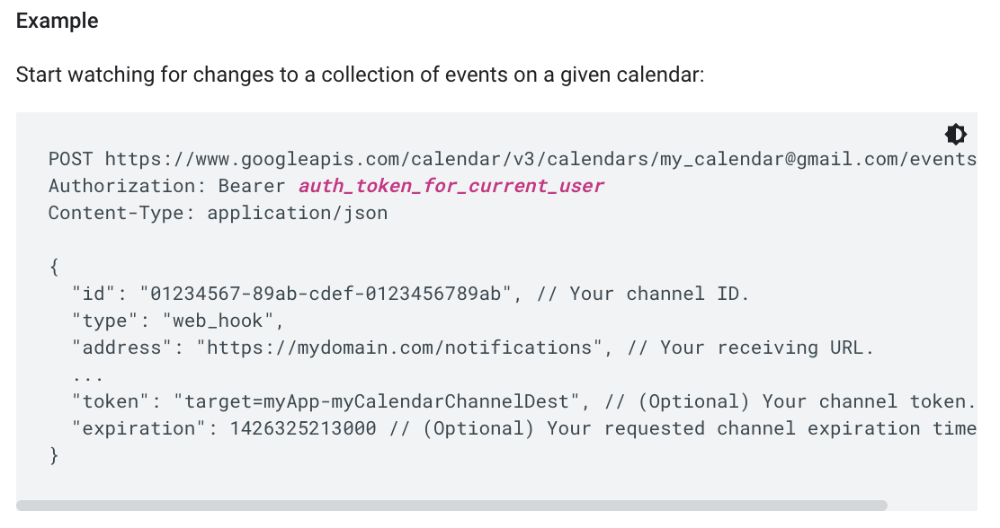

## 들어서며

구글 캘린더는 전 세계적으로 널리 사용되는 캘린더 애플리케이션입니다. 그러다 보니 캘린더를 읽고 새로운 이벤트를 작성하는 데 이용할 수 있는 RESTful API인 Google Calendar API가 함께 제공되고 있습니다.

이번 글에서는 이러한 구글 캘린더 API의 주요 기능을 이해해보고, 관련된 시스템을 구축한다고 하였을 때 도움 될 만한 몇 가지 전략을 공유합니다.

## 유즈케이스

모든 팀원이 공통으로 가능한 시간을 찾아 회의 시간 후보를 제안하는 가상의 애플리케이션을 만든다고 생각해보겠습니다. 그러기 위해서는 모든 팀원이 각자의 구글 계정으로 로그인(OAuth)하고, 캘린더와 관련된 정보를 애플리케이션에 제공하겠다는 동의를 해야 합니다.

그 후에는 회의 시간 후보를 추천 받고 싶을 때마다 버튼을 누르는 등 명령을 실행하여 애플리케이션에 요청을 보내게 될 것이고, 그 요청을 받은 애플리케이션은 연결된 구글 계정의 모든 캘린더 이벤트를 불러와 비어있는 시간을 찾는 과정을 거치게 됩니다.

## List Calendars & Events API

이러한 유즈케이스를 실제로 적용하기 위해서는 캘린더의 목록을 조회하고, 해당 캘린더에 등록된 이벤트를 조회하거나 새롭게 추가하는 등 몇 가지 구글 캘린더 API를 사용해야만 합니다. 이를 조금 더 자세히 알아보겠습니다.

### CalendarList: list

[https://developers.google.com/calendar/api/v3/reference/calendarList/list](https://developers.google.com/calendar/api/v3/reference/calendarList/list)

캘린더 리스트 조회 API

캘린더 리스트 조회 API는 단순히 Authorization 헤더에 인증 토큰을 넘겨 해당 계정에 등록된 캘린더의 목록을 조회하는 API입니다. 이를 통해 캘린더의 ID와 같은 정보를 얻어올 수 있으며, 캘린더 ID는 각 캘린더를 고유하게 식별하는 ID로 사용됩니다.

### Events: list

[https://developers.google.com/calendar/api/v3/reference/events/list](https://developers.google.com/calendar/api/v3/reference/events/list)

이벤트 리스트 조회 API는 앞서 얻은 캘린더 ID를 이용해 해당 캘린더에 등록된 이벤트의 목록을 조회하는 API입니다. `2022년 11월 25일 19:00~21:00 <저녁 약속 & 네트워킹 파티>` 같은 각 일정 정보를 이벤트라 부릅니다.

## Strategy #1. Fetch every time

우리의 유즈케이스를 구현하는 방법은 정말 단순해 보입니다. 사용자가 요청할 때마다 팀원들의 모든 구글 캘린더를 조회하고, 그 캘린더의 이벤트를 모두 가져온 뒤 공통으로 빈 시간을 찾으면 될 것 같습니다. 하지만 이 방법에는 정말 큰 문제가 존재합니다.

4개의 캘린더, 전체 49개의 이벤트를 얻어오는데 소요되는 시간

캘린더 목록을 가져오고, 이벤트를 얻어오는 API가 아주 느리다는 부분입니다. 아무런 최적화 옵션이 없는 경우 각 캘린더의 이벤트 목록을 조회해오는데 500ms~1,000ms가 소요되며 gzip이나 optional field 같은 최적화 옵션을 적용하더라도 엄청나게 성능이 최적화되지는 않습니다.

그나마 각 API 요청에서 발생하는 네트워크 I/O를 Nonblocking I/O로 풀어낸다면 약간의 성능상 이점을 얻을 수 있습니다. 하지만 서비스의 사용자가 요청할 때마다 구글 캘린더 API를 호출해야 하므로 부하가 심하다는 단점이 존재합니다.

## Strategy #2. Fetch every cycle

앞선 방법의 문제는 사용자가 요청할 때마다 외부 API를 호출해야 하는데, 그 속도가 느리고 그때마다 네트워크 통신 비용이 발생한다는 데 있었습니다. 그렇다면 어떻게 개선해 볼 수 있을까요? 단순하게는 시스템이 백그라운드에서 주기적으로 캘린더 정보를 가져오고, 준실시간 수준으로 이벤트 정보를 갱신하는 방법이 있을 것 같습니다.

예를 들어, 5분마다 서비스에 등록된 모든 구글 계정의 모든 캘린더의 이벤트 정보를 받아오는 방법입니다.

음..🤔 벌써 불안합니다. 서비스에 1억 개의 구글 계정이 등록되어 있다면 어떻게 될까요? 5분 안에 모든 이벤트 정보를 가져올 수 있을까요? 5분마다 네트워크 통신 비용을 지불해야 하는 걸까요? 만약 5분 안에 모든 이벤트 정보를 가져올 수 있고, 네트워크 통신 비용도 지불할 수 있다면 모든 문제가 해결되는 걸까요?

그렇지 않습니다. 사용자 입장에서 생각해보겠습니다. 이 구조에서는 구글 캘린더에서 일정 정보가 변경되었음에도 서비스는 아직 그 정보를 알지 못하는 상황이 발생할 수 있습니다. 그렇게 한번 오차가 발생하고, 오차가 누적되다 보면 사용자는 결국 서비스를 이탈하게 될 것입니다.

## Strategy #3. Fetch every time with Sync Token

[https://developers.google.com/calendar/api/guides/sync?hl=en](https://developers.google.com/calendar/api/guides/sync?hl=en)

그럼 다시 매 요청마다 이벤트 정보를 가져오는 방법으로 돌아가 API 호출이 왜 오래 걸리는지 생각해보겠습니다. 일반적으로 API 호출이 오래걸리는 것은 네트워크가 느려서 일수도 있지만, 한번에 탐색하는 데이터의 양이 너무 많아서 그런 경우가 많습니다. 그리고 API Reference를 조금 더 자세히 살펴보면 syncToken이라는 필드가 존재하고 있음을 확인할 수 있습니다.

이벤트 리스트 조회 API syncToken 필드

이는 마지막으로 Sync한 시점으로부터 발생한 변경사항만 탐색하는 방법이라고 합니다.

그래서 이를 적용해보았는데..... 생각보다 엄청나게 빨라지지는 않았습니다. 또한 결국에는 일정주기로 전체 탐색을 해야하는 구조로 되어 있어, 앞서 존재했던 매 요청마다 사용자가 대기해야한다는 문제는 근본적으로 해결할 수 없었습니다.

## Strategy #4. Get push notifications

[https://developers.google.com/calendar/api/guides/push?hl=en](https://developers.google.com/calendar/api/guides/push?hl=en)

Get push notifications watch example

구글 캘린더 API는 사용자에 의해 트리거 되는 RESTful API 외에도 변경이 발생할 때마다 웹훅 형태로 변경 사항을 알려주는 기능이 제공되고 있습니다. 이 방법을 이용한다면 사용자가 요청할 때마다 이벤트를 얻어오는 것이 아니라 변경이 발생하는 즉시 사용자 캘린더 정보를 갱신할 수 있게 됩니다.

하지만 한 가지 걱정되는 부분이 있었습니다. 변경 사항이 우리에게 정상 수신되었다는 걸 어떻게 보장할 수 있는가?라는 부분입니다. 구글 측의 이슈, 혹은 구글과 우리 서비스 사이의 네트워크 이슈 등등 다양한 변수가 존재하기 때문에 100% 보장할 수는 없습니다.

그래서 구글은 웹훅 수신 서버가 웹훅 수신 후 200, 201, 202, 204 또는 102 상태 코드를 응답하는 경우 정상 처리되었다고 판단(ack)하며 500, 502, 503 또는 504 상태 코드를 응답하는 경우 재시도하는 지수 백오프(Expotential Backoff) 기능을 함께 제공하고 있습니다. 그렇기에 일반적인 서버 처리 오류나 Request Timeout 같은 상황에서도 요청 수신을 어느 정도 보장할 수 있습니다.

## 마무리

앞선 분석을 정리해보자면 결국 사용자의 대기를 최소화하고, 최대한 빠르게 데이터를 갱신하기 위해선 Strategy #4. Get push notifications 방식의 적용이 필수로 보입니다. 하지만 섹션의 마지막 문단에서 언급했듯 데이터의 동기화를 어느 정도 보장할 수 있을 뿐, 여러 변수로 인해 이를 100% 신뢰하는 것은 무리가 있습니다.

그렇기 때문에 베이스로는 변경 사항을 웹 훅으로 수신하며 사용자 일정 정보를 갱신하고 긴 주기 혹은 웹훅을 정상적으로 수신하지 못할 것으로 예상되는 시점에 일정 정보를 일괄로 받아오는 구조를 채택하는 것이 바람직합니다. 일괄로 받아올 때는 SyncToken을 활용한다면 조금 더 효과적일 것입니다.
