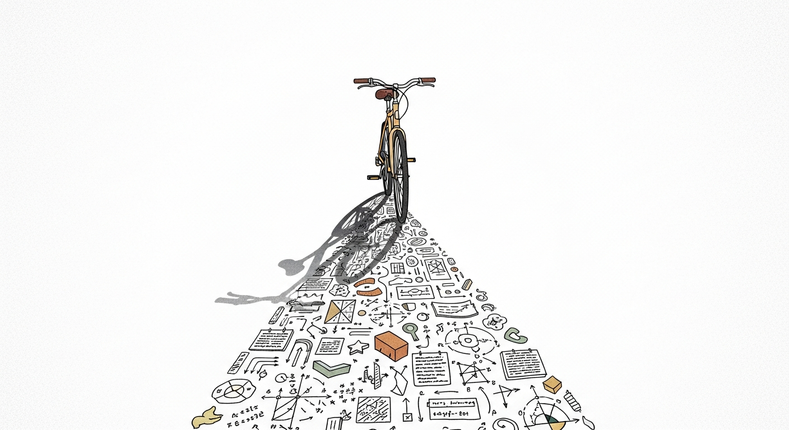

누군가에게 자전거 타는 법을 설명해 본 적이 있는가. 페달을 밟으라, 핸들을 잡으라, 균형을 잡으라 — 말로는 그럴듯하다. 하지만 이 설명을 듣고 자전거를 탈 수 있게 된 사람은 없다. 넘어지고, 다시 올라타고, 또 넘어지고, 어느 순간 몸이 알아서 균형을 잡기 시작할 때까지. 자전거를 타는 법은 말이 아니라 몸으로 배운다.

일하는 법도 마찬가지가 아닐까. 요즘은 "How는 쉽다"는 말이 당연한 것처럼 쓰인다. AI가 코드를 짜주고, 실행 비용이 거의 0에 수렴하는 시대니까. 하지만 정작 "당신은 일을 어떻게 하나요?"라고 물으면, 깔끔하게 대답할 수 있는 사람이 얼마나 될까. How가 정말로 쉽다면, 왜 우리는 그것을 설명하지 못하는 걸까.

## 자전거를 타는 법을 설명해 보라

PR 리뷰를 잘하는 시니어 엔지니어가 있다고 하자. 그 사람에게 "PR 리뷰를 어떻게 하세요?"라고 물으면, 보통 이런 대답이 돌아온다. "일단 전체 diff를 훑어보고, 변경 의도를 파악하고, 로직에 문제가 없는지 확인해요." 맞는 말이다. 하지만 이 설명을 그대로 따라 한다고 해서 같은 수준의 리뷰가 나오지는 않는다.

그 사람이 diff를 훑을 때 실제로 일어나는 일은 훨씬 복잡하다. 수백 줄의 변경 중 어디에서 멈추는지, 왜 그 지점이 걸리는지, "이건 나중에 문제가 될 것 같다"는 직감이 어디서 오는지 — 이런 것들은 당사자도 정확히 설명하지 못한다. 10년의 경험이 압축된 패턴 인식이 작동하고 있을 뿐이다.

자전거와 같다. 핸들을 몇 도 기울여야 좌회전이 되는지, 속도와 균형의 관계가 어떻게 되는지 — 탈 줄 아는 사람도 이걸 수치로 말하지 못한다. 몸이 아는 것과 입으로 설명할 수 있는 것 사이에는 넓은 간극이 있다.

## 절차 기억이라는 블랙박스

최근 AI 에이전트의 인지 구조를 분석한 [CoALA(Cognitive Architectures for Language Agents)](/Agentic-AI-논문-읽기-CoALA-언어-에이전트를-위한-인지-아키텍처/)라는 논문을 읽었다. 인간의 기억 체계를 빌려와 에이전트를 설계하는 프레임워크였는데, 기억을 네 가지로 나눈다. 지금 이 순간 쓰이는 정보를 담는 작업 기억, 과거 경험을 저장하는 일화 기억, 세계에 대한 사실을 보관하는 의미 기억, 그리고 "어떻게 하는지"를 담는 절차 기억.

흥미로운 건 절차 기억이 두 층으로 나뉜다는 점이었다.

첫째는 **명시적 절차 기억**이다. 매뉴얼, 체크리스트, 워크플로우 문서, 코드로 작성된 로직. "사용자가 가입하면 → 이메일 인증을 보내고 → 온보딩 화면을 띄운다" 같은 흐름이다. 이건 누구나 읽을 수 있고, 복사할 수 있고, 자동화할 수 있다.

둘째는 **암묵적 절차 기억**이다. AI로 비유하면 수십억 개의 파라미터에 압축된 가중치 — 언어를 다루는 법, 맥락을 읽는 법이 여기에 녹아 있지만, 꺼내서 들여다볼 수는 없다. 자전거 타는 법을 말로 설명하기 어렵듯, 이 가중치도 명시적으로 풀어쓸 수 없다.

사람에게도 마찬가지다. 시니어 엔지니어의 코드 리뷰 능력, 노련한 PM의 우선순위 감각, 경험 많은 디자이너의 "이건 아닌데" 하는 직감 — 이것들은 모두 암묵적 절차 기억이다. 노션 문서에도, 위키에도, 온보딩 자료에도 담기지 않는다. 당사자의 머릿속에만 존재하고, 당사자조차 온전히 꺼내지 못한다.

사람들이 "How는 쉽다"고 말할 때, 그들이 말하는 How는 첫 번째 층이다. 명시적 절차 기억, 즉 문서화되고 자동화 가능한 표면. 하지만 진짜 How — 일을 잘하게 만드는 그 핵심 — 은 두 번째 층에 있다.

## How를 쉽다고 말할 수 있는 조건

공정하게 말하자면, How가 정말로 쉬워지는 조건이 있긴 하다.

100년 전 프레더릭 테일러는 공장 노동자들의 작업을 관찰하면서 혁신적인 아이디어를 냈다. 하나의 작업을 가능한 한 작은 단위로 쪼개고, 각 단위를 표준화하고, 각 단위를 다른 사람에게 할당하라. 삽으로 석탄을 퍼 나르는 일을 "삽을 들어올리는 동작", "몸을 회전하는 동작", "석탄을 쏟는 동작"으로 분해하면, 각 동작의 How는 단순해진다. 누구나 배울 수 있고, 누구로든 대체할 수 있다.

이 논리는 오늘날에도 유효하다. 일을 충분히 작게 쪼개면, 각 조각의 How는 사소해진다. 소프트웨어 개발에서 마이크로서비스가 대형 모놀리스보다 각 부분의 이해를 쉽게 만드는 것도 같은 원리다. AI가 "How를 대신한다"는 것도 결국 이 맥락이다 — 충분히 분해된 작업의 명시적 절차를 자동화하는 것.

하지만 여기에 숨겨진 전제가 있다. **일이 그렇게 쪼개질 수 있어야 한다는 것**이다.

디자이너가 레이아웃을 결정할 때, 그 판단은 "왼쪽 정렬 → 여백 16px → 폰트 14pt"로 분해되지 않는다. 수백 번의 시행착오에서 축적된 미적 감각, 사용자의 시선 흐름에 대한 체감, "이 화면은 무언가 답답하다"는 느낌 — 이런 것들이 동시에 작동하면서 하나의 결정을 만들어낸다. 엔지니어가 시스템을 설계할 때도, 매니저가 회의에서 분위기를 읽을 때도 마찬가지다.

그 논문에서 흥미로운 문장을 발견했다. 에이전트는 빈 상태에서 태어나도 되지만, 절차 기억만은 비어 있으면 안 된다. 다른 기억 — 경험, 지식 — 은 나중에 채울 수 있지만, "어떻게 할 것인가"는 처음부터 주어져야 한다. 기계도 그런데, 하물며 사람의 How는 어떻겠는가.

## 말로 옮길 수 없는 것의 무게

철학자 마이클 폴라니는 이런 말을 남겼다. "우리는 말할 수 있는 것보다 더 많이 안다(We know more than we can tell)." 이것은 인간 지식의 결함이 아니라 특성이다. 전문성이 깊어질수록, 그 지식은 의식의 표면 아래로 가라앉는다. 더 잘 알게 될수록 덜 설명할 수 있게 되는 역설.

조직에서 이 현상은 매우 구체적인 결과를 낳는다. 시니어가 팀을 떠나면 무엇이 사라지는가. 그 사람이 작성한 문서는 남아 있다. 코드도, 위키도, 슬랙 히스토리도 남아 있다. 하지만 무언가가 분명히 사라진다. "그 사람이 있으면 이런 건 안 일어났을 텐데" 하는 상황이 늘어난다. 사라진 것은 의미 기억(문서화된 지식)이 아니라 암묵적 절차 기억 — 문서에는 없지만 그 사람의 판단에는 있던 것들이다.

AI의 맥락에서도 같은 한계가 드러난다. 회사의 모든 문서를 학습시키면 의미 기억은 복제할 수 있다. 모든 대화 기록을 넣으면 일화 기억도 흉내 낼 수 있다. 하지만 최고의 엔지니어가 "이 설계는 3개월 뒤에 문제가 될 것"이라고 느끼는 그 감각 — 이건 어떤 데이터에도 명시적으로 기록되어 있지 않다. 학습시킬 아티팩트 자체가 존재하지 않는다.

## How를 진짜로 아는 사람

레시피를 따르는 사람과 요리하는 사람의 차이를 생각해 보자. 둘 다 같은 요리를 만든다. 같은 재료, 같은 순서. 하지만 요리하는 사람은 소금을 넣기 전에 맛을 보고, 불 세기를 중간에 바꾸고, 재료가 없으면 다른 것으로 대체한다. 레시피를 따르는 사람은 그렇게 하지 못한다. 이탈하면 불안해지고, 대체하면 확신이 없어진다.

차이는 단계에 있지 않다. 단계와 단계 사이에 있다. 적힌 대로 하는 것은 명시적 절차 기억이고, 상황에 따라 적힌 것을 벗어나는 것이 암묵적 절차 기억이다.

소프트웨어에서도 같다. 주니어 엔지니어는 아키텍처 문서를 충실히 따른다. 시니어 엔지니어는 언제 그 문서를 어겨야 하는지 안다. "이 경우에는 원칙을 따르면 오히려 복잡해진다"는 판단, "지금은 기술 부채를 의도적으로 남기는 게 맞다"는 결정 — 이런 것들은 어떤 가이드라인에도 적혀 있지 않다. 그리고 이것이야말로 조직이 그 사람에게 기대하는 진짜 가치다.

그래서 멘토링, 페어 프로그래밍, 도제식 학습이 AI 시대에도 사라지지 않는 것이 아닐까. 명시적 절차 기억은 문서로 전달할 수 있다. 하지만 암묵적 절차 기억은 옆에서 보고, 따라 하고, 실패하고, 다시 시도하는 과정을 통해서만 전달된다. 자전거를 타는 법을 배우듯이.

어쩌면 우리가 "일 잘하는 사람"이라고 부르는 것의 실체는, 더 많은 What을 아는 사람도, 더 빠른 How를 가진 사람도 아닐 수 있다. 암묵적 절차 기억이 더 정교하게 축적된 사람 — 단계 사이의 판단이 더 촘촘한 사람 — 이 아닐까.

## 그런데 정말 그런 걸까

여기까지 쓰고 나서 스스로에게 반문해 본다. 설명할 수 없다는 것이 정말로 자동화할 수 없다는 뜻일까.

LLM을 생각해 보자. LLM은 자신의 가중치를 설명하지 못한다. 왜 이 단어 다음에 저 단어를 선택했는지 명시적으로 풀어쓸 수 없다. 하지만 그것이 LLM의 능력을 제한하지는 않는다. 오히려 설명할 수 없는 채로 놀라운 수준의 일을 해낸다. 설명 불가능성과 자동화 불가능성은 같은 것이 아니다.

그리고 더 불편한 질문이 있다. 내가 나의 How를 설명하지 못하는 이유가, 정말로 그것이 깊고 정교한 암묵지이기 때문일까. 혹시 그냥 대충 해왔기 때문은 아닐까. 자신의 일에 진지하게 임하지 않은 사람도 "어떻게 하는지 설명하기 어렵다"고 말한다. 숙련자의 설명 불가능과 미숙련자의 설명 불가능은 겉으로 구분이 안 된다.

매일 아침 같은 루트로 출근하는 사람에게 "왜 그 길로 가세요?"라고 물으면 "그냥요"라고 답할 수 있다. 이것은 수천 번의 경험에서 최적화된 암묵적 판단일 수도 있고, 한 번도 다른 길을 시도해 보지 않은 관성일 수도 있다. 둘 다 "설명할 수 없다"는 점에서는 동일하다.

그래서 "How는 어렵다"는 말은 조건부다. 자신의 How를 의식적으로 갈고닦아 온 사람에게만 해당된다. 설명할 수 없는 것의 무게는, 그 아래에 진짜로 쌓인 것이 있을 때만 무겁다. 없으면 그냥 빈 상자다.

## How를 쉽다고 말하기 전에

다시 자전거로 돌아오자. 자전거 타는 법에 대한 매뉴얼을 쓸 수 있다. 10페이지든 100페이지든. 모든 문장이 정확할 수 있다. 그리고 그 매뉴얼은 아무에게도 자전거를 가르치지 못할 것이다. 매뉴얼과 실제 라이딩 사이의 간극 — 그것이 How의 본질이다.

명시적 절차 기억과 암묵적 절차 기억. 문서화된 단계와 문서화할 수 없는 판단. 이 두 층을 구분하지 않으면, How에 대한 대화는 늘 엇갈린다. "How는 쉽다"고 말하는 사람은 첫 번째 층을 보고 있고, "How는 어렵다"고 느끼는 사람은 두 번째 층을 경험하고 있다. 둘 다 맞지만, 말하는 대상이 다르다.

How의 표면이 점점 자동화되고 있는 것은 사실이다. 그리고 그것은 좋은 일이다. 하지만 그 자동화가 진행될수록, 남는 것은 자동화할 수 없는 층이다. 단계를 실행하는 능력이 아니라, 단계를 설계하고, 변형하고, 때로는 무시하는 판단력. 그것이 점점 더 드러나고, 점점 더 중요해진다.

당신이 지금 하는 일의 How를 누군가에게 설명해 보라. 설명할 수 있는 부분은 조만간 자동화될 것이다. 설명할 수 없는 부분이 클수록, 당신이 쌓아온 것도 크다. 그것을 "쉽다"고 부르기 전에, 한 번쯤 그 무게를 재어볼 필요가 있지 않을까.
