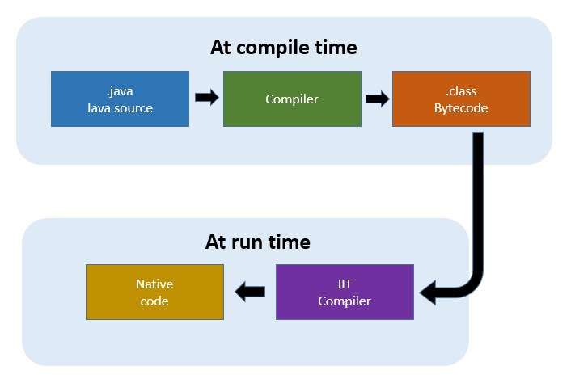
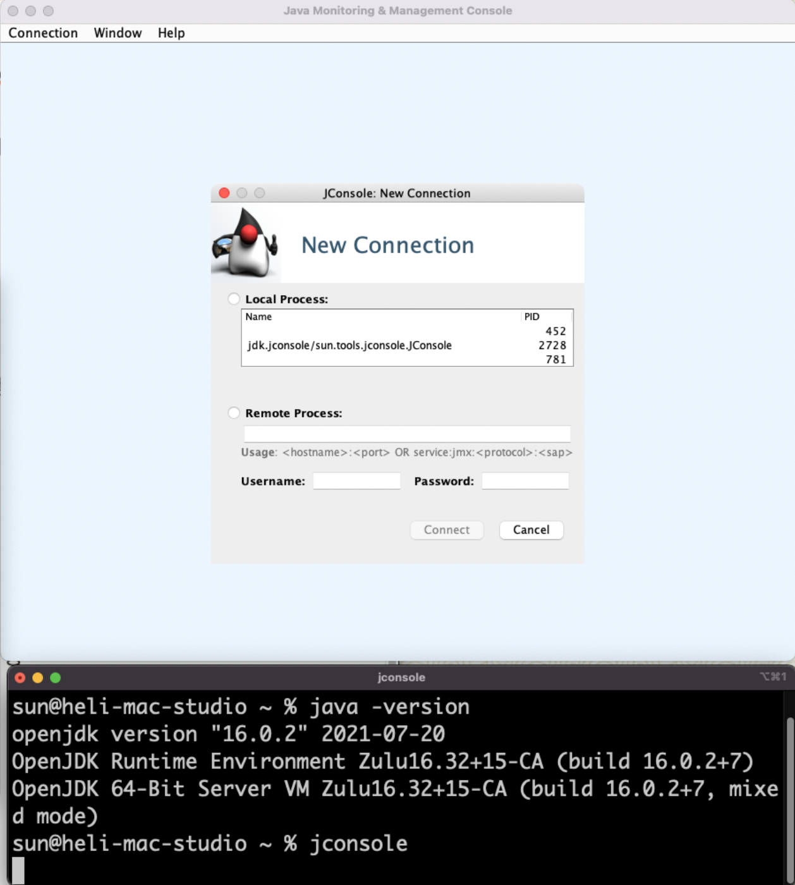

## 시작하며

프로그래머가 작성한 자바 소스 코드가 실제로 실행되기까지는 꽤나 복잡한 과정을 거치게 됩니다.
1. 자바 소스 코드를 바이트 코드로 변환
2. 변환된 바이트 코드를 JRE(Java Runtime Environment)에 적재
3. JRE는 실시간으로 런타임에 기계(컴퓨터)가 이해할 수 있는 형태로 변환 후 실행

1번은 javac를 이용한 '컴파일' 행위이며, 2번은 컴파일된 결과물(.jar)을 java 런타임으로 실행하는 것이며, 3번은 얼핏 보았을 땐 인터프리터의 동작 방식과 유사합니다.

이번 게시글에서는 자바 컴파일의 각 과정에 대해서 간략하게 다루어 보고 그 과정 속에서 컴파일러가 자체적으로 어떤 최적화를 하며, JVM Option으로 컴파일러를 최적화할 수 있는 몇 가지 방법에 대해 이야기합니다.

## Java Virtual Machine / Java Runtime Environment

우선 JVM, JRE이 등장하게 된 역사부터 살펴볼 필요가 있습니다. JAVA 이전에 등장한 C, C++ 같은 언어들은 컴파일 과정에서 어느 플랫폼(CPU Architecture)에서 실행할 것인지 명시해주고, 각 플랫폼에 최적화된 Native Code를 만들어내는 구조였습니다. 즉, 빌드 결과물은 특정 플랫폼에서만 실행 가능했다는 의미입니다.

하지만 이러한 방식은 여러 종류의 플랫폼이 등장하며 단점으로 대두되었습니다. 즉, 소프트웨어의 전파를 제한하고 사용자와 공급자 모두에게 번거로움을 가져다주는 단점이 있었던 것입니다. JAVA는 이러한 단점을 극복하고자 컴파일 과정에서 바이트 코드를 생성하고, 런타임에 각 플랫폼에 적합한 형태로 바이트 코드를 네이티브 코드로 변환하는 구조를 가지게 됩니다.

## Java Compiler at compile time

컴파일 타임의 자바 컴파일러, 즉 javac는 소스 코드(.java 파일)를 바이트 코드(.class 파일)로 만들고 .jar 같은 형태로 패키징 하는 컴파일러입니다. 이후 JVM은 런타임에 바이트 코드를 한 줄씩 읽어가며 네이티브 코드로 변환하는 인터프리터 방식으로 동작합니다.

## JIT Compiler at run time

하지만 매번 한 줄씩 읽으며 네이티브 코드로 변환하는 방식은 필연적으로 속도가 느릴 수밖에 없습니다. JIT 컴파일러는 자주 실행되는 코드 블록의 바이트 코드(.class 파일)를 네이티브 코드(binary code)로 컴파일해주는 역할을 합니다.

모든 바이트 코드를 일괄로 네이티브 코드로 컴파일할 수 있다면 좋겠지만 컴파일을 위해선 프로세서와 메모리를 사용해야 하고, 그 시간이 얼마나 걸릴지 장담할 수 없기 때문에 절충안으로 선택된 것이 JIT 컴파일러입니다.

만약 자바가 런타임 초기에 모든 바이트 코드를 일괄 컴파일하도록 되어 있고, 전체 컴파일에 1분이 걸린다면 사용자는 java 애플리케이션 실행 시 1분의 컴파일 타임을 대기하여야 합니다. 이는 자바 기반 웹 애플리케이션을 배포하는데도 그 정도 시간이 소요된다는 의미이기도 합니다.

이러한 이유로 JIT 컴파일러는 각 메서드마다 호출 카운트를 관리하고, 일정 횟수 이상 호출되면 just-in-time 컴파일을 수행합니다. 따라서 자주 사용되는 메서드는 런타임 직후 컴파일되며, 잘 사용되지 않는 메서드는 훨씬 나중에 컴파일되거나 전혀 컴파일되지 않습니다.

## JIT 컴파일 & 최적화

### Dynamic Lookup

```java
/* .... */
obj1.equals(obj2)
```

이 코드는 obj1의 타입에 따라 동작이 달라집니다. 그렇기 때문에 어떤 동작을 할지 Dynamic Lookup이 필요하며 Dynamic Lookup은 런타임에 해당 오브젝트의 타입을 결정하므로 매우 느립니다.

따라서 JVM은 이 코드가 실행될 때마다 obj1이 String이라는 것을 안다면, Dynamic Lookup을 하지 않고 String.equals 메서드를 호출하도록 컴파일합니다. (물론 100% 보장할 수 있다면 베스트이지만, 다른 타입에 올 가능성이 있기 때문에 가능성은 열어두고 컴파일합니다.)

### Code Cache

코드 캐시는 JIT 컴파일러에 의해 컴파일된 코드가 캐싱되는 저장 공간입니다. 캐시의 사이즈는 고정 크기이며, 가득 차면 JVM은 더 이상 코드를 컴파일할 수 없습니다. 즉, 컴파일되지 않은 많은 양의 코드가 인터프리터로 실행되어 느려지게 됩니다. 이 경우 JVM Warning이 발생하기는 하지만 이 로그를 체크하는 건 마냥 쉽지는 않습니다.

> 캐시 크기 조정 관련 JVM Option

`코드 캐시 최대 사이즈`

```java
-XX:ReservedCodeCacheSize=XXXXX (240m, 2g, 100k 등등)
```

`시작 시 코드 캐시 사이즈`

```java
-XX:InitialCodeCacheSize=XXXXX (240m, 2g, 100k 등등)
```

`Java Monitoring & Management Console`



JDK가 설치되어 있다면 `$ jconsole` 를 입력하여 힙 메모리, 코드 캐시 등을 모니터링할 수 있습니다

## 컴파일 임계치

앞서 JIT 컴파일러의 동작 기준이 '많이 사용되는 메서드'를 컴파일한다고 말했습니다. 여기서 '많이 사용되는'의 기준이 컴파일 임계치입니다.

컴파일 임계치는 메서드가 호출된 횟수(method entry counter) + 메서드 내 루프가 있다면 루프를 빠져나오기까지 실행된 횟수(back-edge loop counter)를 기반으로 측정하며, JVM은 지속적으로 두 카운터의 합계를 확인하고 메서드가 컴파일될 자격이 있는지 검증합니다. 만약 자격이 있다면 컴파일 큐에 추가됩니다.

### OSR; On-Stack Replacement

처음 실행된 메서드이지만, 루프가 정말 길다면 남은 반복을 빠르게 실행하기 위해 중간에 컴파일될 필요가 있습니다. 따라서 루프의 실행을 그때그때 카운트하고 임계치를 넘어가면 전체 메서드가 아닌 루프만을 따로 컴파일해서 컴파일된 버전을 실행합니다.

이렇게 스택상에서 컴파일된 버전을 바로 실행시키는 것을 OSR이라고 부릅니다.

`컴파일 임계치 변경 JVM Option`

```java
-XX:CompileThreadhold=N
```

컴파일 임계치를 지정하는 옵션으로 클라이언트 컴파일러에서 기본 값은 1,500이며 서버 컴파일러의 기본 값은 10,000입니다. JVM 튜닝에 있어 컴파일 임계치를 변경하는 것은 상당히 권고되는 최적화 방법입니다.

`Why?`
- 애플리케이션이 워밍업 하는데 필요한 시간을 절약할 수 있습니다.
  - 1만 번 실행되어서 컴파일될 코드는 8천 번으로 줄여도 큰 차이가 없기 때문입니다.
- 절대로 컴파일되지 않을 일부 서버 메서드를 컴파일할 수 있습니다.
  - 컴파일 임계치에 가까이 있지만, 아슬아슬하게 걸쳐서 컴파일되지 않는 것들을 컴파일해 실행 속도를 높일 수 있습니다.

## 마무리

컴파일 임계치와 관련된 카운터 값은 최근 기간에 대한 상대적 측정값입니다. 따라서 긴 시간에 걸쳐서 많이 호출되는 메서드(lukewarm method)는 카운터 값이 낮을 수밖에 없습니다. 컴파일러 최적화를 고려하고 있다면 컴파일 임계치를 낮추고, 그에 따라 코드 캐시의 크기를 늘리는 방식을 선제적으로 간단하게 적용해볼 수 있을 것입니다.