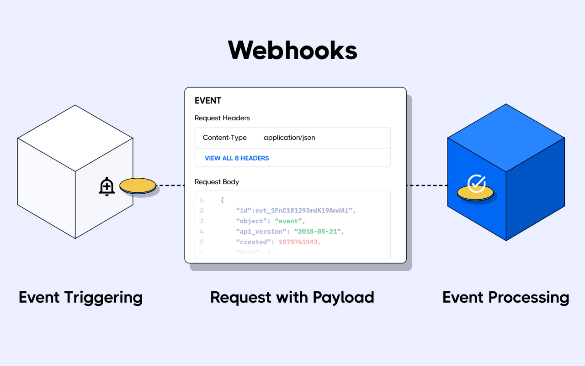

## 들어서며

최근 Webhooks 시스템을 구성하기 위해 필요한 요소를 짤막하게 고민해볼 기회가 생겨, 그때 고민해본 내용을 공유해보고자 합니다.

많은 분들이 웹훅 시스템을 구성한다고 하면 애플리케이션 시스템 아키텍처보다는 인프라 측면의 보안적인 요소에 많은 관심을 가지실 것입니다. 그래서 이번 게시글도 보안에 대한 부분을 메인으로 다루어보겠습니다.

보안과 관련된 내용은 기존 경험에 의한 생각, 웹훅 서비스를 제공하고 있는 서비스 벤치마킹 그리고 네이버와 센드버드에서 보안 업종에 종사하고 있으신 분에게 조언받아 작성하였습니다. 🙂

## 시스템 체크리스트(보안)

### 1. 통신 암호화

100% 신뢰할 수 있으며 통제할 수 있는 내부 시스템이 아닌 이상 통신 암호화는 필수요소라고 말할 수 있습니다. HTTP 통신을 한다면 HTTPS는 필수입니다. 벤치마킹해보니 일부 웹훅 서비스는 수신 측에서 HTTPS가 아니라면 웹훅 자체를 발송해주지 않는 서비스도 존재하고 있었습니다.

### 2. 데이터 서명

데이터 서명의 경우 하면 좋은데, 수신 측과 발신 측 모두 약간의 번거로움이 생길 수 있는 기능입니다. 하지만 그와 동시에 이상적 시스템을 위해선 꼭 적용해야 하는 부분이기도 합니다.

막상 데이터 서명 기능을 제공하더라도 사용자에 따라 서명을 귀찮아하거나 검증을 위한 컴퓨팅 리소스 할애 등을 이유로 평문으로 데이터를 전달 받기 원하는 경우가 있을 수도 있습니다. 이 부분은 시스템을 구성하는 데 있어 고려해볼 만한 부분인 것 같습니다.

만약 데이터 서명을 선택적 기능으로 제공한다면 '기능은 제공하지만, 사용자가 안전하게 사용하지 않는 것'이라는 책임 회피/전가 즉, Shared Responsibility 구조를 가지게 됩니다. 이는 많은 소프트웨어와 정책, 사업 등에서 채택하고 있는 방법이고 웹훅을 정말 적극적으로 제공하는 깃헙 또한 데이터 서명을 선택적 기능으로 제공하고 있습니다.

[https://docs.github.com/en/developers/webhooks-and-events/webhooks/securing-your-webhooks](https://docs.github.com/en/developers/webhooks-and-events/webhooks/securing-your-webhooks)

### 3. 신뢰할 수 있는 발신처 제공

웹훅을 수신하는 입장에서 생각해볼 때, 우리가 수신한 웹훅이 정말 신뢰할 수 있는 시스템이 보낸 제대로 된 데이터일까? 라는 부분은 정말 중요한 요소입니다. 통신을 암호화하고, 데이터를 서명하였더라도 그때 사용하는 인증서나 키가 노출된다면 무용지물입니다.

'웹훅을 보낸 발신처를 신뢰할 수 있는가?'를 판단할 수 있는 가장 대표적 지표는 웹훅을 발신한 시스템이 '누구'인가입니다. 그렇다면 '누구'는 어떻게 식별할 수 있을까요? 방법은 L7에서 확인하거나 L3에서 확인하는 등 다양하겠지만, 가장 쉽고 널리 사용되는 방법은 웹훅 발신 시스템의 IP를 우리 네트워크에 화이트 리스트로 등록하여 L3에서 발신처를 검증하는 방식입니다.

### 4. 수신처의 제한

웹훅을 발신하는 입장에서 고민해보아야 하는 부분도 존재합니다. 일반적으로 외부에서 알기는 어렵겠지만 만약 내부에서만 호출 가능한 내부 서버(서버 애플리케이션, nginx, redis 등) 킬 스위치 같은 API가 있다면, 사용자가 웹훅 대상 URL을 해당 킬 스위치 API로 지정하였을 때 문제가 발생할 수 있습니다. 서버 자체를 킬 하는 스위치가 아니더라도 액츄에이터 재시작 엔드포인트정도는 쉽게 유추할 수 있기 때문에 유의해야만 합니다.

이런 부분을 방지하기 위해선 웹훅을 발송할 때 수신측이 내부망 대역의 IP라면 발송하지 않게끔 해야하며, 30x 리디렉션의 목적지가 내부망이라면 무시하는 등의 보안 조치가 필요합니다.

## 마무리

보안 측면의 체크리스트를 정리해보자면 결국 모든 통신은 신뢰할 수 있어야 한다는 것으로 귀결됩니다. 이는 수신 측 웹훅 URL은 어떠한 경로로든 외부에 노출될 가능성(내부 직원의 실수, 웹훅 발신 시스템 해킹 등)이 존재한다는 것을 전제로 하고 있기도 합니다.

만약 HTTPS 통신을 하고 있으며, 신뢰할 수 있는 웹훅 발신 시스템의 IP만 허용했다면 100% 안전한 시스템일까요? 그렇지 않습니다. 웹훅 발신 시스템이 해킹당하여 해커가 curl을 이용해 여러 수신처에게 요청을 보낸다면 어떻게 될까요? 웹훅을 수신한 시스템들은 '신뢰할 수 있는 시스템'의 요청이기 때문에 이를 신뢰하게 됩니다.

만약 데이터를 서명했다면 서명에 사용되는 키가 유실되지 않는 이상 문제가 발생할 가능성을 줄일 수 있습니다.

보안 조치라는건 결국 시스템이 취약해질 가능성을 줄이는 행위입니다. 그렇기에 우리는 항상 그 가능성을 줄이기 위해 노력하고 있는게 아닐까 싶습니다.