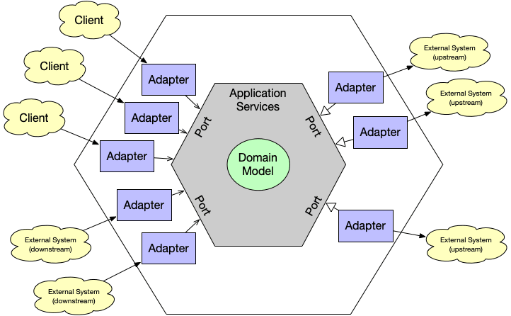
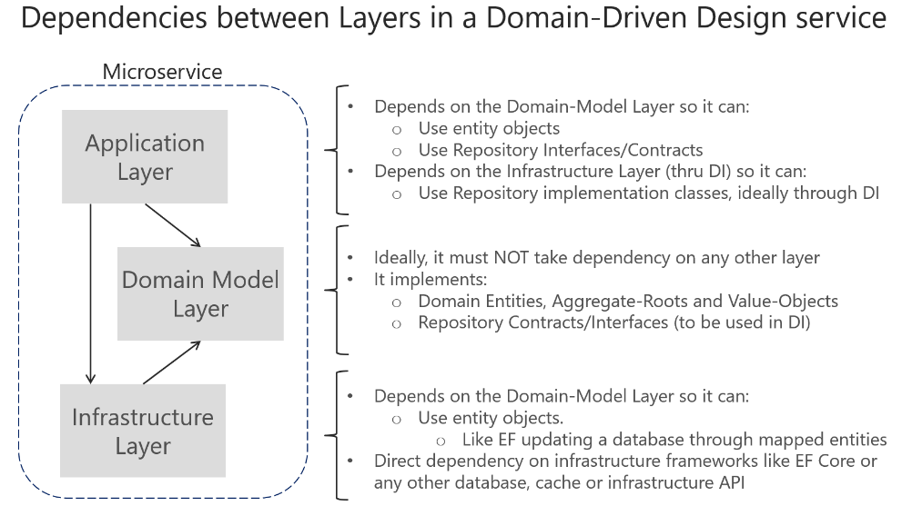
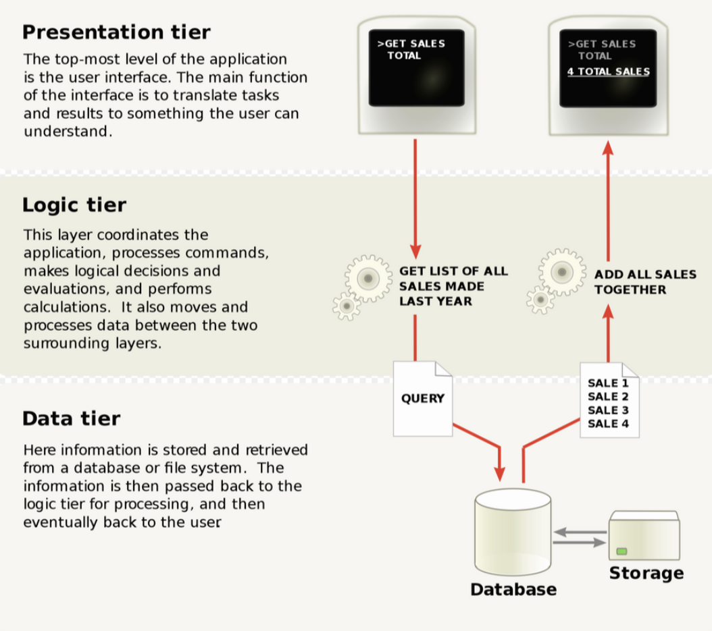
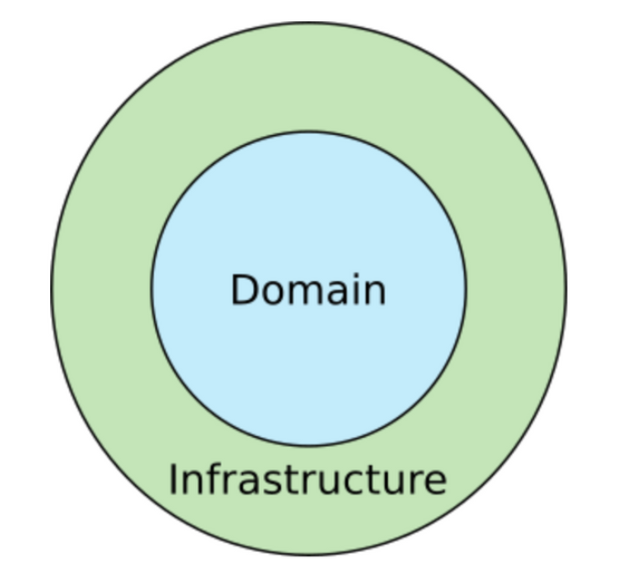
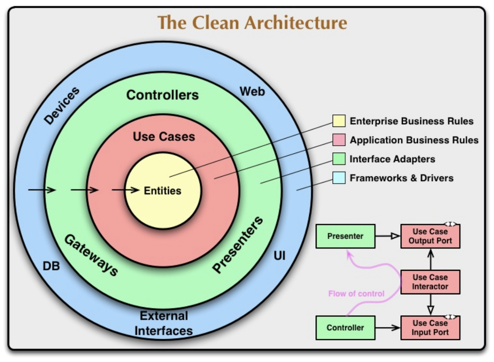

어느 순간부터 소프트웨어 개발 세계에서는 도메인 주도 설계, 클린 아키텍처라는 용어가 사용 되기 시작했습니다. 이것들은 도대체 어떤 것이며, 왜 등장하게 됐을까요?

## 도메인 주도 설계(Domain-Driven Design)

> 소프트웨어의 본질은 해당 소프트웨어의 사용자를 위해 도메인에 관련된 문제를 해결하는 능력에 있다

### DDD와 객체지향

도메인 주도 설계를 보다 잘 이해하고 적용하기 위해선 객체지향에 대한 이해가 필요합니다. 객체지향의 본질과 핵심은 뭘까요? 저는 객체 그 자체라고 생각합니다. 객체지향이라는 것은 결국 각 객체간 역할을 명확히 가져가고, 각 객체간에 메시지를 주고 받는 형태의 프로그래밍 방법론이라 생각하기 때문인데요.

그렇다면 객체지향 프로그래밍에서 사용되는 이 객체들은 어떻게 추려낼 수 있을까요? 이 객체가 필요한지 어떻게 알 수 있을까요? 어떻게 하면 이 객체들이 서로 상호작용할 수 있을까요?

여러 방법이 있을 수 있겠지만, 이를 해결해줄 수 있는 것이 `도메인 주도 설계`입니다.

### Focus on Domain

여기서 도메인은 실세계에서 발생할 수 있는 사건 그 자체라고 생각하면 쉽습니다. 간편결제 서비스를 예로 들어볼까요?

서비스에서 사용되는 포인트를 충전하기 위한 충전 도메인(Charge Domain)이 있을 수 있고, 이렇게 충전된 포인트로 결제를 수행하는 결제 도메인(Payment Domain)이 있을 수 있습니다. 그리고 각 도메인에는 이를 구현하기 위한 여러 객체가 필요하게됩니다.

- 충전 도메인: 포인트, 고객, 충전 수단, ...
- 결제 도메인: 포인트, 고객, 결제 상품, ...

잘 보면 서로 다른 도메인이지만 같은 객체(포인트, 고객)가 존재하는데요. 이는 같은 객체가 여러 개 존재할 수 있다는 도메인 주도 설계의 특징 중 하나입니다. 같은 객체이지만, 그 객체가 속한 도메인의 문맥(Context)에 따라 각 객체의 역할과 책임이 크게 바뀌게 되는 것이지요.

그래서 이러한 객체들은 외부로 노출시키지 않고, 내부에서만 알 수 있게 합니다. 다른 도메인에서는 알 필요가 없으니까요.

즉, 이는 서로 다른 도메인 영역에 영향을 끼치기 위해서는 API를 이용해야 한다는 말이기도 한데요. 이를 통해 각각의 도메인은 서로 철저히 분리되고, `높은 응집력과 낮은 결합도`로 `변경과 확장에 용이한 구조`를 얻게됩니다.

그리고 DDD를 실제로 구현할 때에는 크게 3가지 Layer로 구분하는 것이 핵심입니다.

- Application Layer: 주로 도메인과 Repository를 바탕으로 실제 서비스(API)를 제공하는 계층
- Domain Model Layer: Entity를 활용해 도메인 로직(비즈니스 로직)이 수행되는 계층
- Infrastructure Layer: 외부와 통신(RDBMS, Redis, HttpClient, ...)을 담당하는 계층

결국 각 도메인을 분리하고, 그 도메인을 위와 같은 Layer로 철저히 분리해서 만드는 것이 DDD라 볼 수 있습니다.

## Introduce Clean Architecture

Clean Architecture는 Robert C Martin(Uncle Bob)이 블로그에 기재하면서 화제가 되었었는데요.

Clean Architecture에 대해서 이해하기 위해선 두 가지 개념을 이해하고 있어야 합니다.

- Business Rule
- System Architecture

### What is Business Rule?

Business Rule(Logic)은 컴퓨터 프로그램에서 데이터를 생성, 표시, 저장, 변경하는 부분을 일컫습니다. (=domain logic)

Business Rule(Logic)은 유저의 입력(UI)과 DB 사이에서 발생한 정보 교환을 위한 특정 알고리즘이나 규칙이 정의된 tier를 의미합니다.

이러한 Rule(Logic)은 고객의 요구에 따라 변경될 수 있기 때문에 별도의 tier에 배치되어야 합니다. 만약 다른 역할을 하는 tier와 함께 존재한다면, 고객의 요구에 따라 변경해야하는 부분이 많아질 수 밖에 없기 때문입니다.

### What is System Architecture?

System Architecture는 시스템의 구조(structure), 행위(behavior), 뷰(views)를 정의하는 개념적인 모델입니다.

즉, 시스템의 목적을 달성하기 위해 각 컴포넌트가 어떻게 상호작용하고 정보가 어떻게 교환되는 지를 정의하고 있습니다.

세상에는 정말 다양한 시스템 아키텍처들이 나왔지만 결국 그들의 목적은 하나로 귀결됩니다.

### 관심사의 분리

소프트웨어를 계층으로 나누게 되면 관심사를 분리할 수 있습니다. 그리고 관심사 분리에 목적을 가진 시스템 아키텍처는 최종적으로 다음과 같은 구조를 지니게 됩니다.

- 프레임워크 독립적
  - 라이브러리 존재 여부나 프레임워크에 한정적이지 않아 도구로써 사용하는 것이 가능합니다
- 테스트 용이
  - Business Rule은 UI, DB, Web Server 등 기타 외부 요인과 관계없이 테스트 가능합니다
- UI 독립적
  - 시스템의 다른 부분을 고려하지 않고 UI를 변경할 수 있습니다
- Database 독립적
  - Business Rule에 얽매이지 않고 Database를 독립적으로 변경할 수 있습니다(SQL, Mongo, CouchDB 등)
- 외부 기능 독립적
  - Business Rule은 외부 상황(DB, UI)이 변하더라도 영향을 받지 않습니다

Uncle Bob은 이러한 특징을 가지는 Architecture 들에 대한 총 정리로 Clean Architecture를 내세운 것인데요.

## Overall Clean Architecture

먼저 간단한 그림부터 살펴보겠습니다.

### Domain

Domain Layer는 Business Rule이 존재하는 영역입니다. 번역앱은 번역을 하고, 결제 앱은 결제를 수행합니다. 이렇듯 비즈니스의 본질은 쉽게 바뀌지 않으므로 Business Rule은 잘 변하지 않는 안정된 영역입니다.

### Infrastructure

Infrastructure Layer는 UI, Database, Web APIs, Frameworks 등이 존재하는 영역입니다. 이는 Domain에 비하여 자주, 쉽게 바뀔 수 있습니다. 예를 들어 다른 사용자에게 송금을 한다고 가정해봅시다. 송금을 위한 버튼의 형태는 쉽게 바뀔 수 있지만 송금 방법 (Business Rule)은 그렇지 않습니다.

Uncle Bob은 이렇게 경계를 두어 각 Layer를 분리하고, 관심사를 분리하는 규칙을 의존성 규칙(Dependency Rule)으로 설명했습니다.

### Dependency Rule

> 모든 소스코드 의존성은 반드시 outer에서 inner로, 고수준 정책을 향해야 한다

Dependency Rule은 Business Logic을 담당하는 코드들이 DB 또는 Web 같이 구체적인 세부사항에 의존하지 않고 독립적으로 실행되어야 한다는 규칙입니다.

다시 이 그림으로 돌아와보겠습니다.

Dependency Rule에 따르면 inner circle에 해당하는 Domain은 outer circle에 해당하는 Infrastructure에 대해서 아무것도 모릅니다. 이는 UI, DB는 Business Rule에 의존하지만 Business Rule은 그렇지 않다는 것을 의미합니다.

UI가 웹이건 모바일이건, DB가 SQL이건 NoSQL이건 Business Rule 입장에선 아무런 관계가 없습니다.

## The Clean Architecture

위의 그림을 더 자세히 들여다 보겠습니다.

`Domain`이 `Entities`, `Use Cases`로 세분화 되었고, `Adapter`가 새로 생겨 `Domain`과 `Infrastructure` 사이의 경계를 관리합니다.

이 그림 또한 마찬가지로 **Dependency Rule**에 따라 동작하여 outer에서 inner로 의존성을 가지게 됩니다.

### Entity

Entity는 애플리케이션에서 핵심적인 기능인 Business Rule을 담고 있습니다.

다른 사람에게 돈을 보내는데, 같은 은행으로 보내면 수수료가 면제된다고 가정해 보겠습니다. 모바일 앱에서 돈을 보내던 PC 웹에서 돈을 보내던 같은 은행으로 보내면 수수료가 면제된다는 사실은 변하지 않습니다.

같은 은행이면 수수료가 면제된다는 규칙(Business Rule)은 외부 상황(outer layer)을 전혀 모릅니다.

즉, Entity들은 outer layer들에 속한 다른 class나 component들을 전혀 모르고 신경쓰지 않아도 됩니다.

### Use Cases

Use Cases는 특정 application에 대한 Business Rule입니다. Use Cases는 시스템이 어떻게 자동화 될 것인지에 대해 정의하고 application의 행위를 결정합니다. 다시 말해, 프로젝트 레벨의 Business Rules(Entities)을 사용하여 Use cases의 목적을 달성합니다.

계좌 송금을 하기 위한 Use cases의 예시는 다음과 같습니다.

`[계좌 송금]`

- 입력: 수취인 계좌번호, 수취인 은행, 송금 금액
- 출력: 송금 성공 여부
- 적용되는 Business Rule
  - 계좌번호의 양식은 유효해야 한다
  - 해당 계좌가 돈을 수취할 수 있는 유효한 상태여야 한다
  - 송금 금액은 1회에 1천만원까지만 허용된다
  - ....

Use Cases는 Entities에 의존하는 동시에 상호작용합니다. 물론 outer layer에 대해서는 아는게 없습니다. 다만 이 계층에서는 outer layer에서 사용할 수 있는 abstract class나 interface를 정의합니다.

### Adapters

Adapters는 domain과 interfaces 사이의 번역기 역할을 수행합니다.

예를 들어 GUI로부터 input data를 받아 Use cases와 Entities 에게 편리한 형태로 repackage 하고, Use cases와 Entities의 output을 가져와 GUI에 표시하거나 DB에 저장하기 편리한 형식으로 repackage 합니다.

Adapters는 GUI의 MVC 아키텍처를 완전히 내포하며, Presenter, View, Controller 가 모두 여기에 속합니다.

### Infrastructure

Infrastructure는 모든 I/O components(UI, DB, Frameworks, Devices)가 있는 영역입니다.

이는 변화될 가능성이 매우 높기 때문에 stable 한 domain과는 확실히 분리가 되어 있고, 그렇기 때문에 비교적 쉽게 변화되고 component 또한 쉽게 교환됩니다.

### Conclusion

결국 Clean Architecture는 다음과 같은 이점이 있다고 정의내립니다.

- 의존성 규칙에 따름으로써 관심사가 분리된다
- 본질적으로 테스트하기 쉬운 시스템을 만들 수 있다
- 의존성 규칙이 가져오는 이점을 가져올 수 있다

그리고 주요한 이러한 특징을 지닙니다.

- 같은 상황과 이유로 변경되는 Class들은 Components로 묶인다
- Business Rule은 stable한 components로, 변경되기 쉬운 외부의 infrastructure components (UI, DB, web, frameworks, ... )를 알지 못한다
- 각 components layer 간의 경계는 adapter 인터페이스를 통해 관리된다
- Adapter는 Layer 간의 데이터를 편한 형태로 변환시켜주고 더 stable한 inner components로 의존성을 가지도록 한다

## Hexagonal Architecture

> 그럼 헥사고날 아키텍처는 무엇이고, 왜 쓰이는걸까요?

`인프라` ← `서비스` ← `프레젠테이션`의 방향으로 의존성이 설계된 MVC 아키텍쳐에서는 인프라의 변화가 곧 뷰의 변화로 이어지기 쉽습니다. 하지만 웹서비스에서의 핵심은 인프라가 아니라 실제 비즈니스 로직이 수행되는 서비스 계층, 더욱 정확하게는 개발팀의 의사소통 단위가 되는 도메인 객체들입니다.

도메인 객체들은 근본적으로 서비스가 지니는 바운디드 컨텍스트 안에서 독립적인 로직을 가지고 있습니다. 영속성 계층, 혹은 메시지 큐와 같은 인프라는 결국 이러한 도메인의 상태를 저장하거나 전달하기 위해 존재할 뿐입니다. 즉, 도메인 객체들은 인프라에 의존하지 않아야 한다는 것입니다.

그렇기 때문에 헥사고날 아키텍처는 의존의 방향이 레이어드 아키텍처와 다릅니다.

클린 아키텍처와 마찬가지로 어디에도 의존하지 않는 도메인 객체들이 존재하고, 이들에 의존하는 서비스계층(또는 usecase 계층)이 존재합니다. 서비스계층에서 수행되는 비즈니스 로직들은 외부와 연결된 포트를 통해 시스템 외부로 전달되며 인프라는 포트에 의존합니다.

한 마디로, 외부와의 통신을 인터페이스로 추상화하여 비즈니스 로직 안에 외부 코드나 로직의 주입을 막는다는 것이 헥사고날 아키텍처의 핵심입니다.

### 주요 컴포넌트

#### Adapter

포트를 통해 인프라와 실제로 연결하는 부분을 담당하는 구현체를 의미합니다. Adapter는 크게 두 종류로 구분됩니다.

`Driving Adapter(Primary Adapter)`

- 사용자의 요청을 받아들일 때 사용되는 Adapter
- 예시: AWS Lambda의 Handler, WebApplication의 Controller

`Driven Adapter(Secondary Adapter)`

- 도메인 모델의 처리에 사용되는 Adapter
- 예시: MessageQueue, Persistence Adapter

#### Port

서비스(또는 usecase)에 어댑터에 대한 명세(specification)만을 제공하는 계층을 의미합니다. 단순히 인터페이스 정의만 존재하며, DI를 위해 사용됩니다.

#### Application Service(usecase)

어댑터를 주입 받아 도메인 모델과 어댑터를 적절히 오케스트레이션하는 계층을 의미합니다. 예를들어 게시글 작성이라는 usecase는 그에 필요한 Adapter를 주입받고 게시글 도메인 모델을 적절히 제어하는 로직을 지닙니다.

#### Domain Model

DDD의 도메인 모델과 동일한 개념을 지닌 계층입니다. 비즈니스 로직이라 부르는 엔티티에 대한 변경은 모두 해당 계층에서만 실행됩니다.

원칙적으로는 어떠한 의존성도 없어야 하지만 Entity를 만들 때 Database에 적재되어 있는 데이터를 참고해야하는 경우와 같은 상황에서는 Port를 이용해 Adapter를 주입받아서 사용할 수 있다는 예외사항이 존재하기도 합니다. 이는 클린 아키텍처와 동일합니다.

## Why DDD, Clean Architecture and Hexagonal ?

그래서 DDD, Clean Architecture, Hexagonal Architecture에서 중요한건 뭘까요? 바로 `명확한 관심사의 분리` 입니다.

외부와의 연결에 문제가 생기면 `Adapter`를 확인하면 될 것이고, 인터페이스의 정의를 변경하고자 한다면 `Port`를 확인하면 됩니다. 처리 중간에 Custom Metric 측정을 위해 Event Bridge에 이벤트를 보내거나 트레이스를 로그를 심고 싶다면 `Service(usecase)`를 확인하면 됩니다.

마지막으로 비즈니스 로직이 제대로 동작하지 않는다면 Domain Model만 확인하면 되는 것이지요.

이러한 구조는 결국 쉬운 테스트를 가능하게 해주기도 합니다. 본인의 역할을 수행하기 위해 필요한 Port만 모킹하여 테스트를 쉽게 수행할 수 있습니다.

## Is Hexagonal Superior to MVC?

꼭 그렇다고만은 볼 수 없습니다. 아키텍처란 코드를 표현하는 방법 중 하나일뿐 그 자체로 우월성을 가질수는 없습니다. 도메인이 외부에 닫힌 정도에 따라서 MVC와 같은 단순한 구조가 더 좋을 수도 있습니다.

더욱 중요한 것은 깨진 창문을 만들지 않거나, 만들더라도 빨리 고치는 것입니다. 헥사고날에서 발생하는 가장 대표적인 깨진 창문을 하나 언급하고 싶습니다.

네이밍이 모호한 포트는 구현체의 의존성을 과도하게 많거나 적게 만듭니다. 포트의 이름이 너무 범용적일 경우에는 이런저런 외부 네트워크 콜이 구현체 로직에 포함되게 되는데 외부 의존성이 늘어날수록 코드의 로직은 깨지기 쉽고 유지보수하기 어려워집니다.

코드의 로직이 뚱뚱해지면서 선뜻 건들기 어려워진 코드가 탄생할 것이고 이는 결국 생산성 저하로 이어지게 됩니다. 반대로 포트의 이름이 너무 지엽적일 경우에는 보일러플레이트의 양이 과도하게 많아지게 됩니다. 의존성이 적다는 점에서 SRP를 그나마 잘 구현했다고 느낄 수 있겠지만, 현실 세계의 개발에서는 개발 속도 또한 무시할 수 없고, 지나치게 많은 코드는 서비스의 오류지점과 유지보수 비용을 늘린다는 점에서 생산성의 저하로 이어지게 됩니다.

도메인에 따라서 MVC로 작성한 코드가 거대한 레거시 덩어리로 느껴질 수도 있습니다. 하지만 그럼에도 불구하고 아키텍처 그 자체보다는 코드가 지니는 가치와 생산성에 집중해야만 합니다. 방식이 다를 뿐, 틀린 것은 아닙니다. 이를 얼마나 잘 타협하면서 의존성의 크기를 잘 조절하는지도 정말 중요합니다.

## Appendix

- [https://blog.cleancoder.com/uncle-bob/2012/08/13/the-clean-architecture.html](https://blog.cleancoder.com/uncle-bob/2012/08/13/the-clean-architecture.html)
- [https://github.com/Gummybearr/random-kata/tree/main/kotlin/simple-hexagonal](https://github.com/Gummybearr/random-kata/tree/main/kotlin/simple-hexagonal)
- [https://github.com/thombergs/buckpal](https://github.com/thombergs/buckpal)