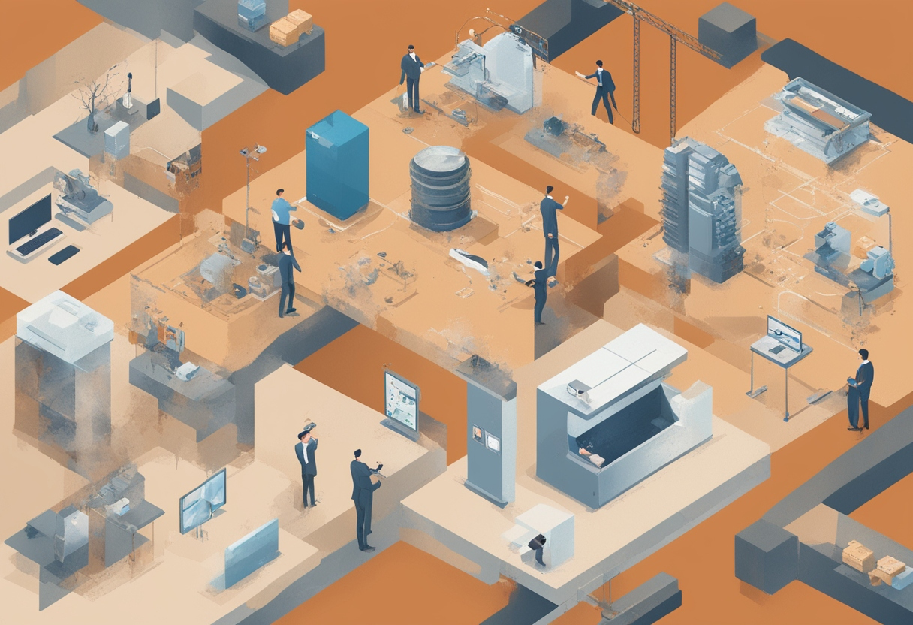

제가 엔지니어로서 경험했던 B2C와 B2B 환경은 각기 다른 매력과 도전이 있었는데요. 이번 글에서는 제 경험을 바탕으로 두 환경의 차이점과 각각의 장단점에 대해 이야기해보려 합니다.

## B2B의 매력: 고객과의 긴밀한 관계

B2B와 B2C는 각자 매력이 있지만, 저는 B2B를 훨씬 더 좋아하는 편입니다. B2B 환경에서는 고객과 더 가까이서 깊은 이야기를 나눌 수 있기 때문인데요. 직접 고객의 목소리(VoC)를 들으며, 실제 임팩트를 산정하고 우선순위를 결정하는 과정에 참여할 기회가 많습니다. 이런 측면에서 B2C보다 B2B에서 더 재미있게 일할 수 있었습니다.

어떤 분들은 이 글을 읽고, B2B가 고객 이야기 듣기 더 어려운 것 아닌지 생각하실 수 있습니다. 하지만 `심층 고객 인터뷰`를 비롯해 더 깊은 이야기를 나누기 용이하고, 개인을 넘어 조직과 회사 전체에 영향을 주는 제품을 만들다 보니 복잡성이 훨씬 증가합니다. 이런 복잡성 속에서 문제를 더 구체화하고 풀어나가는 과정이 꽤나 즐겁습니다.

## 복잡한 조직 설득이라는 도전

B2B 제품 개발에서 또 흥미로웠던 점은 복잡한 이해관계를 가진 조직을 설득하기 위한 제품을 어떻게 만들지 고민하는 과정입니다. B2B 제품은 여러 부서와 다양한 의사결정자들을 만족시켜야 하므로, 제품 설계가 더 복잡해질 수 있습니다. 이러한 복잡성이 오히려 저에게는 흥미로운 도전으로 다가왔습니다.

## B2B 회사 내에서도 플랫폼 조직 선호

흥미롭게도 제가 B2C 서비스 회사에서 일할 때도, 대고객용 앞단 서비스 조직보다는 뒷단 플랫폼 조직에서 일하는 것을 더 즐겼습니다. 그 이유는 일반적으로 플랫폼 조직이 릴리즈하는 경우 정말 많은 사이드 이펙트가 발생할 수 있고, 심지어는 데이터의 정합성 자체가 깨질 수 있기에 문제 하나하나 깊게 고민해보고, 최고의 선택을 해야만 하기 때문이었습니다.

## 다양한 경험의 중요성

제 생각에는 B2C와 B2B 모두 두루두루 경험해보는 것이 좋습니다. `지금 무얼 해보고 싶은가`라는 기준은 계속 바뀔 테니, 그 기준이나 생각이 바뀔 때 즈음이 새로운 도전을 시작하기 좋은 시점이 아닐까 싶습니다.

## 결론

엔지니어링 환경은 B2C와 B2B 모두 각자의 매력과 도전이 있습니다. 개인적으로는 B2B 환경이 제 성향과 더 잘 맞았지만, 이는 개인의 선호도와 목표에 따라 달라질 수 있습니다. 중요한 것은 다양한 경험을 통해 자신에게 맞는 환경을 찾아가는 과정이라고 생각합니다.
