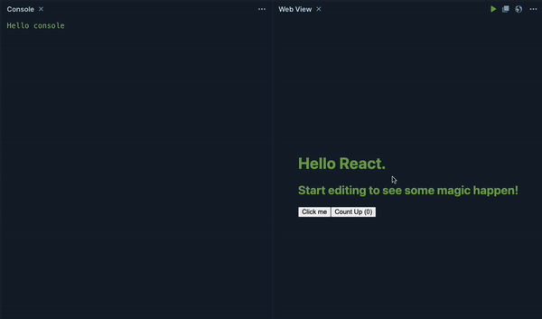
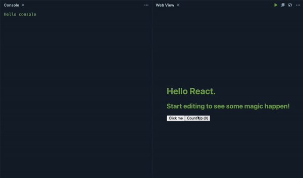

React의 `useCallback` 함수는 함수를 캐싱하여 불필요한 리렌더링을 방지하고, 성능을 최적화하는 데 도움을 주는 훅(Hook)입니다. 일종의 `함수 캐싱`이라고 볼 수도 있는데요. 이를 순수 자바스크립트로 구현한다면 어떻게 만들 수 있을까요?

우선 어떤 구성 요소가 필요할지 고민이 필요합니다. 간단하게 생각해 봤을 때는 아래와 같은 요소가 필요할 것으로 보입니다.

1. 함수를 캐싱하기 위하여 기존 함수를 저장하는 변수
2. 기존 의존성 배열의 값을 저장하는 변수
3. 함수를 처음 호출하는지 검사하는 함수
4. 의존성 배열이 변경되었는지 검사하는 함수
5. 새로운 함수와 의존성을 캐싱하는 함수

단계별로 쪼개어 다루어보겠습니다.

## 1. 함수를 캐싱하기 위하여 기존 함수를 저장하는 변수

```javascript
let cachedFunction = null;
```

## 2. 기존 의존성 배열의 값을 저장하는 변수

```javascript
let cachedDependencies = null;
```

## 3. 함수를 처음 호출하는지 검사하는 함수

```javascript
function verifyInitialCall(cachedFunction) {
    return cachedFunction === null;
    // or
    return !cachedFunction;
}
```

## 4. 의존성 배열이 변경되었는지 검사하는 함수

```javascript
function dependenciesAreEquals(arr1, arr2) {
  if (arr1 === arr2) {
    return true;
  }
  
  if (arr1.length !== arr2.length) {
    return false;
  }
  
  for (let i = 0; i < arr1.length; i++) {
    if (arr1[i] !== arr2[i]) {
      return false;
    }
  }
  
  return true;
}

// 사용 예시
if (!dependenciesAreEquals(cachedDependencies, dependencies)) {
    // ...
}
```

## 5. 새로운 함수와 의존성을 캐싱하는 함수

```javascript
cachedFunction = func;
cachedDependencies = dependencies;
```

위 로직을 합쳐보면 아래와 같은 꼴이 됩니다.

## useCallback Sample #1

```javascript
function useCallback(func, dependencies) {
  // 함수를 캐싱하기 위하여 기존 함수를 저장하는 변수
  // 기존 의존성 배열의 값을 저장하는 변수
  let cachedFunction = null;
  let cachedDependencies = null;

  return function () {
    // 함수를 처음 호출하거나 의존성 배열이 변경된 경우 새로운 함수 생성
    if (
      !cachedFunction || !dependenciesAreEquals(cachedDependencies, dependencies)
    ) {
      cachedFunction = func;
      cachedDependencies = dependencies;
    }

    return cachedFunction.apply(this, arguments);
  };
}

// 두 의존성 배열이 같은지 비교하는 함수
function dependenciesAreEquals(arr1, arr2) {
  if (arr1 === arr2) {
    return true;
  }
  
  if (arr1.length !== arr2.length) {
    return false;
  }
  
  for (let i = 0; i < arr1.length; i++) {
    if (arr1[i] !== arr2[i]) {
      return false;
    }
  }
  
  return true;
}

// 사용 예시
function ProfileComponent() {
  const handleClick = useCallback(() => {
    console.log("Button clicked");
  }, []);

  return <button onClick={handleClick}>Click me</button>;
}
```

예제 소스코드: [React Playground - useCallback Sample 1](https://playcode.io/1867478?v=1)



## 개선 & 최적화 - useCallback Sample #2

첫 번째 예시는 정말 동작만 되게끔 만들기 위해 다수의 함수가 생성되고, 코드의 길이도 긴 편이라 가독성과 효율이 뛰어나지 못합니다. Javascript의 Prototype과 클로저를 적극 활용하여 코드의 길이를 전반적으로 줄여보겠습니다.

```javascript
function customUseCallback(callback, dependencies) {
  const memoizedCallback = function (...args) {
    if (!memoizedCallback.cache) {
      memoizedCallback.cache = new Map();
    }
    const key = dependencies.join('-');
    if (memoizedCallback.cache.has(key)) {
      console.log('cache hit!');
      return memoizedCallback.cache.get(key);
    }
    const result = callback(...args);
    memoizedCallback.cache.set(key, result);
    console.log('cache miss!');
    return result;
  };

  return memoizedCallback;
}

// 사용 예시
export function App(props) {
  const [count, setCount] = useState(0);
  const handleClick = customUseCallback(() => {
    console.log('Button clicked');
  }, [count]);
  return (
    <div className='App'>
      <button onClick={handleClick}>Click me</button>
      <button onClick={() => setCount(c => c + 1)}>Count Up ({count})</button>
    </div>
  );
}
```

예제 소스코드: [React Playground - useCallback Sample2](https://playcode.io/1867478?v=2)



## 문제점

두 단계에 걸쳐 `useCallback`을 임의로 만들어보았는데요. 이 코드를 React에서 사용하기에는 큰 문제가 있습니다. 바로 렌더링마다 `useCallback` 함수가 새롭게 호출되면서 캐시도 초기화된다는 건데요.

이에 따라 의존성 배열의 변경과 상관없이 렌더링마다 새로운 함수가 생성됩니다. 즉, `함수를 캐싱한다.`라는 초기 요구사항을 만족시키지 못한 것인데요. 그럼, 이 부분은 어떻게 개선해야 할까요?

### 문제점 해결

렌더링할 때마다 `useCallback` 함수 전체가 재실행되면서 캐시 초기화와 캐시 검증 로직 전체가 동시에 이루어지는 게 현재의 문제점입니다.

그럼, 이 두 영역을 분리하면 어떨까요?

리액트의 컴포넌트는 크게 `mount`, `update`, `unmount` 세 단계의 생명주기를 가지는데요. 이를 활용하면 힌트를 얻을 수 있습니다.

`mount` 단계에 캐시를 초기화하고, `update` 단계에 캐시 검증 로직을 실행하면 쉽게 해결할 수 있을 것으로 보입니다.

저희가 만든 `useCallback` 함수를 리액트 컴포넌트 생명 주기에 맞추어 각각 쪼개어 실행하게 하는 건 손이 많이 가고, 꽤 번거로운 작업이기에 실제 React의 `useCallback` 함수 구현을 보며 이야기해 보겠습니다.

```javascript
/**
 * 대략의 구현
 */

function mountCallback () { /* */ } // 마운트 상황의 구현체
function updateCallback () { /* */ } // 렌더 상황의 구현체

const HooksDispatcherOnMount = {
  useCallback: mountCallback,
  // ...
}
  
const HooksDispatcherOnUpdate = {
  useCallback: updateCallback,
  // ...
};

/* 컴포넌트 렌더 시에 실행되는 함수 */
export function renderWithHooks() {
  // ...
  ReactCurrentDispatcher.current =
    current === null || current.memoizedState === null // 최초 마운트라면
      ? HooksDispatcherOnMount
      : HooksDispatcherOnUpdate;
  // ...
}
```
실제로 `mountCallback`과 `updateCallback`이 분리되어 있으며, 각 생명주기에 따라 적절한 함수를 호출하는 모습을 볼 수 있습니다.

자세한 구현은 내용이 길어져 관련 소스코드 링크로 생략합니다.

- [facebook/react on GitHub](https://github.com/facebook/react/blob/9e3b772b8cabbd8cadc7522ebe3dde3279e79d9e/packages/react-reconciler/src/ReactFiberHooks.new.js)

## 마무리

이번 예시는 React라는 라이브러리의 생태계 위에서 코드를 작성하다 보니 React 컴포넌트의 생명주기까지 확인을 해야만 했는데요. 순수 Javascript 프로젝트에서는 함수의 파라미터가 동일하다면 반환 값을 캐싱하는 형태도 위 코드를 활용하여 구현해볼 수 있을 것으로 보입니다. `다들 한번 해보시면 어떨까요? 🙂`