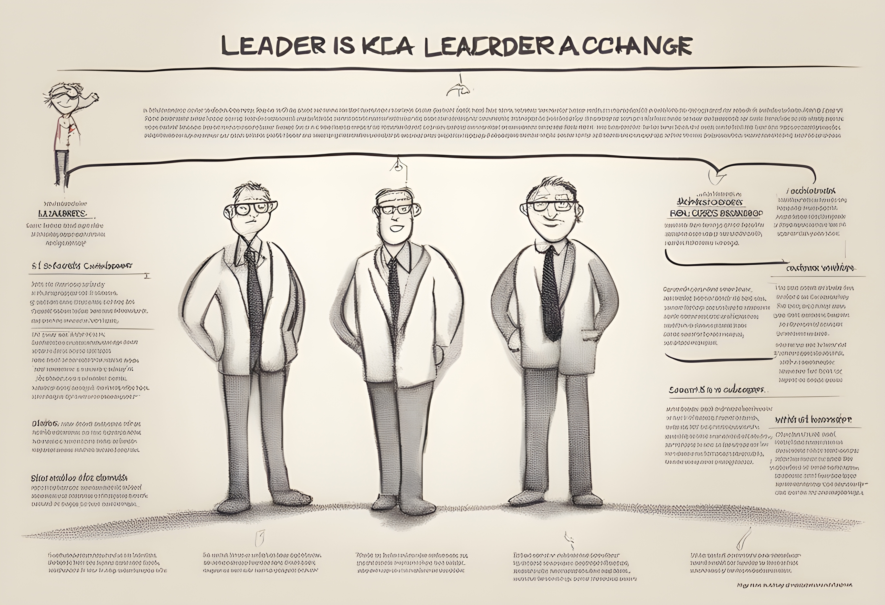

리더는 어떤 사람일까? 리더는 변화를 이끌어 가는 사람이다. 그 변화는 다른 사람의 변화일 수도 있고, 팀의 변화일 수도 있으며, 조직 전체의 변화일 수도 있다. 그러나 무엇보다 우선, 리더는 자기 자신의 변화를 이끌어 가는 사람이다. 그리고 이러한 변화를 이끌어내는 방식은 리더마다 다양하다. 그 이유는 모든 사람이 유일한 존재이기 때문이다. 믿기지 않는다면 한 조직 안에 있는 두 명의 인물을 딱 10분만 관찰해 보자. 개인적으로 그리고 기술적으로 수십 가지 다른 리더십 행동을 찾아볼 수 있을 것이다.

그렇다면 각자의 리더십 스타일을 키워나가는 데 도움이 될만한, 일반적인 리더십이란 존재하지 않는걸까? 이 부분에 있어서는 나의 경험과 여러 사례를 통해 깨달은 MOI라는 모델에 대해 이야기 해보면 좋을 것 같다.

## MOI 리더십 모델

변화를 만들어 내려면 환경은 반드시 다음 세 가지 구성 요소를 포함해야 한다.

- `M(Motivation; 동기부여)`: 위협하거나 보상하거나, 밀거나 당겨서 관련 있는 사람을 움직이도록 만드는 일
- `O(Organization; 조직화)`: 아이디어 실현이 가능하도록 만드는 구조
- `I(Idea; 아이디어, Innovation; 혁신)`: 씨앗, 실현될 것의 이미지

때론 변화를 저지하는 것도 리더십이라고 할 수 있다. 변화가 일어나는 것을 멈추게 하고 싶다면, 환경에 다음 세 가지 중 한 가지를 하면 된다.

- M: 동기 제거 - 사람들에게 변화를 일으켜도 인정받을 수 없다고 느끼도록 만든다. 스스로 무언가를 할 필요를 느끼지 않도록, 자발적 동기를 통해 즐길 수 있는 모든 의욕을 꺾는다.
- O: 혼란 조성 - 협력을 생각할 수 없을 만큼 심한 경쟁을 부추긴다. 자원은 최소한보다 아주 조금 부족한 상태를 유지한다. 보편적 가치가 있는 정보를 제한하거나, 의미 없는 말과 문서에 파묻히도록 한다.
- I: 아이디어 흐름 억제: 비판할 수 있는 상황이라면 다른 사람의 말을 듣지 않는다. 자신의 아이디어를 제일 큰 소리로 먼저 말하고, 의견을 제시하는 사람에게 불이익을 준다. 사람들이 함께 일하지 못하게 하고, 무엇보다도 웃음을 허용하지 않는다.

변화를 추구하는 경우에도, 반대로 변화를 저지하는 경우에도, MOI 모델은 리더십 스타일을 전반적으로 설명하는 모델이다.

## 개발 조직의 리더가 하는 일

개발 조직의 리더가 혁신을 강조하는 방법을 더 자세히 살펴보면, 다음 세 가지에 특히 노력한다는 사실을 알 수 있다.

- 문제를 이해하기
- 아이디어의 흐름을 관리하기
- 품질을 유지하기

이 세 가지가 문제 해결형 리더십의 특징적 구성 요소이며 `이것이 바로 훌륭한 개발 조직 리더의 특징`이다. 물론, 리더는 이 세 가지를 자신의 동기부여, 조직화, 혁신 능력에 따라 각자 서로 다른 방법으로 달성한다. 품질 향상을 목적으로 새로운 측정 도구를 도입하고자 하는 상황에서, 도구를 만드는 방법이 있고(I-전략), 도구를 사용하는 방법을 사람들에게 가르치고 사용하도록 설득하는 방법도 있으며(M-전략), 도구를 사용하는 사람들을 지원하는 체계를 만드는 방법도 있다.(O-전략).

문제 해결형 리더가 되기 위해서 갑자기 개종 수준의 변화가 필요한 것은 아니다. 단지 자신에게 어떤 전략이 부족한지 MOI의 목적과 수단을 조합하여 살펴본 다음, 한 번에 하나씩 부족한 부분을 채우면 된다. 새로운 방식에 각각 익숙해지면 또 다른 선택을 할 수 있게 되고, 문제 해결을 위해 환경에 긍정적 영향을 미칠 수 있는 기회가 늘어난다. 그리고 결국에는 팀이 더 생산적으로 바뀌는 놀라운 모습을 볼 수 있을 것이다.

## 문제 해결 스타일

앞서 훌륭한 개발 조직의 리더가 아래 세 가지에 특히 노력한다고 이야기 했다.

- 문제를 이해하기
- 아이디어의 흐름을 관리하기
- 품질을 유지하기

간혹, 주변 사람들이 나에게 `개발을 잘 하는 사람들은 어떤 특징이 있나요?`라던가 `시니어 엔지니어가 되려면 어떻게 해야하나요?`, `훌륭한 테크리더는 어떻게 될 수 있나요?` 같은 질문을 하는 경우가 있다. 그때마다 한두가지의 특징을 말해주거나, 요행을 바라지 말라며 혼내기 바빴는데 이번 기회에 평소에 어렴풋이 인지하고 있던 생각을 위 세 가지 키워드를 중심으로 정리해보려 한다.

### 문제에 대한 이해

개발자들 중에는 아이디어에 푹 빠져 있지만, 자신의 일과 바깥 세상 사이의 연결 감각이 부족한 경우가 흔하다. 특히 눈앞에 닥친 문제를 이해하고 싶어 하지 않으며, 유일한 목표는 흥미로운 것을 탐색하는 일이다.

모든 구성원이 스스로 목표를 분명하게 이해하는 환경이라면, 위와 같은 팀원은 문제 해결형 팀에서 최고의 팀원이 될 수 있다. 그러나 환경적인 제한이 없다면 쓸모없는 시간만 보낼 뿐이고, 일은 우연에 의해서만 이루어진다. 모든 사람이 문제를 이해하는 환경을 만드는 데 도움을 주는 행동 중에서 우리가 흔히 볼 수 있는 것들은 구체적으로 다음과 같다.

`고객의 문제를 매우 주의 깊게 이해한다.` 성공과 실패가 사소한 문제 정의의 차이에 달려 있는 경우가 많다. 문제의 전체 개요를 파악할 필요도 있지만, 때로는 중요한 세부 사항 하나로 인해 큰 그림이 뒤바뀌기도 한다. 문제 해결형 리더는 이 사실을 잘 알기 때문에 세부 사항에 주의를 기울인다. 이와 반대로, 지금의 재미와 상황 면피만 추구하는 사람들은 괜찮은 해결책을 찾아내자마자 지루해하며 바로 다른 일을 하고 싶어 한다.

`팀 동료들이 고객의 문제를 매우 주의 깊게 이해하도록 권장한다.` 고객의 문제를 이해하는 것은 분명히 MOI 모델에서 I와 관련된 리더십이지만, 다른 사람들이 고객의 문제를 이해하도록 권장하는 것은 동기부여와 관련된 리더십이다.

`원래 문제를 다시 참고함으로써 논쟁을 해결한다.` 모든 팀원이 문제에 대한 이해를 공유하기 전까지 해결을 시도하는 것은 에너지 낭비일 뿐이다. 논쟁이 길어지는 이유는 대부분 서로 내세우는 해결책의 상대적인 가치가 다르기 때문이 아니라, 문제에 대한 이해가 지나치게 다르기 때문이다. 문제 해결형 리더는 논쟁이 문제 정의의 차이점 때문인지 아니면 해결 방법의 차이점 때문인지 보여주는 신호를 읽을 수 있다.

`고객에게 문제에 대한 설명과 추가 정보를 요청한다.` 어떤 훌륭한 프로젝트라도 완벽하고 올바른 설명을 제시하는 경우는 없으며, 문서의 경우도 마찬가지다. 그러나 다른 사람들과 상호작용을 하지 않고 현재 알고 있는 사실에 빠져서 허우적대는 사람들이 있다. 때로는 사소한 상호작용이 정말 큰 차이를 만들기도 한다.

`작업이 어느 정도 진행된 후 요구사항의 의미가 더욱 분명해졌을 때 고객의 문제를 다시 참조한다.` 복잡한 문제를 처음부터 제대로 이해하는 경우는 거의 없지만, 이해하고 있다고 착각하는 경우는 많으며 그 착각은 재앙으로 가는 확실한 길이다. 그렇기 때문에 사람들에게 문제에 대해 끊임없이 다양한 가정을 하도록 권장해야 한다.

### 아이디어의 흐름 관리

아이디어는 문제 해결형 리더십의 핵심이며, 문제 정의에서 출발해 수준 높은 해결책에 도달하는 방법이다. 아이디어가 너무 적으면 해결책을 얻을 수 없고, 반대로 너무 많으면 혼란이 발생한다. 아이디어의 흐름을 관리하는 리더십이 없는 경우, 같은 공간에 두 명의 기술 전문가가 모이면 논쟁을 하고, 세 명이 모이면 오합지졸이 되며, 네 명이 모이면 난장판이 된다. 아이디어를 효과적으로 관리하면, 몇 명이 모이든 성공하는 문제 해결형 팀이 될 수 있다. 다음은 문제 해결형 리더가 아이디어의 흐름을 관리하기 위해 사용하는 12가지 대표적 행동이다.

`팀에 좋은 아이디어를 제공한다.` 새로운 아이디어가 치명적 결과를 초래하는 경우도 있긴 하지만, 좋은 아이디어를 제공하는 것은 가장 확실한 리더십 행동이다. 그러나 사실, 정말로 새로운 아이디어는 매우 드물다. 예를 들자면, 컴퓨터 소프트웨어 분야에서 새로운 아이디어 대부분은 이미 100여 년 전에 제시된 것들이다. 좋은 아이디어보다 더 중요한 것은 문제 해결에 적합한 아이디어가 등장했을 때 그 아이디어를 인식할 수 있는 환경을 만드는 일이다.

`유용한 아이디어를 모방하도록 권장한다.` 인정하기 싫은 사람도 있겠지만 문제 해결형 리더는 상습 모방자이다. 그중에서도 최고로 뛰어난 사람은 자신이 모방자라는 사실을 인정할 뿐 아니라 모방을 예술의 경지까지 끌어올린다. 문제 해결형 리더는 항상 사용할 만한 아이디어를 찾기 위해 다른 분야를 탐색한다. 문제 해결형 리더는 항상 사용할 만한 아이디어를 찾기 위해 다른 분야를 탐색한다. 어떤 설계가 이미 존재하는지, 다른 상황에도 적용 가능한지 알고 있다. 문제 해결형 리더는 자신이나 누군가 다른 사람이 이미 훌륭하게 해낸 일을 단순히 반복하는 일에는 별로 관심이 없다.

`팀 동료의 아이디어를 발전시킨다.` 처음부터 완벽한 아이디어는 존재하지 않는다. 심지어 모방한 아이디어라고 해도 새로운 환경에 맞게 조정해야 한다. 대부분의 문제 해결형 리더는 아이디어를 제시할 때 보다 아이디어를 완벽하게 다듬는 데 100배는 더 많은 에너지를 사용한다. 에디슨이 "천재는 1%의 영감과 99%의 노력으로 이루어진다."라고 말한 것이 그러한 의미다.

`팀이 추구하는 아이디어를 위해 누군가의 아이디어를 포기한다. 다만, 모든 사람이 이해하기 전에는 어떤 아이디어도 포기하지 말아야 한다.` 이것은 복잡한 문제를 해결하는 조화에 대한 이야기이다. 규모가 큰 문제를 해결하려면 많은 사람들이 조화롭게 노력해야 한다. 그러나 팀워크의 필요성을 강조하다 보면 다수의 의견에 동의해야만 하는 강력한 압박이 발생하며, 다수가 잘못된 아이디어를 떨쳐 버리지 못한다면 재앙이 될 수 있다.

자신의 아이디어를 모두 포기하거나 하나도 포기하지 않는 것은 상대적으로 쉽다. 어려운 것은 균형을 잡는 것이다. 즉, 자기 주장을 고집하다 그 아이디어를 포기하거나, 다른 사람들이 치명적 실수를 할 것 같은 상황에서 자신의 고수하는 것은 쉬운 일이 아니다. 이는 우리 회사의 인재상 중 하나인, `Strong opinions, weakly held`와도 맥락이 일치한다.

`시간의 압박에 굴복하지 않고, 다른 사람의 아이디어에 귀를 기울이는 시간을 갖는다.` 시간의 압박을 받는 경우에는 대부분의 아이디어를 제대로 이해하기도 전에 포기한다. 비록 그 아이디어들 중 일부는 별 볼 일 없는 것이라서 이해하는 데 드는 많은 시간을 절약할 수 있기도 하다. 그렇더라도 사람들은 자신의 아이디어가 부당하게 버려지면 열의를 잃어버리기 마련이다. 아이디어를 적용할 수 없다는 사실이 밝혀져도, 사람들이 모든 아이디어에 귀 기울이는 환경에서 프로젝트는 결과적으로 더 빠르게 진행된다.

`다른 사람들의 아이디어를 테스트한다.` 특정 상황만 고려한다면, 대부분의 아이디어는 유용하지 못할 것이다. 과연 유용한 아이디어란 무엇일까? 전세계적으로 유명한 회사들은 자체적으로 큰 기술개발 연구소를 운영하고 있지만 연구소 자체 연구를 통해 탄생한 제품은 거의 없다. 연구원들의 중요한 업무는 자기 분야의 신 개발품을 지속적으로 연구해서, 어떤 개발이 회사에 잠재적 이익을 가져다 줄 것인지 비판적으로 분석하는 것이다. 좋은 아이디어가 나오면, 그들은 그 아이디어를 재빠르게 포착해 더 발전시킬 준비가 되어 있다.

`아이디어의 흐름을 유지하기 위해 팀 동료의 아이디어를 즉각 비판하지 않는다.` 아이디어를 테스트하는 것은 중요한 일이지만, 고민할 만한 가치가 없는 아이디어는 없다. 아이디어를 비판하는 것과 즉각 비판하는 것은 전혀 다른 문제이다. 큰 규모의 회사는 더 작은 회사가 실제로 아이디어를 적용할 수 있다는 것을 증명할 때까지 중요한 아이디어를 여러 차례 받아들이지 않는 일이 흔하다. 스타트업에서 `혁신적인 주장`을 하더라도 대기업에선 크게 반응하지 않는게 대표적인 사례다. 그러다 스타트업의 주장이 유의미하다고 판단되는 시점에는 직접 시장에 뛰어들곤 한다.

`아이디어를 비판할 때는, 그 아이디어를 제시한 사람이 아니라 아이디어 자체를 비판하고 있다는 것을 명확히 안다.` 문제 해결형 리더는 모든 아이디어가 모든 문제에 유용한 것은 아니라는 사실을 잘 알고 있지만, 사람은 모두가 유용한 존재라는 사실을 더욱 잘 알고 있다. `그건 바보 같은 생각이야`라거나 `절대 그럴 리 없어` 같은 말을 하면 사람들이 더 이상 아이디어를 내지 않게 된다는 것을 알고 있기 때문에, 비판을 할 때 신중한 방법을 사용한다. 이것은 단어 선택에 주의를 기울여서, 사람이 아닌 아이디어에 대해서만 비판한다는 것을 의미한다.

`자신의 아이디어를 팀에 제시하기 전에 먼저 테스트한다.` 문제 해결형 리더라고 할 때 사람들이 흔히 떠올리는 이미지는, 영리한 젊은이가 분당 200단어 속도로 똑똑하고 신선한 아이디어를 마구 쏟아내는 모습일 것이다. `영향을 주는 행동`의 숫자를 세어 점수를 매겨서 리더십을 측정한다면 그런 사람들이 높은 점수를 받을 수 있겠지만, 그들이 진짜 문제 해결형 리더인 경우는 드물다. 오히려 그와 반대인 경우가 많다. 왜 그렇게 말을 많이 하는지 물어보면, 이 수다쟁이들은 이렇게 이야기하곤 한다. "글쎄요. 다른 사람들이 아무 아이디어도 내지 않고 있거든요." 이 말은 헛소리다. 좋은 아이디어를 전부 혼자 낼 만큼 똑똑한 사람은 없으며, 자신의 경솔한 아이디어를 끊임없이 내뱉는 것은 다른 사람들의 아이디어를 억누르는 효괒거인 방법이다.

`시간과 인력이 부족해지면, 새로운 아이디어를 멈추고 행동에 옮긴다.` 모든 프로젝트는 언젠가 실제로 일을 시작해야 하는 때가 온다. 그때까지 아이디어가 충분하지 않더라도, 어쨌든 프로젝트는 완료해야 하기 때문이다. 리더가 되기를 원하는 사람들 중 일부는 단순하게 구현하는 일 따위는 할 수 없다고 스스로를 과대평가 한다. 그러나 이 세상의 모든걸 창조했다는, 하나님 조차도 천지창조 6일 후에는 새로운 생명체를 생각해 내는 일을 그만두었다. (참고로 이 글을 쓰는 나는, 종교적인건 전혀 모른다.)

`팀 구성원들에게 예전에는 성공을 거두었지만 새로운 상황에는 맞지 않는 아이디어를 버리도록 권장한다.` 나쁜 아이디어라도 포기하기란 어려운 일이다. 하물며 좋은 아이디어를 버린다는 것은 더욱 어려운 일이다. 하지만 대단한 아이디어라고 하더라도 한계가 있기 마련이다.

`포기한 아이디어라 하더라도 나중에 다른 문제를 해결하는 데 가치가 있다면 다시 활용한다.` 사실 나쁜 아이디어는 없다. 단지 적합하지 않은 아이디어가 있을 뿐이다. 범선은 증기선에 밀려 자취를 감추었지만 에너지 비용이 증가하자 다시 제작되고 있다. 옛 아이디어가 사라져 버리는 것은 아니다. 문제 해결형 리더는 기억력이 뛰어나지만 적기를 포착하는 능력은 더 뛰어나다.

### 품질 제어

누군가는 '열심히' 한다면 성공할 수 있을 것이라고 말한다. 그것은 목표가 없기 때문에 품질을 측정할 수 없는 상태와 같다. 일단 목표를 정의하고 받아들이면, 문제 해결형 리더는 결함이 있는 해결책을 받아들이려 하지 않을 것이다. 다음과 같은 행동을 통해 품질을 위한 환경을 제어한다.

`프로젝트를 진행하면서 품질을 측정한다.` 고객의 요구사항을 재검토하는 능력이 품질에 대해 타협하는 능력을 의미하지는 않는다. 문제를 이해하는 능력은 실제로 요구사항을 구현하는 데 도움이 될 뿐이다. 위대한 요시라들은 요리를 만들면서 맛을 보고, 효과적인 문제 해결형 리더는 결코 품질에 대해 타협하지 않는다. 주어진 문제가 해결할 필요가 없다면 문제가 중요하지 않다는 사실을 인식한다.

`해결책을 만들어 내기 위해 품질을 측정하는 도구와 프로세스를 설계한다.` 제조업에서는 일정이나 요구사항이 우연히 충족되지는 않는다. 사람들에게 더 열심히 일하라고 이야기해서 충족되는 것도 아니다. 첨단 기술 산업에서는 구현 프로세스가 첨단 기술 제품 그 자체라고 할 수 있으며, 최고의 문제 해결형 리더십이 요구된다. 프로젝트를 진행하는 동안 실제 진행 상황과 품질을 측정하는 일이 때로는 낭비로 여겨지기도 하지만, 좋은 도구는 자연스럽게 품질을 제어할 수 있는 환경을 만들어 낸다.

`구현 속도를 측정하고 일정과 비교하여 해결 방법의 변경을 대비한다.` 업무를 완수하는 시간은 항상 요구사항의 일부이며, 원래 요구사항 대비 실제 진행 상황을 항상 비교해야 한다. 지연되고 있음에도 해결 방법을 변경하는 것이 두려워 몇 달 늦게 시장에 진입했기 때문에 사업에 실패한 첨단 기술 회사가 무수히 많다.

`프로젝트에서 한 걸음 물러나서 실행 가능성을 새로운 관점에서 바라보고 평가한다.` 때로는 지금 하고 있는 일을 새로운 관점으로 바라보는 것이 제일 좋은 측정 도구가 되기도 한다. 소프트웨어 업계에서는 구현이 시작된 모든 프로젝트의 반 이상이 제품을 출시하지 못한 채 취소된다. 불운한 프로젝트를 더 일찍 취소할수록 더 많은 비용을 절약할 수 있다. 문제 해결형 리더는 프로젝트가 가망이 없다는 것을 알아차리는 것뿐만 아니라 다른 사람들이 희망 없는 명분에 더 많은 노력을 쏟기 전에 그 사실을 받아들이도록 설득할 수 있어야 한다.

`아이디어를 구현하기 전에 고객과 함께 검토한다.` 문제 해결형 리더의 대중적인 이미지는 고독한 천재이지만, 진짜 리더는 성공을 만들어내는 것을 더 선호한다. 고객이 항상 옳지는 않지만 비용을 지불하는 사람은 고객이며, 리더는 고객이 비용을 지불하지 않는다면 그것은 성공이 아니라는 것을 잘 알고 있다. 만약 리더가 고객과 함께 계속해서 아이디얼르 검토할 수 있는 방법을 마련한다면 프로젝트를 취소하는 비율은 훨씬 더 줄어들 것이다.

`아이디어가 실패했을 때에도 의욕을 잃지 않는다.` 문제 해결형 리더는 실패를 쉽게 받아들이지 않으며 차질이 빋어진 경우에도 일이 멈추지 않도록 하는 방법을 알고 있다. 특히 헌신적인 동료가 그 차질을 개인적 비극으로 생각할 때 더욱 그러하다. 하지만 훌륭한 리더는 실패를 아무런 성과도 없는 아이디어의 속박으로부터 풀려나도록 하며, 아이디어의 순환을 새롭게 하고, 프로세스를 이전보다 더욱 생산적으로 만드는 계기로 삼는다.

## 질문

긴 글을 통해, 23개의 문제 해결 스타일에 대해 정리해보았다.

- `당신은 이 중 어떤 부분에 강점을 가지고 있는가?`
- `내가 리더십을 발휘하고 있는 방식들은 이 중 무엇인가?`
- `전반적으로, 문제 해결형 리더로서 자신의 스타일을 강화하려면 어떤 새로운 행동을 연습할 필요가 있을까?`

위 질문을 받고 `부족한 부분이 많지만, 나는 아직 리더가 되기엔 멀었으니 괜찮아.`라고 말하는 사람이 있다면, 명심하라. 리더는 조직에서 임명된 리더만 있는 것이 아니라, 그 조직의 변화를 만들어내는 모든 사람을 의미한다.

위 내용은 [제럴드 와인버그의 테크니컬 리더](https://www.aladin.co.kr/shop/wproduct.aspx?ItemId=22740964)의 내용과 나의 경험을 일부 섞어 작성하였으니, 더 깊은 내용이 궁금하다면 책을 한번 읽어보는걸 추천한다.