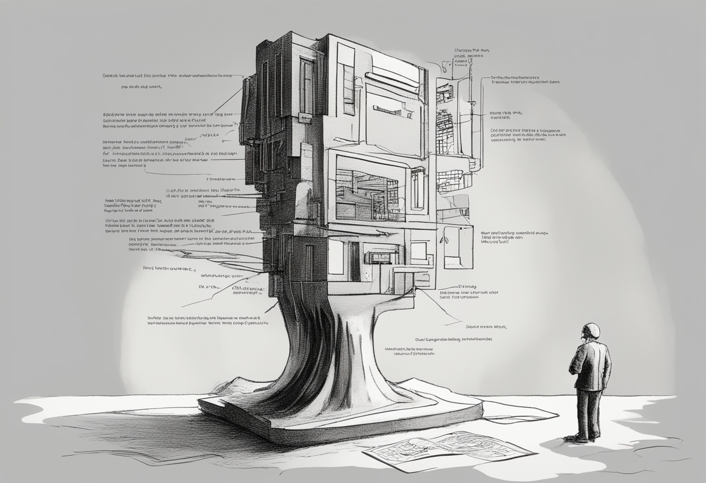

트러블슈팅이란 무언가를 행동하고 그 과정에서 발생한 문제를 해결해 가는 과정이 아닌, 실행하기 전 충분한 상상과 사유의 과정이 아닐까?

이는 단순한 학습에도 큰 교훈을 가져다준다. 과거의 경험과 지식이 쌓여 충분한 상상과 사유의 과정을 거치지 않고, "이건 대략 그럴 것이다"라며 넘겨짚는 경우가 많다. 점점 `'내가 배우려는 것은 무엇인가'`, `'이것의 본질은 무엇인가'`를 비롯한 고민의 과정이 생략되고 간결해지고 있다.

> 이는 시대의 변화 때문일까? AI의 발전도 영향이 있을까?

누군가는 "아무 걱정 없이 고민하는 사치를 부릴 여유가 없다"라며 반문할 수도 있을 것이다. 하지만 그럴수록 무언가에 대하여 고민하고 상상하는 시간은 더욱 가치 있어진다.

## `당신은 왜 그렇게 치열하게 사는가?`

물질적 풍요? 가정의 평화? 자아실현? 어떤 이유에서든 목표하는 바에 도달하기 위해선 치열한 경쟁이 필연적이다. 하지만 목표에 도달하는 것은 극소수의 사람이다. 많은 사람들은 목표에 도달하기 위해 노력하고 실행하고 회고하며 나아간다. 그렇다면 이 과정 자체를 충분히 즐길 수 있어야 하지 않을까?

내가 살아가는 IT 업계에서는 이 세상을 '무한경쟁 게임'에 비유하곤 한다. 이러한 무한경쟁 속에서 스스로를 잃은 채로 타인과 비교하며 그들을 추종하는 것은 너무나도 불행한 일이다. 무한한 가능성이 존재하는 게임 속에서 스스로 한계를 결정짓는 행위이기 때문이다.

## 나에 대한 이해

그렇기에 타인에게 이끌려 다니지 않고 스스로 가치를 만들어낼 수 있어야 한다. 이를 위해선 '나의 강점과 약점은 무엇인지', '나의 관심사는 무엇인지'를 비롯하여 나 자신을 잘 이해하고, 스스로 고민하고 생각하는 시간이 필요한 것이다.

사실 이 글을 읽는 당신은 본능적으로 수년 전부터, 본질의 중요성에 대해 알고 있었을 것이다. 그럼에도 본질에 다가가는 것이 두려워 다가가지 못했을 가능성이 높다.
본능적으로는 알고 있지만, 본질에 대해 생각하는 것을 피하는 행위는 양가감정을 극대화하게 된다. 양가감정이 극에 달하면 결국 스스로 가치 있게 보냈다고 생각했던 과거의 시간들을 부정하게 된다.

남에게 보여주고 싶은 모습만을 보여주기 위해 나를 숨길수록 나에 대해 잃어가고, 어느 순간 허탈감을 느끼게 된다.

내가 개발자이니 개발자로서의 관점을 말해보겠다. 당신은 왜 개발자로서 일하는가? 개발이 재미있고 즐거우면 취미로 하면 되는 것 아닌가? 왜 업으로 하는가?

나는 어떠한 문제를 발견하고, 구체화한 뒤 그 문제를 해결하기 위한 가설을 세우는 과정 자체를 즐긴다. 이는 개발자의 소양이라기보단 사회를 구성하는 구성원으로서 우리가 살아가는 세상에 많은 관심이 있다는 것에 가깝다. 업의 관점으론 우리 업계의 PM이라는 직무를 가진 사람들의 소양에 가깝다.

그럼에도 난 저런 고민과 상상이 즐겁다. 하지만 가설을 세우는 것에서 끝난다면 아쉽지 아니한가? 가설을 검증하기 위해 실행하고, 평가해보고 싶은 욕심도 당연히 있다. 운 좋게도 내가 개발자이기에, 그것도 꽤나 역량 좋은 개발자 중 하나이기에 내 가설을 검증하기 위한 수단으로 개발을 하고, 개발자로 일하는 것이다.

난 내 힘이 닿는 데까지 내가 해결 가능한 문제를 발굴하고 실제로 그 문제를 해결해보려고 한다.

지금은 우리 고객의 고민을 0개로 만들어주고 싶다. 이것이 내가 개발자로서 살아가는 이유이자 내 삶의 목적이다.​​​​​​​​​​​​​​​​
