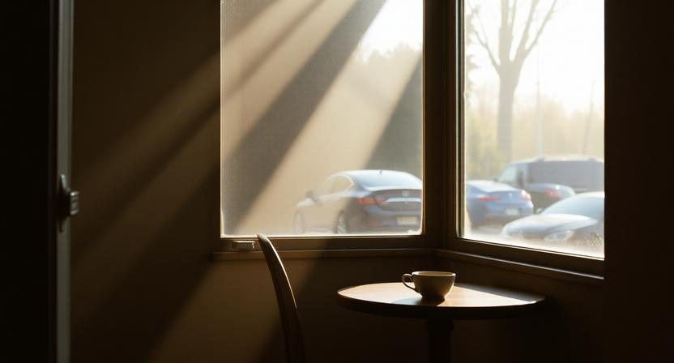

## 1.

문을 열고 들어서는 순간, 알 수 있을 때가 있다.

여기다, 라고.

설명하기 어렵다. 천장 높이가 마음에 들었다거나, 창문으로 들어오는 빛의 각도가 좋았다거나, 의자의 간격이 적당했다거나. 그런 것들을 하나하나 분석해서 내린 결론이 아니다. 그냥 안다. 몸이 먼저 안다. 어깨에 들어가 있던 힘이 스르륵 풀리고, 숨을 조금 더 깊이 들이쉬게 되고, 발걸음이 느려진다.

공간이 말을 거는 순간이다.

---

## 2.

나는 카페를 자주 간다. 커피를 좋아하기도 하지만, 정확히는 커피를 마시는 그 시간과 장소를 좋아한다. 같은 아메리카노라도 어디서 마시느냐에 따라 맛이 다르게 느껴진다. 물론 원두가 같다면 실제 맛은 같을 것이다. 하지만 경험은 다르다.

시끄러운 프랜차이즈 카페에서 마시는 커피와, 조용한 골목 안쪽 작은 가게에서 마시는 커피는 같은 음료가 아니다. 혀로 느끼는 맛은 비슷할지 몰라도, 몸 전체로 느끼는 감각은 완전히 다르다.

그래서 나는 카페를 고를 때 커피 맛보다 공간을 먼저 본다. 어떤 음악이 나오는지, 테이블 사이가 얼마나 떨어져 있는지, 창문 밖으로 뭐가 보이는지, 조명은 어떤 색인지. 그런 것들이 모여서 하나의 분위기를 만들고, 그 분위기 안에서 나는 커피를 마신다.

---

## 3.

좋아하는 공간에는 공통점이 있다.

첫째, 적당히 비어 있다. 너무 꽉 차 있으면 숨이 막힌다. 사람이든 물건이든 가구든, 빈틈이 있어야 시선이 쉴 곳이 생긴다. 여백이 있는 공간에서 생각도 여백이 생긴다.

둘째, 자연광이 들어온다. 인공조명만 있는 공간은 오래 있기 힘들다. 시간이 흐르는 게 느껴지지 않아서 그런 것 같다. 햇빛이 들어오는 공간에서는 오전과 오후가 다르고, 맑은 날과 흐린 날이 다르다. 같은 자리에 앉아 있어도 매번 조금씩 다른 경험을 하게 된다.

셋째, 주인의 취향이 보인다. 이건 설명하기 가장 어렵다. 그냥 느껴진다. 누군가 이 공간을 신경 써서 만들었구나, 라는 게. 벽에 걸린 그림 하나, 선반 위에 놓인 소품 하나, 메뉴판의 글씨체 하나에서. 상업적인 계산이 아니라 진짜 좋아서 고른 것들이 모여 있을 때, 공간은 말을 걸기 시작한다.

---

## 4.

몇 년 전, 교토에 간 적이 있다.

관광지를 돌아다니다가 지쳐서, 골목 안쪽으로 들어갔다. 작은 찻집이 하나 있었다. 간판도 거의 안 보이고, 문도 닫혀 있어서 영업 중인지 알 수 없었다. 그냥 끌려서 문을 밀었다.

안에는 나무 테이블 세 개와 카운터가 전부였다. 주인은 60대쯤 되어 보이는 남자였고, 손님은 아무도 없었다. 말차를 시켰다. 주인은 아무 말 없이 차를 준비했고, 나도 아무 말 없이 앉아 있었다.

그 공간에서 한 시간쯤 있었던 것 같다. 특별한 일은 없었다. 차를 마시고, 창밖을 보고, 가끔 주인이 뭔가를 정리하는 소리를 들었다. 그게 전부였다.

그런데 그날 저녁, 숙소로 돌아가면서 이상하게 마음이 편했다. 피로가 풀렸다기보다, 뭔가 채워진 느낌이었다. 무엇이 채워진 건지는 모르겠다. 그냥 그 공간에 있었던 것만으로 충분했다.

---

## 5.

요즘은 그런 공간을 찾기가 쉽지 않다.

대부분의 카페와 식당은 효율을 위해 설계된다. 테이블 회전율을 높이기 위해 의자를 불편하게 만들고, 조명을 밝게 해서 오래 앉아 있기 싫게 만든다. 음악은 대화를 방해할 정도로 크고, 인테리어는 사진 찍기 좋게 꾸며져 있다.

그런 공간에서는 공간이 말을 걸지 않는다. 오히려 재촉한다. 빨리 사진 찍고, 빨리 먹고, 빨리 나가라고.

물론 그런 공간이 나쁘다는 건 아니다. 목적이 다른 거다. 어떤 공간은 머무르기 위한 곳이고, 어떤 공간은 스쳐 지나가기 위한 곳이다. 다만 나는 머무를 수 있는 곳을 찾는 사람이다.

---

## 6.

집도 마찬가지다.

오래전, 처음 자취를 시작했을 때 가장 신경 쓴 건 월세와 교통이었다. 공간 자체는 별로 생각하지 않았다. 어차피 잠만 자는 곳이라고 생각했다.

그런데 이상하게 집에 있기가 싫었다. 일이 끝나도 카페에서 시간을 보내다 늦게 들어갔고, 주말에도 밖으로 나갔다. 집이 불편해서가 아니었다. 그냥 있고 싶지 않았다.

지금은 다르다. 집을 고를 때 가장 먼저 보는 건 창문이다. 어느 방향으로 나 있는지, 빛이 언제 들어오는지, 창문 밖으로 뭐가 보이는지. 그다음은 천장 높이, 그다음은 바닥 재질. 월세와 교통은 그다음이다.

사치라고 할 수도 있다. 그런데 집에 있는 시간이 편해지니까 삶 전체가 달라졌다. 밖에서 일하다 지쳐도 집에 들어오면 회복이 된다. 공간이 나를 안아주는 느낌이랄까.

---

## 7.

공간은 사람을 닮는다.

주인의 취향이 묻어나는 공간은 그 사람과 대화하는 것 같다. 말을 섞지 않아도 어떤 사람인지 느껴진다. 무엇을 좋아하고, 무엇을 중요하게 생각하는지. 공간 곳곳에 그 사람의 결정들이 쌓여 있기 때문이다.

이 의자를 고른 이유, 저 그림을 건 이유, 이 음악을 트는 이유. 하나하나가 선택이고, 선택이 모여서 공간이 된다. 그래서 좋은 공간에는 주인이 있다. 프랜차이즈가 아무리 예뻐도 어딘가 허전한 건, 선택의 주체가 보이지 않기 때문이다.

---

## 8.

나도 언젠가 공간을 만들어보고 싶다.

카페든 사무실이든 집이든, 들어오는 사람이 "여기다"라고 느낄 수 있는 곳. 말을 걸지 않아도 편안한 곳. 오래 앉아 있어도 재촉하지 않는 곳.

거창한 인테리어가 필요한 게 아니다. 그냥 진심으로 고른 것들이 모여 있으면 된다. 내가 좋아하는 것들로 채워진 공간은, 나와 비슷한 것을 좋아하는 사람에게 말을 걸 것이다.

취향이란 결국 그런 게 아닐까. 내가 무엇을 좋아하는지 알고, 그것을 삶에 가져다 놓는 것. 공간은 취향이 물리적으로 드러나는 가장 정직한 형태다.

---

## 9.

가끔 길을 걷다가, 처음 보는 가게 앞에서 멈출 때가 있다.

안이 잘 보이지 않는다. 문을 열고 들어가 봐야 어떤 곳인지 알 수 있다. 잠깐 망설인다. 그리고 문을 민다.

들어서는 순간, 알 수 있다.
여기다, 혹은 아니다.

그 감각을 믿는다. 설명할 수 없어도 괜찮다. 몸이 먼저 아니까.

좋은 공간을 찾는 일은, 결국 나를 찾는 일이다.
내가 어디서 편안한지, 무엇에 반응하는지, 어떤 것들에 둘러싸여 있고 싶은지.

공간이 말을 거는 순간,
나는 나에 대해 조금 더 알게 된다.
