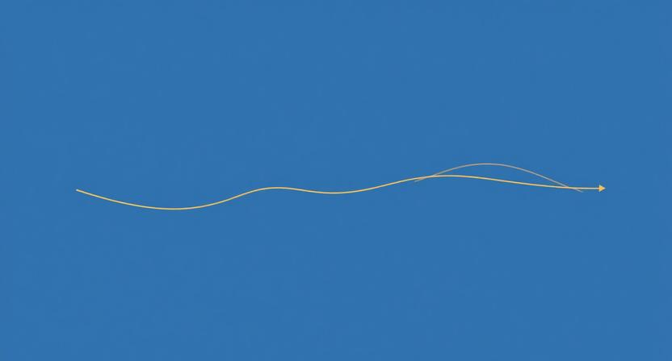

### "재밌게 만들어주세요"

이 요청을 받아본 적 있을 것이다. 기획서를 검토하다가, 프레젠테이션을 준비하다가, 제품의 방향을 논의하다가 — 누군가 이렇게 말한다. "좀 더 재밌게 만들어주세요." 그 순간 막막해진다. 재밌다는 게 뭔데? 어떻게 하면 재밌어지는 건데?

이 막막함에는 이유가 있다. "재밌다"는 결과이지 과정이 아니기 때문이다. 재밌다는 감정은 직접 만들어낼 수 없다. 누군가에게 "지금부터 재밌어하세요"라고 말해봐야 재밌어지지 않는다. 재밌다는 감정은, 어떤 과정을 겪은 끝에 저절로 생겨나는 것이다. 우리가 할 수 있는 건 결과를 직접 만들어내는 게 아니라, 그 결과로 이어지는 과정을 설계하는 것뿐이다.

### 결과를 직접 만들 수 없다는 역설

생각해보면, 우리가 가장 중요하게 여기는 것들은 대부분 직접 만들 수 없는 것들이다. 몰입, 감동, 신뢰, 성장. 이것들은 모두 결과다. 누군가에게 "몰입해"라고 명령할 수 없고, "감동받아"라고 지시할 수 없다. 이것들은 특정한 조건과 흐름 속에서 자연스럽게 발생한다.

그런데 많은 기획과 제품이 결과를 직접 만들려고 한다. 재밌으라고 화려한 이펙트를 넣고, 감동하라고 감성적인 카피를 쓰고, 몰입하라고 정보를 잔뜩 쏟아붓는다. 의도는 좋지만, 방향이 거꾸로다. 결과를 향해 직진하면 오히려 결과에서 멀어진다. 중요한 건, 그 결과가 자연스럽게 흘러나오는 과정을 설계하는 것이다.

### 세 가지 과정의 설계도

그렇다면 어떤 과정이 사람의 마음을 움직일까? 여기에 세 가지 구조가 있다.

첫째, 가설에서 환희로 가는 흐름이 있다. 무언가를 보고 "이건 아마 이렇게 되겠지"라는 가설이 떠오르고, 직접 시행해보고, 예상대로 들어맞았을 때의 쾌감. "역시 내 생각이 맞았어!" 이 흐름은 스스로 해냈다는 성취감을 만든다.

둘째, 오해에서 경악으로 가는 흐름이 있다. 당연히 이럴 거라고 생각하고 행동했는데, 전혀 예상치 못한 결과가 나오는 순간의 충격. "어? 이게 뭐야?" 이 흐름은 기존 전제를 깨뜨리면서 강렬한 인상을 남긴다.

셋째, 번뇌에서 의지로 가는 흐름이 있다. 해결할 수 없을 것 같은 난관에 부딪히고, 고군분투 끝에 한 단계 성장하고, "다시 해볼 수 있겠어"라는 의지가 생기는 흐름. 이 구조는 우리가 이야기라고 부르는 것의 뼈대다.

이 세 가지는 서로 다른 감정을 만들지만, 공통점이 있다. 모두 과정이라는 것이다. 환희도, 경악도, 의지도 — 결과물을 직접 쥐여주는 게 아니라, 특정한 흐름을 겪게 함으로써 자연스럽게 발생한다.

### 나도 모르게 빠져드는 기획

첫 번째 흐름, 가설에서 환희로 가는 구조를 기획에 적용해보자. 좋은 기획서는 읽는 사람이 "이건 이렇게 되겠군"이라는 가설을 세울 수 있게 만든다. 현황과 문제를 제시하면, 읽는 사람의 머릿속에서 자연스럽게 "그럼 이런 방향이겠네"라는 예측이 떠오른다. 그리고 다음 페이지에서 그 예측을 확인하거나, 살짝 다른 각도로 발전시키면 — 읽는 사람은 "내 생각과 통했어"라는 감각을 느낀다.

이런 기획서는 설득하지 않는다. 읽는 사람이 스스로 결론에 도달하게 만든다. 설득은 외부의 힘이지만, 자기 확인은 내부의 동력이다. "나도 모르게" 빠져드는 경험은 바로 이 구조에서 나온다. 기획이라는 체험을 재설계하면, 기획의 목적인 "사람의 마음을 움직이는 것"에 더 가까워진다.

### 예상을 뒤집는 제안

두 번째 흐름, 오해에서 경악으로 가는 구조는 임팩트에 대한 것이다. 프레젠테이션에서, 제품에서, 제안에서 — 사람의 기억에 오래 남는 것은 예상이 맞아떨어진 순간이 아니라 예상이 깨진 순간이다.

"이 문제의 원인은 A입니다"라는 슬라이드를 보고 모두가 고개를 끄덕인다. 당연한 분석이니까. 하지만 다음 슬라이드에서 "하지만 실제 데이터를 보면, A가 아니라 B였습니다"라고 뒤집으면, 회의실의 공기가 바뀐다. 당연하다고 믿었던 전제가 틀렸다는 깨달음. 이 순간의 충격이 메시지를 각인시킨다.

중요한 건, 이 놀라움이 작동하려면 먼저 "확신"이 있어야 한다는 것이다. 확신이 없으면 뒤집힐 것도 없다. "당연히 그렇지"라는 안정감을 먼저 만들고, 그 안정감을 정확한 타이밍에 깨뜨려야 한다. 순서가 중요하다.

### 성장 서사가 있는 조직

세 번째 흐름, 번뇌에서 의지로 가는 구조는 이야기의 힘에 대한 것이다. 사람은 자기 인생을 이야기로 이해한다. 지금 겪고 있는 어려움이 성장의 한 단계라고 느끼면 견딜 수 있고, 의미 없는 반복이라고 느끼면 무너진다.

좋은 조직에는 성장 서사가 있다. "지금은 힘들지만, 이 과정을 지나면 우리는 이전과 다른 팀이 된다"는 흐름이 보인다. 이건 리더가 억지로 주입하는 게 아니라, 실제로 팀이 난관을 넘고 달라지는 경험을 반복하면서 축적된다. 한 번의 위기를 넘기고 "우리가 이걸 해냈어"라는 기억이 쌓이면, 다음 위기가 와도 "이번에도 해낼 수 있어"라는 의지가 생긴다.

반대로, 성장 서사가 없는 조직에서는 어려움이 그저 고통이다. 같은 강도의 업무라도, "이걸 왜 하는지 모르겠다"는 감각 속에서 하면 소진되고, "이걸 넘으면 우리가 달라진다"는 감각 속에서 하면 몰입된다. 차이를 만드는 것은 업무의 양이 아니라, 그 업무가 놓인 서사의 구조다.

### 과정을 디자인하는 사람이 결과도 만든다

결과를 직접 만들려는 사람은 재밌는 기능을 넣고, 감동적인 카피를 쓰고, 임팩트 있는 숫자를 강조한다. 과정을 디자인하는 사람은 사용자가 스스로 발견하는 순간을 만들고, 예상이 뒤집히는 구조를 설계하고, 어려움을 넘는 서사를 깐다. 전자는 전달하고, 후자는 체험하게 한다.

역설적으로, 결과에 집착하지 않는 사람이 더 좋은 결과를 만든다. 재밌게 하려고 안간힘을 쓰는 대신, 사람이 자연스럽게 빠져드는 흐름을 설계하면 — 재미는 그 안에서 저절로 태어난다. 기획이든, 프레젠테이션이든, 조직 운영이든, 제품이든. 결국 우리가 만드는 모든 것은 누군가의 시간 위에 놓인다. 그 시간이 흘러가는 과정을 설계하는 것이, 결과를 만드는 가장 확실한 방법이다.
