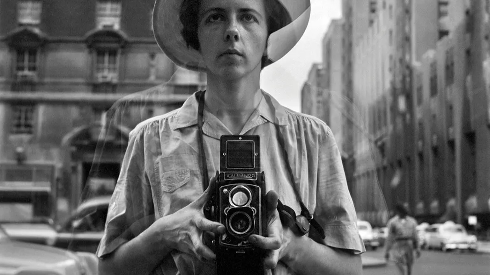

낮에 사진집 한 권을 펼쳤다가 비비안 마이어라는 이름 앞에서 한참 멈췄다.

그녀는 평생 롤라이플렉스 한 대를 목에 걸고 다니며 필름을 15만 장 찍었다. 그런데 정작 인화한 사진은 거의 없다. 찍고, 감고, 다시 찍고. 필름 대부분은 상자 속에 쌓인 채였고, 세상을 떠난 뒤에야 빛을 봤다. 본업은 보모였다.

이상한 일이다. 사진에는 찍는 맛도 있지만 인화해서 손에 쥐고 들여다보는 맛도 있다. 그 확인의 재미가 절반은 된다. 그런데 그녀는 찍기만 했다.

## 찍는 것이 곧 보는 것이었다

왜 찍기만 했을까. 이유를 찾다가 한 가지 해석에 오래 머물렀다. 롤라이플렉스라는 카메라가 '내가 본 대로 잘 담겼다'는 믿음을 줬으리라는 이야기였다.

이 카메라의 뷰파인더는 위에서 아래로 내려다보는 구조다. 눈높이에 대고 겨누는 대신, 가슴 앞에 든 상자 속 유리를 내려다본다. 셔터를 누르는 순간, 유리에 맺힌 장면을 이미 두 눈으로 본 셈이다. 찍는 행위와 보는 행위가 한 몸이었다. 이미 봤는데 굳이 인화해 다시 확인할 이유가 없다. 그녀에게 사진은 확인해야 할 결과가 아니라, 셔터를 누르는 순간에 이미 완결된 봄이었다.

## 나는 매번 되돌아본다

나는 정반대다. 한 장 찍고 액정을 확인하고, 마음에 안 들면 다시 찍는다. 집에 돌아와서는 라이트룸을 열고 같은 사진을 또 째려본다. 이 동작 밑에는 불신이 깔려 있다. 셔터를 누르던 순간의 판단을 나는 믿지 못한다. 그래서 찍은 뒤에도 몇 번이고 되돌아가 확인 도장을 받으려 한다.

되돌아봄은 신중함의 얼굴을 하고 있지만, 자주 의심의 다른 이름이다. 지금의 선택이 미덥지 않으니 나중의 내가 다시 검사한다. 그 검사가 끝나야 비로소 안심한다.

15만 장을 찍고 단 한 번도 돌아보지 않았다는 말은, 매 순간 '지금 이거다' 싶었다는 뜻이다. 셔터를 누르는 그 짧은 순간마다 자기 눈을 믿었고, 믿었으니 다시 볼 필요가 없었다.

상자에 쌓인 필름은 게으름의 증거가 아니라 확신의 증거다. 결과를 확인하지 않고도 흔들리지 않는 사람. 매 순간 지금의 자신을 믿었기에 되돌아볼 이유가 없었던 사람. 그 단단한 믿음이 오래 부러웠다.
