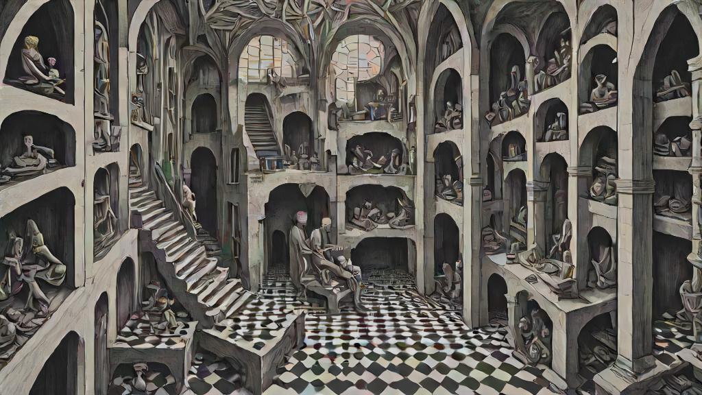
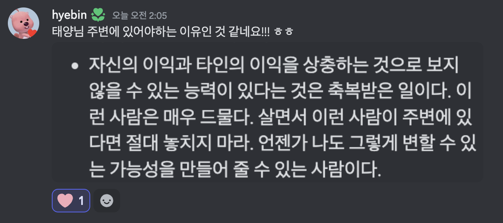
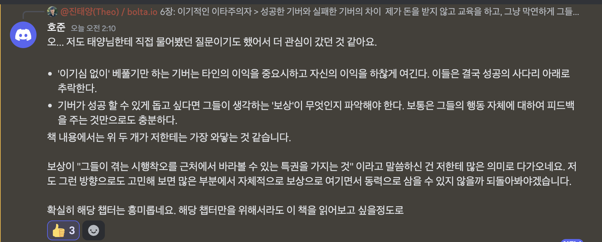

아래 내용은 채팅방에 공유했던 내용이라 문체를 별도로 가공하지 않고 그대로 단락만 정리하여 작성하였습니다. :)

## 6장: 이기적인 이타주의자

> 성공한 기버와 실패한 기버의 차이

제가 돈을 받지 않고 교육을 하고, 그냥 막연하게 그들의 '성공'을 위해 기부를 하고 시간을 쓰는 것에 대하여 많은분들이 어떻게 그렇게까지 할 수 있느냐고 물어보곤 하는데요.

그때마다, 결국 나에게도 도움이 되는 것이 있기에 그렇게 한다. '이기적 이타심'이라고도 부른다. 라고 답을 하는 편이었습니다.

그러다보니 이번 챕터의 타이틀인 '이기적인 이타주의자'라는 표현에 눈길이 갔네요.

### 전체 내용을 읽으면서 느낀 것 + 생각

내가 본능적으로 깨닫고 지니고 있던 마음가짐이 실제로 많은 연구와 사례를 통해 유의미하다는걸 알 수 있었고, 쭉 읽으면서도 저에게 있어서 보상은 '돈'보다는 그들의 성공과 그들이 성공으로 나아가는 과정에서 발생하는 다양한 시행착오를 근처에서 바라볼 수 있는 특권을 가지는 것이라는 생각이 들었네요.

책에서 '일을 더 많이하면서도 활력을 유지하는 사람'에 대해 언급하는데, 실제로 저도 하는 일이 많고 새로운걸 도전하는걸 즐기는 편인데 딱히 힘들다고 생각해본적이 없는데요. 일단 뭐든 하면 잘 해내는 편이고 어느정도 이상의 성취를 이루는 것이 여태까지는 막연하게 성취를 느낄때까지 달려가는 속도가 남들보다 월등히 빠르다. 정도로 생각하고 있었지만, 이번 챕터를 읽어보니 내가 하는 행동과 생각 하나하나에 어떤 영향이 있고 어떻게 발산 시킬 수 있는지 명시적으로 짚어가는 습관이 크게 영향을 준게 아닐까 싶습니다. 지금 이 글을 쓰는 순간에도 이 글을 읽는 여러분들에게 어떤 영향이 있을지 생각하면서 쓰고 있네요.

### 아래는 책 내용 일부 인용 + 살짝의 편집 정리

- 똑똑한 이타주의자는 어리석은 이타주의자보다 덜 이타적일지도 모르지만, 그들은 어리석은 이타주의자와 이기주의자보다 더 바람직한 존재다.
- 성공을 거둔 기버는 단순히 동료보다 더 이타적이기만 한 것이 아니라 그들 자신의 이익을 도모하는 데도 적극적이다.
- 성공한 기버는 테이커나 매처 못지않게 야심이 크다.
- '이기심 없이' 베풀기만 하는 기버는 타인의 이익을 중요시하고 자신의 이익을 하찮게 여긴다. 이들은 결국 성공의 사다리 아래로 추락한다.
- 빌게이츠가 세계 경제포럼에서 '인간에게는 이기심과 타인을 보살피고자 하는 두 가지 강한 본성이 있다'라고 언급한 적 있는데, 그 두 가지 동력이 뒤섞인 사람이 가장 큰 성공을 거둔다.
- 자신의 이익과 타인의 이익을 상충하는 것으로 보지 않을 수 있는 능력이 있다는 것은 축복받은 일이다. 이런 사람은 매우 드물다. 살면서 이런 사람이 주변에 있다면 절대 놓치지 마라. 언젠가 나도 그렇게 변할 수 있는 가능성을 만들어 줄 수 있는 사람이다.
- 많이 베푼다고 더 큰 보람을 느끼지는 않는다. 무엇이 되었든 '보상'이라고 느껴지는게 있어야 연료가 소진되지 않고 베풀 수 있다. 정말 헌신적인 사람들이 회사 생활을 힘들어하는 것이 이런 이유이다. 많은 회사의 보상은 돈으로 귀결되지만, 이는 대부분의 기버들에게는 큰 가치가 아니기 때문이다. 기버가 성공 할 수 있게 돕고 싶다면 그들이 생각하는 '보상'이 무엇인지 파악해야 한다. 보통은 그들의 행동 자체에 대하여 피드백을 주는 것만으로도 충분하다.
- 베푸는 과정에서 동정심을 지나치게 많이 표현하면 동정심 감퇴, 스트레스, 부담감 그리고 피로라고 표현 할 수 있는 '정신적 에너지 소진'이 발생 할 것 같지만, 실제로는 그렇지 않다. 오히려 도움을 필요로 하는 사람들을 효과적으로 도와주지 못한다고 생각할 때 소진된다.
- 일을 더 많이 하면서도 활력을 유지하는 모든 사람은 내가 하는 행동이 고객과 회사에 어떤 영향을 끼칠 수 있는지 이해하고, 그들의 성공과 만족을 위해 일한다는 것을 알고 있다. (책에서는 의사-환자의 관계로 설명함.)
- 직관적으로 생각하면 다소 이상하지만, 기버는 더 큰 영향력을 끼침으로써 더 많이 베풀면서도 에너지 소진을 피한다. 더 큰 영향력을 끼침으로써 그들의 성공을 위해 도움을 주고 있다는 것을 명확히 알고 있기 때문이다.

### 위 내용을 읽은 모임(?) 멤버들의 반응

