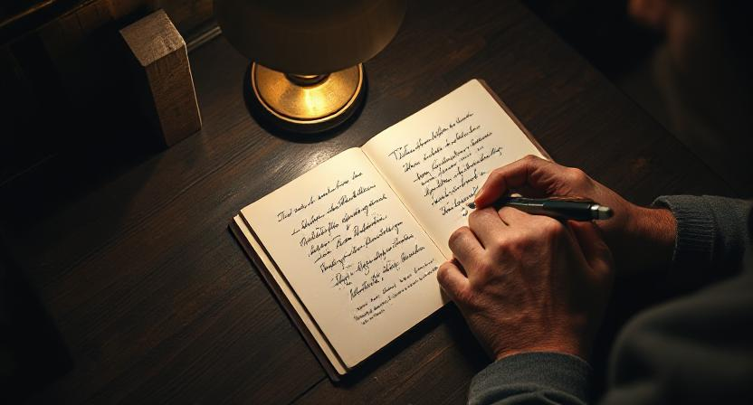

창업가의 삶이란 쉼 없이 흐르는 전류와 닮았다. 세상의 비효율을 해결하겠다는 단 하나의 목표를 향해 모든 에너지를 쏟아붓다 보면, 스스로가 거대한 회로 그 자체가 된 듯한 착각에 빠지곤 한다. 낮과 밤의 경계는 흐릿해지고, 끼니를 거르기 일쑤며, 세상은 온통 최적화해야 할 변수들의 집합처럼 보이기 시작한다. 지도 없이 항해하듯 나아갈 길에 대한 믿음이 희미했던 시절의 압박감은, 이제는 반드시 해낼 수 있다는 단단한 확신으로 바뀌었다. 그 즐거운 확신이야말로, 기꺼이 자신을 태우는 가장 뜨거운 연료가 된다.

문제는 이 회로가 좀처럼 꺼지지 않는다는 점이다. 일상의 모든 풍경 속에서 나는 무의식적으로 비즈니스 모델을 역산하고, 시스템의 숨은 규칙을 파헤친다. 가령, 무인 빨래방 앞을 지날 때면 나는 그저 깨끗한 세탁물을 떠올리지 않는다. '저 기계들의 한 시간당 최대 매출은 얼마일까. 지금 가동률은 20%가 채 안 돼 보이는데. 그렇다면 월매출과 임대료, 기기 감가상각비를 제하고 나면 과연 수익성이 있을까.' 내 머릿속은 순식간에 손익계산서를 그린다. 병원 건물이 즐비한 거리에선 간판의 미묘한 차이가 눈에 들어온다. '「OO의원」과 「OO성형외과 의원」의 차이는 무엇일까. 전문의 자격 유무에 따라 허용된 시술의 범위가 달라지는 걸까.' 나는 사회적 약속과 규제의 층위를 파고들고 있다.

이렇게 세상을 분해하고 재조립하는 사고는 나의 동력이지만, 동시에 내 안의 에너지를 끊임없이 소모시키는 원인이기도 하다. 나는 기업들 사이에 놓인 복잡한 거래의 길을 탐사하고, 그 길목을 막는 보이지 않는 장벽을 허무는 일을 한다. 혼돈처럼 얽힌 돈과 데이터의 흐름 속에서 명료한 질서를 발견하고, 모든 기업이 본질적인 가치 창출에만 집중하는 세상을 만드는 일. 그 거대한 청사진을 현실로 만드는 과정에는 분명 창조적인 희열이 있다. 하지만 그 희열에 매몰되다 보면, 정작 내 안의 가장 섬세한 회로가 마모되는 소리를 놓치고 만다. 혁신이라는 이름 아래, 나라는 존재를 무한히 소모해도 좋은 부품으로 여기기 시작하는 것. 그것은 일이 즐거울 때일수록 더 경계해야 할 위험한 순간이다.

하지만 나는 이 즐거운 질주 속에서도, 문득 스스로에게 질문을 던진다. '나는 왜 이 일을 시작했는가'라는 첫 질문의 빛이 흐려지고, 혹시 내가 이 속도에 취해 방향을 잊고 있지는 않은가. 그럴 때 나는 의식적으로 쉼표를 찍는다. 키보드에서 손을 떼고 목적 없이 낯선 도시의 거리를 걷고, 때로는 의식적으로 낯선 골목을 찾아 카메라의 뷰파인더를 들여다본다. 그날의 날씨와 빛, 그리고 그 순간의 내 감정까지 한 장의 프레임 안에 담아내는 것이다. 그렇게 바깥세상을 충분히 담아낸 뒤에는, 자연스레 안으로 시선이 향한다. 그럴 때 나는 오래된 카페의 구석 자리를 찾아, 노트에 생각을 기록한다.

이 시간은 나에게 흐트러진 마음을 조율하는 시간과 같다. 익숙한 소음이 오히려 고요한 배경이 되어주는 그곳에서 나는 하얀 노트를 펼친다. 정제되지 않은 날것의 단어들, 업무 폴더에는 담을 수 없는 사적인 감정의 조각들을 그저 흘려보낸다. 때로는 복잡한 사회 시스템의 논리를 파고들며, 세상의 규칙을 명료하게 이해하는 과정에서 오히려 마음의 평온을 얻기도 한다. 그것은 불협화음을 내던 내 안의 논리와 감정을 다시 가지런히 하여, 본래의 소리를 되찾게 하는 과정이다. 이 고요한 다독임 끝에, 나는 다시 단단해진다. 비로소 내가 풀어야 할 문제와 나 자신을 건강하게 분리할 수 있게 되는 것이다.

결국 세상을 움직이는 거대한 에너지는 가장 인간적인 '나'에게서 비롯된다고, 나는 믿는다. 잘 조율된 내면을 가진 리더만이 더 멀리 항해할 수 있는 튼튼한 배를 만들 수 있다. 스스로를 돌보는 시간이 결코 도피나 사치가 아니라, 가장 중요한 투자의 시간이자 가장 이타적인 책임감의 발현이라는 역설을 배운다. 기술의 비전을 선명히 제시하는 동시에 내면의 작은 소리에도 귀 기울일 줄 아는 균형 감각. 그것이야말로 이 즐거운 항해를 지치지 않고 계속할 유일한 동력일 것이다. 그래서 나는 오늘도 걷고, 쓰고, 방전된 나 자신을 충전한다. 이 도시의 미래와 함께, 내 안의 작은 불씨 또한 꺼뜨리지 않기 위해서.