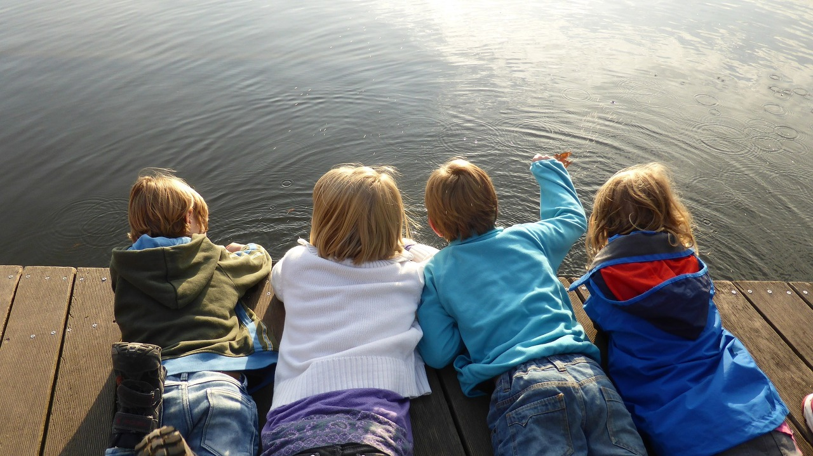
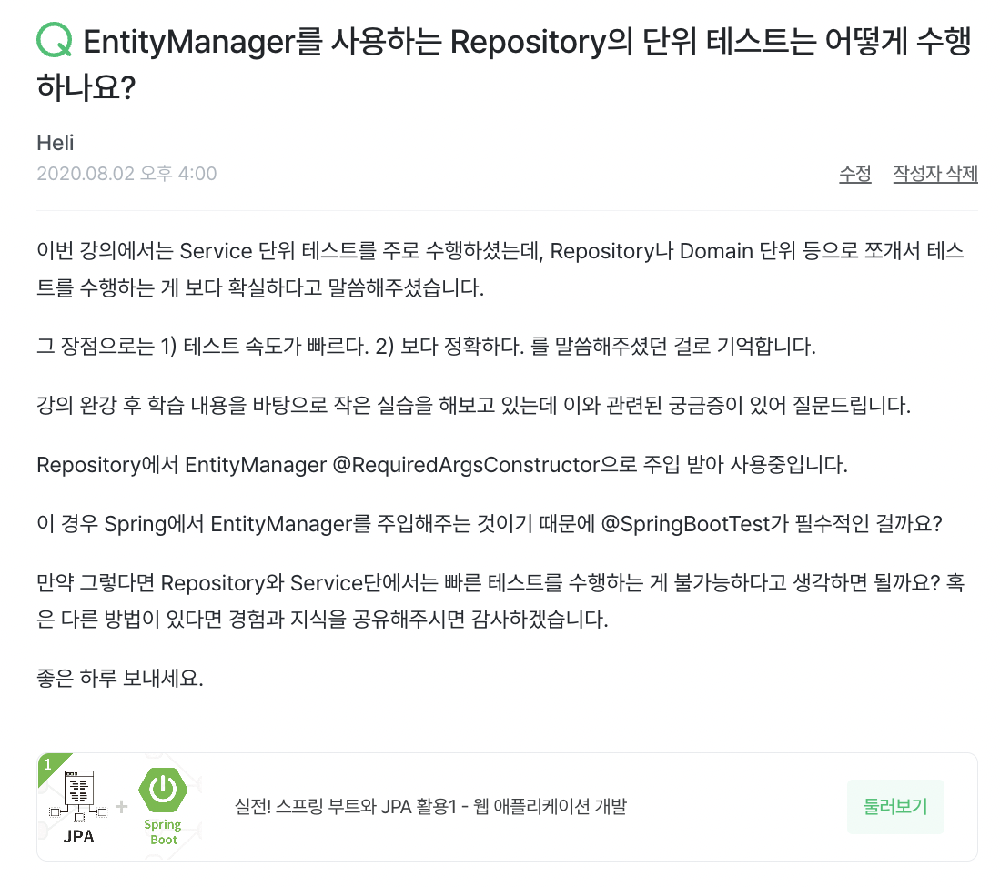
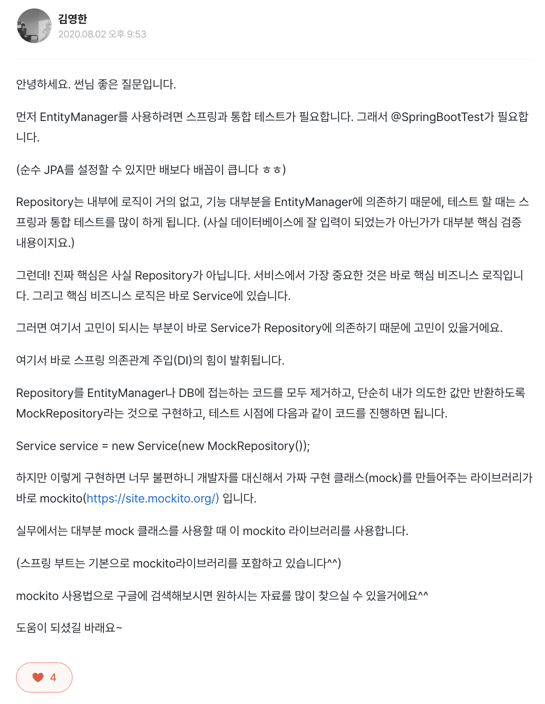
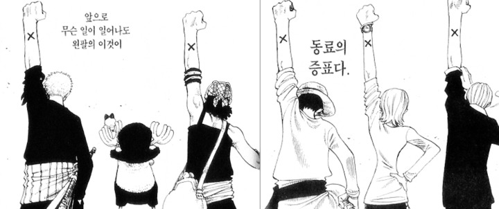

children are together

## 시작하며

안녕하세요, 개발자 진태양(Theo)입니다. 어느덧 벌써 12월입니다. 슬슬 2022년 회고를 작성해볼까 고민하던 시점에, 문득 1년 회고가 아니라 10년 회고를 해보고 싶어졌습니다.

왜 10년이냐고요? 사실 10년 자체에 어떤 의미가 있지는 않습니다. 그냥 제가 개발에 처음 관심 가지게 된 것이 거의 10년 전이기 때문입니다. (정확히는 곧 13년인데 이뻐 보이려고 10년으로 추렸습니다.)

이번 글에서는 개발을 처음 알게 된 시점부터 현재까지의 제 이야기를 회고 형식으로 풀어내며 제가 개발 커뮤니티를 하는 이유에 대해 나눠보고자 합니다. 상당한 장문이 예상되기에 글을 크게 다듬지 않고 빠르게 초판을 먼저 발행해보려 합니다.(글을 다 쓰고 보니 거의 8시간에 걸쳐 썼네요.) 그렇기에 지속적으로 내용이 수정될 수 있으며, `글의 하단에는 '내가 개발 커뮤니티를 하는 이유'에 대한 요약본을 달아두겠습니다.` 😊

## 2010년: 개발 시작

2010년의 저는 중학교 2학년 학생이었습니다. 그때 당시 다녔던 중학교는 2008년에 설립되어 제가 입학할 때 당시엔 학급 자체가 3학년이 없었으며 도서관을 비롯한 내부 시설이 정말 잘 되어 있었던 기억이 있습니다. 그리고 중학교 특성상 거주지 인근에 있는 학교로 배정되기 때문에 하교 후, 주말, 방학 같이 시간이 빌 때마다 도서관에 들려 관심 있는 책을 읽기도 했습니다. 물론 대부분 역사 소설이나 수필이었습니다. 🙂

중학교 입학 후 대략 1년 6개월 동안 수십(어쩌면 수백)권의 책을 읽다 보니, 더 이상 기존에 자주 들리던 도서관 섹션에서는 읽을만한 책이 남아있지 않았습니다. 그러다 그때 당시 정말 구석에 있었던 컴퓨터 섹션을 우연히 들리게 되었고 그곳에서 제가 태어나기 한참 전에 만들어진 Visual Basic 6.0 언어를 다룬 책을 발견하게 됩니다.

그 책의 제목은 정확히 기억나지 않지만, 그 옆에 `'트위터 완전정복'` 같은 뉘앙스를 지닌 트위터 사용법을 알려주는 책이 있었던 기억이 납니다. 최근에는 상상도 못 할 내용의 책이지만, 그때 당시는 컴퓨터와 인터넷 관련된 모든 것들이 아직도 새롭고 낯선 시기였습니다.

아무튼 Visual Basic 6.0 언어를 다룬 책을 빌려보았고, 관련 내용을 인터넷에 검색도 해보면서 여러 가지 예제를 만들어보았는데 그게 너무 재미있었습니다. 다른 사람들이 만들어서 공유해준 프로그램의 소스코드를 분석해보고 내가 만든 프로그램을 공유하는 것 자체가 즐거웠던 것 같습니다. 그리고 이때 당시에 빌려보았던 책 중에는 `'프로그래머의 길, 멘토에게 묻다'`라는 책도 있었는데, 이 책은 아직까지도 제 마음속 베스트셀러 1위로 남아있습니다.

## 2012년: 게임 개발

고등학교에 진학했습니다. 물론 일반적인 고등학교는 아니었고, 일부러 개발을 계속할 수 있는 학교로 지원하여 입학하게 되었습니다. 진학했던 고등학교는 모바일 로보틱스라는 종목으로 기능경기대회 팀을 운영하고 있었습니다. C언어를 이용해 모바일 로봇을 제어하고, 과제의 요구사항에 따라 동작하게끔 하는 종목이었습니다.

그런데 제가 입학하는 시점에 종목이 모바일 로보틱스에서 게임 개발로 바뀌게 되었습니다. 그러다 보니 학교나 팀에 노하우가 전혀 없는 상황이었고 학교에서는 그 팀을 처음부터 빌딩 해나 갈 멤버를 구해야만 했습니다. 그때 당시 저에게도 담당 선생님의 제안이 있었는데, 잠깐의 고민 후 팀에 합류하겠다는 의사를 전달했습니다. 그 후 3D 그래픽스와 사운드를 함께 해줄 수 있는 팀원을 한 명 더 찾을 수 있었고 두 명이서 C++, DirectX9, Windows API를 기반으로 한 2D Stripe Engine과 그 엔진을 이용한 게임을 만들기 시작했습니다.

팀 합류(=팀 빌딩) 이후 첫 1년은 정말 바빴습니다. 장비, 공간, 도서, 시스템, 정책 등 모든 걸 갖추어야 했고 정작 게임 개발 공부 자체엔 시간을 많이 쓰지 못했던 것 같습니다. 그래도 그때는 아무런 고민과 걱정 없이 시간을 보냈습니다.

## 2013년: 본격적인 시작

대략 1년이 지나니 어느 정도 팀은 안정화되고, 기존의 방식에는 꽤나 익숙해진 상태였습니다. 그런 시점에 신입생이 들어오며 팀에도 새로운 팀원이 합류하게 되었습니다. 다 함께 재미있게 공부하고, 대회를 준비했던 기억이 새록새록 납니다. 물론 중간중간 벤치마킹이라는 핑계로 이런저런 게임을 함께 했던 기억도 있네요. 😅

이때부터는 본격적으로 팀 단위로 기능경기대회를 비롯한 여러 대회를 나가며 경험을 쌓기 시작했습니다. 상을 받기도 하고, 아쉬운 결과를 얻기도 했지만 팀과 함께한다는 것 자체가 즐거웠습니다. 여러 경험을 하던 도중 인근에 있는 게임 개발사에서 일을 해볼 기회를 얻게 되었고, 그렇게 개발자가 되었습니다.

## 2014년: 고도화

주변을 둘러보니 대단한 사람들이 너무 많았습니다. 나이도 비슷하고, 과거 경험도 얼추 비슷한 것 같은데 국제무대에서 활동하는 소프트웨어 엔지니어, 보안 엔지니어가 즐비했습니다. 이때 즈음 내가 너무 세상을 좁게 보고 있는 건 아닐까? 걱정되었습니다. 자연스럽게 더 넓은 필드에서 더 다양한 경험을 해보고 싶어 졌습니다. 기존에 함께하던 게임 개발사를 떠나 규모가 더 큰 게임 개발사에서 일을 시작했습니다. 그리고 작은 규모의 게임 개발 교육원에서 교육 보조(조교)를 겸하였습니다.

하지만 아직까지 고등학생이었고, 무엇 하나 제대로 아는 것 같지도 않은데 이런 식으로 경험을 쌓아가도 되는 건가? 불안했습니다. 그러던 중 삼성에서 대규모 채용이 열렸습니다. 무턱대고 대기업이니 도전해보고 싶어 졌습니다. '여기에 합격한다면 나름 인정받을 수 있는 거 아닐까?'라는 생각도 있었습니다. 그렇게 서류 전형, 인적성 검사(SSAT), 면접 전형 어느 하나 제대로 준비하지 않고 누구에게도 알리지 않은 채 삼성전자 S직군 고졸/졸업예정 공개 채용에 지원하였습니다.

운이 좋았던 것인지, 서류 전형과 인적성 검사를 합격하였고 면접 전형에 참가하였습니다. 정확한 면접 전형이 기억나지는 않지만 간단한 정렬 문제를 A4 용지에 각자 풀이하고 그걸 면접관 앞에서 화이트보드에 풀이한 뒤 서류 기반 몇 가지 질문이 오고 갔던 기억이 있습니다.

물론 제가 진행했던 면접 과정과 내용은 초라하기 그지없었습니다. 화이트보드에 중구난방으로 판서했고, 면접관이 하는 질문은 모두 예상치 못한 질문들이었으니까요. 면접이 끝나고 그제야 인터넷을 통해 다른 사람들의 면접 사례를 찾아보니 저를 제외한 대부분의 사람들이 화이트보드에 플로우 차트를 그려가며 논리 정연하게 풀이하고, 소위 말하는 임원 면접도 멋들어지게 답변하는 연습을 했다는 것을 알 수 있었습니다.

면접 유형이나 예상 질문이 인터넷상에 돌아다니고 있었는데도 그걸 찾아볼 생각도 안 했고, 비슷하게 흉내도 못 냈기에 당연히 면접 전형에서는 불합격했습니다. 이때 면접에 응시한 80여 명 중 2명이 최종 합격했던 것으로 기억합니다.

## 2015년: 포기

고등학교를 졸업하였고, 여전히 게임 개발과 관련된 일을 하고 있었습니다. 1년 전에 했던 '이런 식으로 경험을 쌓아가도 되는 건가?'라는 고민과 걱정은 여전했습니다.

나는 이 일을 왜 하고 있는가? 근본적인 이유를 생각해보았습니다.

1. 돈을 벌 수 있다.
2. 게임이 즐겁다.
3. 개발 외엔 경험해보지 않았다.

이 셋이 끝이었습니다. 그런데 이때 즈음부터 게임이 즐겁지 않았습니다. 특별한 이유는 없었습니다. 그냥 무슨 게임을 하든 즐겁지 않았습니다. 그리고 꼭 이 일로만 돈을 벌 수 있는 것도 아니었습니다. 4년 전에 했던 것처럼 C#을 이용해 윈도우즈 애플리케이션을 판매한다면 여전히 돈을 벌 수 있는 시장이었습니다.

그래서 게임 개발을 그만두었습니다. 약 1년간 쉬어가며 간간히 목돈이 필요할 때마다 외주를 했습니다. 이때 당시엔 자연스러운 의식의 흐름이었지만, 지금 돌이켜보면 '게임 개발을 포기했다'에 가까웠던 것 같습니다.

## 2016년: 휴식

군대를 가야만 했습니다. 주변에서는 산업기능요원으로 병역 문제를 해결하는 경우가 많았지만, 이를 위해 게임 개발 세계로 돌아가고 싶지 않았습니다. 그렇게 2016년 6월, 햇살이 가장 따스할 때 즈음 논산 훈련소로 입대하였습니다.

지난 6년간 나쁜 습관이 누적되었던 탓이었을까요, 훈련소 입소 이후 진행하는 간이 신체검사에서 허리 디스크와 관련된 질병이 식별되었고, 1주일이 채 되지 않아 훈련소에서 나오게 되었습니다. 그렇게 다시 민간인 신분이 되었습니다.

훈련소 밖으로 나와 정밀 검사를 받으니 현역에서 보충역으로 역종이 전환되었습니다. 하지만 보충역으로 복무하려고 보니 1년 이상을 기다려야만 했고, 복무 기간은 24개월로 너무 길었습니다. 결국 주사 시술과 재활 치료를 진행하며 또다시 현역으로 역종을 변경하였습니다. 그렇게 2016년 12월, 크리스마스 다음 날 공기가 가장 차가울 때 논산 훈련소로 입대하였습니다.

어쩌다 보니 논산 훈련소의 여름과 겨울을 모두 짧게나마 경험해보게 되었습니다. 둘 다 썩 유쾌한 경험은 아니었지만.. 그나마 겨울이 조금 더 나았던 것 같습니다. 여름엔 실외 샤워장에서 1분, 2분 안에 씻어야 했던 기억이 있네요. 😅

## 2017년: 재정비

군대에 있다 보니 시간이 정말 많았습니다. 과거와 현재, 그리고 미래를 생각해보기 시작했습니다.

나는 왜 개발을 하고 있는가? 지금 하고 있는 개발이 즐거운가? 앞으로도 계속할 수 있을 것 같은가?

- `첫 번째, 나는 왜 개발을 하고 있는가?` 이 부분은 명확했습니다. 이거 말고는 해 본 적이 없었습니다. 그래서 그냥 하고 있었습니다.
- `두 번째, 지금 하고 있는 개발이 즐거운가?` 모호했습니다. 즐거움의 기준이 뭘까?
- `세 번째, 앞으로도 계속할 수 있을 것 같은가?` 단호하게 아니었습니다.

위 세 가지는 하루아침에 도출해낸 결론이 아니었습니다. 거의 3개월에 걸쳐했던 고민이었고 재정비가 필요한 순간이라는 결론을 내렸습니다. 그리고 그 방법은 개발 외에 다른 걸 해보자는 거였습니다. 그런데 무얼 해봐야 할지 알 수 없었습니다.

나름대로 기준을 세웠고, 해볼 만한 아이템을 도출했습니다. 그때의 기준은 `'나의 미래에 도움이 될법하고, 개발과 전혀 상관없는 것'`이었습니다. 그렇게 처음 선택한 아이템은 회계 공부였습니다. 정말 뜬금없지만, 나름 합리적이라고 생각했습니다.

하지만 시도해보고 한 달이 채 되지 않아 포기했습니다. 그 이유는 목표가 너무 막연했습니다. 회계를 공부해보자 -> 구체적으로 어떤 걸? 어떻게? 얼마나?라는 부분이 전혀 없었습니다. 그때 당시엔 CPA 응시를 위해 필요한 필수 과목에 대한 강의를 듣고, 공부해보자가 끝이었습니다. 그러다 보니 동기부여가 부족했고, 도전해볼 아이템을 바꾸었습니다.

그렇게 다음으로 선택한 아이템은 '공인중개사 시험 응시'였습니다. 아무래도 앞선 회계 공부에 비해 뚜렷하게 삼을만한 목표가 존재했고, 그 내용도 `부동산 학개론, 민법, 부동산 중개 관련 공법 규정, 부동산 관련 세법` 등으로 살면서 도움이 될법했습니다.

그렇게 인터넷 강의와 책을 구매해 공부를 시작하였고, 꽤 긴 시간 군 복무와 공인중개사 관련 학습을 병행하였습니다. 그리고 2017년 28회 공인중개사 시험에 응시하였습니다. 정말 다행히(?) 목표로 하던 응시를 넘어 시험에 합격할 수 있었습니다.

## 2018년: 결실

재정비 시간을 가지며 한 가지 깨달음을 얻었습니다. 바로 `'나는 그래도 개발이다'`였습니다. 공인중개사 공부 외에도 운동도 열심히 해보고, 글을 써보기도 하고, 사진을 취미로 가지며 여행 작가 흉내를 내보기도 하였는데 그래도 개발만큼 즐겁지 않았습니다.

이때를 기점으로 나는 개발이 즐거웠고, 단지 잠시 쉬어가고 싶었을 뿐이라는 결론을 내렸습니다. 그리고 앞으로도 개발을 계속하려면 어떻게 해야 할까? 라는걸 고민해보기 시작했습니다.

과거를 조금 더 돌이켜보았습니다. 나는 개발을 할 때 어떤 걸로 동기 부여하고, 즐거움을 얻었을까? 처음에는 돈이라고 생각했습니다. 하지만 내가 해왔던 것 중에선 돈을 전혀 받지 않고도 자발적으로 즐겁게 했던 개발도 존재했습니다. 그런데 그게 무엇인지 알 수 없었습니다.

그래서 무모한 도전을 해보게 됩니다. 모든 외주를 돈을 받지 않거나 최소(500원 ~ 1만원 수준)로 받으며 해보자는 생각을 하게 되었습니다. 그리고 조금 더 생각해보니 여태껏 독학 수준으로 공부하며, 직장을 다니며, 그리고 외주를 하며 다양한 사람을 만나보았지만 대학교에서 대학생 신분으로서 만날 수 있는 사람은 만나보지 못하였다는 사실을 깨달았습니다.

뜬금없긴 하지만, 대학을 가보고 싶어 졌습니다. 그런데 그 생각이 든 시점이 2018년 수시 접수 시작 이틀 전이었습니다. 여전히 군인 신분이었고요. 수능 공부는 당연히 하지 않았기 때문에 아래 세 가지 기준으로 대학을 선정하여 지원하게 됩니다.

1. 고등학교를 졸업한 지 n년이 지났음에도 수시 전형 지원 가능한 곳
2. 수시 전형을 통해 지원하는 경우 수능 최소 등급 기준이 없는 곳
3. 집에서 가까운 곳

사실 이런 기준을 갖춘 곳은 많지 않았습니다. 그렇게 추려진 몇 곳에 지원하였고, 그 시점에 현역 -> 예비역으로 전역하게 되었습니다.

전역 이후 지원했던 몇 군데의 대학에 면접을 보았는데 모두 합격하였습니다. 그중 집에서 가장 가까웠던 대학에 입학 결정을 내리게 됩니다.

## 2019년: 새로운 환경

대학 신입생이 되었습니다. 모든 것이 새로웠습니다. 지난 몇 년간 만나보지 못한 유형의 사람들을 만나볼 수 있었습니다. 학생뿐 아니라 대학의 교수님, 총장님, 그리고 대학 본부의 직원분들을 많이 만나 뵈었습니다.

그리고 여전히 모든 외주를 돈을 받지 않거나 최소로 받으며 하고 있었습니다. 처음엔 C# 단일로만 진행했었는데, 시간이 지나며 Android, React, Node.js도 병행하게 되었습니다. 😅 2018년 중순부터 거의 1년 이상 돈을 거의 받지 않고 진행하다 보니, 어떤 것은 돈을 받아야 되고 어떤 것은 받지 않아도 할 수 있겠다는 어느 정도의 기준이 생기게 되었습니다.

점차 그 기준이 명확해졌고, '나와 친구, 가족, 그리고 대부분의 사람들이 공감할만한 사회 문제를 기술로 해결하는 것'은 돈을 받지 않아도 되겠다는 결론을 내렸습니다. 그 외의 것들은 다시 돈을 받기 시작했습니다.

그렇게 학교를 다니며 가끔씩 외주로 용돈벌이도 하고, 재미있는 사이드 프로젝트(위에서 말한 돈을 받지 않아도 될법한 일)를 여러 개 하기도 했습니다.

## 2020년: 더 많은 경험

그러던 2020년, 코로나19가 전국적으로 유행하기 시작했습니다. 이로 인해 개강 이전 마지막 방학 기간인 2월 즈음에 예정되어 있던 오프라인 해커톤이 취소되었습니다. 이때 당시 신천지 교회에서 시작된 대유행이 사회적으로 큰 이슈였는데.. 대회 장소가 이슈가 되었던 대구 소재의 신천지 교회 근처였기 때문에 다른 선택지가 없었던 게 아닐까 싶습니다.

원래 무박 2일로 진행되려던 해커톤이었는데, 이게 취소되어 그 시간이 붕 뜨게 되었습니다. 특별한 목적 없이 개발 커뮤니티를 이리저리 돌아다니던 중, '코로나19 관련 공공데이터 공동대응'을 함께 하자는 게시글을 보게 됩니다.

글을 읽어보니 코로나19와 관련된 몇 가지 사회문제를 기술적으로 해결해보고자 하는 사람들을 모집하고 있었습니다. 시간적 여유도 있었고, 재미있어 보였기 때문에 합류하게 되었습니다. 합류해보니 저를 포함해 20명이 조금 안 되는 인원이 있었고, 본격적으로 프로젝트를 추진하기 시작했습니다.

그렇게 진행된 프로젝트는 많은 수의 상을 받고, 언론에 노출되기도 하고, `코드포코리아`라는 비영리 단체가 설립되는 등 큰 성과를 가져다주었습니다. 다만 그 과정은 꽤나 길었기에, 관련 링크를 첨부하는 것으로 대체하겠습니다.

- [2020 마스크 앱 백서](https://www.korea.kr/archive/expDocView.do?docId=39223)
- [모두가 함께 한 공적마스크 이야기 - 코드포코리아](https://docs.google.com/document/d/1o-BfBvo8ftwrhxQRaAitYkyGhN4WakLpFJwORCPYIQc/edit#heading=h.u73c578aps6f)
- [미래를 사는 시민들 (청년 인터뷰집) - 청년허브](https://youthhub.kr/hub/research/%EB%AF%B8%EB%9E%98%EB%A5%BC-%EC%82%AC%EB%8A%94-%EC%8B%9C%EB%AF%BC%EB%93%A4-%EC%B2%AD%EB%85%84-%EC%9D%B8%ED%84%B0%EB%B7%B0%EC%A7%91)

그리고 2020년 하반기에는 새로운 기술 경험을 위한 도전도 해보게 됩니다. 기존에 경험해본 기술을 쭉 나열해보자면 정말 다양했습니다. VB 6.0, C#, C++(with Dx9, Windows API), PHP, Java-Android, C-Arduino, JavaScript-React, JavaScript-Node.js(Express.js), ...

여러 기술 경험을 통해 클라이언트 사이드 언어는 제 성향과는 맞지 않는다는 결론을 내리기도 했습니다. 무언가를 하려고 할 때마다 플랫폼의 주체에 의한 제한이나 한계가 너무 많았고 그게 썩 마음에 들지 않았습니다. 그래서 최근 2년 정도는 서버 사이드의 Javacript-Node.js(Express.js)를 주력으로 사용하고 있었습니다.

그리고 평소에 Node.js vs Spring Framework를 이야기하며 스프링은 `'견고하다'`라고 표현되는, 그 이유가 궁금했습니다. 기존에 Node.js로 개발해 운영 중이던 몇 가지 사이드 프로젝트를 스프링 부트로 바꿔보며 인프런에서 김영한님의 강의를 시청했습니다. 지금 생각해보면 정말 귀여운 질문을 남기기도 했었네요.

## 2021년: 확장

이 확장은 조금 복합적인 의미를 지니고 있습니다.

첫 번째로 `프로젝트 경험의 확장`입니다. 2020년에 어쩌다 시작하게 된 비영리 단체인 `코드포코리아`에서 다양하고 많은 수의 프로젝트를 진행하였습니다. 그중에서는 2020년 수준으로 큰 성과를 냈던 프로젝트도 존재했습니다. [정부에 재능 기부한 썰~ Feat. 코로나19 개인 안심번호](https://jinssssun.tistory.com/4)

두 번째는 `기술 경험의 확장`이었습니다. 이것도 나름대로 순조로웠습니다. 특별한 어려움 없이 계획을 세워나가며 하고 싶은 공부를 마음껏 할 수 있었습니다.

그리고 대망의 세 번째는 `직무 경험의 확장`이었습니다. 조금 더 구체적으로는 회사에 소속된 웹 백엔드 엔지니어로서 할 수 있는 경험을 해보고 싶어 졌습니다. 그중에서도 특히 협업, 기술 전문성, 오너십 세 가지를 명확히 경험해보고 배워보고 싶었습니다.

이 생각을 했을 무렵이 2021년 2분기 즈음이었습니다. 곧바로 로켓펀치를 접속해 'Java', 'SpringBoot' 키워드로 채용 공고를 찾아보기 시작했습니다. 그리고 검색 결과 최상단에 노출되던 회사 한 곳과, 평소 관심 가지고 있던 '사진'과 관련된 제품을 만드는 곳, 전체 두 곳을 지원하였습니다.

검색 결과 최상단에 노출되던 회사는 홈페이지도 한번 접속해보지 않고 지원했던 회사였습니다. 그에 반해 사진과 관련된 제품을 만드는 곳은 그곳에서 만들고 있는 애플리케이션을 설치해보며 홈페이지도 많이 둘러본 뒤에 지원했었습니다.

본격적으로 두 회사의 채용 전형이 진행되었습니다. 검색 결과 최상단에 노출된 회사의 채용 전형은 매우 빨랐고, 사진 관련 제품을 만드는 스타트업의 1차 면접을 보기도 전에 처우 협상까지 모두 완료되었습니다.

그렇게 그 회사에 합류 결정을 내리게 되었고 정작 관심 가지던 회사에는 인터뷰 참석 포기 의사를 전달했습니다. 지금 생각해보면 정말 어리석은 행동이었습니다. 하지만 나름 변명하고 싶은 게 있습니다. 당시 저는 대구에 거주하고 있었고, 인터뷰를 보려면 서울로 올라와야만 했습니다. 그런 상황에서 처음 인터뷰 본 곳이 인터뷰를 통해 나름 괜찮은 곳이라는 시그널을 받을 수 있었고, 합격 시그널과 오퍼 레터를 빠르게 전달해주니 굳이 피곤한 과정을 또 경험하고 싶지 않았습니다.

> 그렇게 2021년 6월, 그 회사로 출근을 하게 되었습니다.

그리고 예상하셨을 수도 있겠지만, 정말 빠르게 재직 5개월 시점에 퇴사를 결정하게 됩니다. 회사에 불만이 있었던 것은 아닙니다.

다만, 제가 회사에서 일을 시작하게 된 이유가 불순했었기 때문이었습니다. 직무 경험을 확장하고 싶었던 가장 큰 이유는 밖에서 하는 것들(비영리 단체 활동이나 사이드 프로젝트)을 조금 더 잘해보기 위한 무언가를 회사에서 얻어가고 싶었기 때문이었습니다.

초기 스타트업에 합류하는 입장에서는 바람직하지 못한 마음가짐이었습니다.

> 그래서 이번에는 정말 내가 함께 하고 싶은 회사를 가보자는 생각에 많은 회사를 찾아보고, 지인에게 물어보기도 하며 몇 군데를 추려 지원하였습니다.

그렇게 지원하고, 인터뷰를 진행하며 오퍼를 받은 몇 개의 회사 중 채용 프로세스가 정말 독특했던 회사가 있었습니다.

그 회사는 50여 명 규모에 곧 시리즈 B를 클로징 하는 라운드에 있었음에도 서류 제출 -> 서류 합격 -> 인터뷰 일정 조율 -> 인터뷰 -> 최종 합격 -> 처우 협상까지의 과정이 24시간 안에 이루어졌었습니다.

특히 인터뷰는 대표님의 회사 설명(비즈니스 모델, 자금 계획, 인력 상황 등) 이후 개발팀 인터뷰, 대표님 인터뷰 순서로 진행되었는데 그 현장에서 곧장 의사 결정하여 최종 합격 통보를 주셨던 부분이 인상 깊었습니다. 자연스레 처우 협상도 그 자리에서 진행되었고, 다른 곳에서 받은 오퍼보다 높은 수준의 급여와 사이닝 보너스, 그리고 스톡 옵션까지 제시해주셨습니다.

더불어 대표님의 모든 말과 행동에서 확신이 느껴졌고, 사업 또한 순조로울 것 같다는 생각이 들었습니다. 그래서 이 회사로의 합류를 긍정적으로 고민해보고 있었습니다.

> 그러던 중, 현 회사에 먼저 재직 중이시던 지인분께서 '우리 회사에도 지원해봐라'라는 이야기를 해주셨습니다.

하지만 그때 당시 저는 대기업에 관심도 없었고, 무엇보다 이번에는 해보고 싶은 일을 할 수 있는 곳으로 가보고 싶었습니다. 그래서 거절은 했지만, 내심 한 번쯤 도전은 해볼까?라는 생각이 들기도 했던 것 같습니다.

그렇게 지인 몰래 수시 채용 전형에 지원했습니다. 몰래 지원했던 이유는 두 가지였습니다. 1) 자격 요건에 미달하였기에 불합격할 것으로 예상되는데, 괜히 민폐를 끼치는 것 같았습니다. 2) 사내 추천을 받으면 서류 전형이 100% 통과라는데, 그러고 싶진 않았습니다.

그런데 서류 전형에 합격하였고, 자연스럽게 과제 전형까지 진행하게 되었습니다. 다만 과제 전형 합격 이후 인터뷰 일정 조율 과정에서는 전형이 너무 길어질 것으로 보여, 이후 채용 프로세스 불참 의사를 밝혔고 전형 포기로 처리되는 등 해프닝이 있기도 했었습니다.

물론 1시간 뒤 즈음 다른 채용 담당자분에게 전화가 와서 인터뷰 일정을 다음 주 월요일로 조율 + 당일 합격 통보를 해주겠다고 말씀해주셔서 인터뷰를 보게 되었습니다. (이때가 금요일이었으니 정말 파격적이었습니다.)

우여곡절 끝에 현 회사에 최종 합격을 하고, 많은 고민 끝에 결국 합류를 결정하였습니다. 엔지니어라면 스타트업과 대기업 모두 경험해봐야 한다.라는 말이 흔했고, '한 번쯤 경험해보자'라는 생각이었습니다. 이전 회사와 마찬가지로 의도가 조금은 불순했던 것 같기도 합니다.

다만, 합류하고 나서 보니 눈앞에는 정말 새로운 세계가 펼쳐져 있었습니다.

## 2022년: 새로운 세계

괜히 대기업이 아니었습니다. 2014년 카카오 내에서 3명 규모의 작은 팀으로 시작한 회사는 2017년 60여 명으로 분사하였고, 현시점에서는 1100명을 바라보는 규모가 되었습니다. 그 과정에서 있었던 사업적, 기술적 의사 결정 과정과 다양한 히스토리가 내부에 아카이브 되어 있었고 그 내용은 정말 대단했습니다.

그리고 단순히 회사의 성장만을 위해 달리는 것이 아닌, 내부 구성원을 케어하기 위한 다양한 노력과 제도까지 함께 갖추며 달려 나가는 모습이 너무 신기했습니다.

무엇보다 제가 소속된 팀 자체가 너무 좋았습니다. 좋다는 것은 매우 추상적인 표현입니다만, 그 이유를 조금 구체적으로 생각해보자면 크게 두 가지 이유였습니다.

1. 팀 모두가 각자의 Role에 따라 전문성을 갖고 있음이 느껴졌다.
2. 단순히 회사/팀 차원의 프로덕트를 개발하는 것에서 그치지 않고 구성원의 커리어 패스와 동기부여에 관심 갖고 있다.

사실 첫 번째 이유는 당연한 내용입니다. 회사에 소속되어 일을 한다면 맡은 직무에 대해 전문성을 뗘야 하니까요. 그렇기에 두 번째 이유가 좋은 팀과 함께한다는 생각을 할 수 있게 해 준 결정적인 이유였습니다.

수많은 주니어 레벨의 구성원들은 `'더 가치 있는 사람이 되어야겠다'`라는 욕구를 지니고 있기 마련입니다.

하지만 막상 욕구를 실현하려 하더라도, 어떻게 해야 할지 알기 어렵습니다. 학교나 학원에서는 이런 것들을 알려주지 않으니까요.

- 만약 회사에서 문제를 해결해 나가는 과정 속에서 어려움을 겪는다면 어떻게 해야 할까요?
- 내가 현재 프로젝트에 동기 부여되지 않는다면 어떻게 해야 좋을까요?

개인적으로 이런 것들은 회사에서, 그리고 팀에서 챙겨줄 필요가 있다고 생각합니다. 제가 합류하게 된 조직, 특히 조직장님은 이런 부분에 많은 관심을 가지고 계시며 매우 적극적이셨습니다. 조직 외에도 회사 전반적으로 개인 기여자들의 성장을 지원해주려는 노력이 있었고, 이런 글을 쓸 기회도 얻을 수 있었습니다. [오픈소스 활동 이야기 - 카카오페이](https://tech.kakaopay.com/post/junior-opensource/)

물론 아쉬운 부분도 있었습니다. 조직에 대한 아쉬움보다는 대기업이라는 것에서 오는 아쉬움이었습니다. 아무래도 R&R이 명확해진 만큼 해볼 수 있는 경험의 범위에 한계가 있었습니다. 저는 그래서 개발 커뮤니티를 시작했습니다.

## 내가 개발 커뮤니티를 하는 이유

취미로 개발을 시작하고 현재까지 12년이 흘렀고, 곧 13년이 됩니다. 하지만 전체를 보았을 때 그 기간을 잘 사용하지는 못했습니다.

- 첫 9년은 개발 생태계에서 보고 듣기만 하는 리스너였으며,
- 이후 1년은 생태계에 조금씩 의견을 내보았으며,
- 최근 2년은 개발 생태계를 직접 만들어 보고자 했습니다.

이 중에서 가장 많은 걸 배우고 성장했다고 생각하는 시기는 최근 2년이었습니다. 앞선 10년간 이런저런 실패와 포기를 해보며 나름대로의 기준과 관점을 만들어나간 것이 도움이 된 것 같기도 하지만, 10년이란 시간은 너무 길었습니다.

- 그래서 다른 사람들은 이 정도의 시행착오는 하지 않았으면 했습니다.
- 제 경험을 타인과 나누고 싶었습니다.
- 제가 먼저 겪은 시행착오와 지금 새롭게 배우는 것들을 바탕으로 더 나은 개발 생태계를 만들어나가고 싶었습니다.
- 그렇게 만들어진 더 나은 개발 생태계 속에서 살아가고 싶었습니다.

물론 일방적으로 제 경험을 공유하기만 했다면 지속하지 못했을 것입니다. 커뮤니티 활동을 통해 평소에 생각해보지 못한 관점으로 문제를 접근하는 사례를 간접적으로 경험해볼 수 있었고, 제 생각과 관점을 타인에게 공유하며 피드백받는 그 사이클 자체가 저에게는 큰 가치였습니다.

평소 자주 함께 학습하고, 경험을 공유하던 10여 명의 사람들과 2022년 2월 즈음 만들게 된 기술 경험 공유 네트워크는 어느덧 100명을 넘어 200명 중반을 향해 달려가고 있습니다. 자연스럽게 검색을 통해 유입된 경우도 있었지만, 여러 경로를 통해 만나 뵙게 된 개발자분들을 하나둘 영업한 결과이기도 했습니다. 올 한 해는 100% 온라인으로 운영되었지만, 내년에는 기회가 된다면 오프라인으로 기술 경험을 공유할 수 있는 자리를 마련해보고 싶은 욕심이 생기기도 합니다.

혹시 관심 있는 분이 계시다면 함께해요! 🙂

- 홈페이지 -> https://weekly.ac 
- GitHub Organization 가입 -> https://github.com/weekly-academy/members
- 오픈 채팅방(비밀번호: 9323) -> https://open.kakao.com/o/gyvuT5Yd

그리고 최근에는 회사와 팀도 결국 하나의 네트워크이고, 하나의 커뮤니티라는 것을 깨달았습니다. 그래서 마음 맞는 조직에서 구성원 각자의 경험을 공유하고, 피드백을 주고받으며 회사, 팀, 그리고 구성원 모두 함께 성장할 수 있는 `'상황 학습을 실현할 수 있는 조직'`을 만들고 싶다는 욕심이 생겼습니다.

상황 학습은 구성주의 교육철학에 바탕을 둔 학습 이론입니다. 구성주의의 기본 가정은 다음과 같습니다.

> '학습은 학습자의 경험에 기초하여 학습자의 머릿속에 구성되는 것'이다.

따라서 구성주의에서 말하는 학습은 현실과 유사한 맥락에서 이루어질 때, `실제로 활용할 수 있는 지식을 습득하는 것`이라 볼 수 있습니다.

여기서 지식은 절대 정형화되고 정체되는 것이 아니라 개개인이 자신의 사회적, 역사적, 문화적 상황을 바탕으로 구성해나간다는 것을 유의하여야 합니다. 즉, 지식이란 상황적인 것이고 그 지식이 사용될 과제, 맥락, 문화 안에서 생성되는 것이지 결코 단독적으로 존재하는 것이 아니라는 것입니다. 따라서 실제와 유사한 상황에서 이루어지는 학습이야 말로 유의미한 학습이라 말할 수 있습니다.

모든 사람은 정체하기보다는 배우고 성장하기를 갈망합니다. 새로운 기술이나 이론을 배울 때 대부분의 경우 글로 읽는 것에서 그치거나 간단한 예제로 이해하고 넘어가게 됩니다. 하지만 그것으로 충분할까요?

당연히 아닙니다. 단순히 이론으로 이해하고 넘어가기보다는 내게 주어진 문제를 해결하기 위해 학습한 이론을 적용하거나, 고민하는 과정을 거치면 더 많은 것을 배울 수 있게 됩니다. 많은 분들이 공감할 것입니다.

물론 무조건 새로운 기술과 이론을 적용하는 것이 좋다는 것은 절대 아닙니다. 다만 문제 해결을 위한 다양한 방법을 접해보고, 그것을 주변에 있는 동료 혹은 친구와 함께 고민해보는 것이 정말 중요하다는 의미입니다.

아무리 혼자 고민해봐야 분명 한계가 있습니다. 저는 구성원들이 각자의 목표를 이루기 위해 고민하는 과정을 함께 할 수 있는, 그런 조직을 만들어가고 싶습니다.

다시 생각해보면 지금 개발 커뮤니티를 하는 이유가 이런 상황이 갖춰졌을 때 더 잘해보고 싶어서 인 것 같기도 합니다.

물론 몇 년이 걸릴지는 모르겠지만요. 😅 (대략 아래 같은 모습을 꿈꾸는 것 같기도 합니다.)

