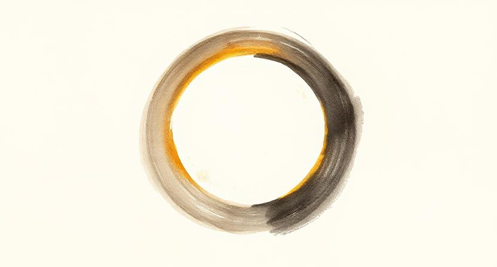

넘어져 무릎이 깨졌을 때, 울기도 전에 나를 일으켜 세우던 손길이 있었습니다. 세상은 선택의 영역이 아니었고, 나를 지켜주던 이들 역시 내가 선택한 사람들이 아니었습니다. 부모, 가족이라는 이름으로 주어진 나의 첫 번째 세계. 그 안에서 나는 안전했지만, 때로는 원치 않는 보호에 숨 막히기도 했습니다.

어른이 된다는 것은, 그 단단하던 세계에 스스로 문을 열고 나오는 일이라는 걸 그때는 몰랐습니다. 법적으로는 성인이지만 정서적으로는 여전히 아이인 채로, 우리는 보호자 없는 시간을 살아갑니다. 모두가 잠든 새벽, 이유 없는 불안에 심장이 내려앉을 때. 중요한 결정을 앞두고 수없이 흔들릴 때. 세상이 너무 거대하게 느껴져 혼자임이 버거울 때. 우리는 문득 깨닫습니다. 어른에게도 여전히 보호자가 필요하다는 것을요.

그래서 우리는 찾아 나섭니다. 내 상처를 들여다보고, 내 편이 되어주고, 필요할 때 기꺼이 어깨를 내어줄 사람. 그리고 동시에, 내가 그런 존재가 되어주고 싶은 단 한 사람을요.

어느 날은 당신이 세상의 무게에 휘청이는 나를 붙잡아 주었고, 또 다른 날은 내가 길을 잃은 당신의 손을 잡았습니다. 아침에는 내가 당신의 불안을 다독이고, 저녁에는 당신이 나의 지친 하루를 안아주었죠. 우리는 그렇게 서로의 어깨를 번갈아 내어주며 각자의 우주를 지켜냈습니다. 이것은 일방적인 보호가 아닌, 서투른 두 사람이 함께 추는 왈츠와 같았습니다.

"내가 너의 보호자가 되겠다."

의무가 아닌 의지로, 책임이 아닌 사랑으로 당신이 이 말을 건넸을 때, 나는 혈연보다 더 무거운 약속의 무게를 느꼈습니다. 선택했기에 더 소중하고, 언제든 떠날 수 있기에 매 순간 서로를 붙잡아야 하는 관계. 그래서 우리는 더 신중해집니다. "밥은 먹었어?", "조심히 들어가" 같은 사소한 안부들이 보이지 않는 보호막이 되어 서로를 지켜준다는 것을 배웁니다.

어쩌면 결혼이란 인류가 만든 가장 오래되고 낭만적인 '보호자 선택 계약'인지도 모릅니다. 기쁠 때 함께 웃고, 아플 때 곁을 지키고, 세상이 등을 돌려도 마지막까지 내 편이 되어줄 한 사람을 법과 사회 앞에서 내 사람으로 공표하는 일. 로맨스와 열정을 넘어, "이제부터 내가 당신을 지킨다"는 엄숙한 약속 말입니다.

매일 아침 눈을 뜨며, 나는 다시 선택합니다. 오늘도 당신의 보호자가 되기를. 그리고 당신에게 기꺼이 보호받는 사람이 되기를.

어린 시절 우리에게 보호자는 '주어지는 것'이었습니다. 하지만 이제야 압니다. 진짜 어른이 된다는 것은 보호자를 잃는 것이 아니라, 비로소 나의 보호자를 선택할 자유와 누군가의 보호자가 될 자격을 얻는 것임을. 그리고 그 선택을 매일 새롭게 이어가는 것임을요.
