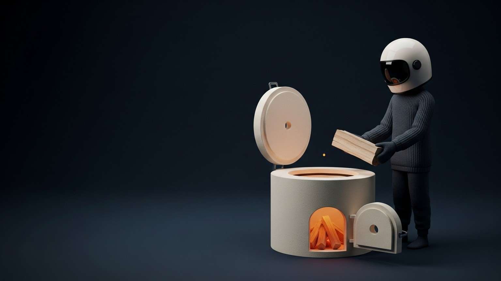

### "덜 애쓰면 더 잘된다"는 말의 수상함

"덜 애쓰면 더 잘된다." 이 문장은 대부분의 사람에게 거짓말처럼 들린다. 살아온 경험이 그 반대를 가리키기 때문이다. 더 오래 준비한 사람이 시험을 잘 보고, 더 오래 연습한 사람이 무대에서 덜 떤다. 밤을 새운 다음 날은 제안서가 통과되고, 느슨한 주는 지표가 내려간다. 인과의 방향은 명확하다. 애쓴 만큼 결과가 나온다.

그런데 상담가 장재열은 《오프 먼트(OFF-MENT)》에서 이 확신을 조심스럽게 비튼다. *목표를 낮추라는 말이 아니다.* 오히려 목표는 품고 있어도 된다. 내려놓아야 하는 건 목표가 아니라, 그 목표를 잡고 있는 손의 힘이라고 한다. 저자는 이것을 '스위치를 끄고 켜는 힘'이라고 부른다. 일과 삶 양쪽에서 스스로의 전원을 조절할 줄 아는 능력. 말은 근사한데, 실제로 뭘 어떻게 하라는 말일까.

### 목표와 강박은 같은 것이 아니다

목표는 방향이다. 어디로 갈 것인가의 문제. 강박은 긴장이다. 그 방향을 붙잡는 손의 힘의 크기. 이 둘은 원래 구분되는데, 일상 속에서 대부분 하나로 묶여 움직인다. 목표가 커질수록 강박도 같이 커지고, 강박이 옅어지면 목표 자체가 흐려진 것처럼 느껴진다.

문제는 여기서 생긴다. 목표와 강박이 한 덩어리로 움직이면, 둘 중 하나를 풀려고 할 때 다른 하나까지 같이 풀린다. 강박만 낮추고 싶어도 목표가 같이 낮아진다. 그래서 많은 사람이 "긴장을 풀어라"는 조언을 받으면 본능적으로 저항한다. 긴장을 풀었다가 목표가 흐려질까 봐. 목표가 흐려졌다가 그 자리가 비어버릴까 봐.

《오프 먼트》가 제안하는 것은 이 한 덩어리를 분리하는 작업이다. 목표는 벡터, 강박은 스칼라. 방향은 유지하되 크기는 조절 가능하다는 감각. 이 감각은 타고나는 것이 아니라 훈련해서 얻는 것에 가깝다.

### 왜 역설은 성립하는가

강박이 문제인 이유는 감정적으로 피곤하기 때문이 아니다. 그 정도면 그저 "힘들지만 해야 한다" 수준에서 끝난다. 진짜 문제는 강박이 목표 달성의 확률 자체를 깎는다는 점이다.

강박은 판단력을 좁힌다. 긴장 상태에 오래 놓인 뇌는 넓은 시야를 포기하고 가까운 위협에 집중한다. 먼 맥락을 보지 못하고, 대안을 떠올리지 못하고, 자신이 지금 잘못된 해결책에 매달리고 있다는 사실조차 인식하지 못한다. 같은 문제 앞에서도 덜 긴장한 사람이 더 나은 답을 내는 이유는 머리가 더 좋아서가 아니라 시야가 더 넓어서다.

회복력도 같이 깎인다. 중요한 일은 대부분 한 번의 시도로 끝나지 않는다. 실패 후에 얼마나 빨리 다시 자세를 잡느냐가 결과를 가른다. 강박이 높은 사람은 실패의 충격이 크고, 충격이 큰 만큼 재정비에 들어가는 시간도 길다. 같은 목표를 쫓는 두 사람 중 한 명이 세 번 넘어졌다가 네 번째에 일어서고, 다른 한 명이 두 번 넘어지고 멈춘다면, 단순한 산수로 후자가 목표에 닿을 확률이 낮다.

그러다 자기 자신까지 소모한다. 장재열은 이 상태를 두고 "깨달음은 끓는 물과 같아서 계속 장작을 넣지 않으면 본래로 돌아간다"고 썼다. 그는 이 문장을 깨달음의 유지 문제로 꺼냈지만, 같은 구조는 에너지 소모에도 적용된다. 강박은 장작을 한 번에 다 태우는 방식이다. 처음 몇 시간은 뜨겁지만, 남은 길이 아직 절반 이상일 때 땔감이 바닥난다. 내려놓음은 장작을 아끼는 기술이다.

이 세 가지가 겹치면 답은 분명하다. 동일한 목표 앞에서, 강박이 낮은 사람이 더 자주 도달한다. 덜 애쓰는 것이 아니라, 애쓰는 방식이 다른 것이다.

### 내려놓음은 포기가 아니다

이 지점에서 자주 오는 오해가 있다. 내려놓음을 '포기', '느슨함', '마음 비우기'와 같은 단어로 읽는 것이다. 이런 독해는 내려놓음을 쉬운 일로 만든다. 그냥 덜 신경 쓰면 되니까. 그러나 《오프 먼트》가 가리키는 내려놓음은 그보다 훨씬 세밀한 작업이다.

유용한 구분은 이렇다. 실행 밀도와 감정 점유율을 나눠보는 것. 실행 밀도는 오늘 하루 동안 이 목표에 투입된 시간과 움직임의 양이다. 감정 점유율은 그 사이 머릿속 공간 중 이 목표가 차지한 비율이다. 지금까지 우리는 두 개가 함께 움직여야만 진심이라고 배워왔다. 밤새 걱정하지 않으면 덜 원하는 거라고, 쉬는 시간에도 머리에 붙어 있지 않으면 책임감이 없는 거라고.

내려놓음의 역설은 여기서 작동한다. 실행 밀도는 그대로 두고 감정 점유율만 떼어내는 것. 오늘 해야 할 일을 어제와 같은 순서, 같은 시간에 하되, 퇴근 후 혹은 샤워 중 혹은 식사 자리에 그 일을 끌고 들어오지 않는 것. "어떻게든 되겠죠"라는 체념처럼 들리는 문장이 실은 이 감정 점유율을 낮추는 선언이다. 포기한다는 뜻이 아니라, 내일 다시 잡을 때까지는 한 번 내려놓는다는 뜻이다.

### 실무의 언어로 번역하면

이 원리를 실무 언어로 옮기면 몇 가지 관찰 가능한 신호로 내려온다.

마감 앞에서의 호흡이 다르다. 강박이 높은 상태에서는 마감 직전에 호흡이 얕아지고, 결과물이 아니라 "어떻게 보일지"에 에너지가 새어나간다. 감정 점유율이 낮은 상태에서는 마감이 다가와도 호흡이 깊게 유지되고, 남은 시간을 결과물 자체에 쓸 수 있다. 같은 사람이 같은 마감 앞에서, 어느 날은 호흡이 얕고 어느 날은 깊다면, 변한 것은 실력이 아니라 손의 힘이다.

실패 후 회복 시간도 다르다. 강박은 실패를 정체성의 문제로 번역하는 경향이 있다. 이 프로젝트가 실패했다는 사실이, 내가 무능한 사람이라는 결론으로 순식간에 건너뛴다. 그러면 회복에 며칠이 필요해진다. 감정 점유율이 낮은 상태에서는 실패가 그냥 실패로 남는다. 원인 분석에 몇 시간, 다음 시도 설계에 몇 시간. 반나절이면 다시 자세가 잡힌다.

중거리 이후의 속도도 다르다. 짧은 기간만 비교하면 강박이 높은 쪽이 빠르게 치고 나간다. 그러나 한 달, 세 달, 여섯 달 단위로 보면 순서가 뒤집히는 경우가 많다. 강박은 단거리 경기에서는 유리하지만, 대부분의 일은 단거리가 아니기 때문이다. 장재열의 비유를 빌리면, 러닝머신에서 버티는 사람과 무빙워크 위에서 제 속도로 걷는 사람 중, 같은 역에 먼저 도착하는 쪽은 후자일 때가 많다.

### 내려놓음은 기질이 아니라 훈련이다

내려놓음의 또 다른 오해는 그것이 타고난 성향의 문제라는 생각이다. 원래 태평한 사람과 원래 불안한 사람이 나뉘어 있고, 불안한 사람은 어쩔 수 없다는 체념. 《오프 먼트》의 제안이 의미 있는 이유는 이 체념을 기각한다는 점이다. 저자는 내려놓음을 기질이 아니라 훈련 대상으로 본다. 빈손 산책, 케렌시아(자기만의 쉼 공간), 의식적 혼자 있기 같은 구체적인 동작들이 반복될 때, 감정 점유율을 조절하는 근육이 조금씩 붙는다.

핵심은 이 근육이 '안 애쓰는 근육'이 아니라 '적절한 순간에 스위치를 끄는 근육'이라는 데 있다. 완전히 꺼둘 필요는 없다. 일할 때는 켜두고, 일이 끝난 뒤에는 끈다. 두 상태를 오갈 수 있다는 것. 그것이 저자가 말하는 오프 먼트다.

이 관점으로 보면 "덜 애쓰면 더 잘된다"는 문장은 더 이상 거짓말처럼 들리지 않는다. 정확히 말하면, 덜 애쓰는 것이 아니라 덜 움켜쥐는 것이다. 목표는 그대로 옆에 둔다. 품에 꼭 껴안지 않을 뿐이다. 껴안은 것은 잘 볼 수 없다. 옆에 두어야 잘 보인다. 그리고 잘 보이는 것이, 결국 잘 닿는다.
