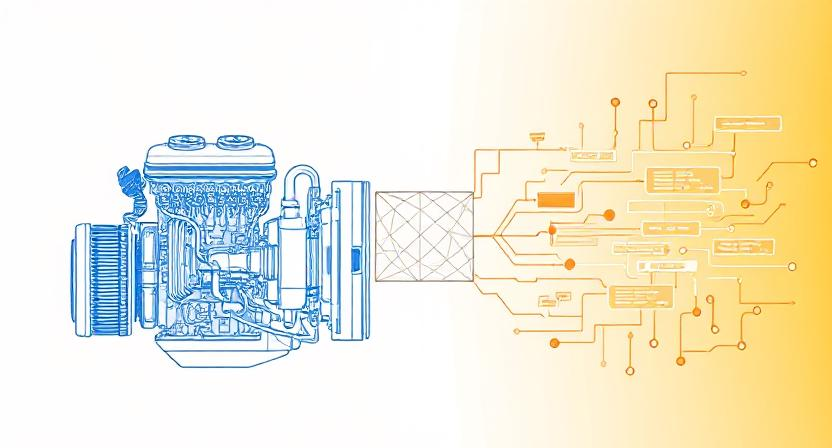

어제 한 친구와 나눈 대화가 계속 머리속을 맴돌고 있다. 기계공학을 전공한 그 친구가 들려준 내연기관의 배기가스 절감 기법에 대한 이야기였는데, 듣다 보니 이게 단순히 자동차 엔진의 이야기가 아니라는 생각이 들었다.

## 물을 엔진에 뿌린다고?

> "엔진에 물을 분사해서 내부 온도를 낮추면, 노킹 현상을 방지하고 출력을 높일 수 있어."

처음 들었을 때는 "엔진에 물을? 고장 나지 않나?"라는 생각이 들었다. 하지만 설명을 듣고 보니 정말 치밀하게 계산된 해결책이었다.

고온에서 발생하는 노킹(비정상 연소)는 물의 증발열로 억제하고, 그 덕분에 점화 타이밍을 최적화해서 출력을 끌어올릴 수 있다는 것이다. 온도를 낮춰서 연소 효율이 좋아지는 게 아니라, `노킹이라는 문제를 해결`해서 엔진이 본래 성능을 발휘할 수 있게 만드는 거였다.

개발자로서 이런 접근이 정말 인상 깊었다. 문제의 근본 원인을 파악하고, 직관적으로는 이상해 보이는 방법으로 해결하는 사고방식 말이다.

## EGR: 배기가스를 다시 넣는다

더 놀라운건 `EGR(Exhaust Gas Recirculation)` 시스템이었다. 이미 연소된 배기가스를 다시 흡기구로 보내서 새로운 공기와 섞는다는 개념이다.

`"왜 더러운 배기가스를 다시 넣는거야?"`라고 물었더니, 친구가 웃으며 설명해줬다. 이미 연소된 CO₂와 H₂O는 불활성 가스라서 산소 농도를 희석시킨다. 그러면 연소 할 수 있는 산소가 줄어드니 연소 온도가 낮아지고, 결국 질소산화물 배출이 줄어든다는 것이다.

여기서 핵심은 `의도적으로 연소 효율을 약간 떨어뜨려서` 환경적 목표를 달성한다는 점이었다. 최고 성능을 포기하고 다른 가치(환경)를 선택하는 엔지니어링적인 결정이다.

정말 기발한 발상이다. 완벽한 연소라는 `국지 최적화`보다, 전체적인 균형을 중시하는 `시스템 최적화`의 사고방식. 그 차이를 배울 수 있었다.

## 제약이 만드는 혁신

가장 인상 깊었던 건 이런 기술들이 탄생한 배경이었다. 환경 규제가 강해질수록 엔지니어들이 더 창의적인 해결책을 만들어낸다는 것이다.

- 질소산화물은 줄여야 하는데
- 출력은 유지해야 하고
- 연비도 좋아야 한다.

이런 상충하는 요구사항들 사이에서 `물 분사, EGR, 다양한 연소 제어 기법`들이 탄생했다. 결국 제약이야말로 혁신을 강제로 끌어내는 연료가 된 셈이다.

소프트웨어 엔지니어링에서도 마찬가지 아닌가? `메모리 제한, 응답 시간 요구사항, 동시 접속자 수` 등등. 이런 제약 조건들이 있기에 우리도 더 효율적인 알고리즘과 아키텍처를 고민하게 되는 것이다.

## ECO 모드와 트레이드오프

ECO 모드에 대한 이야기도 흥미로웠다. 흡기량을 줄이면 배기가스는 줄어들지만 출력도 함께 떨어진다. 완벽한 트레이드오프다.

`"결국 엔지니어링은 트레이드오프의 예술이네."`라고 말했더니, 친구가 고개를 끄덕였다. 모든 것을 다 잡을 수는 없으니, 상황에 따라 무엇을 우선할지 선택하는 것이 핵심이라고.

개발에서도 매일 마주하는 고민이다.

- 성능 vs 가독성
- 기능 vs 단순함
- 속도 vs 안정성

`정답은 없고, 상황에 맞는 최선의 선택만 있을 뿐이다.`

## 격자틀 멘탈모델, 다시 한번 확신하다

평소 찰리 멍거의 `'격자틀 멘탈모델(Lattice Mental Models)'`을 정말 좋아했는데, 이번 대화를 통해 그 위력을 다시 한번 체감했다. 서로 다른 학문 분야의 핵심 원리들이 하나의 격자처럼 연결되어, 더 깊은 이해와 통찰을 만들어낸다는 이 개념이 얼마나 강력한지 새삼 느꼈다.

**기계공학의 내연기관 원리에서 배운 것들:**

- 고정관념을 깨는 발상의 전환 (물을 엔진에 뿌리기)
- 제약 조건을 혁신의 기회로 보는 시각 (환경 규제 -> 새로운 기술)
- 복잡한 시스템에서 핵심 변수를 찾아내는 능력 (온도가 모든 걸 결정)
- 상충하는 요구사항 사이에서 균형점을 찾는 지혜 (성능 vs 환경)

이런 사고법들은 소프트웨어 개발은 물론, 비즈니스, 투자, 인간관계에까지 적용할 수 있다. 한 분야에서 깊이 있게 학습한 원리가 다른 모든 영역의 문제 해결에 도움이 되는 것이다.

멍거가 `"진정한 지혜는 여러 학문의 핵심 아이디어들을 머릿속에서 격자처럼 연결할 때 나온다"`고 했을 때, 이론적으로는 이해했다고 생각했다. 실전적으로도 그 중요성에 대해 어렴풋 이해하고 있었다. 하지만 오늘처럼 실제로 한 분야의 깊은 지식이 완전히 다른 영역의 사고를 확장시키는 순간을 경험하니, 왜 이 개념에 그렇게 매료되었는지 다시 한번 확신하게 되었다.

예전에도 비슷한 경험이 있었다. `우리가 보고 있는 별은 이미 수십억 년 전에 없어져 더 이상 존재하지 않는 별일 수도 있다`는 천체물리학의 개념을 처음 들었을 때, 문득 이런 생각이 들었다. 그렇다면 지구 반대편과 네트워크 통신을 할 때도 비슷한 일이 일어나는 건 아닐까?

내가 지금 보내는 데이터 패킷이 상대방에게 도달할 때 쯤, 내 서버는 이미 다른 상태가 되어있을 수도 있다. 결국 분산 시스템에서 일관성 문제를 다루는 것도, 빛의 속도 제한으로 인한 정보 전달 지연을 다루는 것과 본질적으로 같은 문제인 셈이다.

천체물리학에서 개발까지, 전혀 다른 분야지만 `'시간과 정보'`라는 공통 분모로 연결되는 순간이었다.

## 감사의 마음

한 시간도 안 되는 대화였지만, 완전히 다른 분야에서 이렇게 많은 영감을 얻을 줄 몰랐다. 무엇보다 복잡한 공학적 원리를 이렇게 쉽고 재미있게 설명해주는 친구의 능력에 감탄했다.

전공 지식을 일상 언어로 번역하는 능력, 그리고 상대방이 이해할 수 있도록 친절하게 설명하는 마음씨. 이런 사람과 함께 이야기하는 시간이 얼마나 소중한지 새삼 느꼈다.

기계공학을 전공했지만 지금은 개발자로 일하고 있는 친구에게 고마운 마음이다. 전공 지식을 잊지 않고 간직하면서도, 내가 흥미를 가질 수 있도록 연결고리를 만들어준 그 센스와 배려심.

앞으로도 이런 대화를 계속 나눌 수 있기를 바란다. 서로 다른 분야에서 배운 것들을 나누며, 함께 성장해나가는 관계. 이게 바로 진정한 친구가 아닐까?

**"모든 학문은 연결되어 있다"는 말의 참뜻을 알 것 같다. 오늘도 또 하나 배웠다.**

앞으로도 이런 대화를 계속 나눌 수 있기를 바란다. 서로 다른 분야에서 배운 것들을 나누며, 서로의 사고 격자를 한 칸씩 촘촘하게 메워가는 관계. 그 과정에서 우리는 조금 더 깊고, 조금 더 넓게 세상을 이해하게 될 것이다.

언젠가는 내가 또 다른 분야의 이야기를 들려줄 차례가 오겠지. 그때 이 친구의 격자에도 새로운 선이 그어질 것이다. 모든 학문이 연결되어 있다는 말, 오늘 나는 그것을 머리가 아니라 가슴으로 배웠다.
