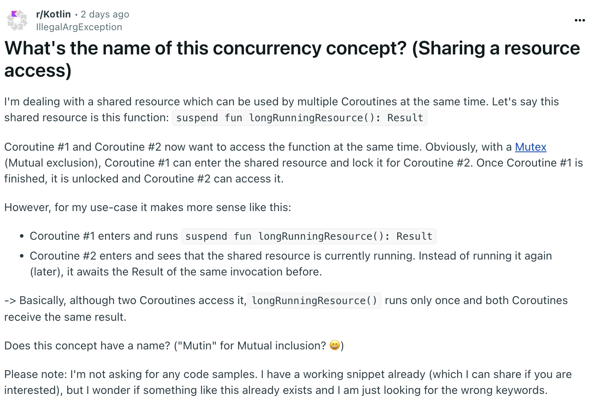

<iframe src="https://embed.reddit.com/r/Kotlin/comments/1icz7k8/whats_the_name_of_this_concurrency_concept"    scrolling="no" width="100%" height="316"></iframe>

## 원문 상황

- OP가 설명한 상황: 동일 메소드에 대한 여러 비동기 요청이 있을때, 이미 다른 비동기 요청에 의해 처리중이라면, 다시 내부 로직을 수행하지 않고 다른 요청의 처리 결과를 기다렸다가 사용하고 싶음.
- 예시: 한번 호출 할 때 마다 비용이 발생하는 외부 API를 호출하는데, 같은 식별자(key)로 여러 요청이 들어오면 기존 요청의 처리 결과를 기다렸다가 사용

## 제안된 해결 방식들

### 1. Structured Concurrency 활용

- coroutineScope 사용: `all-or-nothing` 방식으로 동작.
  - 하나의 자식 코루틴이 실패하면 모든 자식 코루틴을 즉시 취소함.
  - 실패를 상위로 전파하며, 트랜잭션과 같은 원자적 작업에 적합함.
- supervisorScope와는 차이점이 있음: 각 자식 코루틴이 독립적으로 동작함.
  - 실패를 격리시키고 부분적 실패를 허용함.
  - 독립적인 작업들을 실행할 때 적합함.

### 2. Single Flight 패턴

- 동일한 작업이 동시에 요청될 때 중복 실행을 방지
- 첫 번째 요청만 실제로 실행하고 나머지는 그 결과를 공유
- 실제 사용 사례:
  - 캐시가 없을 때 여러 요청이 동시에 들어오는 상황
  - API 호출 중복 방지
  - 리소스 낭비 방지
- Reference: [Golang의 singleflight](https://pkg.go.dev/golang.org/x/sync/singleflight)

## Conclusion

This discussion covers two important concurrency patterns in Programming(e.g. Kotlin):

1. The fail-fast pattern using coroutineScope, which cancels all operations when one fails
2. The Single Flight pattern, which deduplicates concurrent requests for the same operation

While they serve different purposes:

- Fail-fast focuses on error propagation and maintaining consistency
- Single Flight optimizes resource usage by preventing duplicate operations

Both patterns are valuable tools in building robust concurrent systems with Kotlin.

## My Thoughts

As a backend engineering, I find this discussion particularly relevant since it addresses a common business scenario we often encounter. When multiple clients requests the same resource simultaneously (e.g. fetching user profiles or processing payment transactions), we need to carefully handle these concurrent requests to optimize system resources and maintain data consistency.

What fascinates me is how Golang has built-in support for this pattern through their `singleflight` package. It shows that this concurrency pattern is so commonly needed that they decided to provide it at the language ecosystem level. This makes me wonder why other languages haven't adopted similar built-in solutions.

In my experience with Kotlin and Spring Boot, we often have to implement this pattern ourselves or rely on caching mechanisms. While these solutions work, having a standardized approach like Go's would be beneficial for consistency across different projects and team.

While this pattern might not be 100% applicable in distributed environments with multiple instances, having it as part of the ecosystem provides valuable insights into solving concurrency challenges. Without exploring Go or studying various concurrency patterns, I might never have discovered this elegant approach to handling duplicate requests.

Have you encountered similar concurrency challenges in your project? How did you handle them?