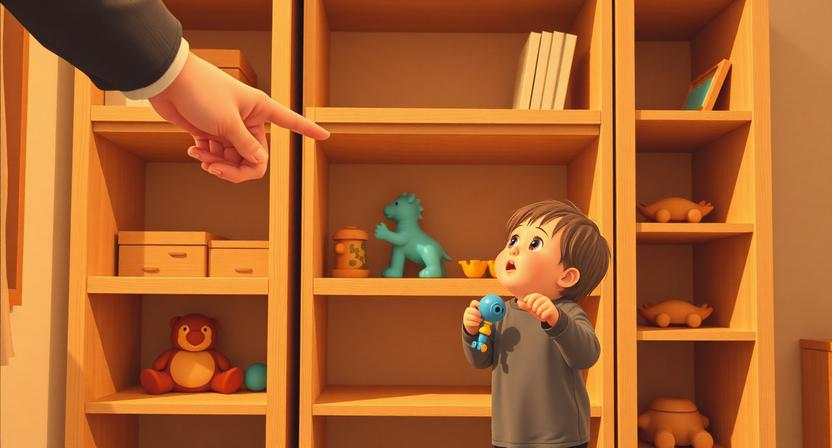

### "치워" vs "이건 어디에 두면 돼?"

아이에게 "장난감 치워"라고 말하면, 십중팔구 꿈쩍도 하지 않는다. 한 번 더 말하면 겨우 몸을 일으키고, 세 번째 말해야 투덜거리며 움직인다. 그런데 같은 상황에서 장난감 하나를 집어 들고 "이건 어디에 두면 돼?"라고 물으면, 아이가 직접 와서 보여준다. "이건 여기, 이건 저기." 어느새 자기가 치우고 있다. 아무도 치우라고 명령하지 않았는데.

이 차이가 매니지먼트의 거의 모든 것을 설명한다. 명령은 저항을 만들고, 장면은 행동을 만든다. 아이를 키우는 것과 팀을 이끄는 것은 놀라울 정도로 닮아 있다. 둘 다 내가 원하는 방향으로 상대를 움직여야 하지만, 직접 움직일 수는 없다. 상대가 스스로 움직이게 만들어야 한다.

### 왜 명령은 저항을 만드는가

"이렇게 해." 이 한마디에는 암묵적인 메시지가 담겨 있다. "네 판단은 필요 없어. 내가 정한 대로 따라와." 명령을 받는 순간, 사람의 뇌는 자율성을 위협받았다고 판단한다. 설령 명령의 내용이 합리적이더라도, 형식 자체가 저항을 유발한다. 이건 고집이 아니라 본능이다.

외부 동기와 내부 동기의 차이가 여기 있다. 외부 동기는 누군가 시켜서 하는 것이다. 보상이 있으니까, 혼나기 싫으니까, 그냥 시키니까. 이런 동기는 빠르게 작동하지만 오래가지 않는다. 감시가 사라지면 행동도 사라진다. 반면 내부 동기는 스스로 하고 싶어서 하는 것이다. 재밌으니까, 의미가 있으니까, 내 문제라고 느끼니까. 이 동기는 느리게 시작하지만 훨씬 오래 지속된다.

명령은 외부 동기를 만든다. 장면은 내부 동기를 만든다. "이렇게 해"는 행동을 강제하지만, "이건 어디에 두면 돼?"는 생각을 유도한다. 생각이 시작되면 행동은 자연스럽게 따라온다. 그리고 그 행동은 시킨 것이 아니라 자기가 선택한 것이 되므로, 책임감과 몰입이 달라진다.

### 장면이 행동을 유도하는 원리

추상적인 지시는 사람을 얼어붙게 한다. "코드 품질을 높여주세요"라고 말하면, 듣는 사람의 머릿속에는 아무런 그림도 떠오르지 않는다. 코드 품질이 뭔지는 알지만, 지금 당장 무엇을 해야 하는지는 모호하다. 반면 "김 개발자, 지난주에 올린 결제 모듈 PR에서 에러 핸들링 빠진 부분 세 곳이 있었어요"라고 말하면, 머릿속에 구체적인 장면이 떠오른다. 어떤 파일의 어떤 부분인지 바로 떠올리고, 무엇을 해야 하는지 선명해진다.

고유명사의 힘이 여기 있다. "잘해주세요"는 아무것도 상기시키지 않지만, "지난 목요일 스탠드업에서 이야기한 그 건"이라고 말하면 기억의 회로가 켜진다. 구체적인 이름, 날짜, 장소, 상황. 이런 고유명사들이 머릿속에 장면을 그린다. 장면이 그려지면 감정이 붙고, 감정이 붙으면 행동이 따른다.

좋은 지시는 명령문이 아니라 묘사문이다. 상대의 머릿속에 구체적인 장면을 심어주는 것. "더 잘해"가 아니라, "이런 상황에서 이렇게 되면 어떨까"를 보여주는 것이다.

### 실수를 체험하게 하는 기술

아이에게 칫솔을 거꾸로 잡으면 안 된다고 백 번 말해봐야 소용이 없다. 하지만 칫솔 자루 쪽으로 이를 닦아보게 하면, 한 번에 이해한다. "아, 이쪽으로 하면 안 닦이는구나." 직접 체험한 실수는 백 마디 설명보다 강력하다.

이 원리는 조직에서도 동일하게 작동한다. 신입 개발자에게 "테스트 코드를 꼭 작성하세요"라고 열 번 말하는 것보다, 테스트 없이 배포했다가 장애가 나는 경험을 한 번 하게 하는 것이 더 효과적이다. 물론 치명적인 장애를 일부러 만들 수는 없다. 하지만 안전한 범위 안에서 실수를 경험하게 하는 것은 가능하다. 스테이징 환경에서 배포해보게 하거나, 작은 프로젝트에서 자기 판단대로 진행해보게 하거나.

중요한 건, 실수 후에 혼내지 않는 것이다. "그것 봐, 내가 뭐라고 했어"라는 말은 체험의 가치를 제로로 만든다. 실수를 체험한 직후에 필요한 건 지적이 아니라 질문이다. "어떻게 된 것 같아?" "다음에는 어떻게 하면 좋을까?" 이 질문이 상대로 하여금 자기 경험에서 스스로 교훈을 끌어내게 한다. 결론을 내 입으로 말하는 순간, 그건 상대의 깨달음이 아니라 나의 잔소리가 된다.

### 조직에서의 적용

코드 리뷰를 생각해보자. "이 코드는 좋지 않습니다. 수정해주세요"라는 코멘트와, "이 함수가 호출되는 시점에 connection pool이 소진된 상태라면 어떻게 될까요?"라는 코멘트. 전자는 명령이고 후자는 장면이다. 전자를 받으면 방어적이 되고, 후자를 받으면 생각하게 된다. 후자는 상대의 머릿속에 특정 시나리오를 그려주고, 스스로 문제를 발견하게 만든다.

온보딩도 마찬가지다. 새로 합류한 사람에게 문서 더미를 던져주는 것과, "첫 주에는 이 기능 하나를 직접 배포까지 해보세요"라고 하는 것은 완전히 다른 경험이다. 전자는 정보의 전달이고, 후자는 장면의 설계다. 직접 배포하는 과정에서 빌드 파이프라인을 이해하고, 코드 리뷰 프로세스를 겪고, 배포 후 모니터링을 확인하게 된다. 누가 설명하지 않아도, 장면이 가르친다.

팀 가이드라인을 만들 때도 같은 원리가 적용된다. "커뮤니케이션을 활발히 합시다"라는 선언은 아무런 행동도 만들지 않는다. 하지만 "PR을 올리면 24시간 안에 최소 한 명이 리뷰한다"라는 구체적인 장면을 제시하면, 행동이 따라온다. 원칙은 추상적이어도 되지만, 가이드라인은 장면이어야 한다.

### 좋은 매니저는 답이 아니라 장면을 만든다

명령하는 매니저는 팀이 자기 없이는 움직이지 못하게 만든다. 모든 결정이 매니저를 거쳐야 하고, 모든 판단이 매니저의 승인을 필요로 한다. 이 구조는 매니저의 존재감을 높이지만, 팀의 자율성을 죽인다. 매니저가 병목이 되고, 팀원은 실행자로 고정된다.

장면을 만드는 매니저는 다르다. 이들은 팀원이 스스로 판단하고 행동할 수 있는 환경을 설계한다. 결정을 내려주는 대신, 결정에 필요한 맥락을 보여준다. 답을 알려주는 대신, 답을 찾을 수 있는 질문을 던진다. 실수를 막는 대신, 안전한 범위에서 실수를 경험하게 한다.

아이에게 "장난감 치워"라고 말하면, 아이는 부모의 지시에 반응하는 존재로 남는다. "이건 어디에 두면 돼?"라고 물으면, 아이는 정리의 주체가 된다. 조직도 같다. "이렇게 해"라고 지시하면 팀원은 수동적 실행자로 남고, "이런 상황인데, 어떻게 하면 좋을까?"라고 장면을 보여주면 팀원은 문제의 주인이 된다.

결국 좋은 매니지먼트란 사람을 움직이는 기술이 아니다. 사람이 스스로 움직이고 싶어지는 장면을 만드는 기술이다. 명령은 순간의 행동을 만들지만, 장면은 지속적인 판단력을 만든다. 답을 줄수록 의존이 생기고, 장면을 줄수록 자율이 생긴다. 그래서 가장 좋은 매니저는 팀이 자기 없이도 잘 돌아가게 만드는 사람이다. 역설적이지만, 존재감이 사라지는 것이 최고의 성과다.
