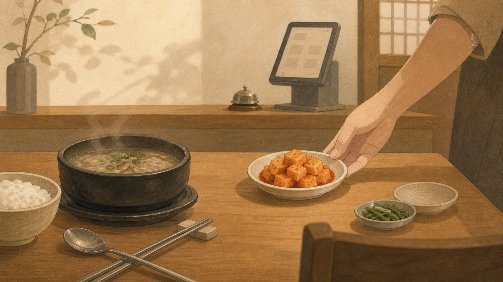

## 손을 드는 제품

국밥집에 앉아 있다. 국밥은 아직 반쯤 남았고, 깍두기 접시는 비었다. 예전이라면 손을 들어야 했다. 저기요, 깍두기 좀 더 주세요. 손을 들고, 눈을 맞추고, 필요한 것을 말한다. 그러면 누군가 와서 빈 접시를 채워준다.

2000년대 초반의 온라인 서비스는 대체로 이 방식에 가까웠다. 사용자는 자기가 원하는 것을 알고 있어야 했고, 그것을 하나씩 입력해야 했다. 주소를 쓰고, 옵션을 고르고, 검색어를 넣고, 게시판에 글을 남겼다. 서비스는 사용자의 요청을 기다렸다가 처리했다. 오프라인에서 하던 일을 화면 위로 옮겼을 뿐이다.

물론 그 자체로도 큰 변화였다. 물리적으로 가야 했던 일을 집에서 할 수 있게 되었고, 전화로 말해야 했던 것을 텍스트로 남길 수 있게 되었다. 다만 제품의 역할은 아직 수동적이었다. 사용자가 먼저 손을 들어야만 움직였다.

## 오프라인을 화면으로 옮기던 시절

초기의 제품은 세상을 바꾸기보다 세상을 복제했다. 은행 창구는 인터넷뱅킹 화면이 되었고, 숙박 장부는 예약 사이트가 되었고, 음식점 전단지는 배달 페이지가 되었다. 이름은 온라인 서비스였지만, 내부 구조는 오프라인 절차를 닮아 있었다.

사용자는 이미 목적을 알고 있었다. 송금해야 할 계좌가 있고, 예약해야 할 날짜가 있고, 먹고 싶은 메뉴가 있었다. 제품은 그 목적을 입력받는 창구였다. 잘 만든 제품은 입력을 덜 헷갈리게 하고, 오류를 줄이고, 처리 결과를 빠르게 보여줬다. 그래도 중심은 사용자에게 있었다. 사용자가 무엇을 원하는지 말해야 제품이 움직였다.

이 층의 제품에서 좋은 경험은 정확한 접수였다. 내가 말한 것을 제대로 알아듣는 것. 내가 입력한 것을 잃어버리지 않는 것. 오프라인보다 덜 번거롭게 처리해주는 것. 당시에는 이것만으로도 충분히 좋았다.

## 버튼이 만든 효율

스마트폰이 나오면서 제품은 다음 층으로 올라갔다. 이제 제품은 단순히 요청을 받는 창구가 아니라, 행동을 짧게 만드는 도구가 되었다. 토스는 송금을 가볍게 만들었고, 야놀자는 숙소를 찾고 예약하는 시간을 줄였고, 배달의민족은 전화 주문의 어색함을 버튼 몇 번으로 바꿨다.

국밥집으로 치면, 손을 들고 말할 필요가 줄어든 셈이다. 테이블 위에 버튼이 생기고, 키오스크에 깍두기 추가 메뉴가 생겼다. 사용자는 여전히 깍두기가 필요하다는 사실을 알아야 하지만, 요청하는 과정은 훨씬 쉬워졌다.

이 시기의 제품은 효율을 팔았다. 같은 일을 더 빠르게, 더 적은 노력으로, 더 덜 민망하게. 사용자는 제품을 쓰면서 효능감을 느꼈다. 내가 직접 했지만, 전보다 훨씬 쉬웠다. 이 감각이 지난 10여 년간 많은 소비자 제품의 성장을 만들었다.

하지만 버튼은 어디까지나 버튼이다. 누르려면 먼저 알아차려야 한다. 깍두기가 비었다는 것도, 더 먹고 싶다는 것도, 버튼을 누르면 된다는 것도 사용자가 알아야 한다. 제품은 사용자의 실행을 도왔지만, 사용자의 판단 앞에서는 기다렸다.

## 요청 전에 움직이는 시스템

지금의 제품은 이 정도로 부족하다. 사용자가 버튼을 더 쉽게 누르게 만드는 일만으로는 충분하지 않다. 좋은 제품은 사용자가 버튼을 누르기 전에 상황을 읽고, 먼저 처리하거나, 적어도 다음 행동을 제안해야 한다.

깍두기 접시가 비어가면 직원이 조용히 다가와 묻는다. 더 드릴까요. 여기서 경험은 달라진다. 사용자는 요청하지 않았지만, 필요한 순간을 알아봐 준다는 감각을 얻는다. 귀찮은 일을 대신했다기보다, 내 상태를 보고 있었다는 느낌에 가깝다.

제품에서도 같은 일이 벌어진다. 금융 서비스는 사용자가 직접 찾기 전에 이번 달 지출에서 이상한 패턴을 알려줄 수 있다. 여행 서비스는 사용자가 검색창에 날짜를 넣기 전에 가격이 내려갈 가능성이 큰 시점을 제안할 수 있다. 배달 서비스는 사용자가 배고프다고 말하기 전에, 반복되는 생활 리듬과 냉장고가 비는 타이밍을 보고 선택지를 좁혀줄 수 있다.

중요한 것은 자동화 그 자체가 아니다. 아무 일이나 먼저 해버리는 제품은 불편하다. 사용자는 자기 삶을 빼앗기고 싶어 하지 않는다. 필요한 것은 선제 실행과 선제 제안의 균형이다. 확실한 것은 조용히 처리하고, 판단이 필요한 것은 좋은 선택지로 건넨다.

## 사용자는 자기가 원하는 것을 모른다

왜 제품은 여기까지 와야 할까. 사용자가 게을러져서가 아니다. 실행 비용이 낮아졌기 때문이다. 원하는 것이 분명한 사람은 이제 직접 해버린다. 검색하고, 비교하고, 만들고, 주문하고, 예약하는 비용은 계속 낮아지고 있다. 실행력이 싸질수록, 실행을 대신해주는 것의 가치는 줄어든다.

남는 문제는 다른 곳에 있다. 많은 사용자는 자기가 무엇을 원하는지 모른다. 더 정확히 말하면, 원하는 것을 말로 정리하기 전의 상태에 머문다. 돈을 아끼고 싶지만 어떤 지출을 줄여야 할지 모르고, 쉬고 싶지만 어디로 가야 회복될지 모르고, 팀을 개선하고 싶지만 무엇부터 손대야 할지 모른다.

이 상태에서 제품이 할 일은 명령을 기다리는 것이 아니다. 사용자의 상황을 읽고, 선택지를 정리하고, 지금 할 만한 일을 제안하는 것이다. 사용자가 이미 답을 알고 있다면 제품은 실행 도구면 충분하다. 사용자가 답을 모를 때 제품은 판단의 보조 장치가 되어야 한다.

제품의 무게중심은 그래서 실행에서 발견으로 옮겨간다. 사용자가 더 빨리 하게 만드는 것에서, 사용자가 자기 상태를 더 빨리 이해하게 만드는 것으로. 버튼을 잘 배치하는 능력보다, 어떤 버튼을 보여주지 않아도 되는지 아는 능력이 더 중요해진다.

## 버튼 다음에 남는 일

제품의 세 층을 이렇게 볼 수 있다. 첫 번째 층은 입력을 받는 제품이다. 사용자가 원하는 것을 말하면 정확히 처리한다. 두 번째 층은 효율을 높이는 제품이다. 사용자가 해야 할 일을 더 쉽고 빠르게 만든다. 세 번째 층은 먼저 제안하는 제품이다. 사용자가 무엇을 해야 할지 모르는 상태에서 다음 행동의 후보를 보여준다.

이 변화는 기능 목록의 문제가 아니다. 제품이 사용자를 어떻게 바라보느냐의 문제다. 사용자를 명령을 내리는 사람으로 볼 것인가, 버튼을 누르는 사람으로 볼 것인가, 아니면 아직 자기 필요를 말로 만들지 못한 사람으로 볼 것인가. 같은 화면이라도 이 관점에 따라 전혀 다른 제품이 된다.

앞으로의 제품은 더 많은 버튼을 만드는 쪽으로 가지 않을 것이다. 버튼은 여전히 필요하지만, 버튼이 많다는 것은 사용자가 그만큼 많이 판단해야 한다는 말이기도 하다. 좋은 제품은 버튼을 늘리기보다 사용자의 판단 부담을 줄인다. 그리고 그 판단을 빼앗지 않는 선에서, 다음에 할 만한 일을 먼저 건넨다.

깍두기를 더 달라고 말하는 제품에서, 깍두기 버튼을 누르게 하는 제품으로. 그리고 이제는 빈 접시를 보고 조용히 다가오는 제품으로. 버튼 다음의 제품은 거기에 있다. 사용자가 손을 들기 전에, 사용자가 아직 말로 꺼내지 못한 필요를 알아보는 쪽에.
