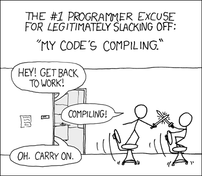
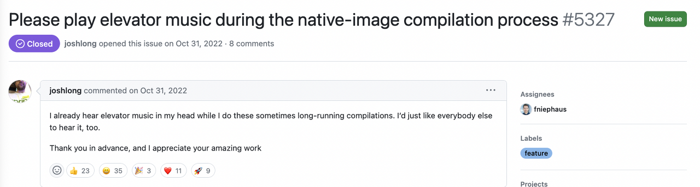
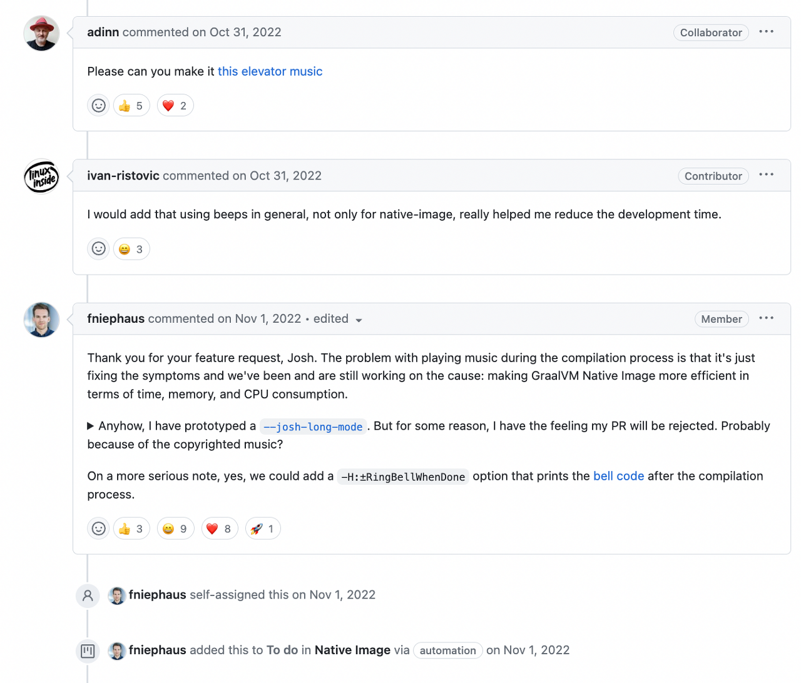
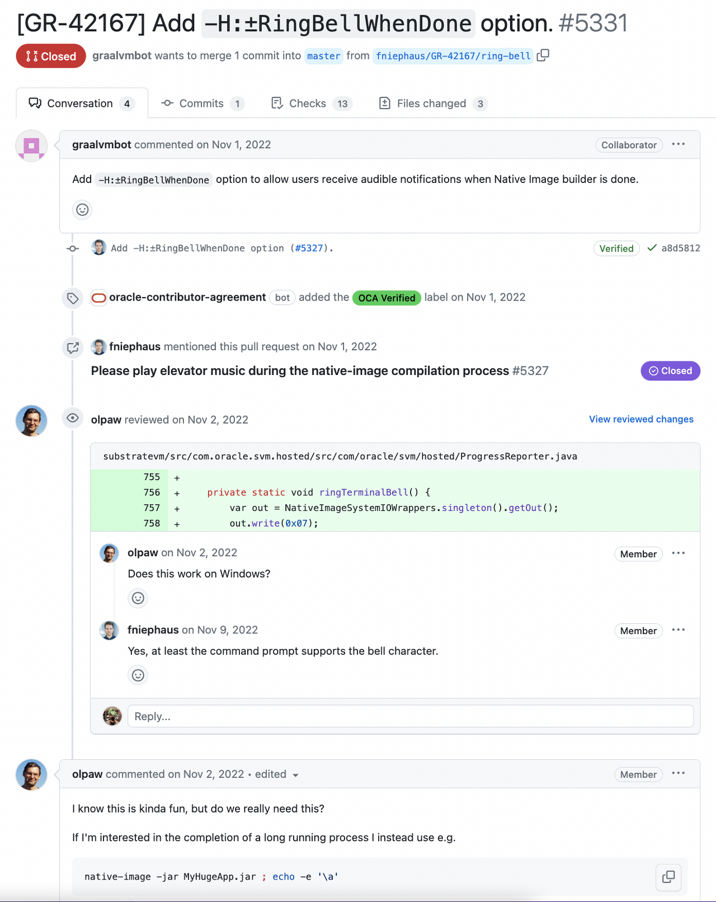
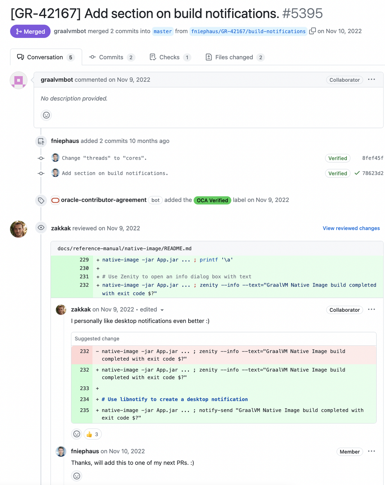

출처: https://xkcd.com/303

유명한 한 컷의 만화가 있습니다. `<My Code's Compling>`

업무 시간에 일은 안하고 동료와 칼싸움(...)을 하고 있는 사람에게 상사가 '돌아와 일해라'라고 이야기하니 컴파일중이라고 말하고, 상사는 알겠다며 하던 일(칼싸움)을 마저하라는 짧은 만화인데요.

이 만화가 처음 등장했을 때에는 C++ 언어로 작성된 소스코드를 컴파일하는데 오래 걸리는걸 유머스럽게 풀어낸 것이지만.. 그 이후 시간이 지나며 C++보다 더 오래걸리고 느린 언어들이 훨씬 많아졌습니다.

출처: https://thenewstack.io/which-programming-languages-use-the-least-electricity

최근 자바/스프링 진영에도 Spring Native, Native Compile이 도입되면서 이를 사용하는 경우 정말 느린 컴파일 속도를 경험해볼 수 있는데,  이와 관련하여 재미있는 오픈소스 Issue 및 PR이 있어 공유해봅니다.

> Native Compile이 느린 이유는 여기서 서술하지 않으니 궁금하시다면 AOT Compile과 JIT Compile에 대해 찾아보시면 좋을 것 같습니다.

출처: https://github.com/oracle/graal/issues/5327

이 이슈는 joshlong(VMware Spring team 소속으로 Spring Project를 만들고 있음)이 올린 이슈로 컴파일이 오래 걸릴때 마다 엘리베이터에서 흘러나오는 음악이 머릿속에서 재생되고 있고, 다른 사람들도 이걸 들을 수 있으면 좋겠다는 이슈(기능 제안)이었습니다.

얼핏 보면 정말 황당한 이슈입니다. 하지만..

Andrew Dinn(adinn; Red Hat Distringuished Engineer), Ivan Ristović(ivan-ristovic; Oracle SDE), Fabio Niephaus(fniephaus; Oracle SDE) 같은 거장들이 이걸 재미있게 받아들이며, 관련 PR이 1차로 올라오게 됩니다.

출처: https://github.com/oracle/graal/pull/5331

1차 PR은 더 나은 확장성과 효율성을 고려하여 Closed 되었고,

출처: https://github.com/oracle/graal/pull/5395

2차 PR에서 최종적으로 Merged 되어 관련 내용이 문서에 포함되게 됩니다.