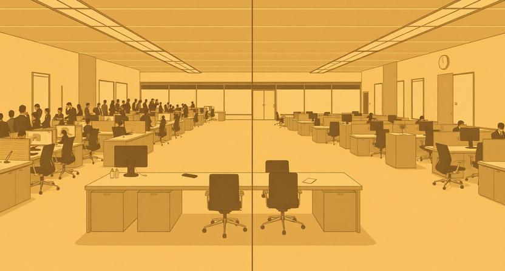
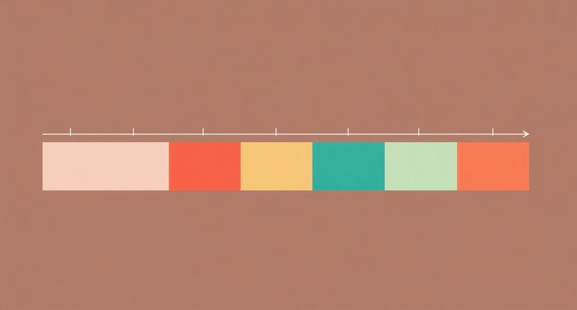

스프린트가 끝났다. 개발자들은 할 일이 없다. 기획은 아직 안 나왔고, 디자인은 리뷰 중이다. 백로그에는 "추후 논의"라고 적힌 티켓만 쌓여 있다.

이상한 일이다. 팀의 실행 속도는 분명히 빨라졌다. 예전에 2주 걸리던 피처를 3일 만에 끝낸다. 그런데 팀 전체의 속도는 오히려 느려진 것 같다. 실행이 빨라진 건 좋은 일이다. 그런데 왜 팀은 더 불안해졌을까.

### How의 비용은 0에 수렴하고 있다

AI 코딩 도구, 자동화 파이프라인, 코드 생성기. 지난 3년간 "만드는 비용"은 극적으로 줄었다. 과거에 시니어 개발자 2명이 2주를 써야 했던 기능을, 지금은 주니어 1명이 3일이면 끝낸다. 이건 과장이 아니다. 실제로 수많은 팀에서 일어나고 있는 일이다.

How — 어떻게 만들 것인가 — 의 비용은 빠르게 0에 수렴하고 있다. 구현은 점점 쉬워지고, 같은 결과물을 내는 데 필요한 사람과 시간은 줄어든다. 기술의 진보다. 축하할 일이다.

그런데 한 가지 비용은 전혀 줄지 않았다. What — 무엇을 만들 것인가 — 를 결정하는 비용이다. 어떤 문제를 풀어야 하는지 파악하고, 아이디어를 구체화하고, 방향을 잡는 데 걸리는 시간은 여전히 똑같다. 오히려 선택지가 늘어나면서 더 오래 걸리기도 한다.

How는 점점 싸지는데, What은 여전히 비싸다. 여기서 역설이 시작된다.

### 그래서 기업은 개발자를 내보낸다

개발자들의 생산성이 높아지면 무슨 일이 벌어질까. 직관적으로는 "팀이 더 많은 걸 만든다"가 답이어야 한다. 하지만 현실은 다르다. 개발자들이 논다.

논다는 건 게으르다는 뜻이 아니다. 실행할 거리가 없다는 뜻이다. What이 나오는 속도보다 How가 소화하는 속도가 압도적으로 빨라졌기 때문이다. PM과 디자이너가 기획하고 디자인하는 속도가 병목이 되어버렸다.

이때 기업에게는 두 가지 선택지가 있다.

**a. 병목 포지션을 충원한다.** PM이나 디자이너를 더 뽑아서 What의 처리량을 늘린다.

**b. 개발자를 줄인다.** How의 처리량을 What의 속도에 맞춘다.

논리적으로는 a가 맞다. 하지만 현실에서 b는 압도적으로 쉽다. 적합한 PM이나 디자이너를 찾는 건 정말 어렵다. 비용이나 연봉의 문제가 아니라, 정말 맞는 사람을 찾는 것 자체가 난제다. 반면 개발자를 줄이는 건 숫자 계산만 하면 된다.

그래서 많은 기업들이 구조조정을 택한다. 이것이 지난 3년간 우리가 목격한 흐름의 구조적 원인이다. 실행력이 높아질수록, 실행하는 사람의 자리가 위태로워지는 역설. 빨라진 실행이 느려진 팀을 만들고, 느려진 팀이 더 적은 사람을 요구한다.

### What을 나눠야 한다

그렇다면 이 역설을 어떻게 깰 수 있을까.

핵심은 간단하다. What을 PM과 디자이너만의 영역으로 두지 않는 것이다. 문제 파악, 아이디에이션, 방향 설정 — 이 과정에 엔지니어가 함께 참여해야 한다.

말처럼 쉽지는 않다. 그래도 구체적인 방법은 있다.

**고객 문의 기반 문제 파악에 참여한다.** 고객이 어떤 문제로 문의를 넣는지, 어떤 기능을 예상과 다르게 쓰는지를 엔지니어가 직접 보는 것만으로도 시야가 달라진다. 단순 알림용으로 만든 웹훅을 고객이 자체 자동화 파이프라인의 핵심 트리거로 쓰고 있다면 — 그건 엔지니어가 가장 빨리 포착할 수 있는 종류의 인사이트다.

**벤치마크 세션을 함께 한다.** 경쟁사 분석, 시장 리서치를 PM만 하는 게 아니라, 팀 전체가 주기적으로 함께 들여다본다. 엔지니어의 관점에서 보이는 기술적 가능성이 전혀 다른 아이디어를 만들어내기도 한다.

**프로토타이핑으로 아이디에이션에 기여한다.** 피그마 목업 대신 실제로 동작하는 프로토타입을 빠르게 만들어서 팀의 논의를 앞당긴다. How가 저렴해진 세상에서, 프로토타입을 만드는 비용도 거의 없다.

결국 How만 잘하는 사람은 대체 가능해진다. What에 참여할 수 있는 엔지니어만이 팀에서 유의미한 자리를 유지할 수 있다. 이건 위협이 아니라 기회다. 과거에는 엔지니어가 기획에 참여할 여유가 없었지만, 지금은 실행 시간이 줄어든 만큼 여유가 생겼으니까.

### What과 How를 같은 스프린트에서 하지 않기

What에 참여하는 것만으로는 부족하다. 운영 구조도 바뀌어야 한다.

가장 흔한 실수는 같은 문제에 대한 What과 How를 같은 스프린트에서 동시에 진행하는 것이다. 이번 스프린트에 문제를 파악하면서, 동시에 그 해결책을 구현하려고 한다. 이러면 무조건 블로킹이 생긴다. What이 늦어지면 How가 멈추고, How가 멈추면 엔지니어가 또 논다.

더 큰 문제는 리스크다. What 단계에서 방향이 틀어지면, 같은 스프린트에서 진행 중이던 How 작업이 통째로 날아간다. 스프린트의 2/3를 한순간에 잃는 것이다.

해법은 교차 운영이다. 나는 이걸 "1/3 법칙"이라고 부른다.

스프린트의 1/3은 미래의 What에 쓴다. 문제를 파악하고, 싱크하고, 아이디에이션한다. 나머지 2/3는 이미 정의된 What의 How를 실행한다. 지난 스프린트에서 충분히 다져놓은 것들을 만드는 데 집중한다.

구체적으로 이런 흐름이다.

- S1: 문제 A 파악 + 아이디에이션
- S2: 문제 A 실행 + 문제 B 파악
- S3: 문제 B 실행 + 문제 C 파악

이렇게 하면 What이 실패해도 How의 리소스가 날아가지 않는다. S1에서 문제 A의 방향이 안 나왔다면 유감이지만, S1에서 실행하고 있던 건 이전 스프린트에서 이미 검증된 다른 문제의 How다. 손실이 격리된다.

교차 운영은 약간의 리드 타임이 필요하다. 지금 3월이라면, 4월 초에 실행할 것에 대한 What을 지금부터 시작해야 한다. 하지만 이 투자가 팀 전체의 블로킹을 없앤다.

### 직관은 훈련된다

What을 잘하려면 직관이 필요하다. 고객이 문의를 넣었을 때, "이 문제를 동일하게 겪는 다른 고객사가 어디일까"가 바로 떠오르는 수준. 별도 리서치 없이도 "이건 진짜 문제일 수 있겠다"라는 판단이 서는 수준.

이건 타고나는 게 아니다. 훈련된다.

**외부 고객을 이해한다.** 우리 고객이 어떤 비즈니스를 하고, 어떻게 돈을 벌고, 어떤 고민을 안고 있는지를 안다. 경조사, 신규 사업, 채용, 구조조정까지. 깊이 알수록 직관이 날카로워진다.

**내부 고객을 이해한다.** 같은 팀원이 어떤 강점이 있고, 어떤 영역에 도전하고 싶어하는지를 안다. 문제를 누구에게 맡길지, 어떻게 나눌지 결정하는 것도 직관이다.

**시장을 이해한다.** 경쟁사, 법령, 시장 동향. 이 맥락 없이는 어떤 문제가 풀 만한 문제인지 판단할 수 없다.

**예상치 못한 사용을 관찰한다.** 우리가 A를 위해 만든 기능을 고객이 B에 쓰고 있다면, 거기에 의외의 기회가 숨어 있다. 이런 시그널은 코드를 만드는 사람이 가장 먼저 감지할 수 있다.

"신입 PM은 없다"는 말이 있다. 직관이 쌓이는 데 시간이 걸리기 때문이다. 하지만 이건 PM만의 이야기가 아니다. What에 참여하려는 모든 사람에게 해당한다. 그리고 지금, 실행이 빨라진 덕분에 우리에겐 그 훈련을 할 시간이 생겼다.

### 빨라진 실행을 기회로

How가 공짜가 되어가는 세상이다. 이 흐름은 되돌릴 수 없다. 실행 비용은 앞으로도 계속 줄어들 것이고, 같은 일을 하는 데 필요한 사람은 점점 적어질 것이다.

이때 살아남는 팀은 "더 빨리 만드는 팀"이 아니라 "더 잘 정의하는 팀"이다. 그리고 잘 정의하는 건 특정 직군 한두 명의 역할이 아니라, 제품팀 전체의 역량이다.

빨라진 실행을 위협으로 볼 수도 있고, 기회로 볼 수도 있다. 줄어든 실행 시간만큼 What에 참여할 여유가 생겼다고 본다면, 이건 엔지니어에게 오히려 더 넓은 영역에서 기여할 수 있는 기회가 된다.

당신의 팀에서 What은 누가 하고 있는가. 그리고 당신은 그 과정에 참여하고 있는가.
