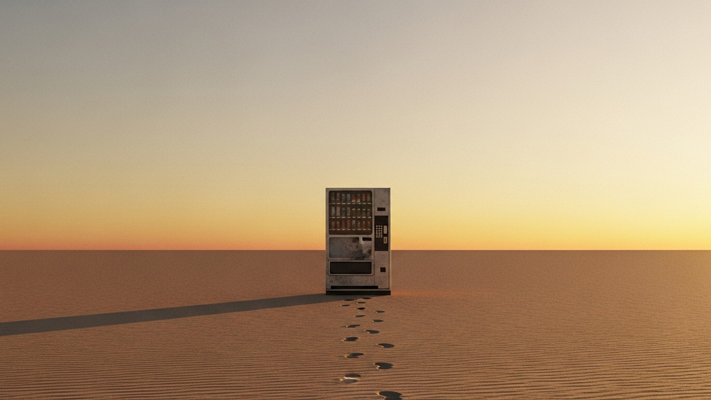

사막 한가운데 자판기가 하나 서 있다. 목이 말라 죽을 것 같은 사람이 동전을 넣고 버튼을 누른다. 아무것도 나오지 않는다. 한 번 더 누른다. 또 안 나온다. 열 번을 누른다. 백 번을 눌러도 같다.

이쯤 되면 보통은 자판기를 떠난다. "안 나오는구나." 그리고 다시는 그 버튼을 누르지 않는다.

이상한 일은 아니다. 백 번 시도해도 안 나오는 자판기 앞에서 버튼을 계속 누르는 게 오히려 더 이상하다. 그건 학습이다. 환경이 가르쳐 준 합리적 결론이다. 그런데 이 학습이 사람에게도 일어난다면 어떨까. 아주 어릴 때, 자기가 누른 버튼이 한 번도 응답하지 않는 경험이 반복되었다면.

## 받지 않는 데에도 기술이 있다

"회피형"이라는 말을 처음 들었을 때, 나는 그게 무언가를 못 하는 사람을 가리키는 줄 알았다. 정을 못 주는 사람, 사랑을 못 받는 사람, 마음을 못 여는 사람. 그런데 들여다볼수록 정반대 같다. 회피형은 무언가를 못 하는 사람이 아니라, 어떤 일을 너무 잘하게 된 사람에 가깝다.

받지 않는 일을 잘하는 사람.

심리학에서 1970년대에 했던 실험이 있다. 한 살짜리 아기를 낯선 방에 데려다 놓고 엄마를 잠깐 내보낸다. 대부분의 아기는 운다. 매달리고 싶어한다. 그런데 어떤 아기들은 울지 않는다. 엄마가 다시 들어와도 본 척도 안 한다. 안아주려 하면 몸을 비틀며 피한다.

처음에는 이 아기들이 씩씩하다고 봤다. 독립적이라고. 그런데 심박수와 스트레스 호르몬을 재 보니 이야기가 달랐다. 겉으로는 멀쩡해 보여도, 속으로는 우는 아기들과 똑같이 무너지고 있었다. 단지 표현하지 않을 뿐이었다.

왜 표현하지 않게 됐을까. 표현해 봤자 응답이 없었기 때문이다. 어떤 자판기는 누르면 가끔이라도 나온다 — 슬롯머신처럼 가끔 잭팟이 터지는 자판기 앞에서는 사람이 더 미친 듯이 버튼을 누른다. 그런데 이 아기들의 자판기는 그것조차 아니었다. 눌러도 안 나오고, 안 눌러도 안 나왔다. 그러니 누르지 않는 게 가장 합리적이었다.

회피형의 자기 신뢰는 그러니까 자신감이라기보다는 선언에 가깝다. 이 세상 믿을 사람 하나 없으니, 차라리 내가 알아서 살아남겠다는. 받기를 포기한 자리에 자립이 들어선 거다.

## 첫 번째 기술: 감정의 스위치를 끄는 법

받지 않는 기술의 핵심은 감정을 다루는 방법에 있다.

불안형이 감정을 키워서 어떻게든 응답을 끌어내는 방식이라면, 회피형은 감정을 꺼버리는 방식이다. 보고 싶다는 마음이 올라오면 — "지금은 일해야 돼." 외롭다는 느낌이 들면 — "혼자가 편하지 뭐." 슬프다는 감정이 시작되면 그 회로 자체를 차단한다.

흥미로운 건 이게 거짓말이 아니라는 점이다. 회피형이 슬프지 않다고 말할 때, 그건 정말로 슬픔을 느끼지 않는 상태일 수 있다. 감정을 느끼는 뇌와 상황을 인지하는 뇌 사이의 연결이 일시적으로 끊어진다. 본인도 모르게.

그래서 회피형 어른에게 어린 시절을 물으면 종종 이런 답이 돌아온다. "별로 힘든 기억은 없어요. 그냥 평범했어요." 구체적으로 어떤 좋은 추억이 있냐고 다시 물으면 잘 떠올리지 못한다. 따뜻하게 안겼던 기억, 함께 웃었던 기억, 위로받았던 기억. 그런 것들이 비어 있다. 좋은 기억도 나쁜 기억도 같이 흐릿한 거다.

스위치를 끈다는 건 한쪽만 끌 수 없는 일인 듯하다. 슬픔의 회로를 차단하면 기쁨의 회로도 같이 어두워진다. 받지 않기 위해 닫은 문은, 들어오는 것도 나가는 것도 막는다.

문제는 그렇게 닫아둔 감정이 사라지지는 않는다는 거다. 어딘가로 가야 한다. 회피형의 몸에는 그래서 두통이, 소화불량이, 만성피로가 자주 산다. 마음이 받지 않으면 몸이 대신 받는다.

## 두 번째 기술: 거북이의 침묵

부부 치료의 권위자 존 가트맨 박사가 갈등 상황에서 회피형의 심박수를 잰 적이 있다. 결과는 좀 충격적이었다. 겉으로는 팔짱을 낀 채 무표정하게 앉아 있는데, 심박수는 분당 100회를 훌쩍 넘어 있었다.

회피형이 싸울 때 침묵하는 이유를 그동안 우리는 거꾸로 이해해 왔던 것 같다. 무관심해서, 화가 나서, 무시하려고. 그런데 안에서 일어나는 일은 정반대다. 감정의 홍수가 뇌를 덮치고, 언어를 담당하는 부분이 마비된다. 말을 안 하는 게 아니라 못 하는 상태에 가깝다.

거북이를 떠올린다. 위협을 느낀 거북이는 등껍질 속으로 머리를 더 깊이 집어넣는다. 우리가 등껍질을 두드리고 소리 지를수록, 거북이는 더 안으로 들어간다. 나오라는 신호로 받아들이지 않기 때문이다. 그건 폭풍이 더 격렬해졌다는 신호다. 거북이는 그저 폭풍이 지나갈 때까지 버틴다.

회피형의 침묵을 보면서 "왜 대답을 안 해"라고 다그치는 건 등껍질을 두드리는 일과 비슷하다. 두드릴수록 안으로 들어간다. 그러니까 침묵은 거절이 아니라 차라리 오작동에 가깝다 — 과부하 걸린 컴퓨터에 엔터키를 백 번 누르는 셈이다.

이걸 알게 된 뒤로 나는 누군가의 침묵을 조금 다르게 읽기 시작했다. 답이 없는 게 답이 아닐 수도 있다는 것. 어쩌면 답이 너무 많아서 하나도 꺼내지 못하는 상태일 수도 있다는 것.

## 세 번째 기술: 일이라는 안전한 도피처

회피형이 가장 우아하게 회피하는 방법은 무엇일까. 도망가는 것도 아니고, 화내는 것도 아니다. 일하는 거다.

인간관계는 내 마음대로 안 된다. 상대가 어떻게 반응할지, 무엇을 요구할지, 언제 실망할지 통제할 수 없다. 그런데 일은 다르다. 노력한 만큼 결과가 나온다. 코드는 짜면 돌아가고, 보고서는 쓰면 완성된다. 회피형에게 직장은 감정 소모 없이 성취감을 얻을 수 있는 가장 안전한 공간이 된다.

게다가 "너무 바빠서 연락 못 했어, 미안"은 사회적으로 완벽하게 용인되는 거절 멘트다. 게으름이 아니다, 무관심이 아니다, 직무유기가 아니다. 오히려 성실함의 증거다. 회피형의 회피 성향이 사회적으로 박수받는 형태로 변신하는 순간이다.

그래서 회피형 중에 일중독이 많다. 일이 일이라기보다 도피처에 가까워진다. 일에 몰두하고 있으면 관계의 요구에서 벗어날 수 있고, 혼자 있어도 외롭지 않다. 책상 앞에 앉아 있는 동안만큼은 누구도 나에게 마음을 요구하지 않는다.

이 글을 쓰면서 가장 뜨끔한 부분이 여기였다. 일을 사랑한다고 믿었던 시간들이, 사실은 일 뒤에 숨어 있던 시간이었을지도 모른다는 가능성. 일을 잘한다는 칭찬을 받을 때마다 안전감을 느꼈다면, 그건 성취에 대한 자긍심이었을까 아니면 회피에 성공했다는 안도였을까.

## 받지 않는 기술의 양면

여기까지 읽으면 회피형이 무슨 결함처럼 들릴 수도 있겠다. 그런데 한쪽 면만 보고 있는 거다.

받지 않는 기술에는 분명한 강점이 있다. 감정에 휩쓸리지 않고 상황의 사실에 차분히 집중할 수 있다는 것. 심리학에서는 이걸 "인지적 재평가"라고 부른다. 위기 상황에서 패닉에 빠지지 않고 침착하게 대응 방식을 떠올릴 수 있다. 갈등이 휘몰아쳐도 자기 페이스를 잃지 않는다.

이스라엘에서 했던 재미있는 실험이 있다. 사람들을 모아놓고 컴퓨터에서 정체불명의 연기가 나도록 한다. 불안형 애착이 높은 사람들이 가장 먼저 알아차렸다. 그런데 위험에서 가장 빨리 벗어난 건 회피형이었다. 알아차리는 건 늦었지만, 알아차린 다음에 침착하게 행동했던 거다.

원시 부족을 상상해 보자. 맹수가 습격할 때 위험을 가장 먼저 감지하는 건 불안형 선조다. 모두가 패닉에 빠질 때, 회피형 선조가 침착하게 말한다. "저쪽 동굴로 가자." 집단이 살아남으려면 둘 다 필요하다. 어쩌면 우리는 회피형을 너무 오래 부정적으로만 봐 왔는지도 모른다. 자급자족 모드로 살아남은 사람들. 받기를 포기한 대신 자기 발로 서는 법을 익힌 사람들.

다만 이 기술에는 비용이 따른다. 받지 않는 데 익숙해진 사람은, 자기가 무언가를 받았을 때 그것을 어떻게 처리해야 할지 모른다. 누가 호의를 베풀면 즉시 갚아야 한다는 압박을 느낀다. 빚지고 싶지 않아서가 아니라, 빚진 채로 있는 방법을 모르기 때문이다. 받기는 통제권을 잠깐 내려놓는 일인데, 회피형은 그 잠깐을 견디기가 어렵다.

그리고 무엇보다, 감정은 미뤄둔 만큼 한 번에 돌아온다. 회피형은 이별 직후에 오히려 후련함을 느낀다. "아, 이제 내 시간이 생겼네." 그런데 몇 달이 지나면 갑자기 그 사람이 떠오르고, 후회가 밀려오고, 잠을 못 잔다. 억눌렀던 감정이 쓰나미처럼 밀려오는 거다. 받지 않으려 했던 것들의 청구서가 한참 뒤에 도착한다.

## 다시 받는 연습

회피형은 어쩌면 어린 시절에 두려움 때문이 아니라 사랑 때문에 그 길을 선택했는지도 모른다. 자기를 충분히 돌봐주지 못하는 부모가 안쓰러워서, 내가 기대면 부모가 더 힘들어할 것 같아서. 부모를 귀찮게 하지 않고, 알아서 잘하는 모습으로 짐을 덜어주려고. 그 어린 나이에 그런 마음을 먹었다면, 그건 결함이라기보다는 차라리 사랑의 한 형태였다.

다만 이제는 좀 다른 이야기가 가능해진다. 어른이 된 회피형은 더 이상 그렇게 혼자 모든 걸 짊어져야 하는 아이가 아니다. 도움을 요청해도 무너지지 않는다. 약한 모습을 보여도 사람들이 떠나지 않는다. 그런데 그 사실을 머리로 아는 것과, 몸이 받아들이는 건 다른 문제다.

받지 않는 기술이 평생에 걸쳐 정교해진 만큼, 받는 기술도 같은 시간을 들여 다시 익혀야 할지도 모른다. 단번에 되는 일이 아니다. 사막 자판기 앞에서 다시 버튼을 누르는 일은, 한두 번 누른다고 익숙해지지 않는다. 누를 때마다 "또 안 나오면 어쩌지" 하는 두려움이 따라온다. 그게 자연스럽다.

진짜 용기는 더 강해지는 게 아닐 수도 있다. 혼자서 갈증을 끝까지 참는 것도 아닐 수 있다. 어쩌면 다시 목마르다고 말하는 것. 그리고 누군가가 건네는 물을 거절하지 않는 것. 받는 일을 어색해하면서도 일단 받아보는 것.

세상의 모든 자판기가 고장 난 건 아니다. 그건 어릴 적의 자판기 한 대가 그랬을 뿐이다. 다른 자판기는 다른 응답을 한다. 그걸 머리로 아는 것에서, 한 번 더 눌러보는 것까지의 거리가 회피형에게는 가장 멀고 어려운 길일 것이다.

다만 그 거리를 한 번 건너고 나면, 받지 않는 기술과 받는 기술 둘 다 가진 사람이 된다. 위기에 침착하면서도 친밀함에 마음을 열 수 있는 사람. 자급자족이 가능하면서도 함께 살아갈 줄 아는 사람. 그게 어쩌면 회피형이 도달할 수 있는 가장 단단한 형태가 아닐까.
