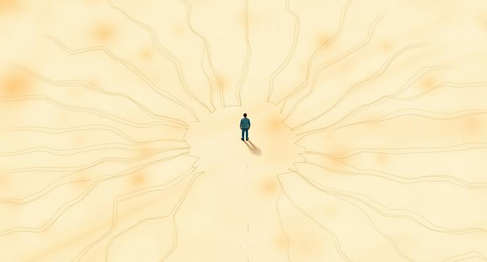

## 1.

금요일 저녁, 넷플릭스를 켠다.

썸네일을 훑는다. 스크롤을 내린다. 다시 올린다. 뭔가 끌리는 게 있다가도, 옆에 더 나은 게 있을 것 같아서 넘긴다. 10분이 지나고, 20분이 지나고, 결국 아무것도 고르지 못한 채 유튜브를 켠다.

수천 개의 콘텐츠가 눈앞에 있는데, 나는 아무것도 보지 못했다.

---

## 2.

메뉴가 세 개인 식당에서는 고민이 짧다. 하지만 선택지가 열 개, 스무 개가 되면 이야기가 달라진다. 괌을 갈까, 몰디브를 갈까, 발리를 갈까. 심지어 그 선택이 결정적이지도 않다. 어디를 가든 즐거울 것이다. 그런데도 고르지 못한다.

이미 결정된 조건 내에서 고르는 건 쉽다. 어려운 건 아무런 제약 없이 열린 선택지 앞에 서는 것이다.

---

## 3.

자유롭다는 건 좋은 것이라고 배웠다. 더 많은 선택지, 더 많은 가능성, 더 많은 길. 그것이 곧 풍요라고.

그런데 막상 모든 문이 열려 있으면, 어느 문으로 들어가야 할지 모르겠다. 문 앞에서 서성이다 지친다. 열려 있는 문이 많을수록 들어가지 못한 문도 많아지고, 들어가지 못한 문 뒤에 뭐가 있을지 계속 궁금해진다.

선택하지 못한 것들이 유령처럼 따라다닌다.

---

## 4.

종교를 가진 사람들이 때로 부러울 때가 있다.

신앙이 있어서가 아니다. 규율이 있어서다. 무엇을 먹고, 무엇을 하지 않고, 어떤 날에 쉬고, 어떤 방식으로 기도하고. 삶의 많은 부분이 이미 정해져 있다. 그 안에서 고민할 여지가 줄어든다.

자유를 포기한 것처럼 보이지만, 오히려 그 안에서 깊은 평온을 찾는 사람들이 있다. 규율에 따라 스스로를 통제하면서, 역설적으로 더 자유로워지는 것이다.

---

## 5.

연인 관계도 비슷하다.

상대방의 요구를 받아들인다. 금요일 저녁은 같이 보내기로 한다. 일요일 아침에는 같이 산책하기로 한다. 혼자였다면 무엇이든 할 수 있었던 시간을, 기꺼이 포기한다.

자유를 잃는 것일까? 표면적으로는 그렇다. 하지만 매주 금요일 뭘 할지 고민하지 않아도 된다는 안도감. 누군가와 함께한다는 충만함. 자유를 제한함으로써, 오히려 더 단단한 무언가를 얻는다.

---

## 6.

아무런 토양에도 뿌리를 내리지 못하면, 삶은 수많은 방향으로 물살이 흐르는 바다에서 이리저리 떠다니다 질식하게 된다.

자유의 바다에서 질식한다. 이 표현이 머릿속에 남았다. 이충녕의 『어떤 생각들은 나의 세계가 된다』에서 만난 문장인데, 자유가 많으면 많을수록 숨이 트일 줄 알았는데 오히려 질식할 수 있다니. 묘하게 와닿았다.

---

## 7.

생각해보면, 내가 가장 생산적이었던 시기는 제약이 있었던 시기였다.

마감이 정해져 있을 때. 예산이 한정되어 있을 때. 선택지가 줄어들었을 때. 그때 오히려 집중력이 생기고, 창의력이 나오고, 결과물이 만들어졌다.

무한한 시간과 무한한 자원이 있었다면? 아마 아무것도 하지 못했을 것이다. 넷플릭스 앞에서 20분을 허비하듯이.

---

## 8.

'하고 싶은 대로 하는 것'이 자유일까, '해야 한다고 판단한 것을 실행할 수 있는 것'이 자유일까.

전자는 욕망에 이끌리는 것이고, 후자는 이성으로 방향을 정하는 것이다. 자유를 쓰려면 먼저 기준이 있어야 한다. 기준 없는 자유는 표류다.

---

## 9.

요즘 나는 의식적으로 선택지를 줄이려 한다.

아침에 뭘 먹을지 고민하지 않는다. 대략 정해두었다. 옷도 비슷한 것들로 채워두었다. 카페도 두세 군데만 간다. 사소한 결정에 에너지를 쓰지 않으니, 정말 중요한 결정 앞에서 더 또렷해진다.

---

## 10.

끝없는 자유의 바다에서 표류하다가 질식해 정신을 잃는 것은, 자유를 상실하는 것에 가깝다. 모든 것을 할 수 있다는 것은, 아무것도 하지 않는 것과 종이 한 장 차이다.

자신의 삶에 선을 긋는 것. 그리고 그 선을 지키는 것.

---

## 11.

나는 아직도 때때로 선택 앞에서 멈춘다. 완벽한 선택을 하고 싶은 욕심이 발목을 잡는다.

하지만 이제는 안다. 완벽한 선택이란 없다는 것을. 선택하지 않는 것이 가장 나쁜 선택이라는 것을. 그리고 무언가를 포기해야 비로소 무언가를 얻을 수 있다는 것을.

자유란 모든 것을 가질 수 있는 상태가 아니다.
무엇을 가지지 않을지 스스로 정할 수 있는 상태다.

선을 긋자.
그 선 안에서, 진짜 자유가 시작된다.
