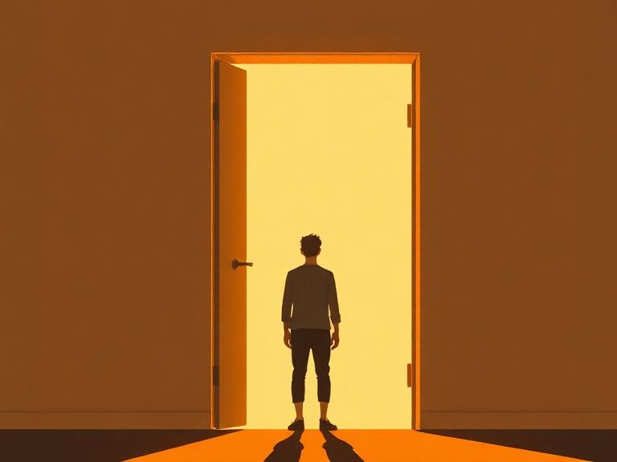

얼마 전 누군가와 이런저런 이야기를 나누다가 문득 물었습니다.

"살면서 잃고 싶지 않은 게 뭐예요?"

돌아온 답은 예상 밖이었습니다.

`"새로운 거에 설레어하는 마음이요."`

그 순간 멈칫했습니다. 좋은 답이라고 생각했는데, 동시에 이상한 질문이 떠올랐습니다. 나는 왜 설레지?

## 당연하게 설레고 있었다

저는 원래 잘 설레는 편입니다. 새로운 고객을 만나면 설레고, 팀원들과 새로운 기능을 기획하면 설레고, 처음 보는 문제를 마주하면 설렙니다. 스타트업을 4년째 하면서 설렘이 부족했던 적은 없었던 것 같습니다.

그런데 그 사람의 답을 듣고 처음으로 생각했습니다. `나는 왜 설레는 걸까?`

당연하게 느끼고 있던 감정이라 한 번도 뜯어본 적이 없었습니다. 왜 어떤 건 설레고 어떤 건 안 설레는지, 설렘의 조건이 뭔지.

## 설렘은 어디서 오는 걸까

생각해보니 모든 새로운 것이 설레는 건 아니었습니다.

이미 해본 일의 반복은 새로워도 설레지 않고, 결과가 뻔히 보이는 일은 시작해도 두근거리지 않습니다. 반대로 어떻게 될지 모르는 일, 예상 못한 방향으로 흘러가는 대화, 처음 만나는 사람과의 시간은 설렙니다.

결국 설렘은 `새로움` 자체가 아니라 `예측 불가능한 가능성`에서 오는 것 같습니다.

"이게 어디로 갈지 모르겠다"는 감각. 그게 설렘의 정체가 아닐까요.

## 그래서 잃고 싶지 않다는 말

그 사람이 "잃고 싶지 않다"고 했을 때, 저는 처음엔 그냥 좋은 답이라고만 생각했습니다.

그런데 곱씹어보니 그 말이 좀 다르게 들렸습니다. 설렘은 가만히 있으면 유지되는 게 아니라, 의식하지 않으면 사라질 수 있는 거라는 뜻이니까요.

경험이 쌓이면 예측력이 올라갑니다. 예측력이 올라가면 불확실성이 줄어듭니다. 불확실성이 줄어들면 불안도 줄지만, 설렘도 함께 줄어들 수 있습니다.

그래서 "잃고 싶지 않다"는 말은 어쩌면 `의도적으로 지키겠다`는 말일지도 모르겠습니다.

## 다시 그 질문

"살면서 잃고 싶지 않은 게 뭐예요?"

그 사람의 답을 듣고 저도 생각해봤습니다. 아직 깔끔하게 정리되진 않았지만, 적어도 한 가지는 알게 됐습니다. 설렘은 그냥 오는 게 아니라 어딘가에서 오고, 지키려면 뭔가를 해야 한다는 것.

다음에 만나면 물어보고 싶습니다.

"그 설렘, 어떻게 지키고 있어요?"
