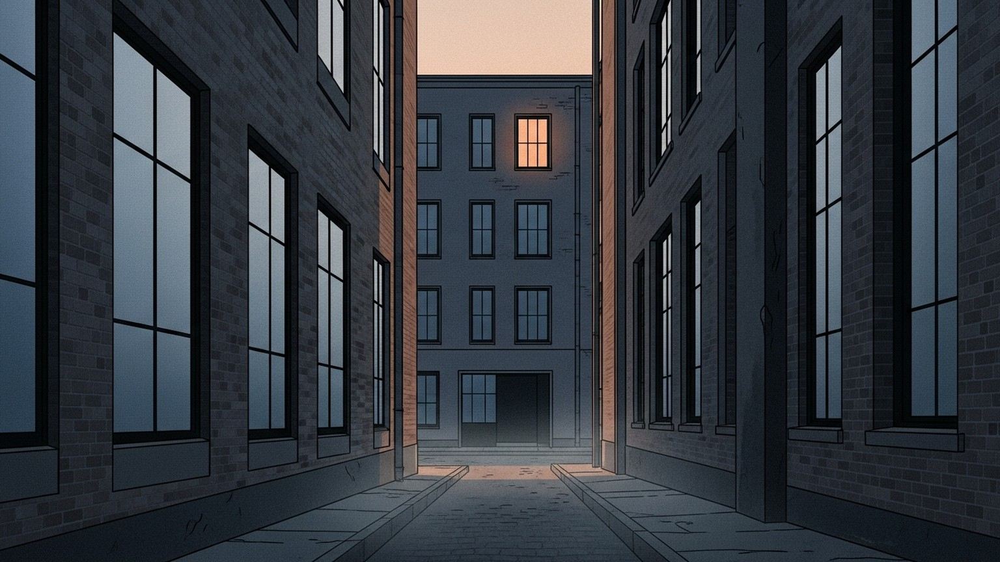

요즘 이런 뉴스를 한 번쯤 본 적이 있을 것이다. 길을 가던 사람에게 갑자기 흉기를 휘두른 범죄자가 체포된다. 수사관이 묻는다. "미안하지 않습니까?" 범죄자는 고개를 숙이지 않는다. 도리어 어리둥절한 얼굴로 되묻는다. "제가 왜 미안해야 하죠?"

우리는 이런 사람을 보면 쉽게 꼬리표를 붙인다. "사이코패스라서 그래." 그런데 30년 가까이 범죄자들을 만나 온 한 프로파일러는 다르게 말한다. 사이코패스라서 죄책감이 없는 게 아니라, 그들에겐 애초에 미안해야 할 이유가 없다는 것이다. 이 말이 무슨 뜻인지 따라가다 보면, 이야기는 몇몇 이상한 사람의 문제로 끝나지 않는다.

## 미안함은 어디서 생겨나는가

잠깐 생각해 보자. 누군가에게 미안하다고 느끼려면 무엇이 필요할까.

상대가 나와 '같은 편'이라는 감각이 먼저 깔려 있어야 한다. 같은 사회에 살고, 같은 거리를 걷고, 어떤 식으로든 서로 엮여 있다는 느낌 말이다. 그 바탕이 있어야 그 위에서 미안함이라는 감정이 자란다.

프로파일러가 만난 범죄자들은 거짓말을 하거나 입을 다문 것이 아니었다. 그들은 정말로 미안할 이유를 이해하지 못했다. 그들에게 피해자는 나와 같은 세상에 속한 사람이 아니었다. 그냥 지나가는 사물에 가까웠다. 같은 편이라는 바탕이 사라진 자리에서는, 그 위에서 자라야 할 감정도 함께 사라진다.

그렇다면 왜 그 바탕이 사라졌을까. 원래부터 그렇게 태어났기 때문일까, 아니면 자라는 동안 조금씩 지워져 간 걸까.

## 살인자의 뇌를 가졌지만 살인자가 되지 않은 사람

흥미로운 이야기가 하나 있다.

미국에 [짐 팰런](https://www.bbc.com/korean/features-51961812)이라는 과학자가 있다. 그의 일은 살인범들의 뇌 사진을 분석하는 것이었다. 어느 날 그는 살인범과 일반인의 뇌를 비교하려고 자기 가족의 뇌 사진도 함께 찍어 섞어 두었다.

그러다 한 장의 사진이 눈에 들어왔다. 보자마자 그는 소름이 돋았다. 살인범들에게서 반복적으로 나타나는 특징이 너무도 선명했다. 그는 동료들에게 말했다. "이 사람은 위험하다. 사회에 돌아다니게 두면 안 된다." 그러고 나서 이름을 가린 종이를 떼어 냈다. 사진의 주인은 자기 자신이었다.

놀라서 가계도를 뒤져 보니, 조상 중에 살인자가 일곱 명이나 있었다. 그는 그야말로 '살인자의 뇌'를 가지고 태어난 셈이었다. 그런데 그는 아무도 죽이지 않았다. 오히려 가족과 친구들이 고민이 있을 때 찾아가는 조언자로 살아왔다.

그는 이렇게 말한다. "어린 시절이 믿을 수 없을 정도로 따뜻했다. 그 행복이 내 유전자를 씻어 낸 것 같다."

유전자는 방아쇠 같은 것이다. 방아쇠가 있다고 총이 저절로 발사되지는 않는다. 누가 당겨야 발사된다. 팰런의 경우, 따뜻한 환경이 방아쇠에 끝내 손을 대지 않은 셈이다.

이 이야기를 거꾸로 읽으면 오싹한 말이 된다. 특별히 나쁜 것을 타고나지 않은 사람이라도, 자라는 곳이 충분히 메마르면 방아쇠가 당겨질 수 있다는 뜻이기 때문이다. 학교가 배우는 곳이 아니라 서로 밟고 올라가는 곳이 되고, 선생님이 아이를 길러 내는 사람이 아니라 입시 서비스를 파는 사람이 되었을 때, 아이들에게 남는 것은 목표뿐이다. 다투고 화해하고 다시 엮이는 긴 과정을 배울 시간이 그들에게는 없다.

## 사람 사이에 흐르는 보이지 않는 무언가

가만히 보면, 우리는 하루 동안 생각보다 많은 것을 주고받는다.

아침에 엘리베이터에서 마주친 이웃과 눈인사를 나눈다. 편의점 계산대에서 거스름돈을 받으며 "감사합니다"를 덧붙인다. 붐비는 지하철에서 어깨를 부딪친 사람에게 "죄송합니다" 하고 지나간다. 복도에서 아이 울음소리가 들리면 잠시 걸음이 느려진다.

대단한 일이 아니다. 돈이 오가는 것도 아니고, 서로의 이름을 기억하는 것도 아니다. 하지만 이 자잘한 주고받음이 사람과 사람 사이에 작은 온기를 돌게 한다. 이 온기는 통장처럼 쌓아 두는 것이 아니라, 매일 주고받아야 살아 있는 것이다.

이 온기가 식기 시작하면 이상한 일이 생긴다. 옆에 있는 사람이 그냥 '좀 먼 사람'이 되는 게 아니라, '아예 없는 사람'이 된다. 길에 쓰러진 낯선 사람을 보고 그냥 지나치는 일이 점점 자연스러워지는 것도 그런 이유에서다. 차가워서가 아니다. 그 사람이 내 온기가 닿는 범위 바깥으로 밀려나 있기 때문이다.

댓글창에서 누군가의 죽음이 농담거리가 되는 순간, 익명의 화면 뒤에서 쏟아지는 조롱, 지하철에서 어깨를 스쳤다고 튀어나오는 욕설. 이 모든 풍경은, 사람들 사이의 온기가 식어 버린 자리에서 자주 볼 수 있는 것들이다.

## 더 무서운 고립은 '문을 닫은 고립'이다

고립에는 두 종류가 있다.

하나는 세상이 나를 밀어낸 경우다. 아무리 다가가도 사람들이 받아 주지 않아 혼자가 된 사람이다. 이런 사람은 외롭고, 아프다. 그래도 마음 한구석에서는 여전히 연결되고 싶어 한다. 창문 바깥에서 계속 문을 두드리고 있는 셈이다.

다른 하나는 내가 먼저 세상을 밀어낸 경우다. "나는 굳이 너희들과 엮일 이유가 없어." 이렇게 정해 버린 사람이다. 두드림이 없다. 대신 옆자리가 지워진다.

더 무서운 쪽은 두 번째다. 외로운 사람은 누가 손을 내밀면 조심스럽게라도 잡는다. 그러나 스스로 문을 닫은 사람은 손을 내밀어도 필요 없다고 한다. 그렇게 점점 더 안쪽으로 들어간다. 그 끝자락에 "저 사람들은 제 사회가 아닙니다"라는 말이 있다.

여기서 앞서 말한 팰런을 다시 떠올려 보면 이야기가 한 번 더 뒤집힌다. 그는 사실 감정적으로 차가운 사람이라고 스스로 말했다. 누가 울어도 함께 울어지지 않는다고 했다. 원래 이런 온도의 사람이라면 남과 엮이는 일이 번거롭게 느껴져서 문을 닫기 쉽다. 그런데 팰런은 정반대로 갔다. 사람들의 이야기를 몇 시간이고 들어 주고, 차분하게 조언한다. 문을 닫지 않았기 때문이다.

즉 타고난 감정의 온도와, 문을 열어 둘지 닫을지는 서로 다른 축이다. 차갑게 태어난 사람도 문이 열려 있으면 조언자가 되고, 따뜻하게 태어난 사람도 문이 닫히면 아무에게도 미안하지 않은 사람이 된다. 중요한 것은 타고난 것이 아니라, 문을 어느 쪽으로 두고 사느냐는 쪽이다.

## 성공만 남고 사람은 지워진다

그런데 여기서 이상한 점이 하나 있다.

문을 닫고 사는 사람이라면 세상에 대한 의욕도 같이 식었을 것 같지만, 실제로는 그렇지 않다. 이들도 성공은 간절히 원한다. 돈을 벌고 싶고, 이름이 알려지고 싶고, 자리가 높아지고 싶은 마음은 그대로 남아 있다. 오히려 더 뜨거울 때도 있다.

다만 그 성공의 길 위에 다른 사람이 보이지 않는다. 누군가를 밟아야 올라갈 수 있다면 망설임 없이 밟는다. 옆에서 비슷한 속도로 달리는 사람이 있어도, 같이 가는 동료가 아니라 치워야 할 장애물로 보인다.

이쯤 되면 질문이 하나 떠오른다. 이게 정말 몇몇 범죄자들만의 이야기일까.

다시 한 번 떠올려 보자. 그들은 다른 별에서 온 사람들이 아니다. 팰런처럼 위험한 것을 타고나고도 따뜻한 사람으로 자란 경우가 있고, 반대로 평범하게 태어났지만 점점 차갑게 굳어 간 경우도 있다. 양쪽을 갈라놓은 것은 어디서, 어떤 환경에서 자랐느냐였다.

그러니 '미안할 이유를 모르는 사람'과 우리 사이의 거리도, 어쩌면 우리가 더 착하기 때문이 아니라 우리 주변에 아직 작은 온기가 남아 있기 때문일지 모른다.

성공을 향해 달리는 마음은 누구에게나 있다. 문제는 그 옆에, 같이 달리는 사람이 있다는 것을 느끼는 마음이 함께 있느냐는 것이다. 우리는 두 마음 중 어느 쪽을 먼저 잃고 있을까.

아직 온기가 다 식지 않은 자리에서, 이 질문은 물어볼 수 있다.
