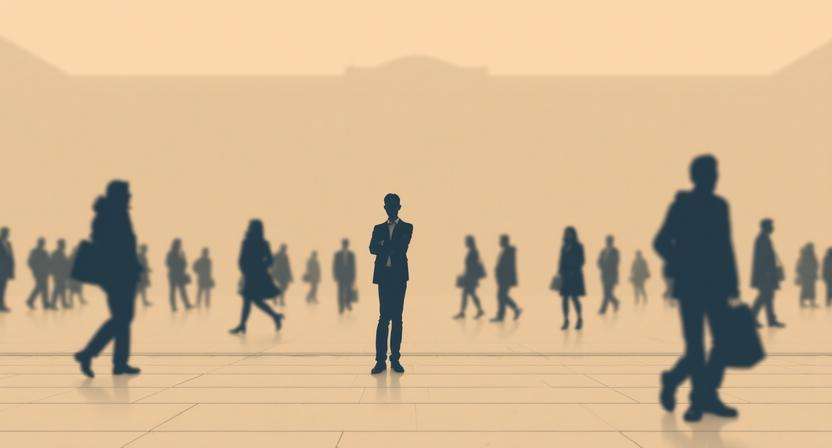

미국 거리에서 한국어로 영상을 찍고 있었다. 지나가는 사람들이 힐끗힐끗 쳐다봤다. 동양인이 혼자 카메라를 들고 뭔가를 열심히 말하고 있으니 눈길이 갈 만도 했다. 그런데 신기하게도, 긴장이 되지 않았다. 저 사람들은 내 말을 알아듣지 못한다. 그 사실 하나만으로 나는 자유로웠다.

한국에서였다면 어땠을까. 카페에서 노트북을 펴는 것조차 주변 눈치를 보던 때가 있었다. 길에서 혼잣말을 하면 이상한 사람이 될까 봐, 식당에서 혼자 밥을 먹으면 외로운 사람으로 보일까 봐. 같은 행동인데, 장소만 바뀌었을 뿐인데, 마음의 무게가 완전히 달랐다. 왜 그랬을까.

### 보이지 않는 무대 위의 배우

심리학에는 "스포트라이트 효과"라는 개념이 있다. 자신이 다른 사람들에게 주목받고 있다고 과대평가하는 인지 편향이다. 실제로는 아무도 신경 쓰지 않는데, 나만 혼자 무대 위에 서 있다고 느끼는 것이다.

코넬 대학의 실험이 유명하다. 학생들에게 다소 창피한 티셔츠를 입히고 교실에 들어가게 했다. 티셔츠를 입은 학생들은 교실의 절반 이상이 자신의 옷을 알아챘을 거라고 예상했다. 실제로 알아챈 사람은 25%도 되지 않았다. 우리는 자기 자신에게 스포트라이트를 비추고, 그 빛 아래서 온 세상이 나를 지켜보고 있다고 착각한다.

무대 위의 배우는 객석이 가득 차 있다고 믿는다. 하지만 커튼을 걷으면 대부분의 의자는 비어 있다. 관객은 각자의 무대에서 바쁘다. 내 실수를, 내 외모를, 내 어색한 행동을 기억하는 사람은 거의 없다. 기억하는 유일한 사람은 나 자신이다.

### 시선이 만드는 감옥

문제는 존재하지 않는 관객을 위해 우리가 실제로 행동을 바꾼다는 것이다.

하고 싶은 말을 삼킨다. 회의에서 떠오른 아이디어가 있지만, "이상하게 들리면 어쩌지?"라는 생각에 입을 다문다. 정작 말했더라면 아무도 이상하게 생각하지 않았을 것이다. 아니, 애초에 5분 뒤면 아무도 기억하지 못했을 것이다.

사소한 행동도 망설인다. 혼자 영화를 보고 싶지만 "혼자 온 사람"이라는 시선이 신경 쓰인다. 새로운 취미를 시작하고 싶지만 "나이 들어서 그걸 왜?"라는 반응이 두렵다. 질문을 하고 싶지만 "그것도 모르냐"는 눈빛이 겁난다.

이 모든 시선은 실체가 없다. 내 머릿속에서 만들어낸 상상의 관객이다. 하지만 상상의 관객이 만드는 감옥은 진짜다. 벽도 없고 자물쇠도 없는데, 우리는 그 안에서 스스로 작아진다. 할 수 있는 일을 하지 않고, 되고 싶은 사람이 되지 못하고, 살고 싶은 대로 살지 못한다. 보이지 않는 시선에 보이지 않는 사슬이 묶여 있다.

### 시선 속으로 걸어 들어가기

미국에서 영상을 찍으며 깨달은 것이 하나 있다. 시선의 무게를 줄이는 방법은 시선을 피하는 것이 아니라, 시선 속으로 직접 걸어 들어가는 것이다.

거창한 용기가 필요하지 않다. 아주 작은 것부터 시작하면 된다. 카페에서 혼자 앉아본다. 모르는 것을 질문해본다. 사람들 앞에서 자기 생각을 말해본다. 길에서 영상을 찍어본다. 처음에는 심장이 뛴다. 누가 나를 이상하게 보지 않을까. 하지만 직접 해보면 놀라운 사실을 발견한다.

아무도 신경 쓰지 않는다.

정말로, 놀라울 만큼 아무도 관심이 없다. 내가 혼자 밥을 먹든, 길에서 카메라를 들고 말을 하든, 회의에서 엉뚱한 질문을 하든. 사람들은 각자의 스포트라이트 아래서 자기 자신에게 바쁘다. 내가 나에게 쏟는 만큼의 관심을 타인이 나에게 쏟는 일은 거의 일어나지 않는다.

이것을 머리로 아는 것과 몸으로 느끼는 것은 완전히 다르다. 한 번 직접 경험하면, 상상 속 관객의 존재감이 조금 옅어진다. 두 번, 세 번 반복하면 더 옅어진다. 시선의 무게는 부딪힐수록 가벼워진다. 마치 근육이 반복 훈련으로 강해지듯, 시선을 견디는 힘도 반복으로 커진다.

### 관객석은 비어 있다

돌이켜보면, 내 인생에서 후회되는 순간들은 대부분 하지 않은 것들이다. 말하지 않은 것, 시도하지 않은 것, 시작하지 않은 것. 그리고 그 "하지 않음"의 이유를 파고 들어가면, 대부분의 끝에는 타인의 시선이 있었다.

실체 없는 시선 때문에, 실체 있는 기회를 놓친 것이다.

미국 거리에서 나를 쳐다보던 사람들은 10초 뒤에 내 존재를 잊었을 것이다. 그들에게 나는 스쳐 지나가는 풍경의 일부였을 뿐이다. 우리 모두 서로에게 그렇다. 당신이 생각하는 것만큼 세상은 당신을 지켜보고 있지 않다. 그리고 그것은 슬픈 일이 아니라, 자유로운 일이다.

지금 당신이 망설이고 있는 그 사소한 행동은 무엇인가. 그것을 가로막고 있는 시선은 정말 존재하는가. 한번 커튼을 걷어보라. 관객석은 비어 있을 것이다.
