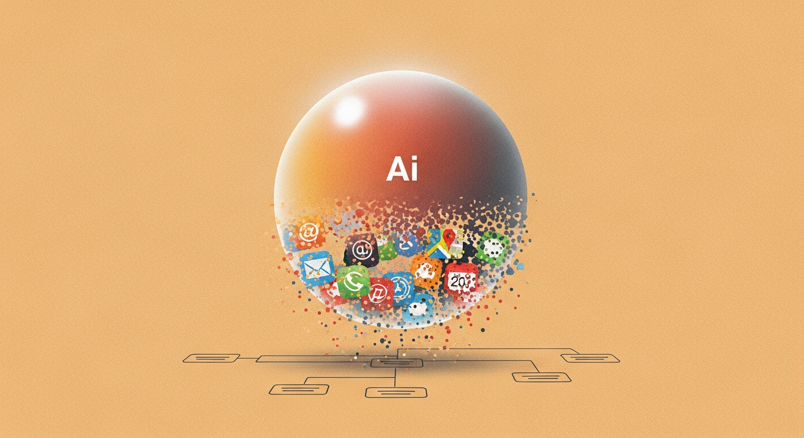

EP 91 팟캐스트(2026년 3월 21일)의 후반부 세션으로, 비즈니스 관점에서 AI가 만들어내는 산업 구조 변화를 집중적으로 다룬다. 에이전트가 기존 앱 위에 새로운 레이어를 형성하면서 게이트키퍼의 지위가 흔들리고, 번들과 언번들의 역사적 사이클이 AI 시대에 다시 반복되며, 기업 내부에서는 AX(AI Transformation)의 접근 방식 자체가 재설계되어야 한다는 논의가 이어진다. 효율 극대화와 신규 가치 창출이라는 두 축이 본질적으로 다른 게임이라는 점, 그리고 AI 시대의 경쟁이 요트 경기처럼 바람(환경 변화)에 따른 빠른 적응의 게임이라는 프레임까지 폭넓게 다룬다.

### 게이트키퍼의 시대가 끝난다

에이전트가 기존 앱 생태계의 구조를 근본적으로 바꾸고 있다. **오모봇** 사례가 대표적이다. 사이먼이 만든 이 에이전트 앱은 배달의민족, 쿠팡, 카카오택시 등 기존 슈퍼앱들을 에이전트가 대신 조작한다. API가 있는 서비스는 API로 연결하고, API가 없는 서비스는 CUA(Computer Use Agent)로 에뮬레이션하여 조작한다.

> "짜장면 배달하려면 배민 가야 되고 생수 주문하려면 쿠팡 가야 되고 택시 부르려면 카카오택시 가야 되고... 그거 그냥 비서가 다 해주면 되는 거 아니야"

이 구조에서 기존 앱은 에이전트 레이어 아래로 묻히게 된다. 사용자가 직접 앱을 열고 탐색하는 대신, 에이전트가 중간에서 모든 것을 처리한다.

> "기존 사업자들은 다른 에이전트들의 function call이 될 가능성이 매우 농후"

젠슨 황은 GTC 2026에서 "use open claude rad"를 언급하며, 모든 비즈니스와 개인이 오픈 클로드 전략을 갖춰야 한다고 강조했다. 에이전트 레이어가 새로운 디스트리뷰션 채널이 되면서, 기존의 앱 중심 생태계가 근본적으로 재편되고 있다.

### 번들과 언번들, 끝없는 사이클

**베네딕트 에반스(a16z)**의 프레임워크에 따르면, 매체가 전환될 때마다 번들에서 언번들로, 다시 번들로 돌아가는 사이클이 반복된다. 신문에서 TV로, TV에서 웹으로, 웹에서 모바일로, 그리고 이제 모바일에서 AI로. 새로운 디스트리뷰션 레이어가 등장할 때마다 판이 뒤집힌다.

> "거의 대부분의 B2B SaaS 애플리케이션은 그냥 오라클 언번들링이다"

이 관점을 AI 시대에 대입하면 명확한 그림이 그려진다.

> "AI 시대는 결국은 거의 대부분의 서비스는 GPT 언번들링일 거다"

안드리슨 호로위츠는 이를 **"AI eats eating the world"**라는 새로운 프레임으로 정의했다. 이 사이클은 진화 알고리즘과 동형 구조를 갖는다. 다이버시피케이션(다양화)에서 셀렉션(선택)으로, 다시 다이버시피케이션으로. 기존 산업이 해체되고 새로운 형태로 재조합되는 과정이 반복된다.

### 기존 사업자는 막을 수 있는가

결론부터 말하면, **막기 어렵다**. 기존 사업자의 UX는 본질적으로 마찰(friction)이며, 이 마찰이 곧 마진이다.

> "기존의 UX가 다 언번들 될 게 이제 다음 트렌드"

UX 플로우 사이에 존재하는 수많은 광고 인벤토리와 크로스 셀 구간들이 기존 사업자의 수익 모델을 지탱한다. 에이전트는 이 마찰을 전부 제거해버린다. 사용자가 원하는 결과만 즉시 전달하고, 중간의 탐색 과정을 모두 건너뛴다.

기술적으로도 막기 어렵다. 에뮬레이터에 로그인한 뒤 에이전트가 조작하면 IP도 다르고, 일반 사용자와 구별이 불가능하다. 샤오미, 애플, 구글 모두 모바일 OS에 AI를 내장할 예정이어서, OS 레벨에서 에이전트가 앱을 제어하는 미래가 다가오고 있다.

> "이거는 못 막는 게임이고 기존에 있었던 사업자들은 다 디스인터미디에이션될 가능성이 좀 있는 거죠"

### AX의 불편한 진실

기업 내부의 AI 전환(AX)에서 가장 흔한 실패 패턴은 **"도와주세요" 방식**이다. AX팀이 각 팀을 돌아다니며 요건을 받아 도구를 만들어주는 형태다.

> "만들어 줘 봐요. 어차피 안 써요"

이 방식이 실패하는 이유는 **인센티브 구조** 때문이다. 현업 담당자 입장에서는 오랜 시간 힘들게 익힌 엑셀과 파워포인트 단축키가 자신의 경쟁력이다. AI 도구가 그 역할을 대체하면 자신의 존재 이유가 사라진다. "나는 그냥 내가 여기까지 오려고 얼마나 힘겹게 노가다를 하며 엑셀과 파워포인트 단축키를 익혔는데, 난 계속 이거 하고 싶어" — 이것이 현실이다.

성공하는 AX의 출발점은 완전히 다르다.

> "저 팀을 통째로 없애주세요"

개인의 단위 업무를 보조하는 것이 아니라, 그 업무 자체를 온전히 없애고 해당 인력을 새로운 직무로 전환시키는 것이 핵심이다. 인간을 모아놓으면 언제나 정상분포가 나타난다. 잘하는 사람끼리만 모아놔도 그 안에서 가장 잘하는 사람과 못하는 사람이 생긴다. 부분 최적화가 아닌 구조적 재설계가 필요한 이유다.

### 효율(1/10X)과 혁신(10X)은 독립적이다

AI 활용에는 두 가지 방향이 있다. 하나는 **효율 극대화** — 100의 비용을 10으로 줄이는 것(1/10X). 다른 하나는 **혁신** — 기존에 없던 900의 가치를 새로 창출하는 것(10X). 현재 거의 대부분의 AX는 효율 쪽에 집중되어 있다. 10X 뉴비즈니스는 "아직 시작되지 않았지만 곧 시작될 것"이라는 판단이다.

두 방향의 **오브젝티브 성격이 본질적으로 다르다**. 효율은 메트릭이 명확하다. 처리 시간, 비용, 오류율 등 측정 가능한 지표가 있다. 반면 혁신은 오브젝티브 자체가 부재한 상태에서 시작한다.

> "다른 거 하려고 하지 마. 이거야"

효율의 영역에서는 결국 돌고 돌아 바닐라로 수렴한다. 프론티어 모델 + 데이터 커넥터 + 좋은 프롬프트. 이 조합이 대부분의 효율화 문제를 해결한다.

**10X Lawyer 아티클**이 혁신 방향의 좋은 사례를 보여준다. 최상단 파트너의 결정적 공헌에 에이전트를 결합하면, 기존에 팀 전체가 하던 일을 소수가 처리할 수 있게 된다. 하지만 이 영역에는 근본적인 진입 장벽이 있다.

> "앤트로프레너라는 기질이 없으면 도대체가 할 일이 없어요"

혁신 영역은 앙트러프러너 기질이 필수다. 오브젝티브를 스스로 설정하고 불확실성 속에서 방향을 잡아야 하기 때문이다.

### 요트 경기의 규칙

경쟁의 본질을 세 가지 레이싱 비유로 설명한다.

- **자동차 경기**: 돈 싸움. 더 좋은 차, 더 많은 자본을 투입하면 이긴다
- **자전거 경기**: 노력과 눈치. 체력과 전략이 중요하다
- **요트 경기**: 환경 변화, 즉 바람이 결정한다

AI 시대는 요트 경기다. 바람이 바뀌면 후발 주자가 방향을 바꾸는 순간, 앞에 있던 사람들도 전부 따라 바꿔야 한다.

> "빠른 적응이 훨씬 더 중요한 장세다"

AI 덕분에 **모두가 회장님이 되고 있다**. 이전에는 수단(도구)을 팔았다면, 이제는 해결 완료(결과)를 팔아야 한다. 에이전트가 중간 과정을 모두 처리할 수 있게 되면서, 사용자는 과정이 아니라 결과만을 기대한다.

다만 보안 우려는 여전하다. 오픈 클로드를 VM에 깔아서 테스트는 하지만, 크레덴셜을 에이전트에게 넘기기는 아직 쉽지 않다. 에이전트 자율성이 높아질수록 프롬프트 인젝션 리스크도 커지며, "사건 사고가 있을 가능성도 있겠다"는 우려가 공존한다.

### 키 테이크어웨이

- **에이전트가 새로운 디스트리뷰션 레이어**: 기존 앱은 에이전트의 function call로 전락하며, 게이트키퍼 지위를 유지하기 어려운 구조적 변화가 진행 중이다
- **AX는 보조가 아닌 구조적 재설계**: "도와주세요" 방식은 인센티브 구조상 실패한다. 업무 자체를 없애고 인력을 전환하는 접근이 유효하다
- **효율(1/10X)과 혁신(10X)은 다른 게임**: 효율은 바닐라(프론티어 모델 + 데이터 커넥터 + 프롬프트)로 수렴하고, 혁신은 앙트러프러너 기질이 필수 전제다
- **AI 시대는 요트 경기**: 자본력보다 환경 변화에 대한 빠른 적응이 생존을 결정한다. 수단이 아닌 해결 완료를 팔아야 한다
- **보안과 자율성의 긴장**: 에이전트의 자율성이 높아질수록 크레덴셜 관리와 프롬프트 인젝션 리스크가 새로운 과제로 부상한다
