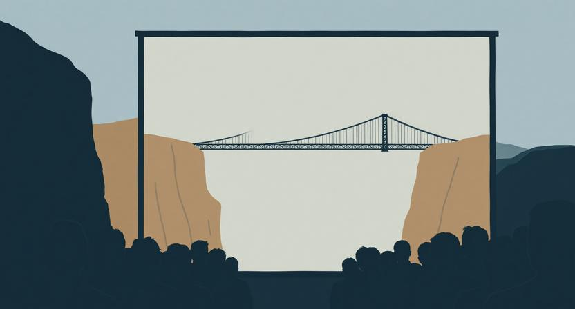

## 폰을 꺼내는 정확한 타이밍

프레젠테이션을 하다 보면, 청중이 폰을 꺼내는 순간이 있다. 흥미로운 건 그 타이밍이 꽤 일정하다는 것이다. 발표 내용이 어려워서가 아니다. 재미없어서도 아니다. 청중이 폰을 꺼내는 정확한 순간은, "다음에 뭐가 나올지 감이 안 잡힐 때"다.

한번 떠올려보자. 누군가의 발표를 듣고 있는데, 한 슬라이드가 끝났다. 다음 슬라이드로 넘어갔는데, 이전 내용과 어떻게 연결되는지 모르겠다. "이 사람이 지금 어디로 가고 있는 거지?" 이 질문이 머릿속에 떠오르는 순간, 집중은 이미 끊겨 있다. 그리고 손은 자연스럽게 주머니 속 폰으로 간다. 의식적인 선택이 아니다. 뇌가 "이건 추적할 수 없다"고 판단한 것이다.

## 집중이 끊기는 진짜 이유

보통 발표가 실패하면, 내용이 부실했다거나 전달력이 부족했다고 분석한다. 물론 그것도 요인이 될 수 있다. 하지만 내용이 훌륭하고 전달력이 좋은데도 청중이 이탈하는 경우가 있다. 이때의 원인은 다른 곳에 있다. 이야기 흐름의 예측 불가능성이다.

사람의 뇌는 이야기를 들을 때 자동으로 다음을 예측한다. "문제를 설명했으니, 다음은 원인이겠지." "사례를 들었으니, 다음은 교훈이겠지." 이 예측이 대략적으로라도 맞으면, 뇌는 안심하고 이야기를 따라간다. 자신이 올바른 경로 위에 있다는 감각. 이 감각이 유지되는 한, 집중은 계속된다.

문제는 이 예측이 완전히 깨질 때다. 다음에 뭐가 올지 전혀 감이 잡히지 않으면, 뇌는 이야기를 쫓아가는 것을 포기한다. 미지의 길에서 이정표 없이 걷는 것과 같다. 어디로 가고 있는지 모르면, 계속 걸을 동기가 사라진다. 발표에서 청중이 이탈하는 건 지루해서가 아니라, 길을 잃어서다.

## 접속사가 만드는 예측 가능성

그렇다면 청중이 길을 잃지 않게 하려면 어떻게 해야 할까. 가장 단순하면서도 강력한 도구가 있다. 접속사다.

"다음으로"라고 말하면, 청중은 새로운 주제가 시작된다는 것을 안다. "예를 들어"라고 말하면, 구체적인 사례가 올 것을 예측한다. "그러나"라고 말하면, 앞의 내용을 뒤집는 무언가가 올 것을 기대한다. 이 짧은 단어 하나가 청중의 뇌에 이정표를 세운다. "아, 다음은 이런 종류의 이야기가 오겠구나."

접속사를 무시하고 이야기를 나열하면, 내용이 아무리 좋아도 청중의 머릿속에서는 분절된 슬라이드의 연속이 된다. 각각은 의미가 있지만, 흐름이 없다. 마치 챕터 번호가 없는 소설을 읽는 것과 비슷하다. 개별 장면은 좋은데, 전체 구조가 잡히지 않는다.

접속사는 화려한 기술이 아니다. 하지만 이야기에 골격을 부여한다. "첫째", "반면에", "결국" — 이런 단어들이 청중의 뇌에 지도를 그려준다. 지도가 있으면 사람은 걸을 수 있다. 지도가 없으면 멈춘다.

## 예고의 세 가지 기술

접속사가 문장 단위의 이정표라면, 예고는 구간 단위의 이정표다. 발표 전체의 흐름을 청중이 따라올 수 있게 하려면, 세 가지 종류의 예고가 필요하다.

첫째, 질문으로 예고하는 방법이 있다. "그렇다면 왜 이런 일이 벌어질까요?"라고 물으면, 청중의 뇌는 자동으로 답을 찾기 시작한다. 답을 찾으려는 상태에서 다음 슬라이드를 보면, 같은 정보라도 흡수 깊이가 다르다. 질문은 청중의 뇌를 수동에서 능동으로 전환시킨다. 다음에 올 내용을 "듣는" 것이 아니라 "찾는" 것으로 바꿔준다.

둘째, 의미심장한 중단이 있다. 핵심 메시지를 말하기 직전에 잠깐 멈추는 것이다. 이야기가 어떤 방향으로 흘러가고 있는데 갑자기 멈추면, 청중은 "왜 멈췄지?"라는 긴장감을 느낀다. 그 긴장감이 다음에 오는 말의 무게를 두 배로 만든다. 침묵은 빈 시간이 아니다. 기대를 증폭시키는 장치다.

셋째, 마무리 예고가 있다. "마지막으로 한 가지만 더 말씀드리겠습니다"라고 하면, 청중은 끝이 가까워졌음을 알고 집중력을 끌어올린다. 반대로 끝이 보이지 않는 발표는 청중을 지치게 한다. 마라톤에서 결승선이 보이면 마지막 힘을 낼 수 있지만, 결승선이 어디인지 모르면 페이스를 유지할 수 없는 것과 같다.

이 세 가지 — 질문, 중단, 마무리 예고 — 의 공통점은 청중에게 "다음에 무슨 일이 일어날지"에 대한 감각을 주는 것이다. 완벽하게 예측할 필요는 없다. 대략적인 방향만 알아도 사람은 따라온다.

## 예측 가능성과 놀라움의 리듬

여기서 한 가지 역설이 있다. 예측 가능성이 중요하다고 했는데, 그러면 발표가 뻔해지는 것 아닌가. 다음에 뭐가 올지 다 알면 재미없지 않은가.

맞는 지적이다. 예측 가능성만으로는 집중을 유지할 수 있지만, 몰입을 만들 수는 없다. 몰입이 생기려면, 예측 가능한 흐름 위에 예상치 못한 순간을 심어야 한다. 이것이 예측 가능성과 놀라움의 리듬이다.

구조는 이렇다. 먼저 청중이 "이건 이런 방향이겠지"라는 가설을 세울 수 있게 한다. 접속사와 예고를 통해 흐름의 뼈대를 보여준다. 청중이 안심하고 따라오는 상태가 만들어지면, 그때 예상을 뒤집는다. "그런데 실제로는 정반대였습니다." 안정된 흐름 위에서 터지는 반전은, 혼란이 아니라 쾌감이 된다. 가설이 먼저 있었기 때문에, 그 가설이 깨지는 순간이 강렬해지는 것이다.

이 리듬은 발표 전체에 걸쳐 반복되어야 한다. 예측 가능한 구간으로 안심시키고, 놀라운 순간으로 각성시키고, 다시 예측 가능한 구간으로 안심시키는 반복. 이 파동이 발표에 생명력을 준다. 예측만 있으면 졸리고, 놀라움만 있으면 피곤하다. 둘이 교차할 때 사람은 빠져든다.

## 발표 너머의 원리

이 원리는 프레젠테이션에만 적용되는 게 아니다. 글을 쓸 때도, 기획서를 작성할 때도, 심지어 일상적인 대화에서도 같은 구조가 작동한다.

글에서 문단의 첫 문장은 예고다. 이 문단에서 무엇을 다룰 것인지 독자에게 미리 알려준다. 그 예고가 없으면 독자는 문단 중간에서 길을 잃는다. 기획서에서 목차는 전체 흐름의 예고다. 목차를 읽는 것만으로 "아, 이런 순서로 이야기가 전개되겠구나"라는 감각이 생겨야 한다. 대화에서 "한 가지 물어봐도 될까"는 예고이고, "근데 말이야"는 전환의 신호다. 이런 작은 장치들이 상대방의 뇌가 다음을 준비할 시간을 만들어준다.

슬랙에서 긴 메시지를 보낼 때도 마찬가지다. "공유 드릴 것이 세 가지입니다"라고 시작하면 상대방은 마음의 준비를 한다. 아무런 예고 없이 장문의 메시지가 오면, 읽기도 전에 부담부터 느낀다. 같은 내용이지만, 예고가 있고 없고에 따라 수신자의 경험이 완전히 달라진다.

결국 모든 커뮤니케이션은 상대방의 뇌에 지도를 그려주는 일이다. "지금 여기에 있고, 다음은 저기로 간다"는 감각을 주는 것. 이 감각이 있으면 사람은 기꺼이 따라오고, 이 감각이 없으면 사람은 조용히 이탈한다. 프레젠테이션이 실패하는 진짜 이유는 내용이 나빠서가 아니다. 청중이 길을 잃었기 때문이다. 그리고 길을 잃게 만드는 가장 확실한 방법은, 예고 없이 이야기를 시작하는 것이다.
