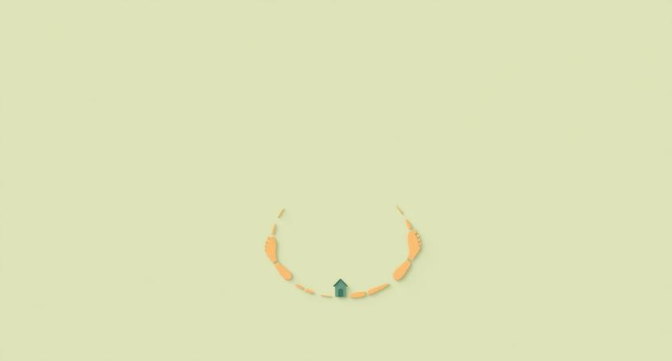

## "결국 돌아왔다"

여행을 다녀온 직후의 감각이 있다. 현관문을 열고 집에 들어서는 순간, 묘한 허무함. 낯선 도시에서의 흥분, 새로운 음식, 예상치 못한 만남. 분명 특별한 시간이었는데, 돌아오니 방은 떠나기 전과 똑같고, 내일은 평소와 같은 하루가 기다리고 있다. "결국 돌아왔네." 이 한마디에 여행의 의미가 흐릿해지는 느낌.

프로젝트도 비슷하다. 몇 달간 몰두해서 무언가를 만들어내고, 출시하고, 반응을 확인하고 나면 — 다시 다음 프로젝트의 시작점에 서 있다. 이직도 마찬가지다. 새로운 환경에서 적응하고, 성과를 내고, 자리를 잡으면 — 그곳이 곧 새로운 일상이 된다. 어디를 가든, 무엇을 하든, 결국 어떤 형태로든 출발점과 닮은 자리로 돌아온다.

## 돌아온 여행에 의미가 없을까

"결국 제자리 아닌가?" 이렇게 느낄 수 있다. 돈과 시간을 들여 여행을 갔다 와도 일상은 그대로이고, 열정을 쏟아 프로젝트를 끝내도 다시 백지에서 시작해야 하고, 힘들게 이직해도 결국 비슷한 고민을 하게 된다면. 도착한 곳이 출발한 곳과 같다면, 그 여정에 무슨 의미가 있는 걸까.

이 질문에 답하려면, "같은 자리"라는 표현을 다시 생각해봐야 한다. 정말 같은 자리인가? 물리적으로는 그렇다. 같은 집, 같은 책상, 같은 모니터. 하지만 그 자리에 앉아 있는 사람은 같은 사람인가?

## 출발한 나와 돌아온 나는 다른 사람이다

여행을 다녀온 후 같은 동네를 걸으면, 이상하게 풍경이 다르게 보인다. 길은 그대로인데, 보이는 것이 달라져 있다. 이건 풍경이 변한 게 아니라 보는 사람이 변한 것이다. 새로운 도시에서의 경험이, 의식하지 못하는 사이에, 사물을 보는 필터를 바꿔놓는다.

프로젝트도 마찬가지다. 하나의 프로젝트를 끝내고 나서 다음 프로젝트를 시작하면, 같은 종류의 결정을 내려야 하는 상황에서도 판단이 달라진다. 이전에는 고민하던 것을 이번에는 바로 결정하고, 이전에는 몰랐던 위험을 이번에는 미리 감지한다. 같은 자리에 앉았지만, 같은 사람이 아니다.

문제는 이 변화를 당사자가 잘 느끼지 못한다는 것이다.

## 성장은 왜 보이지 않는가

매일 거울을 보는 사람은 자기 얼굴이 변하는 걸 모른다. 오랜만에 만난 친구가 "너 살쪘다"고 말해줘야 비로소 인식한다. 성장도 마찬가지다. 매일 조금씩 달라지기 때문에, 당사자는 자신이 성장했다는 사실을 체감하지 못한다.

어제의 나와 오늘의 나를 비교하면, 차이를 발견하기 어렵다. 작은 판단 하나, 미세한 관점의 변화, 약간 더 빨라진 결정 속도. 이런 것들은 하루 단위로는 보이지 않는다. 하지만 6개월 전의 나와 지금의 나를 비교하면, 차이가 분명해진다. 성장을 인식하려면 충분한 시간적 거리가 필요하고, 그 거리를 만들어주는 것이 바로 "시작점으로의 귀환"이다.

## 시작점이 거울이 된다

원래 자리로 돌아왔을 때, 그 자리는 거울이 된다. 과거의 내가 서 있던 자리에 지금의 내가 다시 서면, 비로소 비교가 가능해진다. "예전에는 이걸 어떻게 했더라?" 하고 떠올렸을 때, 지금의 내가 그때와 다르게 생각하고 있다는 걸 발견한다. 그 발견의 순간이 성장의 인식이다.

여행에서 돌아와 같은 동네를 걸을 때 풍경이 다르게 보이는 이유가 이것이다. 시작점이 과거의 나를 비추는 거울이 되어, 변한 나를 보여주는 것이다. 만약 여행이 끝나지 않고 계속 새로운 곳만 간다면, 변화를 인식할 기준점이 없다. 돌아와야만 비교가 가능하고, 비교해야만 성장이 보인다.

## 두 번째로 같은 일을 할 때

이 원리가 가장 선명하게 드러나는 순간은, 같은 종류의 일을 두 번째 할 때다.

처음 팀을 빌딩할 때는 모든 것이 막막하다. 누구를 뽑아야 하는지, 어떤 역할이 필요한지, 언제 사람을 늘려야 하는지. 시행착오를 겪으며 어찌저찌 팀을 만든다. 그리고 두 번째로 팀을 빌딩할 때, 자신이 얼마나 달라졌는지를 알게 된다. 이전에는 고민하던 결정을 이번에는 확신을 가지고 내린다. 이전에는 미처 몰랐던 실수를 이번에는 미리 피한다.

이건 "경험이 쌓여서"라는 한 문장으로 설명할 수 있다. 하지만 중요한 건, 그 성장을 인식하는 시점이 "두 번째로 같은 자리에 섰을 때"라는 것이다. 첫 번째 팀 빌딩이 끝난 직후에는 내가 뭘 배웠는지 잘 모른다. 두 번째 시작점에 서야 비로소, 첫 번째의 나와 지금의 나 사이의 거리가 보인다.

## 커리어도 원환이다

이직을 하고, 새 환경에 적응하고, 성과를 내고, 다시 다음을 고민하는 사이클. 창업을 하고, 실패하고, 다시 시작하는 사이클. 프로젝트를 기획하고, 실행하고, 마무리하고, 다시 기획하는 사이클. 커리어는 직선이 아니라 원환이다.

이걸 "제자리걸음"으로 볼 수도 있다. 하지만 정확히 같은 자리를 도는 원이 아니라, 조금씩 높아지는 나선이다. 같은 종류의 고민을 하지만 깊이가 다르고, 같은 종류의 결정을 내리지만 정확도가 다르고, 같은 종류의 실패를 하지만 회복 속도가 다르다. 나선은 위에서 보면 원처럼 보인다. 하지만 옆에서 보면 분명히 올라가고 있다.

## 왜 모든 여행은 집으로 돌아오는가

여행의 의의는 도착지에 있지 않다. 가는 동안 겪는 것들, 보는 것들, 느끼는 것들이 여행의 본질이다. 그리고 그 본질을 비로소 인식하게 되는 순간은, 집에 돌아왔을 때다. 떠나기 전의 나와 돌아온 뒤의 나를 비교할 수 있는 유일한 장소가 시작점이기 때문이다.

그래서 모든 좋은 이야기는 시작점으로 돌아간다. 신화 속 영웅이 모험을 마치고 마을로 돌아오는 것도, 긴 프로젝트를 끝내고 다시 백지 앞에 서는 것도, 같은 이유다. 돌아옴은 끝이 아니라, 성장을 자각하는 시작이다.

결국 집으로 돌아왔다고 느끼는 그 순간, 당신은 이미 떠나기 전의 당신이 아니다. 그걸 깨닫는 것이, 여행이 우리에게 주는 진짜 선물이다.
