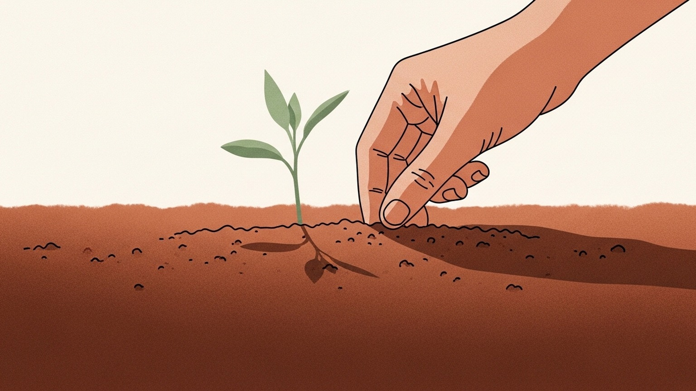

스타트업의 채용 풍경이 빠르게 달라지고 있다. 한 명이 들고 가는 일의 양이 늘어난 만큼, 그 사람을 어떤 자리에 어떻게 두느냐를 두고 회사가 던지는 질문이 바뀐다. 한 명 한 명이 어떤 능력을 가졌느냐만큼이나, 그 사람을 받아낼 조직이 어떤 모양인지가 같이 의식되기 시작했다. 채용이 사람을 보는 일에서, 사람을 받아낼 토양을 같이 보는 일로 이동하고 있다는 감각이다.

## 일당백을 전제로 한 채용

볼륨 하이어링이 줄고 있다. AI로 인당 아웃풋이 커지면서, 한 명이 두세 명 몫을 한다는 가정을 처음부터 깔고 자리를 설계하는 사례가 늘었다. 자리를 만들 때 첫 질문이 "지금 급한가"에서 "1~2년 뒤에도 이 자리가 필요한가"로 옮겨가는 흐름도 같이 보인다. 그 이후 사라질 자리는 정규직보다 프랙셔널·계약·자문 형태로 메우는 쪽이 안전한 선택지로 정착하고 있다. 한국에서 정규직 정리는 비용도 관계도 부담이 크기 때문이다.

보상 밴드 설계가 예전보다 더 신경 쓰이는 항목이 됐다. 급해서 한 명에게 시장 초과 보상이 한동안 지속되면, 그 사람을 제외한 내부의 동기가 빠르게 흔들리는 것을 경험한 조직이 늘었기 때문이다. 그래서 밴드의 위아래 폭은 좁히고, 예외는 한시적 옵션으로 분리해서 다루는 사례가 자주 보인다.

채용 단계에서 보는 항목 중 하나는 "목표가 매년 오르는 환경에 결이 맞는 성향인가"이다. 안정과 워라밸을 우선하는 성향이 부족하다는 뜻이 아니다. 100→120→150% 곡선이 매년 그어지는 환경에 본인의 결이 맞느냐, 그 자리에 본인이 부담을 덜 가져가느냐의 문제로 본다.

## 받아낼 토양을 먼저 본다

조직에 잘 녹는 사람의 공통 습성을 페르소나로 정의해두는 시도가 늘고 있다. 친분이나 레퍼럴에 기대지 않고도, 그 페르소나에 맞는 사람을 채용 시장에서 발견하기 위해서다. 페르소나는 추상적인 성격 형용사가 아니라, 일을 시작하는 방식·질문을 던지는 방식·실패를 다루는 방식 같은 행동 단위로 내려가 있을 때 가장 잘 작동한다.

능력만큼 토양 적응성이 중요한 변수로 다뤄진다. 스테이지가 바뀌면 필요 역량도 바뀌고, 외부에서 검증된 전문가도 토양과 어긋나면 한동안 겉돌다 빠진다. 사람을 데려오는 비용보다, 데려온 사람이 토양에 닿지 못해 빠지는 비용이 더 크다는 인식이 자리잡고 있다. 그래서 "받아낼 토양을 같이 준비하는 일"이 채용과 비슷한 비중으로 다뤄지는 흐름이 생긴다.

## 인재 밀도를 유지하는 설계

수습 기간, 적합도 평가, 합의에 기반한 분리(위로금을 포함한 절차)는 인재 밀도를 유지하기 위한 정상적이고 설계 가능한 절차로 자리잡고 있다. 다만 같은 절차도 운영의 디테일에 따라 노동자 입장에서의 체감 압박은 크게 갈린다. 합의의 시점, 평가의 투명도, 분리 이후의 관계 관리까지가 절차의 일부로 다뤄질 때만, 이 설계가 양측에 큰 흠집 없이 굴러간다.

노무 유연성이 필요한 곳은 미국 법인 고용 후 한국 파견 형태를 쓰는 사례도 보인다. 직접적인 한국 정규직 채용보다 운영의 폭이 넓은 선택지로 다뤄진다.

신규 채용 대신 기존 A급 구성원에게 AI 활용과 보상 인상으로 커버시키는 방식도 자주 등장한다. 한 명이 만들어내는 결과의 천장이 올라간 만큼, 자리를 늘리는 비용보다 자리를 보강하는 비용이 더 합리적인 구간이 넓어졌다. 고밀도 조직일수록 이 선택은 단순한 비용 절감이 아니라 조직 모양을 지키는 결정으로 평가된다.

## 오퍼 직전에 결을 맞춘다

회사가 3개월·6개월·12개월, 그 이후의 기대 임팩트 그림을 채용 전에 미리 그려두는 흐름이 자리잡고 있다. 채용은 그 그림과 사람의 결을 맞춰가는 과정으로 다뤄진다.

오퍼 직전 단계에서 실제 일하는 방식을 짧게 테스트하고, 후보의 양해를 구한 뒤 회사가 자체 네트워크를 통해 추가 레퍼런스를 받는 사례가 늘었다. 후보가 제출한 공식 레퍼런스 리스트 바깥에서 한 번 더 결을 맞춰 보는 절차다. 오퍼 직전은 후보 입장에서도 의사결정에 가까워진 구간이라, 양해를 구하는 절차에 큰 거부감이 생기지 않는 시점으로 다뤄진다. 같은 요청을 초기 단계에 하면 거부감이 커지는 흐름이 같이 관찰된다. 그래서 타이밍이 중요한 절차로 정착하고 있다.

다만 검증을 너무 촘촘하게 짜면 옵션이 많은 A 플레이어가 중간에 이탈하기 쉽다. 검증의 강도와 퍼널의 폭은 항상 같이 설계된다. 자신 있는 후보일수록 상호 트라이얼을 오히려 환영하는 경우도 있어서, 검증을 일방의 점검이 아닌 상호의 결 맞추기로 운영하는 곳이 늘고 있다.

매칭의 불확실성 자체도 자주 함께 다뤄진다. 전문가가 개입하는 매칭조차 성공률이 그리 높지 않은 영역이라는 인식이 깔려 있다. 양측 모두 신중하게 가는 것이 기본값으로 정착하고 있다.

## 타이밍, JD, 위임

하반기 채용의 타이밍이 늦어지는 흐름이 보인다. 하이퍼포머는 12월 보너스 수령 후 3월쯤 이직을 결정하는 경향이 있어서, 10~12월에 인터뷰가 진행되어도 실제 조인은 다음 해 1분기 끝 무렵에 맞춰지는 경우가 많다. 채용 일정은 이 리듬을 전제로 짜는 것이 자연스럽다.

JD는 "이 자리에서 무엇을 해내야 하는가"만 명확하면 AI로 충분히 작성·보완되는 단계에 들어섰다. 형식의 매끄러움보다, 자리의 임팩트 그림이 또렷한지가 더 중요한 입력이 된다.

위임은 점점 결정적인 변수가 되어간다. AI로 본인이 감당되는 동안에는 위임 없이도 굴러간다. 다만 번아웃 수준의 커버리지가 길어지면 위임이 다음 단계로 가는 한 수가 된다. 전문가의 새 밸류는 위임이 안 되면 캡처되지 않는다는 관찰이 자주 보인다. 자기 손에서 일이 떨어져 나가야 그다음의 일이 본인의 손에 닿는다.

## 마무리

요즘 채용 풍경을 한 단어로 묶으면 "토양"에 가깝다. 사람을 보는 일이 사람만 보는 일에서, 사람을 받아낼 조직을 같이 설계하는 일로 이동하고 있다. 페르소나도, 보상 밴드도, 오퍼 직전의 결 맞추기도 결국 같은 방향을 가리킨다.

같은 흐름은 다른 쪽에서 보면 채용과 평가의 압박이 더 정교해지는 흐름이기도 하다. 어느 쪽 시점에서 보든, 토양과 사람의 결을 미리 맞춰두려는 시도가 늘고 있다는 점은 동일하다. 잘 짜인 토양이 양쪽 모두의 시간을 아낀다는 인식이 이 변화의 동력으로 보인다.
