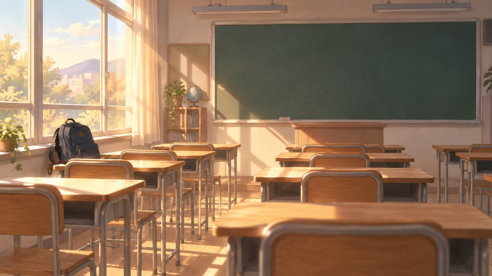

나는 월요일이 싫었다. 정확히는 일요일 저녁 여섯 시부터 싫었다. 엄마가 밥 먹으라고 부르는 소리, 거실 TV에서 흘러나오는 주말 예능의 마지막 코너, 방문 뒤에 걸린 교복. 그런 것들이 한꺼번에 "내일 학교"라고 말하는 것 같았다. 침대에 누워 천장을 보고 있으면 숨이 조금씩 무거워졌다. 월요일은 일주일 중에 제일 긴 날이었고, 1교시는 하필 수학이었다.

그게 바뀐 건 고2 3월이었다.

## 대각선 앞자리

새 학기 첫 주에 담임쌤이 번호순으로 자리를 정했다. 나는 창가 넷째 줄. 내 대각선 앞자리에 걔가 앉았다. 이름은 출석 부를 때 처음 들었다. 같은 반이 된 적도, 복도에서 인사한 적도 없는 애였다.

둘째 주 수학 시간에 샤프심이 떨어졌다. 짝한테 빌리려고 팔꿈치를 찌르는데, 앞에서 걔가 뒤를 돌아보더니 샤프심 통을 통째로 내밀었다.

"두 개 가져가."

말은 그게 전부였다. 받고 나서야 알았다. 내 샤프는 0.5인데 걔 샤프심은 0.7이었다. 맞지도 않는 걸 고맙다고 받아 들고, 나는 그날 남은 시간을 짝의 샤프심으로 버텼다. 그 두 개는 아직 필통 안쪽 지퍼 칸에 있다. 쓸 수도 없는데 버리지도 못하고.

그날부터 이상한 것들이 보이기 시작했다. 걔는 문제가 안 풀리면 샤프 끝으로 책상을 두 번 두드린다. 쉬는 시간이면 창밖을 본다. 내 자리가 창가라서, 걔가 창밖을 볼 때마다 꼭 나를 보는 각도가 된다. 물론 걔가 보는 건 운동장이다. 알면서도 나는 매번 고개를 숙였다.

한번은 국어쌤이 걔한테 시를 읽혔다. 걔 목소리는 생각보다 낮았고, 문장 끝을 살짝 흐리는 버릇이 있었다. 다른 애들은 엎드려 있었는데 나는 교과서의 같은 줄을 손가락으로 따라가고 있었다. 시 제목은 기억이 안 난다. 걔가 어느 줄에서 숨을 쉬었는지는 기억난다.

## 길어진 주말

이상한 일은 주말에 일어났다. 원래 금요일 종례는 해방이었다. 그런데 토요일 오후가 되면 할 게 없어졌다. 게임은 재미가 없었고, 친구들 카톡에도 대충 답했다. 반 단톡방에 걔 이름이 뜨면 프로필 사진만 몇 번 눌러 봤다. 바다 사진이었다. 언제 바뀌었는지는 모른다.

일요일 낮에는 괜히 학교 앞 문구점까지 걸어갔다. 살 것도 없으면서 0.7 샤프를 하나 집었다가 내려놨다. 그걸 사면 걔가 준 샤프심을 쓸 수 있다. 그런데 쓰면 없어진다. 문구점 아저씨가 "학생, 안 사?" 하고 물을 때까지 나는 그 앞에 서 있었다.

일요일 저녁 여섯 시. 예전 같으면 가라앉기 시작할 시간이다. 그런데 그 무렵부터 가슴 어딘가가 들썩였다. 나는 옷장에서 교복 셔츠를 꺼내 다림질을 했다. 엄마가 지나가다 "웬일이니?" 했다.

"내일 사진 찍어."

거짓말치고는 너무 빨리 나왔다.

그날 밤 침대에 누웠을 때, 천장은 똑같았는데 숨은 가벼웠다. 내일이 월요일이라는 사실이 처음으로 나쁜 소식이 아니었다.

## 월요일 아침, 7시 52분

원래 알람은 7시 10분이다. 월요일만 7시로 바꿨다. 그러면 버스를 한 대 일찍 탈 수 있다. 교실 문을 열면 아직 몇 명 없다. 걔는 보통 8시쯤 오는데, 나는 그보다 먼저 와 있고 싶었다. 걔가 들어오는 걸 보고 싶어서인지, 먼저 와 있는 사람이 되고 싶어서인지는 잘 모르겠다.

자리에 앉아 영어 단어장을 폈다. 단어는 하나도 안 외워졌다. 앞문 쪽에서 발소리가 날 때마다 고개가 먼저 움직였다. 첫 번째는 반장이었고, 두 번째는 옆 반 애였다. 세 번째에는 고개를 안 들기로 마음먹었는데, 그것도 실패했다.

그날은 7시 52분에 앞문이 열렸다. 걔가 가방을 내려놓고 의자를 빼다가, 뒤를 돌아봤다.

"주말 잘 보냈어?"

나한테 한 말이었다. 혹시 몰라서 옆을 볼 뻔했다.

"어, 그냥. 너는?"

"나도 그냥."

그게 다였다. 그 두 번의 "그냥"이 하루 종일 머릿속에서 굴러다녔다. 1교시 수학은 하나도 안 들렸다. 월요일 1교시가 그렇게 짧았던 적은 처음이었다.

점심시간에 짝이 물었다. "너 요즘 월요일만 되면 왜 이렇게 쌩쌩하냐?" 나는 주말에 잠을 많이 자서 그렇다고 했다. 이번 거짓말은 조금 느리게 나왔다.

## 요일은 그대로인데

솔직히 월요일은 그대로다. 1교시는 여전히 수학이고, 급식은 이상하게 월요일마다 맛이 없다. 바뀐 건 요일이 아니라 그 요일에 누가 있느냐였다. 주말은 걔를 못 보는 이틀이 됐고, 월요일은 그 이틀이 끝나는 날이 됐다. 싫어하던 날이 기다리는 날이 되는 데 필요한 건 생각보다 작았다. 맞지도 않는 샤프심 두 개, 그리고 "주말 잘 보냈어?" 한마디.

대신 요즘은 다른 게 싫어졌다. 목요일 밤부터 슬슬 그렇다. 내일이 지나면 이틀을 버텨야 한다는 생각이 든다. 그리고 금요일 종례. 담임쌤이 "주말 잘 보내라" 하면 다들 환호하는데, 나만 가방을 느리게 싼다. 걔가 앞문으로 나가는 걸 보고 나서야 자리에서 일어난다.

언젠가 걔한테 이 얘기를 할 수 있을까. 너 때문에 월요일이 좋아졌다고. 아직은 못 하겠다. 일단 이번 주 일요일에도 셔츠를 다릴 거다. 필통 안쪽 지퍼 칸의 0.7 샤프심 두 개는, 아마 졸업할 때까지 그대로 둘 것 같다.
