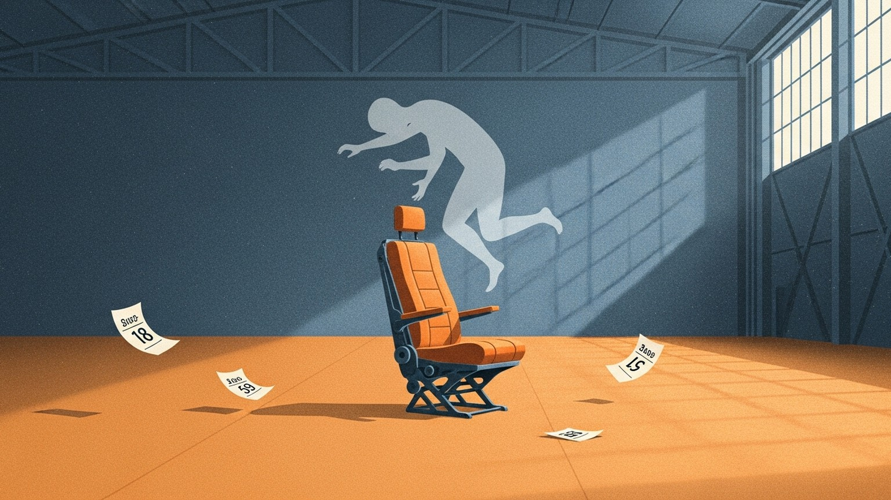

시험지가 돌려지는 교실의 풍경이 있다. 종이 맨 위에는 이름이, 그 옆에는 붉은 글씨로 숫자가 하나 붙어 있다. 94. 그 아래에는 더 작은 글씨로 '반 석차 3/35'. 아이들은 종이를 받아 들며 책상 아래로 시선을 내리깐다. 옆자리 친구의 점수를 흘끗 훔쳐본다. 마음 한구석에서 무언가가 조용히 움직인다.

이름 옆에 숫자가 붙는 순간, 무언가가 바뀐다. 그때부터 사람은 더 이상 사람이 아니라, 평균으로부터 몇 점 위에 있거나 아래에 있는 존재가 된다. 길이가 되고, 너비가 되고, 등급이 된다. 그런데 우리는 대체 누구를 기준으로 그 거리를 재고 있는 걸까.

## 존재하지 않는 조종사

1950년대 초, 미 공군은 원인을 알 수 없는 추락 사고에 시달리고 있었다. 전투기 성능은 비약적으로 좋아졌는데, 조종사들이 잇따라 떨어졌다. 처음엔 조종사 개개인의 실력을 탓했고, 그다음엔 기계적 결함을 의심했다. 그러나 진짜 원인은 엉뚱한 곳에 있었다. 조종석이었다.

공군은 조종사 4,063명의 신체 치수를 측정해 그 평균값으로 조종석을 설계했다. 가장 많은 사람에게 가장 잘 맞을 거라고 굳게 믿었던 그 평균 사이즈. 그런데 연구원 길버트 대니얼스가 이상한 질문 하나를 던진다. 키, 가슴둘레, 팔 길이 등 열 가지 주요 항목에서 평균값에 모두 속하는 조종사는 과연 몇 명일까.

답은 0명이었다.

4,063명의 조종사 중 열 가지 평균에 모두 부합하는 사람은 단 한 명도 없었다. 어떤 이는 팔이 긴데 다리가 짧았고, 어떤 이는 가슴이 넓은데 머리가 작았다. 평균적인 조종사라는 존재는 이 세상에 없었다. 미 공군은 유령을 위해 수만 대의 조종석을 찍어내고 있었던 것이다.

이 이야기의 무게는 거기에 있다. 우리가 평생 맞추려 애써온 그 몸은, 어쩌면 애초에 존재하지도 않는 것일지 모른다.

## 교실이라는 조종석

평균이 이상적 인간의 모습이라고 선언한 사람은 19세기의 통계학자 아돌프 캐틀레였다. 그는 군인들의 신체 치수를 재서 평균값을 구한 뒤, "이상적인 인간이란 평균값이다"라고 선언했다. 그로부터 200년이 지난 지금도, 이 한 문장이 학교와 회사와 사회 전체를 지배하고 있다.

18세기 후반, 나폴레옹에게 처참하게 패배한 프로이센 제국은 이런 결론을 내렸다. 제국은 비판적으로 생각하는 개인이 아니라 명령에 복종하는 부품이 필요하다. 그렇게 종소리에 맞춰 이동하고, 정해진 내용을 암기하고, 시험으로 서열을 매기는 프로이센식 교육이 탄생했다. 토드 로즈는 이 모델을 "존재하지도 않은 평균적 학생을 위해 설계된 거대한 조종석"이라고 불렀다.

이 조종석 안에서 잘 적응한 사람들은 하나의 공통된 믿음을 가진다. 공부를 잘하면 나는 똑똑한 사람이고, 못하면 나는 멍청한 사람이다. 성적이, 시험 점수가, 평균과의 거리가 곧 내 가치를 증명한다.

이 믿음이 어디서 탈이 나는지를 보여주는 실험이 있다. 스탠포드의 캐럴 드웩은 초등학교 5학년 400명에게 어려운 퍼즐을 풀게 한 뒤, 두 그룹에게 딱 한 마디씩만 다르게 말해주었다. A 그룹에게는 "너 정말 똑똑하구나", B 그룹에게는 "너 정말 열심히 했구나". 다음 시험에서 '열심히 했다'고 칭찬받은 그룹은 성적이 30% 올랐고, '똑똑하다'고 칭찬받은 그룹은 오히려 20% 떨어졌다.

왜 이런 일이 벌어졌을까. '똑똑하구나'라는 말을 들은 순간, 아이의 머릿속엔 '나는 똑똑한 아이'라는 정체성이 생긴다. 그런데 이 정체성이 곧 양날의 검이다. 다음 시험에서 어려운 문제를 만나면 아이는 생각한다. 틀리면 어떡하지? 내가 사실은 똑똑하지 않다는 게 들통나는 것 아닐까. 그래서 아이는 도전하지 않는다. 쉬운 문제만 고른다. 실패는 단순한 실패가 아니라, 내가 멍청하다는 증거가 되어버리니까.

어쩌면 이것이, 요즘 번아웃과 무기력의 정체일지도 모른다. 태어날 때부터 평균이라는 잣대로 줄 세워져온 사회에서, 한 번의 실패가 "나는 역시 평균도 안 되는 사람이구나"를 증명해버리는 순간 — 우리는 아예 시도하지 않는 쪽을 택한다. 시도하지 않으면 적어도 '아직 제대로 안 해 본 사람'으로는 남을 수 있으니까. '해봤는데 안 되는 사람'보다는 나으니까.

## 사냥꾼의 몸, 농부의 일

그렇다면 왜 어떤 사람들은 유독 교실과 사무실에서 힘들어할까. 미국 국립 보건원의 연구에 따르면, ADHD가 있거나 산만하다고 평가받는 사람들의 뇌는 도파민 수용체 밀도와 운반체 수치가 일반인보다 현저히 낮다. 쉽게 말해, 남들만큼 각성하려면 훨씬 더 강렬하고 즉각적인 자극이 필요하다는 뜻이다.

숏폼 영상은 1초마다 도파민을 공급한다. 학교와 직장은 3개월 뒤의 성적, 1년 뒤의 인사 평가라는 지연된 보상을 약속한다. 애초에 강한 자극이 필요한 뇌에게 이 간격은, 굶어 죽으라는 요구와 비슷하다.

흥미로운 건, 이 뇌가 늘 결함이었던 건 아니라는 사실이다. 아프리카 케냐 북부의 아리알 부족에는 새로운 자극을 끊임없이 좇게 만드는 DRD4-7R, 이른바 '방랑자 유전자'를 가진 사람들이 있다. 이들이 초원을 누비는 유목 생활을 하던 시절, 방랑자 유전자를 가진 사람들은 부족 최고의 에이스였다. 체질량 지수도 높고 영양 상태도 완벽했다. 사방에서 맹수가 튀어나오는 환경에서 그들의 산만함은 주변을 경계하는 레이더였고, 충동성은 창을 빠르게 던지게 만드는 생존의 무기였다.

그런데 부족이 마을에 정착해 농경 생활을 시작하자, 똑같은 유전자를 가진 에이스들이 가장 먼저 영양실조에 시달리며 도태되기 시작한다. 몸은 그대로인데 환경만 바뀌었는데, 에이스가 낙오자가 된다. 진화 생물학은 이 현상을 '진화적 불일치'라고 부른다.

어쩌면 교실과 사무실에서 미칠 듯한 지루함을 느끼는 건, 당신에게 결함이 있어서가 아닐지도 모른다. 사냥꾼의 하드웨어를 가지고, 씨앗이 자라는 걸 가만히 기다려야 하는 농부의 삶에 갇혀 있기 때문일지도 모른다.

## 악당이 되는 편이 낫다

중학교 1학년 미술 시간, 지루함을 견디지 못한 한 소년이 칠판을 향해 황화암모늄 폭탄 여섯 개를 던진다. 달걀 썩는 냄새에 모든 학생이 눈물을 흘리며 도망칠 때, 그 소년만 혼자 웃었다. 선생님은 소년의 목덜미를 잡고 교장실로 끌고 갔다. 소년에게는 이미 익숙한 공간이었다. 그는 정학 처분을 받았고, 얼마 뒤 ADHD 판정도 받았다. 평점 0.9로 고등학교를 간신히 졸업한 이 소년은, 훗날 교육 신경과학의 권위자가 되는 토드 로즈다.

그는 나중에 이렇게 고백했다. "무능한 피해자로 동정받느니, 차라리 악당이 되어 경멸받고 싶었다."

이 고백의 핵심은 자율성이다. 인간의 가장 강력한 본능 중 하나는 '내 삶을 스스로 통제한다'는 감각이다. 환경이 "너는 평균이야. 너는 구제 불능이야"라고 억압할 때, 남은 통제권을 지키기 위해 할 수 있는 일은 스스로 룰을 엎어버리는 것뿐이다. 악당이 되는 길은 결함이 아니라, 마지막 자존감을 지키기 위한 처절한 방어 기제일 수 있다.

생각해보면 우리 주변에도 이런 사람들이 있다. 이해할 수 없는 타이밍에 조직을 뒤집는 동료, 갑자기 프로젝트를 엎어버리는 선배, 스스로 커리어를 망치는 듯한 선택을 반복하는 지인. 그들을 그냥 '문제 있는 사람'으로 라벨링하기는 쉽다. 하지만 그들이 오랫동안 맞지 않는 조종석에 눌려 있었다면, 어쩌면 그 폭발은 결함이 아니라 생존 신호였을지도 모른다.

## 토드답지 않게요

시간당 4달러를 받으며 백화점 선반을 정리하던 고졸 중퇴자. 아내와 어린 두 아들을 부양하며 복지 수당으로 연명하던 사람. 이 사람이 어떻게 하버드 교수가 될 수 있었을까.

먼저 움직인 건 아내 케일린이었다. 토드가 일하러 나간 사이, 그녀는 부모에게 돈을 빌려 야간 수업 두 과목을 대신 등록해버렸다. 그리고 대수롭지 않게 말했다. "등록금은 환불이 안 되니까, 늦기 전에 듣고 싶은 과목으로 바꾸는 게 좋을 거야." 토드가 선택한 과목은 개인 관계 심리학이었다.

어느 날 토드가 과제를 내지 않았다. 예전의 나쁜 습관이 되살아난 것이었다. 그런데 담당 교수는 혼내지 않았다. 걱정스러운 표정으로 다가와서 이렇게 말했다. "토드, 토드답지 않게 왜 그랬어요?"

이 한 마디가 그의 안에서 무언가를 건드렸다. 그는 처음으로, 자신을 '문제'가 아니라 '가능성 있는 학생'으로 바라보는 사람을 만난 것이다.

1963년, 하버드의 로버트 로젠탈은 샌프란시스코의 저소득층 학교에서 작은 실험을 한다. 전교생을 대상으로 지능 검사를 한 뒤, 점수와 무관하게 무작위로 20%의 학생을 뽑아 교사들에게 이렇게 말했다. "이 아이들은 앞으로 지적 능력이 크게 향상될 것으로 보입니다." 8개월 후 다시 검사했을 때, 그 아이들의 성적은 실제로 눈에 띄게 향상되어 있었다. 유명한 피그말리언 효과의 탄생이다.

교사가 아이에게 긍정적인 기대를 품는 순간, 의식적으로 그 아이에게 더 눈을 맞추고, 더 따뜻하게 대하고, 질문에 답할 시간을 더 주고, 틀려도 더 많이 격려하게 된다. 기대는 대기 중으로 사라지지 않는다. 시선으로, 어조로, 기다림의 길이로 전해진다.

토드는 결국 우수한 성적으로 대학을 졸업했지만, 하버드 대학원 지원서를 써놓고도 원서비 120달러가 아까워서 — 아니, 사실은 또 실패할까 두려워서 — 그 종이를 쓰레기통에 쳐박는다. 그때 아내 케일린이 다시 쓰레기통에서 원서를 꺼내 먼지를 털며 말했다. "떨어지는 건 아무것도 아니야. 근데 시도조차 안 하면, 평생 후회하면서 살게 될 걸."

'너답지 않게'와 '시도 안 하면 후회해'. 이 두 문장 사이에, 토드 로즈의 하버드가 있다.

## 좌석을 조종사에게 맞추기

미 공군은 결국 그 문제를 어떻게 해결했을까. 해결책은 아주 단순했다. 좌석을 앞뒤로 밀고 당길 수 있게 만든 것이다. 조종사를 조종석에 맞추는 대신, 조종석을 조종사에게 맞췄다. 그러자 모든 조종사의 기량이 상승했다.

우리에게도 같은 일이 일어난 적이 있을까.

평균이 곧 이상이었던 지난 200년 동안, 우리는 조종석에 몸을 맞춰왔다. 그 과정에서 몸은 뒤틀렸고, 그 통증에 우리는 이렇게 이름을 붙였다. 게으름. 의지박약. 평균 이하. 하지만 평균에 딱 들어맞는 사람은 이 세상에 단 한 명도 없다. 아인슈타인은 이렇게 말했다. 모든 사람은 천재다. 하지만 나무에 오르는 능력으로 물고기를 평가한다면, 물고기는 평생 자신을 바보라고 믿으며 살게 될 것이다.

사람이 자신의 특별함을 의심하기 시작하는 건 언제일까. 아마 처음으로 이름 옆에 숫자가 붙던 그날부터일 것이다. 그날 이후로 사람은 이름이 아니라 숫자로 호명된다. 몇 등이고, 몇 점이고, 몇 번째 직원이고, 몇 분위.

조종석을 조종사에게 맞추는 일은 거창한 해방이 아니다. 언제 에너지가 차오르고 언제 지치는지를 관찰하는 일. 무엇이 자신의 도파민에게 말을 거는지 이해하는 일. 빠른 영역과 느린 영역을 섞어서 자기 고유의 리듬으로 받아들이는 일. 아주 작은 범위에서라도, 앉을 자리의 위치를 몇 센티미터 앞뒤로 미세하게 조정해보는 일이다.

어쩌면 어른이 된다는 건, 이름 옆에 붙었던 숫자들을 하나씩 떼어내고 다시 이름으로 돌아가는 과정일지도 모른다. 그리고 그때 숫자를 이름으로 되돌리는 주체는 선생님도 회사도 사회도 아니다. 결국, 자기 자신이다.
