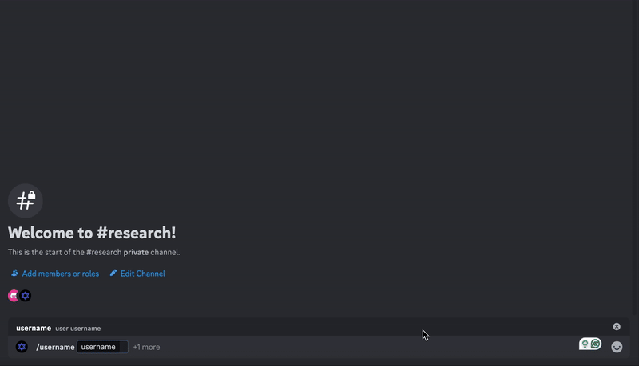

데스노트라는 일본 애니메이션을 본적 있는가? 안본 사람을 위해 대략 내용을 설명해주자면, 얼굴과 이름을 알고 있는 상태에서 작품명과 동일한 이름의 `데스노트`에 이름을 적으면 그 사람이 어디에 있든 사망에 이르게 할 수 있다는 컨셉을 지닌 애니메이션이다.

그리고 이 애니메이션의 초반에는 전세계에의 불특정 다수가 사망하는 것을 보고, 특정 `단체`의 소행이라 판단한채 범인을 검거하기 위해 추리를 펼치는 모습이 등장한다. 하지만 범인은 일본에 거주하는 평범한 학생이었다.(작품에서는 `키라`라는 별칭으로 불리운다.)

이때 작품에 등장하는 천재 명탐정(작품에서는 `L`이라는 이름으로 불리운다.)이 범인의 위치를 구체화 하기 위하여 구역을 나누고, 각 구역마다 방송을 송출하며 미끼를 던지는 모습이 등장한다. 이러한 방식은 범죄 수사에서 흔히 쓰이는데, 숨겨진 신원을 밝혀낸다는 의미에서 `비익명화`라고 부른다.

이제 우리에게는 익명이라는 개념이 너무 익숙하다. 인터넷 자체가 익명이기 때문이다. 인터넷을 이용하여 익명으로 여러 범죄가 이루어지고, 비밀이 오고간다.

최근 한 15세 해커가 흥미로운 연구 결과를 공개했다. 그는 Cloudflare라는 CDN 서비스의 특성을 이용해 Signal이나 Discord 같은 메신저 사용자의 위치를 추적할 수 있는 방법을 발견했다. 이 방법은 사용자의 어떤 조작도 필요 없이 약 400km 반경 내에서 위치를 특정할 수 있다고 한다.

## 공격 방법의 원리

이 공격의 핵심은 Cloudflare의 캐시 시스템에 있다. Cloudflare는 전 세계 330개 도시에 데이터센터를 두고 있으며, 사용자와 가까운 데이터센터에서 콘텐츠를 제공한다. 해커는 이 특성을 이용해 특정 콘텐츠가 어느 데이터센터에 캐시되었는지 추적함으로써 사용자의 대략적인 위치를 파악할 수 있었다.

## Signal과 Discord의 취약점

Signal의 경우, 메시지에 첨부된 이미지나 파일이 Cloudflare CDN을 통해 전달된다. 사용자가 채팅방을 열거나 푸시 알림을 받을 때 이 파일들이 자동으로 다운로드되며, 이 과정에서 사용자의 위치 정보가 노출될 수 있다.

Discord도 비슷한 취약점을 가지고 있다. 특히 친구 요청을 보낼 때 프로필 이미지가 푸시 알림과 함께 전송되는데, 이 과정에서 위치 추적이 가능하다. 해커는 이를 자동화한 `'GeoGuesser'`라는 Discord 봇을 제작해 실제로 Discord CTO의 위치를 추적하는 데 성공했다.

## 보안 업체들의 반응

이 취약점이 공개된 후, 각 회사의 반응은 제각각이었다. Signal은 이를 자신들의 책임이 아니라며 사용자가 알아서 주의해야 한다는 입장을 보였다. Discord는 초기에는 수정을 약속했지만 나중에는 Cloudflare의 문제라고 입장을 바꿨다. Cloudflare는 결국 일부 취약점을 수정했지만, 근본적인 문제는 여전히 남아있다.

## 시사점

이 사례는 현대 인터넷 인프라의 복잡성과 그로 인한 예상치 못한 보안 위험을 보여준다. 특히 성능 향상을 위해 도입된 기술이 역설적으로 프라이버시를 위협할 수 있다는 점을 잘 보여준다.

개인의 프라이버시가 중요한 저널리스트, 활동가, 그리고 일반 사용자들은 이러한 위험을 인지하고 적절한 보호 조치를 취할 필요가 있다. VPN이나 Tor 같은 추가적인 보안 도구의 사용을 고려해볼 만하다.

- 전문: [https://gist.github.com/hackermondev/45a3cdfa52246f1d1201c1e8cdef6117](https://gist.github.com/hackermondev/45a3cdfa52246f1d1201c1e8cdef6117)
