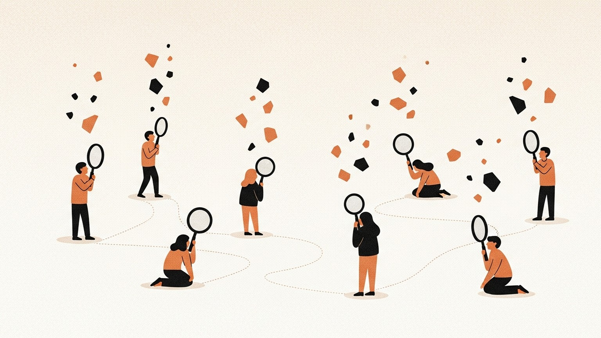

지난주, 한 팀의 두 사람이 비슷한 일을 각자의 AI에게 맡겼다. 한 명은 Claude로 경쟁사 리서치를 세 시간 만에 끝냈고, 다른 한 명은 Gemini로 같은 주제의 시장 자료를 정리했다. 두 결과물은 모두 훌륭했다. 문제는 그다음이었다. 한 사람이 파고든 논점과 다른 사람이 짚어낸 구조는, 서로의 화면 안에만 머물렀다. 팀 전체로 보면 아무것도 적재되지 않았다. 각자는 빨라졌는데, 팀은 그만큼 빨라지지 않았다.

이런 장면은 요즘 많은 조직에서 반복된다. AI는 개인을 도왔지만, 조직은 그 도움을 흡수하지 못한다. 왜 AI는 개인 수준에서 멈추는가. 이 질문을 파고들다 보면, 답은 기술 쪽에 있지 않다.

## 증폭되는 것은 개인이다

지금의 AI 인터페이스는 구조적으로 1인용이다. 챗봇은 나의 대화 히스토리 위에서 움직이고, IDE 플러그인은 내 편집기에 붙어 있으며, 검색은 나의 질의어에서 시작한다. 컨텍스트는 개인의 기억에 묶이고, 프롬프트는 개인의 언어로 쓰이며, 산출물은 개인의 채널로 흐른다. 이 구조가 뒤틀리기 전까지는, AI가 아무리 강해져도 남는 것은 "개인의 생산성"이다.

팀 안에서는 이상한 일이 벌어진다. 모두가 각자의 현미경을 들고 같은 샘플을 들여다본다. 각자의 현미경은 다른 각도로 맞춰져 있고, 각자만 볼 수 있는 디테일을 찾아낸다. 그런데 들여다본 것은 각자의 노트에만 남는다. 옆자리 사람이 무엇을 보았는지, 왜 그 각도로 돌려보았는지, 그 미세한 조정을 통해 무엇을 배웠는지, 공유되는 것은 거의 없다.

그래서 AI는 "생산성 도구"로 소비된다. 조직이 기대하는 "역량"으로는 쌓이지 않는다. 같은 크기의 팀이, 구성원 각자는 분명 똑똑해졌는데, 조직 단위로는 작년과 거의 같은 질문을 반복한다.

## 조직은 왜 이것을 올리지 못하는가

회사는 당연히 이 증폭을 조직 역량으로 끌어올리고 싶다. 공유된 지식, 학습된 판단, 재사용 가능한 노하우. 표현은 각자 다르지만 바라는 것은 하나다. 그러나 시도는 번번이 막힌다.

막히는 지점은 대체로 셋이다. 첫 번째는 데이터 접근의 경계다. 개인이 다룬 문서, 주고받은 대화, 검토한 자료 대부분이 조직 저장소로 되돌아오지 않는다. 기술적 이유보다 감정적 이유가 크다. 내 메모를 공용 공간에 올리면, 그 메모에 남은 거친 표현과 흐트러진 논리의 책임까지 나에게 남는다.

두 번째는 문제의 비반복성이다. 조직이 다루는 일은 정확히 반복되지 않는다. 지난 분기의 가격 인상 논의와 이번 분기의 가격 인상 논의는 이름만 같다. 그래서 템플릿은 대개 절반만 맞고, AI가 학습할 "정답 패턴"이 조직의 일 속에는 드물다.

세 번째가 가장 까다롭다. 암묵지다. 사람이 AI와 나눈 대화에는 프롬프트로 쓰이지 않은 판단 기준이 녹아 있다. "이 문단은 내보내지 않는다"는 결정, "여기서는 강하게 밀어붙인다"는 감각. 이런 것들은 대화 본문에 드러나지 않고, 사람의 머릿속에만 남아 있다.

이 지점에서 "RAG를 도입하면 됩니다" 식의 처방이 흔히 등장한다. 그러나 이 처방이 풀려는 문제의 단위 자체가 잘못 설정된 것이라면 어떨까.

## 그렇다면 조직이란 무엇이었는가

"조직이 AI를 못 올린다"는 문제에 부딪혔을 때, 먼저 의심해야 할 것은 도구가 아니라 조직이라는 단어의 해상도다. 그 단어는 AI 이전 시대에 정의됐다.

지금까지 조직은 대체로 "사람의 모음"으로 정의됐다. 사람이 들어오고 나가며, 그 사람들이 가진 능력과 경험의 합이 조직이었다. 그래서 HR은 자연스럽게 "사람을 관리하는 부서"였다. 채용은 사람을 들이는 일, 평가는 사람을 재는 일, 이탈은 사람을 잃는 일이었다.

그러나 일의 단위가 이미 개인-AI 쌍(pair)으로 내려가 있다면, 조직의 단위도 "사람"에서 벗어날 수 있다. 조직을 "판단의 축적체"로 다시 정의해 볼 수 있다는 말이다. 누가 있는가보다, 무엇이 학습되어 있는가가 앞선다.

합창단을 떠올려 보면 된다. 합창단은 단원 리스트가 아니라 악보로 정의된다. 단원은 바뀌지만 악보는 남고, 새 단원은 그 악보를 배우며 합창단의 일부가 된다. 조직도 "사람의 리스트"가 아니라 "그동안 쌓인 판단의 악보"로 정의될 수 있다.

이 정의 위에서 HR의 역할은 달라진다. 사람의 고용과 평가보다 앞서는 질문이 생긴다. 조직이 어떤 판단을 학습하고, 어떤 판단을 버리는가. 일종의 기억 큐레이션이다.

구체적으로 보자. 채용은 "이 사람이 들어오면 어떤 판단이 조직에 추가되는가"를 묻는 일이 된다. 평가는 "이 사람이 만든 자산이 조직의 악보에 편입되었는가"로 이동한다. 이탈은 "이 사람이 나갈 때 어떤 판단이 함께 빠져나가고, 어떤 판단이 조직에 남는가"를 묻는다. HR은 사람을 관리하는 부서에서, 판단을 쌓고 걸러내는 부서로 바뀐다.

이 전환은 거창한 제도 개편에서 시작되지 않는다. 두 사람이 각자의 AI로 같은 주제를 파고든 뒤, 지운 문장과 바꾼 질문의 이유를 서로에게 설명하는 작은 루틴에서 시작된다. 그 루틴을 통해 팀의 판단은 처음으로 개인의 머리 바깥에 기록된다. 흥미로운 것은, 앞으로 HR이 다룰 일의 많은 부분이 채용 공고의 표현이나 평가 양식의 항목이 아니라 이런 루틴의 설계라는 점이다. 조직이 매일 어떤 흔적을 남기는지, 어떤 대화를 공용 기억에 흡수시키고 어떤 대화를 개인에게 돌려보내는지. 사람을 고르는 일보다 기억을 설계하는 일이 먼저다.

## 흔들리는 것은 조직이라는 단어 자체다

AI를 어떻게 조직에 올릴까를 묻기 전에, 한 가지를 먼저 점검해 볼 만하다. 우리 팀이 지난 한 달간 AI와 나눈 대화 중, 팀의 자산으로 남은 것은 무엇인가. 아무것도 없다면, 그 AI는 팀의 것이었는가 개인의 것이었는가.

조직을 "사람의 조합"이 아니라 "판단의 조합"으로 한 번 그려보는 것도 도움이 된다. 그 그림 속에서 HR의 자리는 어디로 움직이는가. 그 자리가 지금 우리가 알고 있는 HR과 같은 곳이라면, 우리는 아직 조직이라는 단어가 흔들리기 전의 모습으로 조직을 그리고 있는 셈이다.
