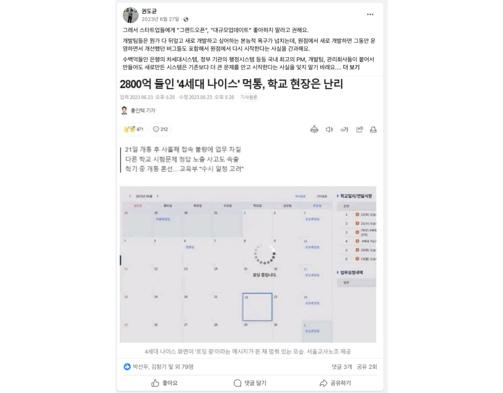

## Do: Work

- `리뉴얼 릴리즈 기념 회식`: 볼타 서비스 리뉴얼은 꽤나 장기간으로 가져왔던 프로젝트입니다. 리뉴얼과 관련된 자세한 내용은 [2023년 회고 게시글](/2023년-회고-프로젝트-퇴사-창업-채용-기술/#볼타:-전면-리뉴얼-&-FrontEnd-Engineering)에서 다룬 적 있는데요. 정말 쉴 틈 없이 빠르게 달려왔기 때문에 피로를 푸는 느낌으로 회식을 진행했습니다. 🙂
- `외부 제휴사 미팅`: 과거 제휴 논의를 해왔던 파트너사들과 밀린 미팅을 진행했습니다. 리뉴얼 릴리즈를 위해 기술과 제품 개발에만 집중하고 있던 시점이라 한없이 밀리고 있었는데요. 그래도 오랫동안 기다려주셔서 감사할 따름입니다.
- `스트롱벤처스 포트폴리오 밋업`: 최근 볼타 팀은 스트롱벤처스로부터 [Pre-A 투자를 유치](https://news.mt.co.kr/mtview.php?no=2024012613574584122)하였는데요. 운 좋게도 직후에 분기별로 진행되는 스트롱벤처스 포트폴리오 밋업이 개최되었고, 이 행사에 다녀오게 되었습니다. 해당 행사에 참가하신 분 중에는 저희 고객사 분들도 계셨는데, 오프라인으로 처음 인사드리는 분들도 계셔서 만나 뵙게 되어 매우 반가웠네요.
- `채용 커피챗/인터뷰`: 이번 주를 시작으로 본격적으로 신규 채용을 오픈하였습니다. B2B 마케터, 프로덕트 엔지니어(Frontend), 프로덕트 엔지니어(Backend) 포지션을 채용 중이며, 3분기까지 각 1명씩 모시는 걸 목표로 오픈해 두었지만 생각보다 많은 분들이 관심 가져 주셔서 후보자분들과 이야기 나눠볼 수 있는 시간을 가졌습니다. 

## Do: Academic

- `도커 교과서 스터디`: 격주 일요일에 오프라인에서 모이는 도커 스터디를 진행하고 있는데요. 이번 한 주는 이 스터디를 위한 자료를 준비하고, 일요일에 모여서 스터디를 진행하였습니다.
- `찰리 멍거 바이블 2회독`: [찰리 멍거 바이블](https://www.aladin.co.kr/shop/wproduct.aspx?ItemId=306333657)은 2024년 1월 중순에 북클럽으로 읽었던 책입니다. 경제와 투자 관련 서적이지만, `현인들의 현자`라고 불리는 찰리 멍거의 100년 치 인생 노하우가 담겨있는 책이라고 이야기해도 될 정도였습니다. 저는 항상 일을 잘하기 위해서는 내가 속해있는 섹터뿐 아니라 다른 섹터에 대한 이해를 바탕으로 새로운 방식의 문제 접근 방식이 필요하다고 생각했는데요. 찰리 멍거는 이를 `격자형 멘탈 모델`이라 소개하고 있습니다. 짧은 경험으로 어렴풋이 가지고 있던 생각이 100년의 현자와 비슷하다는 부분에서 놀랐고, 제 가치관이 더 명확해지는 기회였습니다. 다시 한번 리마인드하는 목적으로 완독 2주 뒤 한번 더 읽었습니다.

## Keep

- `격자형 멘탈 모델`에 대한 가치관 유지하기
- `사내 스터디 장려하기`: 도커 교과서 스터디는 볼타 팀의 유일한 백엔드 개발자분과 외부 개발자분들까지 7명이 함께 하고 있는데요. 아무래도 작은 팀을 유지하다 보니 내부에서 다양한 사례를 공유하거나 기술을 공유하는 데에 있어 물리적인 한계가 있어 아쉬움이 있었습니다. 하지만 이번 스터디를 해보니, 백엔드 개발자분의 만족도가 높아 보여서 좋았네요. 🙂

## Problem

- `그랜드 오픈은 신중하게 하기`: 이전에 프라이머 [권도균 대표](https://www.facebook.com/douglasguen3)님 께서 그랜드 오픈, 대규모 업데이트를 좋아하지 말라고 권고한다는 글을 쓰신 적 있는데요. 이 글을 읽었을 때 당시엔 '초기 스타트업 제품은 할만하지 않을까?'라고 생각했던 기억이 납니다. 하지만 실제로 리뉴얼을 준비하면서 그랜드 오픈/대규모 업데이트를 경험해 보니 아무리 초기 스타트업이어도 쉽지 않은 일이었습니다.

- `팀 매니지먼트, 프로덕트 매니지먼트, 실무 그리고 채용의 밸런스 조절`: 이전 채용(2023년 3분기) 당시에도 여러 가지를 동시에 해오면서 하나하나 디테일을 챙기지 못한 것 같아 아쉬움이 있었는데요. 이번에 채용을 다시 시작하면서 약간씩 비슷한 징조가 보여 걱정이 됩니다.

## Try

- `집중과 휴식을 시스템적으로 번갈아 하자`: 팀 빌딩 초기부터 가지고 있었던 마음가짐입니다. 하지만 고객이 늘어나고 제품에 신경 써야 하는 것이 늘어남에 따라 잘 지켜지지 않았습니다. 이에 다음 주는 팀 전체가 쉬어가는 주간으로 보내보면 어떨까 하여 한 주정도 쉬어보려고 합니다. 물론 다른 회사처럼 아예 출근하지 않고 휴가!까지는 아니지만, 내부적으로 정비할 것들을 정비하는 시간으로 보내보고자 합니다.

- `고객과 팀에 최대의 시간을 쏟자`: 채용이 아무리 중요해도 팀과 고객 그리고 제품만큼은 아니라는 생각이 문득 들었습니다. 최대한 대부분의 시간을 고객과 팀에 쏟고, 채용의 우선순위를 낮게 가져가 보려고 합니다. 메이저 채용 플랫폼에 공개적으로 채용 공고를 올리지 않고, SNS와 일부 아웃바운드 수준으로만 채용 기회를 노리고 있습니다.

- `주 1회 회고하기`: 이 회고 글은 [홍연의](https://www.linkedin.com/in/yeoneui-hong)님이 만들어주신 `IT 업계 스타트업 팀장 회고 모임` 시간에 작성한 회고인데요. 매주 일요일 온라인으로 모여 각자 체크인 후 회고를 작성하고 매달 1회 모이는 방식입니다. 막상 회고를 작성해 보니 잊고 있었던 기억도 새록새록 나고, 생각을 정리하기 좋았던 것 같습니다. 빠지지 않고 잘 참가해 보려고 합니다. 공개적으로 공유하기 힘든 내용은 개인 메모로 작성 예정입니다.